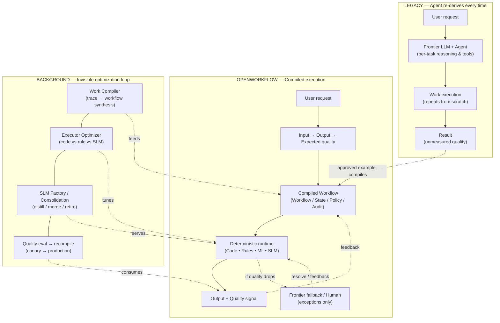
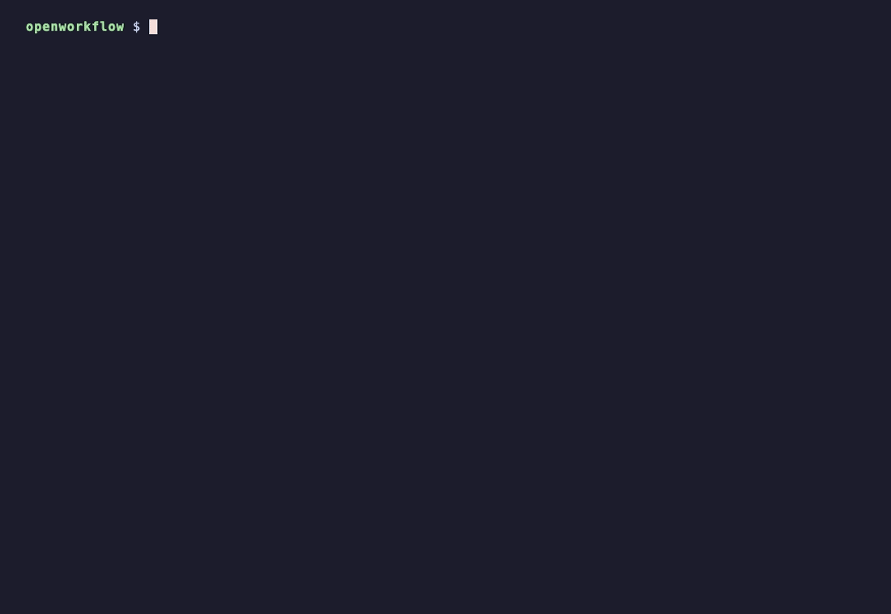

# OpenWorkflow

**The execution layer for AI work.**

[한국어 README](README.md)

Let AI do the work once. OpenWorkflow learns how to run it reliably thereafter.

> **"Build the kernel, integrate the ecosystem, enrich with semantic truth."**
>
> *"LinkML is the front door for human/LLM model authoring; OWL is the semantic truth layer; SHACL validates constraints; OpenWorkflow executes durable work."*

---

## 30-second demo: use it from inside Codex


A **real interactive Codex session**, not a mock-up. Point Codex at the OpenWorkflow proxy (ChatGPT login reused as-is) and invoke the three skills shipped in this repository with `$` mentions.

| Step | Typed in Codex | Result |
| :--- | :--- | :--- |
| 1 | `$ow-compile-work examples/quality_analysis.work` | OpenWorkLang (`.work`) → **executable build tree** `build/quality_analyst/` — `work.yaml` + `handlers/*.py` (code) + `rules/*.rule.yaml` (rule) + `models/ml|slm/<action>/` (model card · dataset · train.py) + LinkML schema |
| 2 | `$ow-traces` | Sessions captured by the proxy — **this very Codex session** appears as `shell_python3, shell_sed, respond, …` steps |
| 3 | `$ow-compile-trace codex-session` | The captured Codex session compiles into `build/codex_session/` — shell steps become `handlers/shell_*.py` that replay the recorded command, non-deterministic steps become `prompts/*.prompt.md` |
| 4 | `$ow-bench codex-session` | **Agent vs. compiled build** — replays the same session and compares output equality, tokens and speed in `BENCHMARK.md` |

**Benchmark** (task: compile a `.work` file, inspect the build tree, summarize — [`examples/demo/build/codex_session/BENCHMARK.md`](examples/demo/build/codex_session/BENCHMARK.md)):

| | recorded agent (Codex) | compiled build | delta |
| :-- | --: | --: | --: |
| LLM tokens | 46,680 | 16,782 | **−64%** |
| wall time | 29.9 s | 17.4 s | **1.7×** |
| outputs reproduced (code-tier steps) | — | **2/2 exact** | |

The two shell steps (`shell_python3`, `shell_find`) lowered to the code tier and reproduced the same output with zero tokens in tens of milliseconds; the remaining cost is the final summary (`respond`), still escalated to a frontier LLM — that is what the `models/slm/` training candidate takes over once promoted.

**A real business task — customer contract renewal proposal** ([`examples/customer-renewal/TASK.md`](examples/customer-renewal/TASK.md): verify the active CRM contract → aggregate 3 months of usage → price with the current policy → write the proposal and pricing JSON; artifacts in [`examples/demo/customer-renewal-bench/`](examples/demo/customer-renewal-bench/)):

| | recorded agent (Codex, 8 steps) | compiled build (replayed from a clean state) | delta |
| :-- | --: | --: | --: |
| LLM tokens | 139,437 | 20,545 | **−85%** |
| wall time | 82.6 s | 11.2 s | **7.4×** |
| outputs reproduced | — | **7/7** | |
| deliverables `proposal-CUST-1001.md` · `pricing-CUST-1001.json` | — | **byte-identical** | |

Contract lookup (`jq`), data reads, pricing and writing the proposal (`apply_patch`) — the work itself — all compiled to the code tier and replayed with zero tokens; the only remaining cost is the one final summary step shown to a human.
### Front agent + compiled build: hybrid run for a new input (CUST-1002)

A compiled build only replays the recorded inputs (CUST-1001). A **front agent** therefore binds the parameters of a new request (`customer_id` from `PARAMS.json`), the code tier re-runs with those values, and only the steps the agent had synthesized (writing the pricing JSON/proposal, the final summary) are escalated to Codex — flexibility stays with the front agent, efficiency comes from deterministic code ([`hybrid-CUST-1002/`](examples/demo/customer-renewal-bench/hybrid-CUST-1002/)):

```bash
python3 -m core.build run build/customer_renewal_codex \
  --request "Prepare the annual renewal proposal for customer CUST-1002." --escalate codex
```

| CUST-1002 | Codex alone (whole task) | hybrid (build + front agent) | delta |
| :-- | --: | --: | --: |
| LLM tokens | 32,572 | 26,481 (2 escalations) | −19% |
| wall time | 83 s | 40.2 s | **2.1×** |
| steps | 8 agent turns | 6 code (0 tokens) + 2 escalated | |
| pricing result | 60 seats · $17,100/yr · 5% volume | 60 seats · $17,100/yr · 5% volume | identical |

The token saving is smaller than in the first benchmark for an obvious reason: each remaining escalation is a fresh Codex session (10–16k tokens with its system prompt). Once those two steps are promoted to `models/slm/` candidates or the proposal wording is lowered to a template (code), tokens approach zero — and how far that lowering may go is stated explicitly in the `.work` file's `escalation` block.

### WHAT → HOW: the two artifacts this pipeline produces

| | what | where |
| :-- | :-- | :-- |
| **WHAT** — goal, acceptance criteria, behavior contracts | Raw requirements turned into sentences a human signs off on. Early on, an interrogation skill such as [grill-me](https://github.com/mattpocock/skills) sharpens the goal; the rules harden while a human verifies the agent's first run | `TASK.md`, `behaviors/*/BEHAVIOR.md` |
| **HOW** — execution split and limits | The **OpenWorkLang (`.work`)** compiled from the verified session: per action, whether code / rule / ml / slm / llm executes it, which parameters the front agent binds, and which steps remain `agent` (the limits) — readable, editable, recompilable | `build/<work>/<work>.work` (+ `PARAMS.json`, `prompts/`) |

Example of a compiled `.work` — `build/customer_renewal_codex/customer_renewal_codex.work`:

```text
work customer_renewal_codex {
  params:
    - customer_id            # recorded CUST-1001; bound from the request by the front agent
  workflow: [shell_sed, shell_rg, shell_cat, shell_jq, shell_mkdir, write_pricing_cust_1001, respond]
  executors: { shell_sed: code, shell_rg: code, shell_cat: code, shell_jq: code, shell_mkdir: code,
               write_pricing_cust_1001: code, respond: llm }
  escalation: { write_pricing_cust_1001: agent,     # synthesized content — regenerated by the agent when params change
                respond: frontier_llm,               # final summary — frontier until the SLM candidate is promoted
                on_error: fallback_to_frontier_llm, on_quality_drop: require_human_review }
}
```


Setup and the exact commands each step runs are in the [Zero-Code Agent Proxy](#zero-code-agent-proxy-adaptersproxy) section; the prompts, Codex transcripts, compiled artifacts and benchmark are in [`examples/demo/`](examples/demo/).

---

## High-Level Architecture & Pipeline Overview



---

## Why OpenWorkflow

Coding agents and frontier LLMs can perform work, but their output is not repeatable, cost-effective, or observable. Every run re-derives the same result at the same frontier cost, and quality is unmeasured.

OpenWorkflow inverts this: an agent performs the work once, a human evaluates the output, and the system compiles that proven execution into a reliable, optimized workflow that runs deterministically behind the scenes.

**AI performs. Humans evaluate outcome quality. OpenWorkflow evaluates behavior, compiles the work, and continuously optimizes execution.**

---

## End-to-End Work Compilation Pipeline (6 Steps)

```text
 ┌─────────────────────────────────────────────────────────────────────────────┐
 │                      6-STEP COMPILATION & EXECUTION PIPELINE               │
 ├─────────────────────────────────────────────────────────────────────────────┤
 │ Step 1: Trajectory Ingestion ────▶ Normalize raw logs into TraceIR         │
 │ Step 2: Behavior Parsing ────────▶ Ingest BEHAVIOR.md process constraints   │
 │ Step 3: Work IR Compilation ─────▶ Analyze & lower steps across 8 tiers     │
 │ Step 4: Durable Runtime ─────────▶ State machine execution & checkpointing  │
 │ Step 5: Frugal Oracle Gate ──────▶ Schema & behavior invariant validation   │
 │ Step 6: Quality Fold & Opt ──────▶ Lucky-correct check & SLM dataset export │
 └─────────────────────────────────────────────────────────────────────────────┘
```

1. **Step 1: Trajectory Ingestion (`TraceIR`)**: Ingest raw agent logs (OpenWorker, LangGraph, custom scripts, or OpenAI/Anthropic API calls) and normalize them into canonical `TraceIR`.
2. **Step 2: Behavior Spec Ingestion (`BEHAVIOR.md`)**: Parse process evaluation specifications into Rule/Policy, Workflow Transition Constraint, or Runtime Judge.
3. **Step 3: Work IR Compilation (`WorkCompiler`)**: Middle-end analyzers (`DeterminismAnalyzer`, `PredictionAnalyzer`, `SLMAnalyzer`) lower action steps into optimal executors across the 8-tier hierarchy and produce `work.yaml`.
4. **Step 4: Durable State Machine Execution (`DurableRuntimeEngine`)**: State machine execution with automatic state checkpointing and support for `WAITING_EVENT`, `WAITING_HUMAN`, and `WAITING_TIMER` wait states.
5. **Step 5: Frugal Objective Oracle Escalation (`ObjectiveOracleGate`)**: Closed-world schema validation and behavior invariant checks. Escalates to Frontier LLM or Human **only when schema checks or process invariants fail**.
6. **Step 6: Quality Fold Evaluation & Executor Promotion (`QualityRecord` & `ExecutorOptimizer`)**: Evaluates candidate runs via `evaluate_quality_fold()` (rejecting lucky-correct runs that violated process behaviors), evaluates model promotion, and generates HuggingFace SFT `TrainingCandidate` datasets.

---

## Zero-Code Agent Proxy (`adapters/proxy/`)

OpenWorkflow collects standard LLM API requests as TraceIR input. `adapters/proxy/server.py` offers two modes.

| Endpoint | Mode | Description |
| :--- | :--- | :--- |
| `POST /v1/responses`, `POST /backend-api/codex/responses` | **passthrough** (`X-OpenWorkflow-Response-Mode: passthrough`) | Forwards the request to the real upstream (OpenAI Responses API or the ChatGPT Codex backend), relays the SSE stream byte-for-byte, and captures the completed turn into TraceIR in the background. **Codex CLI runs unmodified.** |
| `POST /v1/chat/completions`, `POST /v1/messages` | **synthetic** (`X-OpenWorkflow-Response-Mode: synthetic`) | Development/demo synthetic responses. Do not route production traffic here. |

### Real usage: everything inside the Codex TUI

The [30-second demo](#30-second-demo-use-it-from-inside-codex) at the top of this README is a **real interactive Codex TUI session**, not synthetic data; apart from one line that starts the proxy, every step runs inside Codex. The three skills in this repository's `.agents/skills/` are discovered automatically and invoked explicitly with `$` mentions (Codex has deprecated `/prompts:` custom prompts and current versions no longer recognize them, so skill mentions are the standard explicit command).

| Step | Typed in Codex | What Codex runs | Result |
| :--- | :--- | :--- | :--- |
| 1 | `$ow-compile-work examples/quality_analysis.work` | `python3 -m core.openworklang compile …` | OpenWorkLang → `build/quality_analyst/` build tree (work.yaml, handlers/, rules/, models/ml|slm/, schema/), with the 8-tier executor lowering explained |
| 2 | `$ow-traces` | `curl localhost:8787/v1/workcompiler/traces` | Sessions captured by the proxy — **this very Codex session** shows up as `shell_python3, shell_sed, respond, …` steps |
| 3 | `$ow-compile-trace codex-session` | `POST /v1/workcompiler/compile` (`build_dir`) | The captured Codex session compiles into `build/codex_session/` — `handlers/shell_*.py` replay the recorded commands, `respond` becomes `prompts/respond.prompt.md` |
| 4 | `$ow-bench codex-session` | `python3 -m core.build bench build/codex_session` | Replays the code tier against the bundled `trace.json` → per-action output equality, tokens and latency in `BENCHMARK.md` |

The recording script is [`docs/demo/openworkflow-codex-demo.tape`](docs/demo/openworkflow-codex-demo.tape).

**Try it**

1. Configure the Codex provider — add to `~/.codex/config.toml`, or use a separate `CODEX_HOME` directory (copy `auth.json` + the `config.toml` below).

   ```toml
   model_provider = "openworkflow"
   approval_policy = "never"
   sandbox_mode = "workspace-write"

   [sandbox_workspace_write]
   network_access = true            # lets Codex curl the local proxy

   [model_providers.openworkflow]
   name = "OpenWorkflow Proxy"
   base_url = "http://127.0.0.1:8787/backend-api/codex"
   wire_api = "responses"
   requires_openai_auth = true      # reuse the ChatGPT login token as-is
   ```

2. Start the proxy and launch Codex from the repository root; the skills load from `.agents/skills/` automatically.

   ```bash
   python3 -m uvicorn adapters.proxy.server:app --port 8787 &
   codex
   ```

3. Inside Codex, invoke the skills — `$ow-compile-work <file.work>`, `$ow-traces`, `$ow-compile-trace <target>`, `$ow-bench <target>`.

   The commands the skills run work from a plain shell too:

   ```bash
   python3 -m core.openworklang compile examples/quality_analysis.work        # -> build/quality_analyst/
   curl -s localhost:8787/v1/workcompiler/traces | jq                # run_id, actions, token usage
   curl -s localhost:8787/v1/workcompiler/traces/<run_id> | jq       # full TraceIR for the session
   curl -s -X POST localhost:8787/v1/workcompiler/compile -H 'Content-Type: application/json' \
     -d '{"run_id":"<run_id>","target_name":"codex-session","build_dir":"build"}'   # -> build/codex_session/
   python3 -m core.build from-trace trace.json --target codex-session   # build from a TraceIR JSON without the proxy
   python3 -m core.build bench build/codex_session                       # agent vs. build: outputs · tokens · speed
   python3 -m core.build run build/<work> --request "..." --escalate codex  # front agent: bind params → code runs free → escalate only synthesized steps
   ```

   API-key clients (OpenAI SDK, Agents SDK, ...) only need `OPENAI_BASE_URL=http://127.0.0.1:8787/v1`; `/v1/responses` is captured the same way.

```text
Existing AI Agent (Codex CLI, Claude Code, Cursor, AutoGen, LangChain, Custom Script)
                                │
        Standard LLM API Calls (OPENAI_BASE_URL=http://localhost:8787/v1)
                                │
                                ▼
 ┌─────────────────────────────────────────────────────────────────────────────┐
 │                OPENWORKFLOW TRANSPARENT PROXY ADAPTER                       │
 │                    (adapters/proxy/server.py)                              │
 ├─────────────────────────────────────────────────────────────────────────────┤
 │ 1. Responses API / Codex backend calls pass through upstream (SSE relayed)   │
 │ 2. Normalizes prompts, tool calls, and tool outputs into TraceIR             │
 │ 3. chat/completions · messages answer with dev-only synthetic responses      │
 └──────────────────────────────┬──────────────────────────────────────────────┘
                                │
                                ▼
                     OpenWorkflow WorkCompiler
                   (TraceIR → WorkIR compilation)
```

---

## The 8-Tier Executor Lowering Hierarchy

OpenWorkflow's compiler prioritizes **model elimination before model lowering**. It uses middle-end analyzers (`DeterminismAnalyzer`, `PredictionAnalyzer`, `SLMAnalyzer`) to lower steps down the 8-tier hierarchy:

```text
Priority 1: Model Elimination (Zero Token Cost)
   ├── 1. Constant / Lookup
   ├── 2. SQL / Database Query
   ├── 3. Rule Engine
   └── 4. Deterministic Code (Python / WASM / HTTP)

Priority 2: Model Lowering (Statistical & Small Models)
   ├── 5. Traditional ML (XGBoost / LightGBM / Scikit-Learn)
   ├── 6. Embedding & Vector Retrieval (RAG)
   └── 7. Distilled SLM (1B–7B local student model)

Priority 3: Residual Execution (Fallback & Quality Assurance)
   ├── 8. Frontier LLM (OpenAI / Anthropic / Gemini)
   └── 9. Human-in-the-Loop (Approval / Interrupt / Review)
```

---

## Semantic Stack Architecture (v4)

OpenWorkflow v4 introduces a multi-tiered semantic stack. It uses **LinkML** as the developer-friendly YAML authoring language, compiles into internal **Semantic IR**, enriches with **OWL 2** DL semantics, and validates closed-world constraints via **SHACL**:

| Layer | Role | Target Technology |
| :--- | :--- | :--- |
| **Authoring DSL** | Human/Developer/LLM business model authoring | **LinkML (YAML DSL)** |
| **Semantic Canonical IR** | Internal unified semantic model | **Semantic IR (`core/semantic_ir/`)** |
| **Semantic Ontology** | Open-world reasoning & relationship semantics | **OWL 2 (DL)** |
| **Constraint Validation** | Closed-world data verification & cardinalities | **SHACL** |
| **Reasoner** | Inferred classification & consistency checking | **ELK / HermiT** |
| **Runtime Graph** | Knowledge Graph & RDF triples | **Jena / RDF4J / RDFLib** |
| **Execution Engine** | Stateful workflow, action DAG & durable runtime | **OpenWorkflow Kernel** |

---

## Semantic Compiler Pipeline: Trace → LinkML → Semantic IR → Execution

```text
               Agent Trace (Trace IR)
                         │
                         ▼
                 LLVM / LLM Compiler
                         │
           LinkML Domain Model (YAML DSL)
                         │
                 Semantic Compiler
                         │
               Semantic IR (Canonical)
                         │
   ┌─────────────────────┼─────────────────────┬─────────────────────┐
   ▼                     ▼                     ▼                     ▼
Pydantic               SHACL                  OWL                 Work IR
(Runtime Types)    (Closed-World)         (Open-World)          (Durable DAG)
                         │                     │
                         ▼                     ▼
                  Validation Gate      ELK / HermiT Reasoner
                         │                     │
                         └──────────┬──────────┘
                                    ▼
                           OpenWorkflow Runtime
```

---

---

## OpenWorkLang: The Agent Programming Language (`.work`)

OpenWorkflow introduces **OpenWorkLang**, a declarative Agent Programming Language for compiling human intent, agent goals, tools, memory policies, process invariants, and action workflows into executable agent programs:

> **"Code → Software를 만드는 시대에서 OpenWorkLang → Agent를 컴파일하는 시대로."**

```openworklang
# OpenWorkLang (.work) Example: Production Quality Analyst Agent

work quality_analyst {
  goal: "Analyze production line quality anomaly root causes and generate remediation plans"

  inputs: [production_data, quality_inspection_data, equipment_logs]
  outputs: [root_cause, evidence, confidence_score, remediation_plan]
  tools: [query_mes(), query_sensor(), analyze_statistics(), create_report()]
  memory: [short_term, quality_knowledge_base]
  invariants: [verify_sensor_calibration, require_human_approval_for_remediation]

  workflow: [collect_data -> detect_anomaly -> find_correlation -> determine_root_cause -> create_report]

  executors: {
    collect_data: code,
    detect_anomaly: rule,
    find_correlation: ml,
    determine_root_cause: slm,
    create_report: slm
  }
}
```

```text
Human Intent ──▶ OpenWorkLang (.work) ──▶ OpenWorkLang Compiler ──▶ Work IR (work.yaml) ──▶ Durable Runtime
```

Compile from the command line:

```bash
python3 -m core.openworklang compile examples/quality_analysis.work
# -> build/quality_analyst/ build tree; prints actions / invariants / executors / artifacts
```

### Build output: executable assets per tier, not just `work.yaml`

Compilation does not stop at the `work.yaml` definition: for every action the compiler emits the concrete asset of its executor tier under `build/<work>/` (`core/build`).

```text
build/quality_analyst/
├── work.yaml                                  # Work IR (source of truth for the runtime)
├── quality_analyst.work                       # HOW — editable, recompilable OpenWorkLang source (executors · params · escalation)
├── PARAMS.json                                # parameters the front agent binds + synthesized steps
├── MANIFEST.json                              # action → tier → artifact index
├── handlers/collect_data.py                   # code   : def run(**inputs) — replays the recorded shell command when the trace has one, otherwise a contract-bearing scaffold
├── rules/detect_anomaly.rule.yaml             # rule   : declarative branch list evaluated as-is by RuleExecutor
├── models/ml/find_correlation/                # ml     : model_card.yaml + dataset.jsonl (trace I/O) + train.py
├── models/slm/determine_root_cause/           # slm    : training_candidate.yaml + dataset.jsonl (SFT pairs) + train.py (TRL SFTTrainer)
├── models/slm/create_report/
├── prompts/<action>.prompt.md                 # frontier_llm : prompt contract + invariants + recorded example
├── human/<action>.review.md                   # human  : review checklist
└── schema/quality_analyst.linkml.yaml         # LinkML schema
```

`core.build.load_build_into_engine(engine, "build/quality_analyst")` registers `handlers/` and `rules/` on the `DurableRuntimeEngine`, so a filled-in tree runs immediately. `python3 -m core.build bench build/<work>` replays the code/rule tiers against the session bundled in the build (`trace.json`) and writes `BENCHMARK.md` comparing **output equality, tokens and latency** per action with the recorded agent. Real examples live in [`examples/demo/openworkcompiled/`](examples/demo/openworkcompiled/) and [`examples/demo/build/`](examples/demo/build/).

See **[OpenWorkLang Spec](docs/openworklang-spec.md)** for full language grammar and compiler details.


## Core Concept: Work Compilation & `Work IR`

```
Agent Trace  ──▶  Trace IR  ──▶  Work Compiler  ──▶  Work IR  ──▶  Durable Runtime
```

The **Work IR** (`work.yaml`) is OpenWorkflow's primary native asset representing executable business work:

```yaml
work: customer-renewal
version: "4.0"

inputs:
  - customer_id

outputs:
  - renewal_proposal_pdf

states:
  - initialized
  - contract_verified
  - usage_calculated
  - proposal_drafted
  - approved
  - sent

actions:
  - lookup_contract
  - calculate_usage
  - price_offer
  - draft_proposal
  - send_email

dependencies:
  calculate_usage: [lookup_contract]
  price_offer: [calculate_usage]
  draft_proposal: [price_offer]
  send_email: [draft_proposal]

invariants:
  - verify_current_contract
  - use_current_pricing_policy
  - require_approval_before_send

quality:
  reviewer_acceptance: ">=0.95"

executors:
  lookup_contract:
    type: code
    handler: connectors.crm.lookup_contract
  calculate_usage:
    type: code
    handler: services.usage.calculate
  price_offer:
    type: rule
    handler: rules.pricing_v2
  draft_proposal:
    type: slm
    preferred: models/renewal-draft-slm-v1
    fallback:
      - frontier_llm
      - human
```

---

## The 5 Standard Protocol Boundaries

OpenWorkflow connects to external surfaces and tools through 5 standardized protocol contracts:

1. **Ingress Protocol**: Standardized event format for external triggers (webhooks, cron timers, Slack events, email notifications).
2. **Surface Protocol (AG-UI)**: Real-time workflow streaming (`workflow.started`, `step.started`, `approval.requested`, `workflow.completed`) to UI surfaces like OpenTag or CopilotKit.
3. **Tool Protocol (MCP)**: Exposes control endpoints (`start_work`, `get_work`, `list_approvals`, `approve`) to agents via Model Context Protocol.
4. **Trace/Eval Protocol (Trace IR)**: Import adapters converting agent trajectories (OpenAI, LangGraph, Braintrust, OpenWorker) into **Trace IR**.
5. **Worker Protocol**: Orchestrates remote or local execution workers (OpenWorker Desktop executing file/shell actions).

---

## Repository Layout (v4)

```
openworkflow/
├── core/                        # Thin, strong OpenWorkflow kernel
│   ├── semantic_ir/             # LinkML parser, Semantic IR AST, OWL/SHACL generators
│   ├── work_ir/                 # Work IR schema, parser, and AST
│   ├── compiler/                # Trace IR → Work IR compilation & Middle-End Analyzers
│   │   └── analyzers/           # DeterminismAnalyzer, PredictionAnalyzer, SLMAnalyzer
│   ├── runtime/                 # Durable state machine, checkpointing & ObjectiveOracleGate
│   ├── policy/                  # Permissions, approvals, and confidence gates
│   ├── validation/              # Behavior contract judges & QualityRecord fold evaluator
│   └── optimizer/               # Executor routing, SLM promotion gate & TrainingCandidate generator
│
├── protocols/                   # Standard protocol contract definitions
│   ├── events/                  # Ingress protocol schemas
│   ├── traces/                  # Trace IR import schemas
│   ├── workers/                 # Worker protocol contracts
│   └── surfaces/                # AG-UI surface event contracts
│
├── adapters/                    # Ecosystem & Semantic Adapters
│   ├── proxy/                   # Zero-code LLM API proxy adapter (OpenAI & Anthropic)
│   ├── linkml/                  # LinkML authoring & generator adapter
│   ├── owl/                     # OWL 2 ontology & ELK/HermiT reasoner adapter
│   ├── shacl/                   # SHACL constraint validator adapter
│   ├── agui/                    # Surface protocol adapter for AG-UI
│   ├── mcp/                     # MCP tool protocol adapter
│   ├── opentag/                 # OpenTag channel adapter
│   ├── openworker/              # OpenWorker desktop adapter
│   ├── agentbehavior/           # AgentBehavior BEHAVIOR.md importer
│   ├── braintrust/              # Braintrust trace/eval adapter
│   └── opentelemetry/           # OpenTelemetry export adapter
│
├── agents/                      # Guide and measurement fleet specs
├── docs/                        # Specifications, architecture, usage guides, and diagrams
├── .agents/skills/              # Codex skills: $ow-compile-work · $ow-traces · $ow-compile-trace · $ow-bench
├── core/build/                  # build backend: Work IR → build/<work>/ (handlers · rules · models/ml|slm · prompts) + runtime loader + benchmark
├── tests/                       # Complete pytest suite (151 tests)
└── examples/                    # Sample workflows, LinkML schemas, and runnable demo scripts
```

---

## Usage & Demonstration

For complete API documentation and a step-by-step developer guide, see **[Usage Guide](docs/usage.md)**.

### Pipeline demo (Python script run)



The recording shows the 6-step pipeline (`Agent Trace → BEHAVIOR.md parsing → Work IR compilation → Durable Runtime execution → Objective Oracle Gate → SLM promotion evaluation`) running end to end, followed by the full pytest suite passing. The recording script lives at [`docs/demo/openworkflow-demo.tape`](docs/demo/openworkflow-demo.tape) and can be regenerated with [vhs](https://github.com/charmbracelet/vhs):

```bash
brew install vhs   # or: go install github.com/charmbracelet/vhs@latest
vhs docs/demo/openworkflow-demo.tape
```

Run the end-to-end customer renewal demonstration script:

```bash
python3 examples/run_customer_renewal_demo.py
```

Run the complete test suite:

```bash
python3 -m pytest tests/
```

---

## Ecosystem & Reference Links

OpenWorkflow builds upon and integrates with the following open-source projects, standards, and research initiatives:

| Category | Project / Standard | Link | Description |
| :--- | :--- | :--- | :--- |
| **Zero-Code Agent Proxy** | **OpenCodex** | [lidge-jun/opencodex](https://github.com/lidge-jun/opencodex) | Transparent LLM API proxy for intercepting agent trajectories |
| **Model Authoring DSL** | **LinkML** | [linkml/linkml](https://github.com/linkml/linkml) | Linked Open Data Modeling Language for YAML schema modeling |
| **Semantic Ontology** | **OWL 2 / W3C** | [w3.org/TR/owl2-overview](https://www.w3.org/TR/owl2-overview/) | W3C Web Ontology Language for semantic reasoning |
| **Constraint Validation** | **SHACL / W3C** | [w3.org/TR/shacl](https://www.w3.org/TR/shacl/) | W3C Shapes Constraint Language for RDF data validation |
| **Desktop Shell / Local Worker** | **OpenWorker** | [baryonlabs/openworker](https://github.com/baryonlabs/openworker) | Desktop AI agent shell & local execution worker |
| **Enterprise Channel UX** | **OpenTag** | [baryonlabs/opentag](https://github.com/baryonlabs/opentag) | Slack & Teams channel integration for AI workflows |
| **UI Streaming Protocol** | **AG-UI** | [agui-protocol/agui](https://github.com/agui-protocol/agui) | Protocol for streaming AI workflow lifecycle events to UIs |
| **Tool Protocol** | **Model Context Protocol (MCP)** | [modelcontextprotocol.io](https://modelcontextprotocol.io) | Anthropic's standard protocol for connecting AI models to tools |
| **Behavior Contracts** | **AgentBehavior** | [braintrustdata/agentbehavior](https://github.com/braintrustdata/agentbehavior) | Open standard format for process evaluation specs (`BEHAVIOR.md`) |
| **LLM Tracing & Evals** | **Braintrust** | [braintrustdata/braintrust](https://github.com/braintrustdata/braintrust) | Enterprise LLM evaluation & tracing platform |
| **LLM Tracing & Evals** | **Langfuse** | [langfuse/langfuse](https://github.com/langfuse/langfuse) | Open-source LLM engineering & observability platform |
| **Observability** | **OpenTelemetry** | [opentelemetry.io](https://opentelemetry.io) | Cloud-native observability framework for telemetry data |
| **Durable Execution** | **Temporal** | [temporalio/temporal](https://github.com/temporalio/temporal) | Durable state machine & workflow execution engine |
| **Compiler Research** | **LLMCompiler** | [SqueezeAILab/LLMCompiler](https://github.com/SqueezeAILab/LLMCompiler) | ICML 2024 compiler for parallel LLM function calling |

---

## License

MIT
