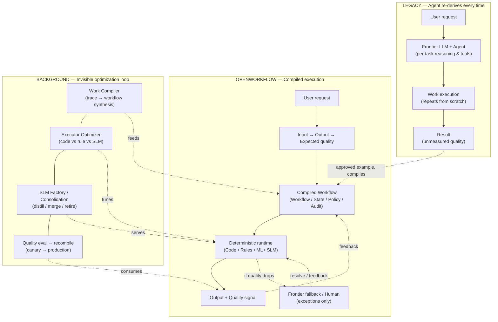

# OpenWorkflow

**The execution layer for AI work.**

[한국어 README](README.md)

Let AI do the work once. OpenWorkflow learns how to run it reliably thereafter.

> **"Build the kernel, integrate the ecosystem, enrich with semantic truth."**
>
> *"LinkML is the front door for human/LLM model authoring; OWL is the semantic truth layer; SHACL validates constraints; OpenWorkflow executes durable work."*

---

## High-Level Architecture & Pipeline Overview



---

## Why OpenWorkflow

Coding agents and frontier LLMs can perform work, but their output is not repeatable, cost-effective, or observable. Every run re-derives the same result at the same frontier cost, and quality is unmeasured.

OpenWorkflow inverts this: an agent performs the work once, a human evaluates the output, and the system compiles that proven execution into a reliable, optimized workflow that runs deterministically behind the scenes.

**AI performs. Humans evaluate outcome quality. OpenWorkflow evaluates behavior, compiles the work, and continuously optimizes execution.**

---

## End-to-End Work Compilation Pipeline (6 Steps)

```text
 ┌─────────────────────────────────────────────────────────────────────────────┐
 │                      6-STEP COMPILATION & EXECUTION PIPELINE               │
 ├─────────────────────────────────────────────────────────────────────────────┤
 │ Step 1: Trajectory Ingestion ────▶ Normalize raw logs into TraceIR         │
 │ Step 2: Behavior Parsing ────────▶ Ingest BEHAVIOR.md process constraints   │
 │ Step 3: Work IR Compilation ─────▶ Analyze & lower steps across 8 tiers     │
 │ Step 4: Durable Runtime ─────────▶ State machine execution & checkpointing  │
 │ Step 5: Frugal Oracle Gate ──────▶ Schema & behavior invariant validation   │
 │ Step 6: Quality Fold & Opt ──────▶ Lucky-correct check & SLM dataset export │
 └─────────────────────────────────────────────────────────────────────────────┘
```

1. **Step 1: Trajectory Ingestion (`TraceIR`)**: Ingest raw agent logs (OpenWorker, LangGraph, custom scripts, or OpenAI/Anthropic API calls) and normalize them into canonical `TraceIR`.
2. **Step 2: Behavior Spec Ingestion (`BEHAVIOR.md`)**: Parse process evaluation specifications into Rule/Policy, Workflow Transition Constraint, or Runtime Judge.
3. **Step 3: Work IR Compilation (`WorkCompiler`)**: Middle-end analyzers (`DeterminismAnalyzer`, `PredictionAnalyzer`, `SLMAnalyzer`) lower action steps into optimal executors across the 8-tier hierarchy and produce `work.yaml`.
4. **Step 4: Durable State Machine Execution (`DurableRuntimeEngine`)**: State machine execution with automatic state checkpointing and support for `WAITING_EVENT`, `WAITING_HUMAN`, and `WAITING_TIMER` wait states.
5. **Step 5: Frugal Objective Oracle Escalation (`ObjectiveOracleGate`)**: Closed-world schema validation and behavior invariant checks. Escalates to Frontier LLM or Human **only when schema checks or process invariants fail**.
6. **Step 6: Quality Fold Evaluation & Executor Promotion (`QualityRecord` & `ExecutorOptimizer`)**: Evaluates candidate runs via `evaluate_quality_fold()` (rejecting lucky-correct runs that violated process behaviors), evaluates model promotion, and generates HuggingFace SFT `TrainingCandidate` datasets.

---

## Zero-Code Agent Proxy (`adapters/proxy/`)

OpenWorkflow can collect standard LLM API requests as TraceIR input. The current `adapters/proxy/server.py` runs in an explicit **development/demo synthetic-response mode**, identified by the `X-OpenWorkflow-Response-Mode: synthetic` header. Live OpenAI/Anthropic upstream passthrough and streaming are not implemented yet, so production traffic must not be routed through this proxy.

```bash
# Direct your existing agent to the local OpenWorkflow Proxy
export OPENAI_BASE_URL="http://localhost:8080/v1"
export ANTHROPIC_BASE_URL="http://localhost:8080/v1"
```

```text
Existing AI Agent (Claude Code, Cursor, AutoGen, LangChain, Custom Script)
                                │
        Standard LLM API Calls (OPENAI_BASE_URL=http://localhost:8080/v1)
                                │
                                ▼
 ┌─────────────────────────────────────────────────────────────────────────────┐
 │                OPENWORKFLOW TRANSPARENT PROXY ADAPTER                       │
 │                    (adapters/proxy/server.py)                              │
 ├─────────────────────────────────────────────────────────────────────────────┤
 │ 1. Captures development/demo requests with synthetic responses               │
 │ 2. Normalizes prompts, tool calls, and tool outputs into TraceIR             │
 │ 3. Production passthrough/streaming is planned                               │
 └──────────────────────────────┬──────────────────────────────────────────────┘
                                │
                                ▼
                     OpenWorkflow WorkCompiler
                   (TraceIR → WorkIR compilation)
```

---

## The 8-Tier Executor Lowering Hierarchy

OpenWorkflow's compiler prioritizes **model elimination before model lowering**. It uses middle-end analyzers (`DeterminismAnalyzer`, `PredictionAnalyzer`, `SLMAnalyzer`) to lower steps down the 8-tier hierarchy:

```text
Priority 1: Model Elimination (Zero Token Cost)
   ├── 1. Constant / Lookup
   ├── 2. SQL / Database Query
   ├── 3. Rule Engine
   └── 4. Deterministic Code (Python / WASM / HTTP)

Priority 2: Model Lowering (Statistical & Small Models)
   ├── 5. Traditional ML (XGBoost / LightGBM / Scikit-Learn)
   ├── 6. Embedding & Vector Retrieval (RAG)
   └── 7. Distilled SLM (1B–7B local student model)

Priority 3: Residual Execution (Fallback & Quality Assurance)
   ├── 8. Frontier LLM (OpenAI / Anthropic / Gemini)
   └── 9. Human-in-the-Loop (Approval / Interrupt / Review)
```

---

## Semantic Stack Architecture (v4)

OpenWorkflow v4 introduces a multi-tiered semantic stack. It uses **LinkML** as the developer-friendly YAML authoring language, compiles into internal **Semantic IR**, enriches with **OWL 2** DL semantics, and validates closed-world constraints via **SHACL**:

| Layer | Role | Target Technology |
| :--- | :--- | :--- |
| **Authoring DSL** | Human/Developer/LLM business model authoring | **LinkML (YAML DSL)** |
| **Semantic Canonical IR** | Internal unified semantic model | **Semantic IR (`core/semantic_ir/`)** |
| **Semantic Ontology** | Open-world reasoning & relationship semantics | **OWL 2 (DL)** |
| **Constraint Validation** | Closed-world data verification & cardinalities | **SHACL** |
| **Reasoner** | Inferred classification & consistency checking | **ELK / HermiT** |
| **Runtime Graph** | Knowledge Graph & RDF triples | **Jena / RDF4J / RDFLib** |
| **Execution Engine** | Stateful workflow, action DAG & durable runtime | **OpenWorkflow Kernel** |

---

## Semantic Compiler Pipeline: Trace → LinkML → Semantic IR → Execution

```text
               Agent Trace (Trace IR)
                         │
                         ▼
                 LLVM / LLM Compiler
                         │
           LinkML Domain Model (YAML DSL)
                         │
                 Semantic Compiler
                         │
               Semantic IR (Canonical)
                         │
   ┌─────────────────────┼─────────────────────┬─────────────────────┐
   ▼                     ▼                     ▼                     ▼
Pydantic               SHACL                  OWL                 Work IR
(Runtime Types)    (Closed-World)         (Open-World)          (Durable DAG)
                         │                     │
                         ▼                     ▼
                  Validation Gate      ELK / HermiT Reasoner
                         │                     │
                         └──────────┬──────────┘
                                    ▼
                           OpenWorkflow Runtime
```

---

---

## OpenWorkLang: The Agent Programming Language (`.work`)

OpenWorkflow introduces **OpenWorkLang**, a declarative Agent Programming Language for compiling human intent, agent goals, tools, memory policies, process invariants, and action workflows into executable agent programs:

> **"Code → Software를 만드는 시대에서 OpenWorkLang → Agent를 컴파일하는 시대로."**

```openworklang
# OpenWorkLang (.work) Example: Production Quality Analyst Agent

work quality_analyst {
  goal: "Analyze production line quality anomaly root causes and generate remediation plans"

  inputs: [production_data, quality_inspection_data, equipment_logs]
  outputs: [root_cause, evidence, confidence_score, remediation_plan]
  tools: [query_mes(), query_sensor(), analyze_statistics(), create_report()]
  memory: [short_term, quality_knowledge_base]
  invariants: [verify_sensor_calibration, require_human_approval_for_remediation]

  workflow: [collect_data -> detect_anomaly -> find_correlation -> determine_root_cause -> create_report]

  executors: {
    collect_data: code,
    detect_anomaly: rule,
    find_correlation: ml,
    determine_root_cause: slm,
    create_report: slm
  }
}
```

```text
Human Intent ──▶ OpenWorkLang (.work) ──▶ OpenWorkLang Compiler ──▶ Work IR (work.yaml) ──▶ Durable Runtime
```

See **[OpenWorkLang Spec](docs/openworklang-spec.md)** for full language grammar and compiler details.


## Core Concept: Work Compilation & `Work IR`

```
Agent Trace  ──▶  Trace IR  ──▶  Work Compiler  ──▶  Work IR  ──▶  Durable Runtime
```

The **Work IR** (`work.yaml`) is OpenWorkflow's primary native asset representing executable business work:

```yaml
work: customer-renewal
version: "4.0"

inputs:
  - customer_id

outputs:
  - renewal_proposal_pdf

states:
  - initialized
  - contract_verified
  - usage_calculated
  - proposal_drafted
  - approved
  - sent

actions:
  - lookup_contract
  - calculate_usage
  - price_offer
  - draft_proposal
  - send_email

dependencies:
  calculate_usage: [lookup_contract]
  price_offer: [calculate_usage]
  draft_proposal: [price_offer]
  send_email: [draft_proposal]

invariants:
  - verify_current_contract
  - use_current_pricing_policy
  - require_approval_before_send

quality:
  reviewer_acceptance: ">=0.95"

executors:
  lookup_contract:
    type: code
    handler: connectors.crm.lookup_contract
  calculate_usage:
    type: code
    handler: services.usage.calculate
  price_offer:
    type: rule
    handler: rules.pricing_v2
  draft_proposal:
    type: slm
    preferred: models/renewal-draft-slm-v1
    fallback:
      - frontier_llm
      - human
```

---

## The 5 Standard Protocol Boundaries

OpenWorkflow connects to external surfaces and tools through 5 standardized protocol contracts:

1. **Ingress Protocol**: Standardized event format for external triggers (webhooks, cron timers, Slack events, email notifications).
2. **Surface Protocol (AG-UI)**: Real-time workflow streaming (`workflow.started`, `step.started`, `approval.requested`, `workflow.completed`) to UI surfaces like OpenTag or CopilotKit.
3. **Tool Protocol (MCP)**: Exposes control endpoints (`start_work`, `get_work`, `list_approvals`, `approve`) to agents via Model Context Protocol.
4. **Trace/Eval Protocol (Trace IR)**: Import adapters converting agent trajectories (OpenAI, LangGraph, Braintrust, OpenWorker) into **Trace IR**.
5. **Worker Protocol**: Orchestrates remote or local execution workers (OpenWorker Desktop executing file/shell actions).

---

## Repository Layout (v4)

```
openworkflow/
├── core/                        # Thin, strong OpenWorkflow kernel
│   ├── semantic_ir/             # LinkML parser, Semantic IR AST, OWL/SHACL generators
│   ├── work_ir/                 # Work IR schema, parser, and AST
│   ├── compiler/                # Trace IR → Work IR compilation & Middle-End Analyzers
│   │   └── analyzers/           # DeterminismAnalyzer, PredictionAnalyzer, SLMAnalyzer
│   ├── runtime/                 # Durable state machine, checkpointing & ObjectiveOracleGate
│   ├── policy/                  # Permissions, approvals, and confidence gates
│   ├── validation/              # Behavior contract judges & QualityRecord fold evaluator
│   └── optimizer/               # Executor routing, SLM promotion gate & TrainingCandidate generator
│
├── protocols/                   # Standard protocol contract definitions
│   ├── events/                  # Ingress protocol schemas
│   ├── traces/                  # Trace IR import schemas
│   ├── workers/                 # Worker protocol contracts
│   └── surfaces/                # AG-UI surface event contracts
│
├── adapters/                    # Ecosystem & Semantic Adapters
│   ├── proxy/                   # Zero-code LLM API proxy adapter (OpenAI & Anthropic)
│   ├── linkml/                  # LinkML authoring & generator adapter
│   ├── owl/                     # OWL 2 ontology & ELK/HermiT reasoner adapter
│   ├── shacl/                   # SHACL constraint validator adapter
│   ├── agui/                    # Surface protocol adapter for AG-UI
│   ├── mcp/                     # MCP tool protocol adapter
│   ├── opentag/                 # OpenTag channel adapter
│   ├── openworker/              # OpenWorker desktop adapter
│   ├── agentbehavior/           # AgentBehavior BEHAVIOR.md importer
│   ├── braintrust/              # Braintrust trace/eval adapter
│   └── opentelemetry/           # OpenTelemetry export adapter
│
├── agents/                      # Guide and measurement fleet specs
├── docs/                        # Specifications, architecture, usage guides, and diagrams
├── tests/                       # Complete pytest suite (108 tests)
└── examples/                    # Sample workflows, LinkML schemas, and runnable demo scripts
```

---

## Usage & Demonstration

For complete API documentation and a step-by-step developer guide, see **[Usage Guide](docs/usage.md)**.

Run the end-to-end customer renewal demonstration script:

```bash
python3 examples/run_customer_renewal_demo.py
```

Run the complete test suite:

```bash
python3 -m pytest tests/
```

---

## Ecosystem & Reference Links

OpenWorkflow builds upon and integrates with the following open-source projects, standards, and research initiatives:

| Category | Project / Standard | Link | Description |
| :--- | :--- | :--- | :--- |
| **Zero-Code Agent Proxy** | **OpenCodex** | [lidge-jun/opencodex](https://github.com/lidge-jun/opencodex) | Transparent LLM API proxy for intercepting agent trajectories |
| **Model Authoring DSL** | **LinkML** | [linkml/linkml](https://github.com/linkml/linkml) | Linked Open Data Modeling Language for YAML schema modeling |
| **Semantic Ontology** | **OWL 2 / W3C** | [w3.org/TR/owl2-overview](https://www.w3.org/TR/owl2-overview/) | W3C Web Ontology Language for semantic reasoning |
| **Constraint Validation** | **SHACL / W3C** | [w3.org/TR/shacl](https://www.w3.org/TR/shacl/) | W3C Shapes Constraint Language for RDF data validation |
| **Desktop Shell / Local Worker** | **OpenWorker** | [baryonlabs/openworker](https://github.com/baryonlabs/openworker) | Desktop AI agent shell & local execution worker |
| **Enterprise Channel UX** | **OpenTag** | [baryonlabs/opentag](https://github.com/baryonlabs/opentag) | Slack & Teams channel integration for AI workflows |
| **UI Streaming Protocol** | **AG-UI** | [agui-protocol/agui](https://github.com/agui-protocol/agui) | Protocol for streaming AI workflow lifecycle events to UIs |
| **Tool Protocol** | **Model Context Protocol (MCP)** | [modelcontextprotocol.io](https://modelcontextprotocol.io) | Anthropic's standard protocol for connecting AI models to tools |
| **Behavior Contracts** | **AgentBehavior** | [braintrustdata/agentbehavior](https://github.com/braintrustdata/agentbehavior) | Open standard format for process evaluation specs (`BEHAVIOR.md`) |
| **LLM Tracing & Evals** | **Braintrust** | [braintrustdata/braintrust](https://github.com/braintrustdata/braintrust) | Enterprise LLM evaluation & tracing platform |
| **LLM Tracing & Evals** | **Langfuse** | [langfuse/langfuse](https://github.com/langfuse/langfuse) | Open-source LLM engineering & observability platform |
| **Observability** | **OpenTelemetry** | [opentelemetry.io](https://opentelemetry.io) | Cloud-native observability framework for telemetry data |
| **Durable Execution** | **Temporal** | [temporalio/temporal](https://github.com/temporalio/temporal) | Durable state machine & workflow execution engine |
| **Compiler Research** | **LLMCompiler** | [SqueezeAILab/LLMCompiler](https://github.com/SqueezeAILab/LLMCompiler) | ICML 2024 compiler for parallel LLM function calling |

---

## License

MIT
