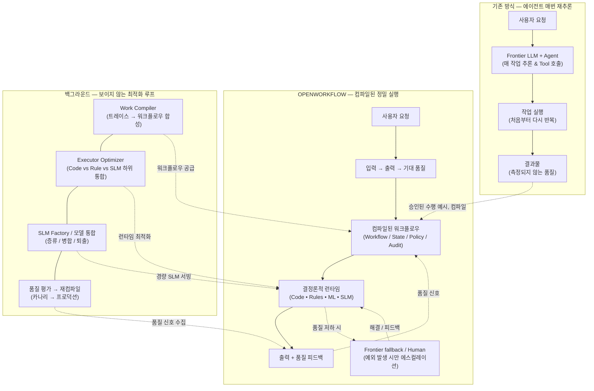

# OpenWorkflow

**AI 작업을 위한 실행 레이어 (The execution layer for AI work)**

[English README](README.en.md)

AI가 한 번 작업하게 하세요. OpenWorkflow는 이후 작업을 안정적으로 실행하는 방법을 배웁니다.

> **"코어 커널을 구축하고, 생태계를 통합하며, 시맨틱 진실을 강화하라 (Build the kernel, integrate the ecosystem, enrich with semantic truth.)"**
>
> *"LinkML은 모델 작성의 관문이며, OWL은 시맨틱 진실 레이어이고, SHACL은 제약 조건을 검증하며, OpenWorkflow는 지속적 작업을 실행합니다."*

---

## 30초 데모: Codex 안에서 그대로 쓰기


합성 화면이 아닌 **실제 Codex 대화형 세션**입니다. Codex를 OpenWorkflow 프록시로 향하게 한 뒤(ChatGPT 로그인 그대로), 저장소의 스킬 3개를 `$` 멘션으로 호출하면 됩니다.

| 순서 | Codex 입력 | 결과 |
| :--- | :--- | :--- |
| 1 | `$ow-compile-work examples/quality_analysis.work` | OpenWorkLang(`.work`) → `work.yaml` + LinkML 스키마 컴파일, executor 하위 통합(code/rule/ml/slm) |
| 2 | `$ow-traces` | 프록시가 캡처한 세션 목록 — **이 Codex 세션 자체**가 `shell_python3, shell_sed, respond, …` 스텝으로 잡힘 |
| 3 | `$ow-compile-trace codex-session` | 캡처된 Codex 세션이 `build/codex-session.work.yaml`로 컴파일됨 |

설정 방법과 각 단계가 실행하는 명령은 [Zero-Code 에이전트 프록시](#zero-code-에이전트-프록시-adaptersproxy) 섹션을 참조하세요.

---

## 전체 아키텍처 및 파이프라인 개요



---

## 왜 OpenWorkflow인가?

코딩 에이전트와 프론티어 LLM은 뛰어난 수행 능력을 갖추었지만, 그 출력은 반복 가능하지 않고, 비용 효율적이지 않으며, 관측 가능하지 않습니다. 매 요청마다 프론티어 비용을 지불하며 동일한 추론을 처음부터 다시 수행하지만, 품질은 지속적으로 측정되지 않습니다.

OpenWorkflow는 이를 역전시킵니다: 에이전트가 1회 작업을 수행하고 인간이 결과를 평가하면, 시스템은 검증된 실행 과정을 백그라운드에서 결정론적으로 실행되는 안정적이고 최적화된 워크플로우로 컴파일합니다.

**AI는 실행합니다. 인간은 결과 품질을 평가합니다. OpenWorkflow는 행위를 감독하고, 작업을 컴파일하며, 실행을 지속적으로 최적화합니다.**

---

## 실제 업무에서는 어떻게 동작하나요?

아래 사례의 공통점은 처음에는 LLM 에이전트가 업무를 수행하지만, 사람이 결과의 품질만 승인하면 OpenWorkflow가 반복 가능한 부분을 백그라운드에서 컴파일한다는 것입니다. 사람에게 상태 머신이나 모델 선택을 요구하지 않습니다.

| 업무 사례 | 처음 한 번: 에이전트가 수행하는 일 | 컴파일 후: 기본 실행 경로 | 예외 시 에스컬레이션 | 사람이 보는 품질 기준 |
| :--- | :--- | :--- | :--- | :--- |
| **1. 고객 계약 갱신 제안** | CRM에서 계약·사용량을 조회하고 가격 정책을 해석해 제안서를 작성 | 계약 조회는 DB/API, 가격은 Rule, 표준 문구는 SLM으로 실행 | 정책에 없는 할인, 낮은 신뢰도, 고객별 특약은 Frontier LLM 또는 영업 담당자에게 전달 | 가격 오류 없음, 필수 조항 포함, 승인된 톤·형식 |
| **2. 인보이스/환불 승인** | 주문·결제·약관을 조사하고 환불 가능 여부와 사유를 정리 | 주문 조회와 기간 계산은 Code, 환불 자격은 Rule, 안내문은 템플릿/SLM으로 실행 | 고액 환불, 중복 청구, 증빙 불일치는 재무 담당자 승인 대기 | 정책 준수, 금액 정확성, 승인 이력 완결성 |
| **3. 제조 품질 이상 대응** | 센서·MES 로그를 모아 이상 원인을 분석하고 개선 보고서를 작성 | 데이터 수집은 API, 임계치 판정은 Rule, 이상 탐지는 ML, 보고서 초안은 SLM으로 실행 | 신규 패턴, 센서 보정 실패, 안전 영향은 품질 엔지니어와 Frontier LLM 분석으로 전환 | 원인 근거, 안전 절차 준수, 개선안의 재현성 |
| **4. 보안/운영 장애 분류** | 경보·로그·변경 이력을 조사해 영향도와 초기 대응안을 작성 | 이벤트 정규화는 Code, 알려진 시그니처 분류는 Rule/ML, 런북 안내는 검색·SLM으로 실행 | 권한 상승 징후, 미분류 공격, 영향도 불확실은 온콜 엔지니어에게 즉시 전달 | 오탐/미탐률, SLA 내 분류, 민감 작업의 승인 여부 |

### 사례 1: 고객 계약 갱신의 한 번의 루프

```text
영업 담당자 요청
  → LLM Agent가 계약·사용량·가격 정책을 조사해 갱신안 작성
  → 담당자가 “가격과 조항이 정확하다”라고 결과 품질 승인
  → OpenWorkflow가 승인 trace를 Work IR로 컴파일
  → 다음 갱신부터 DB 조회 + 가격 Rule + SLM 초안으로 실행
  → 특약/품질 저하만 Frontier LLM 또는 담당자에게 에스컬레이션
```

핵심은 “갱신안을 만드는 LLM”을 계속 호출하는 것이 아닙니다. 승인된 업무 수행법을 실행 가능한 자산(`work.yaml`)으로 바꾸고, 더 싼 실행 주체로 교체해도 같은 행동 규격과 품질 기준을 통과하는지 계속 확인하는 것입니다. 실제 샘플은 [customer-renewal 예제](examples/customer-renewal/)에서 볼 수 있습니다.

---

## 엔드투엔드 작업 컴파일 파이프라인 (6단계)

```text
 ┌─────────────────────────────────────────────────────────────────────────────┐
 │                      6-STEP COMPILATION & EXECUTION PIPELINE               │
 ├─────────────────────────────────────────────────────────────────────────────┤
 │ 1단계: 트레이스 수집 ────────▶ 로컬/API 통신 로그를 TraceIR로 정규화       │
 │ 2단계: 행위 규격 파싱 ───────▶ BEHAVIOR.md 프로세스 불변식 구조화            │
 │ 3단계: Work IR 컴파일 ───────▶ 3대 분석기 기반 8단계 실행 계층 하위 통합     │
 │ 4단계: 지속성 런타임 ────────▶ 상태 머신 실행, 체크포인팅 및 대기 상태      │
 │ 5단계: Frugal 오라클 게이트 ──▶ JSON 스키마 & 행위 규격 객관적 에스컬레이션  │
 │ 6단계: 품질 축약 & 최적화 ───▶ Lucky-correct 차단 & SLM 학습 데이터 산출   │
 └─────────────────────────────────────────────────────────────────────────────┘
```

1. **1단계: 트레이스 수집 (`TraceIR`)**: OpenWorker, LangGraph, 커스텀 스크립트, 또는 OpenAI/Anthropic API 통신 로그를 표준 `TraceIR`로 정규화합니다.
2. **2단계: 행위 규격 파싱 (`BEHAVIOR.md`)**: 프로세스 평가 사양을 파싱하여 Rule/Policy, Workflow Transition Constraint, Runtime Judge로 분류합니다.
3. **3단계: Work IR 컴파일 (`WorkCompiler`)**: 3대 Middle-End 분석기(`DeterminismAnalyzer`, `PredictionAnalyzer`, `SLMAnalyzer`)가 액션 스텝을 8단계 최적 실행 주체로 하위 통합(Lowering)하여 `work.yaml`을 생성합니다.
4. **4단계: 지속성 상태 머신 실행 (`DurableRuntimeEngine`)**: 자동 상태 체크포인팅 및 `WAITING_EVENT`, `WAITING_HUMAN`, `WAITING_TIMER` 대기 상태를 지원하는 런타임 상태 머신 실행.
5. **5단계: Frugal 객관적 오라클 에스컬레이션 (`ObjectiveOracleGate`)**: 폐쇄 세계 스키마 검증 및 행위 불변식을 직접 검증하며, **검증 실패 시에만** Frontier LLM이나 인간으로 에스컬레이션합니다.
6. **6단계: 품질 축약 평가 & 모델 승격 (`QualityRecord` & `ExecutorOptimizer`)**: `evaluate_quality_fold()`를 통해 행위 불변식을 위반한 행운의 성공(Lucky-Correct)을 거부하고, 모델 승격을 평가하며, HuggingFace SFT `TrainingCandidate` 데이터 세트를 산출합니다.

---

## Zero-Code 에이전트 프록시 (`adapters/proxy/`)

OpenWorkflow는 표준 LLM API 요청을 TraceIR 입력으로 수집합니다. `adapters/proxy/server.py`는 두 가지 모드를 제공합니다.

| 엔드포인트 | 모드 | 설명 |
| :--- | :--- | :--- |
| `POST /v1/responses`, `POST /backend-api/codex/responses` | **passthrough** (`X-OpenWorkflow-Response-Mode: passthrough`) | 요청을 실제 upstream(OpenAI Responses API 또는 ChatGPT Codex 백엔드)으로 그대로 전달하고 SSE 스트림을 바이트 단위로 중계하면서, 완료된 턴을 백그라운드에서 TraceIR로 캡처합니다. **Codex CLI가 수정 없이 그대로 동작합니다.** |
| `POST /v1/chat/completions`, `POST /v1/messages` | **synthetic** (`X-OpenWorkflow-Response-Mode: synthetic`) | 개발·데모용 합성 응답. 운영 트래픽을 전달하면 안 됩니다. |

### 실제 사용 화면: Codex TUI 안에서 전부 실행

README 상단의 [30초 데모](#30초-데모-codex-안에서-그대로-쓰기) 녹화는 합성 데이터가 아니라 **실제 Codex 대화형 TUI 세션**이며, 프록시 기동 한 줄을 제외한 모든 실행이 Codex 안에서 이뤄집니다. 저장소의 `.agents/skills/`에 든 스킬 3개가 Codex에 자동 탐지되어 `$` 멘션으로 명시 호출됩니다(Codex 문서상 `/prompts:` 커스텀 프롬프트는 폐기되어 최신 버전에서 인식되지 않으므로, 명시적 명령은 스킬 멘션이 표준입니다).

| 순서 | Codex 입력 | Codex가 실행하는 것 | 결과 |
| :--- | :--- | :--- | :--- |
| 1 | `$ow-compile-work examples/quality_analysis.work` | `python3 -m core.openworklang compile … --linkml …` | OpenWorkLang → `build/quality_analysis.work.yaml` + LinkML 스키마, 8단계 executor 하위 통합(code/rule/ml/slm) 설명 |
| 2 | `$ow-traces` | `curl localhost:8787/v1/workcompiler/traces` | 프록시가 캡처한 세션 목록 — **지금 이 Codex 세션 자체**가 `shell_python3, shell_sed, respond, …` 스텝으로 잡혀 있음 |
| 3 | `$ow-compile-trace codex-session` | `POST /v1/workcompiler/compile` | 캡처된 Codex 세션이 `build/codex-session.work.yaml`로 컴파일됨 (actions: `shell_python3 → shell_sed → respond → shell_curl`) |

녹화 스크립트는 [`docs/demo/openworkflow-codex-demo.tape`](docs/demo/openworkflow-codex-demo.tape)입니다.

**직접 해보기**

1. Codex provider 설정 — `~/.codex/config.toml`에 추가하거나, 별도 `CODEX_HOME` 디렉터리(`auth.json` 복사 + 아래 `config.toml`)를 사용합니다.

   ```toml
   model_provider = "openworkflow"
   approval_policy = "never"
   sandbox_mode = "workspace-write"

   [sandbox_workspace_write]
   network_access = true            # Codex가 로컬 프록시에 curl 할 수 있게

   [model_providers.openworkflow]
   name = "OpenWorkflow Proxy"
   base_url = "http://127.0.0.1:8787/backend-api/codex"
   wire_api = "responses"
   requires_openai_auth = true      # ChatGPT 로그인 토큰을 그대로 사용
   ```

2. 프록시를 띄우고 저장소 루트에서 Codex를 실행합니다. 스킬은 `.agents/skills/`에서 자동으로 로드됩니다.

   ```bash
   python3 -m uvicorn adapters.proxy.server:app --port 8787 &
   codex
   ```

3. Codex 안에서 스킬을 호출합니다 — `$ow-compile-work <file.work>`, `$ow-traces`, `$ow-compile-trace <target>`.

   스킬이 실행하는 명령은 셸에서 직접 써도 동일합니다:

   ```bash
   python3 -m core.openworklang compile examples/quality_analysis.work --linkml build/quality_analysis.linkml.yaml
   curl -s localhost:8787/v1/workcompiler/traces | jq                # run_id, actions, 토큰 사용량
   curl -s localhost:8787/v1/workcompiler/traces/<run_id> | jq       # 세션의 TraceIR 전체
   curl -s -X POST localhost:8787/v1/workcompiler/compile -H 'Content-Type: application/json' \
     -d '{"run_id":"<run_id>","target_name":"codex-session","output_path":"build/codex-session.work.yaml"}'
   ```

   API 키 기반 클라이언트(OpenAI SDK, Agents SDK 등)는 `OPENAI_BASE_URL=http://127.0.0.1:8787/v1`만 지정하면 `/v1/responses`가 같은 방식으로 캡처됩니다.

```text
Existing AI Agent (Codex CLI, Claude Code, Cursor, AutoGen, LangChain, Custom Script)
                                │
        Standard LLM API Calls (OPENAI_BASE_URL=http://localhost:8787/v1)
                                │
                                ▼
 ┌─────────────────────────────────────────────────────────────────────────────┐
 │                OPENWORKFLOW TRANSPARENT PROXY ADAPTER                       │
 │                    (adapters/proxy/server.py)                              │
 ├─────────────────────────────────────────────────────────────────────────────┤
 │ 1. Responses API / Codex 백엔드 호출은 upstream으로 투명 전달 (SSE 중계)    │
 │ 2. Prompts, Tool Calls, Tool Outputs를 TraceIR로 정규화                     │
 │ 3. chat/completions · messages는 개발용 synthetic 응답                       │
 └──────────────────────────────┬──────────────────────────────────────────────┘
                                │
                                ▼
                     OpenWorkflow WorkCompiler
                   (TraceIR → WorkIR 컴파일)
```

---

## 8단계 실행 주체 하위 계층 (8-Tier Lowering Hierarchy)

OpenWorkflow 컴파일러는 **"모델을 축소하기 전에 모델을 아예 없애는 것(Model Elimination)"**을 최우선으로 합니다. 3대 Middle-End 분석기(`DeterminismAnalyzer`, `PredictionAnalyzer`, `SLMAnalyzer`)를 통해 8단계 계층으로 작업을 하위 통합합니다:

```text
Priority 1: 모델 완전 제거 (Zero Token Cost)
   ├── 1. Constant / Lookup
   ├── 2. SQL / Database Query
   ├── 3. Rule Engine
   └── 4. Deterministic Code (Python / WASM / HTTP)

Priority 2: 소형/통계 모델 치환 (Statistical & Small Models)
   ├── 5. Traditional ML (XGBoost / LightGBM / Scikit-Learn)
   ├── 6. Embedding & Vector Retrieval (RAG)
   └── 7. Distilled SLM (1B–7B local student model)

Priority 3: 잔여 실행 및 품질 보증 (Residual & Human)
   ├── 8. Frontier LLM (OpenAI / Anthropic / Gemini)
   └── 9. Human-in-the-Loop (Approval / Interrupt / Review)
```

---

## 시맨틱 스택 아키텍처 (v4)

OpenWorkflow v4는 멀티 티어 시맨틱 스택을 도입합니다. **LinkML**을 개발자 친화적인 YAML 저작 언어로 활용하고, 이를 내장 **Semantic IR**로 컴파일한 뒤, **OWL 2** DL 의미론으로 풍부화하고 **SHACL**을 통해 폐쇄 세계(Closed-World) 데이터 제약조건을 검증합니다.

| 계층 | 역할 | 추천 기술 |
| :--- | :--- | :--- |
| **Authoring DSL** | 사람이 업무 모델 작성 | **LinkML (YAML DSL)** |
| **Semantic Canonical IR** | 내부 통일 시맨틱 모델 | **Semantic IR (`core/semantic_ir/`)** |
| **Semantic Ontology** | 개방 세계 의미/관계/추론 | **OWL 2 (DL)** |
| **Constraint Validation** | 폐쇄 세계 데이터 제약 검증 | **SHACL** |
| **Reasoner** | 추론 및 일관성 검사 | **ELK / HermiT** |
| **Runtime Graph** | 지식 그래프 및 RDF 트리플 | **Jena / RDF4J / RDFLib** |
| **Execution Engine** | 지속성 워크플로우 실행 엔진 | **OpenWorkflow Kernel** |

---

## 컴파일 파이프라인: Trace → LinkML → Semantic IR → Execution

```text
               Agent Trace (Trace IR)
                         │
                         ▼
                 LLVM / LLM Compiler
                         │
           LinkML Domain Model (YAML DSL)
                         │
                 Semantic Compiler
                         │
               Semantic IR (Canonical)
                         │
   ┌─────────────────────┼─────────────────────┬─────────────────────┐
   ▼                     ▼                     ▼                     ▼
Pydantic               SHACL                  OWL                 Work IR
(Runtime Types)    (Closed-World)         (Open-World)          (Durable DAG)
                         │                     │
                         ▼                     ▼
                  Validation Gate      ELK / HermiT Reasoner
                         │                     │
                         └──────────┬──────────┘
                                    ▼
                           OpenWorkflow Runtime
```

---

---

## OpenWorkLang: Agent 프로그래밍 언어 (`.work`)

OpenWorkflow는 인간의 의도, 에이전트 목표, 도구, 메모리 정책, 프로세스 불변식 및 액션 워크플로우를 실행 가능한 에이전트 프로그램으로 컴파일하는 선언형 Agent 프로그래밍 언어인 **OpenWorkLang**을 제시합니다:

> **"Code → Software를 만드는 시대에서 OpenWorkLang → Agent를 컴파일하는 시대로."**

```openworklang
# OpenWorkLang (.work) 예시: 품질 분석가 에이전트

work quality_analyst {
  goal: "생산라인의 이상 품질 원인을 분석하고 개선안 보고서를 작성한다"

  inputs: [production_data, quality_inspection_data, equipment_logs]
  outputs: [root_cause, evidence, confidence_score, remediation_plan]
  tools: [query_mes(), query_sensor(), analyze_statistics(), create_report()]
  memory: [short_term, quality_knowledge_base]
  invariants: [verify_sensor_calibration, require_human_approval_for_remediation]

  workflow: [collect_data -> detect_anomaly -> find_correlation -> determine_root_cause -> create_report]

  executors: {
    collect_data: code,
    detect_anomaly: rule,
    find_correlation: ml,
    determine_root_cause: slm,
    create_report: slm
  }
}
```

```text
Human Intent ──▶ OpenWorkLang (.work) ──▶ OpenWorkLang Compiler ──▶ Work IR (work.yaml) ──▶ Durable Runtime
```

명령줄에서 바로 컴파일할 수 있습니다:

```bash
python3 -m core.openworklang compile examples/quality_analysis.work --linkml build/quality_analysis.linkml.yaml
# -> build/quality_analysis.work.yaml (+ LinkML 스키마), actions / invariants / executors 요약 출력
```

상세한 문법 사양과 Python API는 **[OpenWorkLang 명세서(docs/openworklang-spec.md)](docs/openworklang-spec.md)**를 참조하세요.


## 핵심 개념: 작업 컴파일 & `Work IR`

```
Agent Trace  ──▶  Trace IR  ──▶  Work Compiler  ──▶  Work IR  ──▶  Durable Runtime
```

**Work IR** (`work.yaml`)은 특정 LLM, UI, 클라우드 인프라에 독립적인 실행 정의서입니다:

```yaml
work: customer-renewal
version: "4.0"

inputs:
  - customer_id

outputs:
  - renewal_proposal_pdf

states:
  - initialized
  - contract_verified
  - usage_calculated
  - proposal_drafted
  - approved
  - sent

actions:
  - lookup_contract
  - calculate_usage
  - price_offer
  - draft_proposal
  - send_email

dependencies:
  calculate_usage: [lookup_contract]
  price_offer: [calculate_usage]
  draft_proposal: [price_offer]
  send_email: [draft_proposal]

invariants:
  - verify_current_contract
  - use_current_pricing_policy
  - require_approval_before_send

quality:
  reviewer_acceptance: ">=0.95"

executors:
  lookup_contract:
    type: code
    handler: connectors.crm.lookup_contract
  calculate_usage:
    type: code
    handler: services.usage.calculate
  price_offer:
    type: rule
    handler: rules.pricing_v2
  draft_proposal:
    type: slm
    preferred: models/renewal-draft-slm-v1
    fallback:
      - frontier_llm
      - human
```

---

## 5대 표준 프로토콜 경계 (5 Standard Protocols)

OpenWorkflow는 5가지 표준화된 프로토콜 계약을 통해 외부 표면 및 도구와 연결됩니다.

1. **Ingress Protocol**: 외부 트리거(웹훅, cron 타이머, 슬랙 이벤트, 이메일 알림)를 위한 표준화된 이벤트 규격.
2. **Surface Protocol (AG-UI)**: OpenTag, CopilotKit과 같은 UI 표면에 실시간 워크플로우 이벤트를 스트리밍 (`workflow.started`, `step.started`, `approval.requested`, `workflow.completed`).
3. **Tool Protocol (MCP)**: 외부 에이전트에 제어 엔드포인트(`start_work`, `get_work`, `list_approvals`, `approve`)를 Model Context Protocol로 노출.
4. **Trace/Eval Protocol (Trace IR)**: 다양한 에이전트 트레이스(OpenAI, LangGraph, Braintrust, OpenWorker)를 **Trace IR**로 정규화 수집.
5. **Worker Protocol**: 로컬/원격 실행 워커(로컬 파일/쉘 작업을 수행하는 OpenWorker Desktop) 오케스트레이션.

---

## 리포지토리 레이아웃 (v4)

```
openworkflow/
├── core/                        # 얇고 강력한 OpenWorkflow 커널
│   ├── semantic_ir/             # LinkML 파서, Semantic IR AST, OWL/SHACL 생성기
│   ├── work_ir/                 # Work IR 스키마, 파서, AST
│   ├── compiler/                # Trace IR → Work IR 컴파일러 & Middle-End 분석기
│   │   └── analyzers/           # DeterminismAnalyzer, PredictionAnalyzer, SLMAnalyzer
│   ├── runtime/                 # Durable 상태 머신, 체크포인팅 & ObjectiveOracleGate
│   ├── policy/                  # 권한, 승인, 신뢰도 임계치
│   ├── validation/              # Behavior 검증기 & QualityRecord 축약 평가기
│   └── optimizer/               # 실행 라우팅, SLM 승격 & TrainingCandidate 생성기
│
├── protocols/                   # 5대 표준 프로토콜 규격
│   ├── events/                  # Ingress Protocol
│   ├── traces/                  # Trace IR 규격
│   ├── workers/                 # Worker Protocol
│   └── surfaces/                # AG-UI Surface Protocol
│
├── adapters/                    # 생태계 및 시맨틱 연동 어댑터
│   ├── proxy/                   # Zero-code LLM API 프록시 어댑터 (OpenAI & Anthropic)
│   ├── linkml/                  # LinkML 저작 & 생성기 어댑터
│   ├── owl/                     # OWL 2 온톨로지 & ELK/HermiT 추론기 어댑터
│   ├── shacl/                   # SHACL 데이터 제약 검증기 어댑터
│   ├── agui/                    # AG-UI 스트리밍 어댑터
│   ├── mcp/                     # MCP 도구 어댑터
│   ├── opentag/                 # OpenTag 슬랙/팀즈 어댑터
│   ├── openworker/              # OpenWorker 데스크톱 어댑터
│   ├── agentbehavior/           # AgentBehavior BEHAVIOR.md 임포터
│   ├── braintrust/              # Braintrust 트레이스/평가 어댑터
│   └── opentelemetry/           # OpenTelemetry 내보내기 어댑터
│
├── agents/                      # 가이드 및 측정 에이전트 규격
├── docs/                        # 명세서, 아키텍처, 사용 가이드, 다이어그램
├── .agents/skills/              # Codex 스킬: $ow-compile-work · $ow-traces · $ow-compile-trace
├── tests/                       # pytest 테스트 수트 (134개 테스트 전원 통과)
└── examples/                    # Sample Work IR, LinkML 스키마, 데모 실행 스크립트
```

---

## 사용 가이드 & 데모 실행

전체 파이프라인 개발자 가이드 및 상세 사용법은 **[사용 가이드(docs/usage.md)](docs/usage.md)**를 참조하세요.

### 파이프라인 데모 (Python 스크립트 실행 화면)


위 녹화는 `Agent Trace → BEHAVIOR.md 파싱 → Work IR 컴파일 → Durable Runtime 실행 → Objective Oracle Gate → SLM 승격 평가`의 6단계 파이프라인이 한 번에 실행되는 모습과, 전체 pytest 수트가 통과하는 장면입니다. 녹화 스크립트는 [`docs/demo/openworkflow-demo.tape`](docs/demo/openworkflow-demo.tape)에 있으며, [vhs](https://github.com/charmbracelet/vhs)로 재생성할 수 있습니다:

```bash
brew install vhs   # 또는 go install github.com/charmbracelet/vhs@latest
vhs docs/demo/openworkflow-demo.tape
```

고객 계약 갱신 엔드투엔드 파이프라인 실시간 데모 실행:

```bash
python3 examples/run_customer_renewal_demo.py
```

전체 테스트 수트 실행:

```bash
python3 -m pytest tests/
```

---

## 생태계 및 참고 오픈소스 링크

OpenWorkflow는 다음 오픈소스 프로젝트, 표준 규격 및 연구 이니셔티브와 연동되거나 참고하여 개발됩니다.

| 카테고리 | 프로젝트 / 표준 | 링크 | 설명 |
| :--- | :--- | :--- | :--- |
| **Zero-Code 에이전트 프록시** | **OpenCodex** | [lidge-jun/opencodex](https://github.com/lidge-jun/opencodex) | 에이전트 트레이스 가로채기용 투명 LLM API 프록시 |
| **모델 저작 DSL** | **LinkML** | [linkml/linkml](https://github.com/linkml/linkml) | YAML 모델링 기반 시맨틱 schema 표현 언어 |
| **시맨틱 온톨로지** | **OWL 2 / W3C** | [w3.org/TR/owl2-overview](https://www.w3.org/TR/owl2-overview/) | W3C 웹 온톨로지 시맨틱 추론 언어 표준 |
| **제약 조건 검증** | **SHACL / W3C** | [w3.org/TR/shacl](https://www.w3.org/TR/shacl/) | W3C RDF 폐쇄 세계 데이터 제약 조건 검증 규격 |
| **데스크톱 쉘 / 로컬 워커** | **OpenWorker** | [baryonlabs/openworker](https://github.com/baryonlabs/openworker) | 데스크톱 AI 에이전트 쉘 및 로컬 실행 워커 |
| **엔터프라이즈 채널 UX** | **OpenTag** | [baryonlabs/opentag](https://github.com/baryonlabs/opentag) | 슬랙 및 팀즈 채널 연동 AI 워크플로우 인터페이스 |
| **UI 스트리밍 프로토콜** | **AG-UI** | [agui-protocol/agui](https://github.com/agui-protocol/agui) | AI 워크플로우 상태를 UI에 스트리밍하는 표준 프로토콜 |
| **도구 연동 프로토콜** | **Model Context Protocol (MCP)** | [modelcontextprotocol.io](https://modelcontextprotocol.io) | AI 모델과 도구를 연결하는 Anthropic 표준 프로토콜 |
| **행위 규격 사양** | **AgentBehavior** | [braintrustdata/agentbehavior](https://github.com/braintrustdata/agentbehavior) | 프로세스 검증 사양(`BEHAVIOR.md`) 표준 규격 |
| **LLM 트레이싱 & 평가** | **Braintrust** | [braintrustdata/braintrust](https://github.com/braintrustdata/braintrust) | 엔터프라이즈 LLM 평가 및 트레이싱 플랫폼 |
| **LLM 트레이싱 & 평가** | **Langfuse** | [langfuse/langfuse](https://github.com/langfuse/langfuse) | 오픈소스 LLM 엔지니어링 및 관측 플랫폼 |
| **관측성** | **OpenTelemetry** | [opentelemetry.io](https://opentelemetry.io) | 텔레메트리 데이터를 위한 클라우드 네이티브 관측 프레임워크 |
| **지속성 실행 엔진** | **Temporal** | [temporalio/temporal](https://github.com/temporalio/temporal) | 내결함성 지속성 상태 머신 및 워크플로우 실행 엔진 |
| **컴파일러 선행 연구** | **LLMCompiler** | [SqueezeAILab/LLMCompiler](https://github.com/SqueezeAILab/LLMCompiler) | ICML 2024 병렬 LLM 함수 호출 컴파일러 연구 |

---

## 라이선스

MIT
