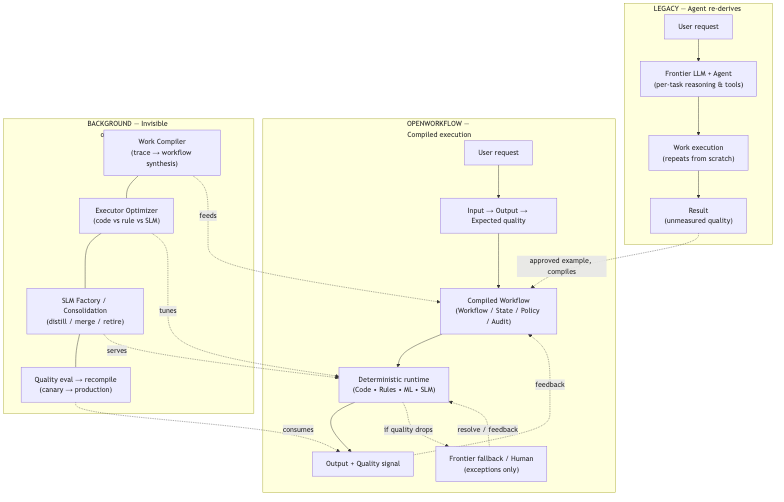
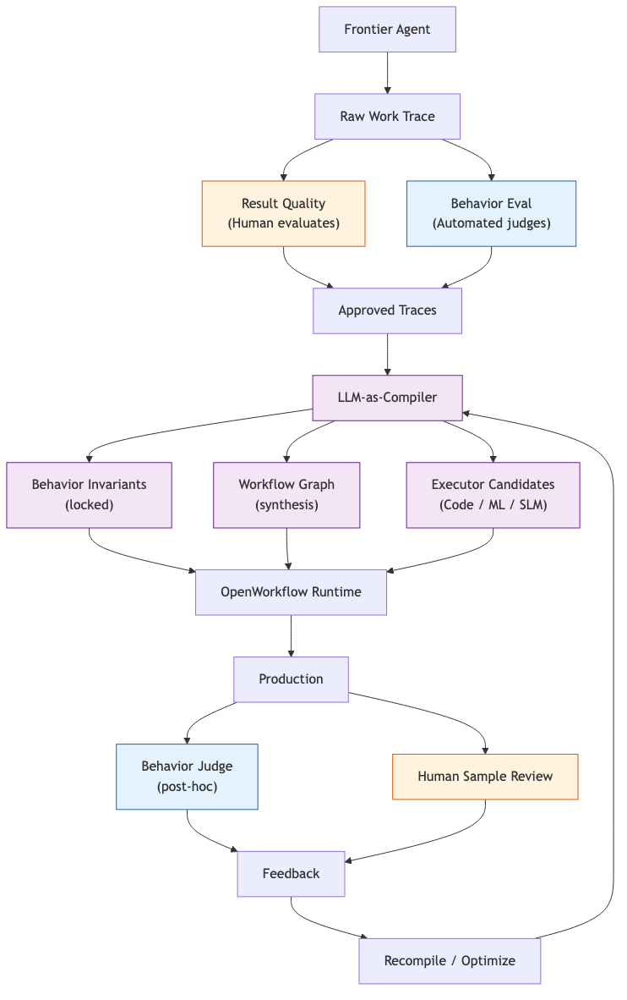

# OpenWorkflow

**The execution layer for AI work.**

Let AI do the work once. OpenWorkflow learns how to run it reliably thereafter.

From agent execution to compiled automation.

## Why OpenWorkflow

Coding agents and frontier LLMs can perform work, but their output is not repeatable, cost-effective, or observable. Every run re-derives the same result at the same frontier cost, and quality is unmeasured.

OpenWorkflow inverts this: an agent performs the work once, a human evaluates the output, and the system compiles that proven execution into a reliable, optimized workflow that runs deterministically behind the scenes.

**AI performs. Humans evaluate outcome quality. OpenWorkflow evaluates behavior, compiles the work, and continuously optimizes execution.**

The result being correct and the way it was done being correct are not the same. OpenWorkflow supervises the process, not only the outcome — see [Behavior Contract Layer](docs/behavior-contracts-v2.md).

## Core concept: Work Compilation

```
Agent Trace
      ↓
Work Compilation
      ↓
Optimized Workflow (Compiled Workflow)
```

A frontier agent produces an execution trace. Once a human approves the result, the **Work Compiler** decomposes the trace, discovers states and actions, extracts the deterministic parts, synthesizes rules and workflow structure, and produces a **Compiled Workflow**.

## Legacy vs OpenWorkflow



The pipeline contrasts the two ways of getting AI work done:

- **Left — Legacy:** A frontier LLM + agent re-derives each task from scratch on every request. Reasoning, tools, and execution repeat every time, quality is unmeasured, and cost stays at frontier rates.
- **Right — OpenWorkflow:** A workflow is compiled once and executed deterministically (code, rules, ML, SLM). Frontier LLMs and humans are reserved for the exception path, and every output carries a measured quality signal.
- **Bottom — Background:** The invisible optimization loop. The Work Compiler, Executor Optimizer, and SLM Factory/Consolidation constantly feed, tune, and serve the compiled pipeline, and quality signals drive recompilation — all without blocking execution and without anyone operating the loop.

One approved example is enough to bridge from left to right: it is compiled into the workflow, and the background loop takes over from there.

## The two loops

### Execution Loop

```
Event
  ↓
Workflow
  ↓
Action
  ↓
Result
  ↓
Validation
  ↓
Output
```

### Optimization Loop

```
Output
  ↓
Quality Evaluation
  ↓
Trace Analysis
  ↓
Compiler Agent
  ↓
Workflow Revision
  ↓
Model / Rule / SLM Revision
  ↓
Canary
  ↓
Production
```

The loops are separate. The optimization loop never blocks the execution loop.

## Evaluation model: outcome + behavior

A correct-looking output is not enough. OpenWorkflow evaluates the outcome and the behavior that produced it:

```
Production Trace
   │
   ├── Output Quality      ← human evaluates the result card
   └── Behavior Compliance ← system judges, per contract (true / false / na)
```

Behavior contracts (invariant + process expectations) are compiled alongside workflows. Judges verify `verify-contract`, `use-current-pricing-policy`, `approval-before-send`, etc. — and a lucky-correct result that skipped the required process stays **FAIL**. See [Behavior Contract Layer](docs/behavior-contracts-v2.md).



## Product principles

1. **One human can evaluate quality.** No matter how complex the internals, the human unit of evaluation is always `Input → Output → Expected quality`. People evaluate outcomes, never workflow graphs.
2. **The system supervises behavior, not only outcomes.** An approved trace must pass its behavior contracts (verify, consult, escalate, require approval — written as `BEHAVIOR.md` specs). A lucky-correct result that skips a required process is still a failure.
3. **Behavior is implementation-independent.** Behavior, workflow, and executor stay separate. Any executor swap (LLM → SLM → code) must satisfy the same behavior contracts.
4. **Users do not design workflows.** FSM, rules, thresholds, model routers, SLM selection, fallbacks, retries, confidence policies, ontology, event mapping — all managed by backend compiler agents, invisible to users.
5. **The loop is visible, but no one operates it.** Users see automation level, quality, cost reduction, and execution mix. The system maintains itself.
6. **SLM Factory.** When a frontier LLM is overkill for a task, the backend generates the training data, distills and fine-tunes an SLM, evaluates it under a quality/latency/cost policy, then ships it through shadow → canary → production. Promotion additionally requires behavior-compliance parity on held-out traces.
7. **Model consolidation.** Model count stays at a healthy level. The backend continuously evaluates merge / split / retire / promote / rollback across tasks so `300 workflows` never becomes `280 runaway SLMs`.
8. **Escalate, don't duplicate.** Quality degradation and exceptions escalate to frontier LLM + human. Everything else is compiled.

## Architecture

```
                       FRONTIER AGENT
                            │
                     performs new work
                            │
                            ▼
                    Execution Trace                 │
                            │                       │
                            ▼                       │
                    Human Quality Gate              │
                            │                       │
                     approved example               │
                            │                       │
                            ▼                       │
        ┌────────────────────────────────┐          │
        │        WORK COMPILER        │             ◀──── feedback: recompile
        │  decomposition / rules /    │             │
        │  workflow synthesis / schema│             │
        └──────────────┬──────────────┘             │
                       ▼                            │
        ┌────────────────────────────────┐          │
        │      EXECUTOR OPTIMIZER      │            ◀──── feedback: retune
        │  code vs rule vs ML / SLM /  │            │
        │  thresholds / cost policy    │            │
        └──────────────┬──────────────┘             │
                       ▼                            │
        ┌────────────────────────────────┐          │
        │          MODEL FACTORY        │           │
        │  dataset / distill / fine-tune│           │
        │  evaluate / consolidate       │           │
        └──────────────┬──────────────┘             │
                       ▼                            │
                OpenWorkflow Runtime                │
                / Policy / Production               │
                       │                            │
                       ▼                            │
                       Outputs                      │
                       │                            │
                       ▼                            │
                    Quality Eval                    ┘
```

## Pillars

- **Work Compilation** — from agent trace to compiled workflow
- **Behavior Contracts** — what a good execution means, enforced across executor swaps
- **Autonomous Optimization** — the system tunes itself
- **Human Quality Loop** — humans evaluate outcomes; the system supervises behavior
- **SLM Factory** — build small models when frontier is overkill

## Status

Early-stage. Repo scaffolds the vision; runtime, compiler, and model factory are under construction.

## License

MIT