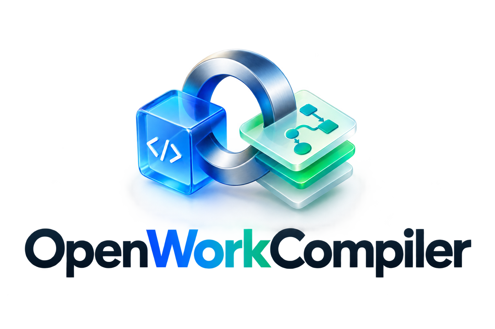
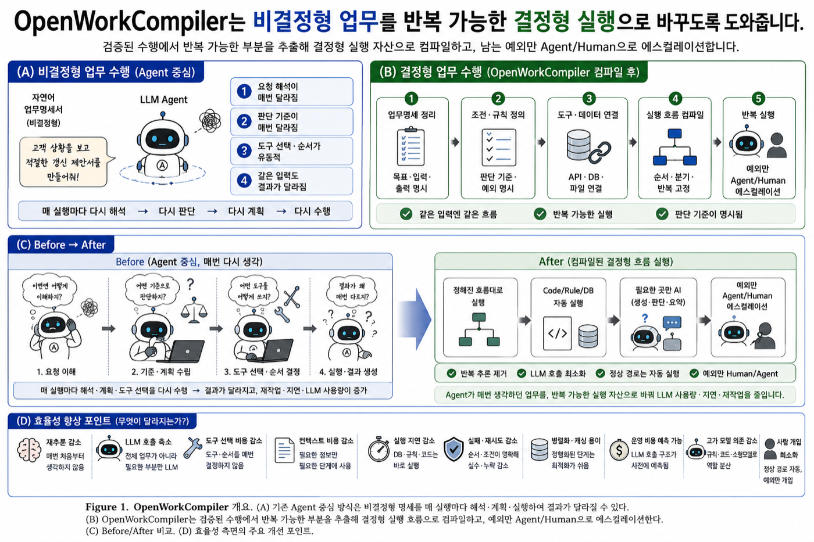
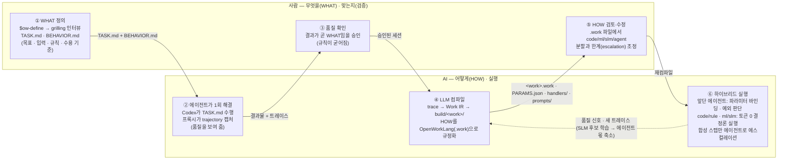
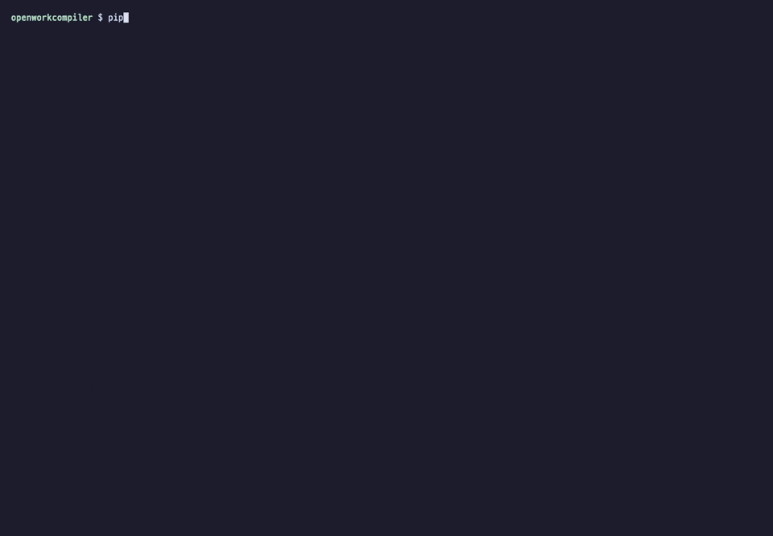
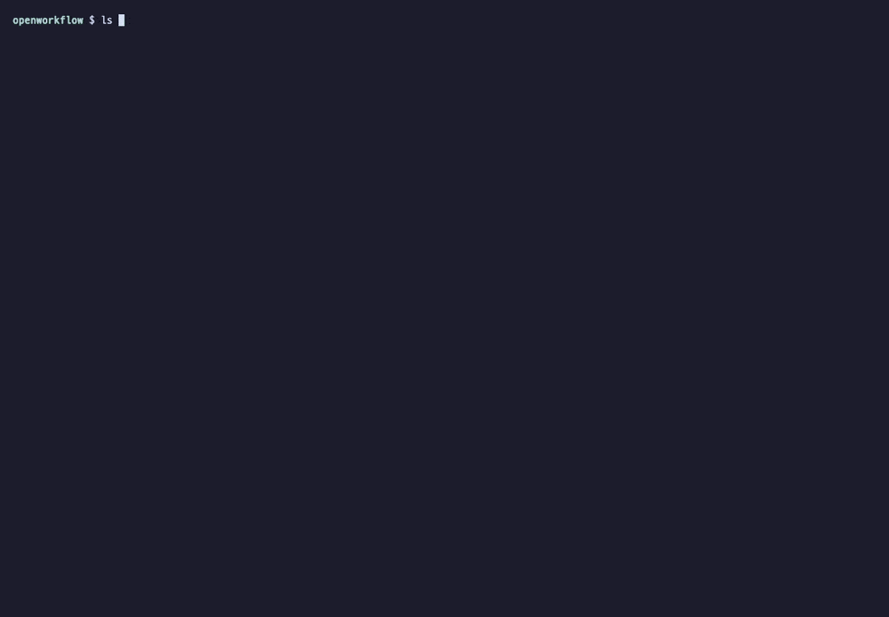
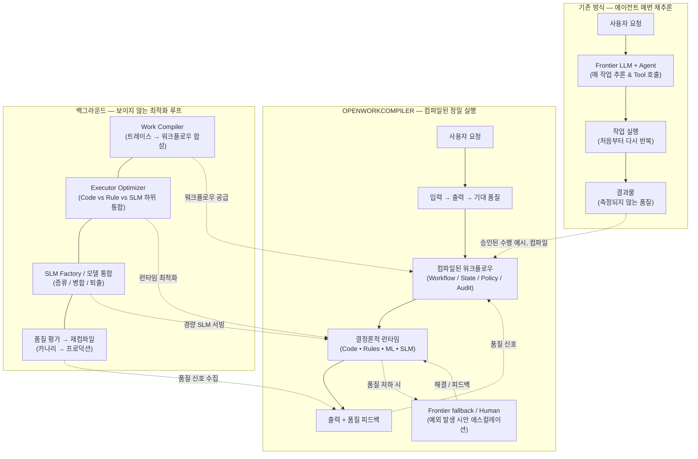

<p align="center">
  
</p>

# OpenWorkCompiler

<p align="center">
  <a href="https://github.com/baryonlabs/workcompiler/actions/workflows/ci.yml"></a>
  <a href="https://github.com/baryonlabs/workcompiler/releases/latest"></a>
  <a href="LICENSE"></a>
  
  <a href="https://baryonlabs.github.io/workcompiler/"></a>
  <a href="https://github.com/baryonlabs/openworklang"></a>
</p>



**AI 작업을 위한 실행 레이어 (The execution layer for AI work)**

[English README](README.en.md)

AI가 한 번 작업하게 하세요. OpenWorkCompiler는 이후 작업을 안정적으로 실행하는 방법을 배웁니다.

> **"코어 커널을 구축하고, 생태계를 통합하며, 시맨틱 진실을 강화하라 (Build the kernel, integrate the ecosystem, enrich with semantic truth.)"**
>
> *"LinkML은 모델 작성의 관문이며, OWL은 시맨틱 진실 레이어이고, SHACL은 제약 조건을 검증하며, OpenWorkCompiler는 지속적 작업을 실행합니다."*

---

## 사람과 AI의 역할 분담: WHAT은 사람이, HOW는 컴파일러가



| 역할 | 사람 | AI |
| :-- | :-- | :-- |
| 정의 | **WHAT** — 목표·입력·규칙·수용 기준을 문장으로 확정 (`$ow-define`) | — |
| 첫 수행 | — | 에이전트가 한 번 해결해 **품질을 보여 줌** (`codex exec`, 프록시 캡처) |
| 검증 | 결과의 품질이 WHAT과 같음을 **승인** | — |
| 규정화 | `.work`의 분할·한계를 검토·수정 | **LLM 컴파일** — 검증된 세션을 **HOW**(OpenWorkLang)로: code / rule / ml / slm / agent |
| 실행 | 에스컬레이션된 예외만 처리 | **효율성**(결정론·SLM, 토큰 0~소량) + **유연성**(앞단 에이전트가 파라미터·예외 담당) |

실측: 같은 갱신 제안서 작업에서 컴파일된 빌드는 에이전트 대비 토큰 **−85%**, **7.4×** 빠르게 같은 산출물을 냈고, 마지막 남은 요약 스텝을 로컬 SLM으로 승격한 뒤에는 **−97%**(frontier 에스컬레이션 0)까지 내려갔으며, 새 고객(CUST-1002)에 대한 하이브리드 실행은 Codex 단독 대비 **2.1×** 빠르며 에이전트 몫은 합성 스텝 1개로 줄었습니다 ([벤치마크](#30초-데모-codex-안에서-그대로-쓰기)).

---

## 30초 데모: Codex 안에서 그대로 쓰기



합성 화면이 아닌 **실제 Codex 대화형 세션**입니다. `pipx install "git+https://github.com/baryonlabs/workcompiler.git"` 한 줄로 `owc`를 설치하고(`owc agent list`가 설치된 에이전트 CLI를 보여줌), `owc proxy`를 띄운 뒤 Codex를 프록시로 향하게 하면(ChatGPT 로그인 그대로) 저장소의 스킬을 `$` 멘션으로 호출할 수 있습니다.

| 순서 | Codex 입력 | 결과 |
| :--- | :--- | :--- |
| 1 | `$ow-compile-work examples/quality_analysis.work` | OpenWorkLang(`.work`) → **실행 가능한 빌드 트리** `build/quality_analyst/` — `work.yaml` + `handlers/*.py`(code) + `rules/*.rule.yaml`(rule) + `models/ml|slm/<action>/`(model card·dataset·train.py) + LinkML 스키마 |
| 2 | `$ow-traces` | 프록시가 캡처한 세션 목록 — **이 Codex 세션 자체**가 `shell_python3, shell_sed, respond, …` 스텝으로 잡힘 |
| 3 | `$ow-compile-trace codex-session` | 캡처된 Codex 세션이 `build/codex_session/`로 컴파일됨 — 셸 스텝은 기록된 명령을 재실행하는 `handlers/shell_*.py`, 비결정 스텝은 `prompts/*.prompt.md` |
| 4 | `$ow-bench codex-session` | **에이전트 vs 컴파일된 빌드** — 같은 세션을 재실행해 결과 일치·토큰·속도를 비교한 `BENCHMARK.md` |
| 5 | `$ow-promote codex-session respond qwen2.5:7b` | 유일하게 frontier LLM에 남은 최종 요약(`respond`)을 **로컬 SLM으로 승격** — 기록 예시로 게이트 평가(근거 재현율·환각·길이) → 통과 시 `work.yaml`/`.work`에 `respond: slm` |
| 6 | `$ow-bench codex-session` | 다시 벤치 — 이번엔 SLM이 **실제로 실행**되고 토큰 원장에서 frontier 모델과 분리되어 잡힘 |

**벤치마크 결과** (작업: `.work` 파일 컴파일 후 빌드 트리 점검·요약, [`examples/demo/build/codex_session/BENCHMARK.md`](examples/demo/build/codex_session/BENCHMARK.md)):

| | 기록된 에이전트 (Codex) | 컴파일된 빌드 | 차이 |
| :-- | --: | --: | --: |
| LLM 토큰 | 147,288 | 6,551 | **−95.6%** |
| 벽시계 시간 | 106.1 s | 31.6 s | **3.4×** |
| 결과 재현 | — | **6/8 일치** (`respond` 2/2는 SLM 게이트 PASS; `shell_curl` 2개는 실행마다 달라지는 트레이스 목록 조회) | |

셸 스텝(`shell_sed`, `shell_python3`, `shell_find`, `shell_curl`)은 code 계층으로 내려가 토큰 0·수십 ms에 재실행됐고(컴파일·탐색 출력은 그대로 일치, 프록시 트레이스 목록 `curl`은 세션마다 내용이 달라 불일치로 표시), 남은 비용은 최종 요약(`respond`)뿐인데, 이 스텝은 녹화의 5–6단계에서 **로컬 `qwen2.5:7b`로 승격**되어 실행됩니다(6,551 토큰, $0, 게이트 2/2 PASS) — 같은 세션에서 `qwen2.5:3b`는 자리표시자를 남겨 게이트에 거부됐습니다.

**실제 업무 작업 — 고객 계약 갱신 제안서** ([`examples/customer-renewal/TASK.md`](examples/customer-renewal/TASK.md): CRM 활성 계약 확인 → 3개월 사용량 집계 → 현행 가격정책으로 산정 → 제안서·가격 JSON 작성; 원본은 [`examples/demo/customer-renewal-bench/`](examples/demo/customer-renewal-bench/)):

| | 기록된 에이전트 (Codex, 8 스텝) | 컴파일된 빌드 (빈 상태에서 재실행) | 차이 |
| :-- | --: | --: | --: |
| LLM 토큰 | 139,437 | 20,545 → 승격 후 **4,208** | **−85% → −97%** |
| 벽시계 시간 | 82.6 s | 11.2 s | **7.4×** |
| 결과 재현 | — | **7/7 일치** (승격 후 8/8) | |
| 최종 산출물 `proposal-CUST-1001.md` · `pricing-CUST-1001.json` | — | **바이트 단위 동일** | |

계약 조회(`jq`)·데이터 읽기·가격 산정·제안서 작성(`apply_patch`)까지 업무 자체는 전부 code 계층으로 컴파일돼 토큰 0으로 재현됐고, 남은 비용은 사람에게 보여줄 최종 요약 한 스텝입니다.

**같은 업무를 Claude Code로** ([`examples/demo/claude-code-bench/`](examples/demo/claude-code-bench/): `ANTHROPIC_BASE_URL`만 프록시로 향하게 한 실제 Claude Code v2.1.251 세션, 코드 변경 없음):

| | 기록된 에이전트 (Claude Code, 7 스텝) | 컴파일된 빌드 (빈 상태에서 재실행) | 차이 |
| :-- | --: | --: | --: |
| LLM 토큰 (캐시 읽기 포함) | 1,426,098 | 213,044 | **−85%** |
| 벽시계 시간 | 74.1 s | 10.7 s | **6.9×** |
| 결과 재현 | — | **4/6 일치** (나머지 2개: `ls -la` 시각, Glob 경로 접두어) | |
| 최종 산출물 `proposal-CUST-1001.md` · `pricing-CUST-1001.json` | — | **바이트 단위 동일** | |

`Read`/`Glob`/`Bash`가 Codex의 `exec_command`/`apply_patch`와 같은 어휘(`read_*`, `shell_*`, `write_*`)로 정규화되므로 결과 구조가 같습니다 — 어떤 에이전트로 녹화하든 컴파일 결과는 같은 빌드 트리입니다.
## 지원하는 코드 에이전트

에이전트는 갈아끼울 수 있는 부품입니다. 캡처(프록시)와 실행(에스컬레이션 백엔드) 두 이음새가 모두 에이전트 중립이므로, 어떤 에이전트로 녹화했든 컴파일 결과는 같은 빌드 트리이고, 남은 스텝은 어떤 에이전트로든 실행할 수 있습니다.

| 에이전트 | 캡처 (프록시) | 실행 (`--escalate`, 앞단 바인더) | 스킬 호출 | 프록시 연결 |
| :-- | :-- | :-- | :-- | :-- |
| **Codex CLI** | ✅ Responses API + ChatGPT 백엔드(구독 로그인 그대로) | ✅ `codex exec` | `$ow-define` … `$ow-bench` (`.agents/skills/`) | `~/.codex/config.toml` provider ([아래](#실제-사용-화면-codex-tui-안에서-전부-실행)) |
| **Claude Code** | ✅ Anthropic Messages API (API 키 · 구독/OAuth 로그인 모두) | ✅ `claude -p` | `/ow-define` … `/ow-bench` (`owc skills install --agent claude`) | `export ANTHROPIC_BASE_URL=http://127.0.0.1:8787` |
| **Cursor · Windsurf · Continue** | ✅ OpenAI chat/completions (`OPENAI_BASE_URL`) | — (CLI 없음) | — | `OPENAI_BASE_URL=http://127.0.0.1:8787/v1` (Settings → Models → Override OpenAI Base URL) |
| **opencode** | ✅ OpenAI chat/completions | ✅ `opencode run` | `/ow-*` (`owc skills install --agent opencode`) | `export OPENAI_BASE_URL=http://127.0.0.1:8787/v1` |
| **Aider** | ✅ OpenAI chat/completions | ✅ `aider --message` | (SKILL.md 본문을 메시지로) | `export OPENAI_BASE_URL=http://127.0.0.1:8787/v1` |
| **Gemini CLI** | 계획 중 (Gemini API 인터셉터) | ✅ `gemini -p` | `/ow-*` (`owc skills install --agent gemini`) | — |

```bash
owc agent list                       # 설치된 에이전트 CLI · 스킬 디렉터리 · 캡처 방식
owc agent setup claude               # 에이전트별 프록시 연결 설정 출력 (codex / claude / opencode / aider)
owc skills install --agent claude    # 정본 .agents/skills/ → .claude/skills/ (Codex는 정본을 그대로 읽음)
owc build run build/<work> --request "…" --escalate auto   # auto = OWC_AGENT → 녹화한 에이전트 → 설치된 첫 에이전트
```

에이전트마다 다른 도구 이름(`exec_command`·`Bash`·`run_terminal_cmd`, `apply_patch`·`Write`/`Edit`)은 프록시에서 하나의 어휘(`shell_<prog>`, `write_<stem>` + V4A 패치 텍스트, `read_*`/`glob_*`/`grep_*`)로 정규화되어 같은 컴파일러·핸들러·벤치마크를 탑니다 — [`adapters/proxy/README.md`](adapters/proxy/README.md).

### 앞단 에이전트 + 컴파일된 빌드: 새 입력(CUST-1002)에 대한 하이브리드 실행

컴파일된 빌드는 기록된 세션의 입력(CUST-1001)을 재현할 뿐이므로, **앞단 에이전트**가 새 요청에서 파라미터를 바인딩하고(`PARAMS.json`의 `customer_id`), code 계층은 그 값으로 재실행하며, 에이전트가 합성했던 스텝(가격 JSON·제안서 작성, 최종 요약)만 Codex로 에스컬레이션합니다 — 유연성은 앞단 에이전트가, 효율성은 결정론적 코드가 맡는 구조입니다 ([`hybrid-CUST-1002/`](examples/demo/customer-renewal-bench/hybrid-CUST-1002/)):

```bash
python3 -m core.build run build/customer_renewal_codex \
  --request "Prepare the annual renewal proposal for customer CUST-1002." --escalate codex
```

| CUST-1002 | Codex 단독 (전체 수행) | 하이브리드 (빌드 + 앞단 에이전트) | 차이 |
| :-- | --: | --: | --: |
| LLM 토큰 | 32,572 | 26,481 (에스컬레이션 2회) | −19% |
| 벽시계 시간 | 83 s | 40.2 s | **2.1×** |
| 스텝 | 에이전트 8턴 | code 6 (토큰 0) + 에스컬레이션 2 | |
| 산정 결과 | 60석 · 연 $17,100 · 볼륨 5% | 60석 · 연 $17,100 · 볼륨 5% | 동일 |

같은 빌드를 **Claude Code**로 에스컬레이션해도(`--escalate claude`, 코드·빌드 변경 없음) `pricing-CUST-1002.json`은 Codex 결과와 동일합니다 — 60.7 s, 517,720 토큰(그중 363,523은 캐시 읽기: `claude -p`가 매 호출 전역 `CLAUDE.md`·도구 스키마를 읽음), [`hybrid-CUST-1002-claude/`](examples/demo/customer-renewal-bench/hybrid-CUST-1002-claude/).

토큰 절감이 첫 벤치보다 작은 이유는 명확합니다: 남은 두 에스컬레이션이 각각 새 Codex 세션(시스템 프롬프트 포함 10–16k 토큰)이기 때문입니다. 이 두 스텝이 `models/slm/` 후보로 승격되거나 제안서 문안이 템플릿(code)으로 내려가면 그때 토큰이 0에 가까워집니다 — 어디까지 내려갈 수 있는지가 `.work` 파일의 `escalation` 블록에 명시됩니다.


### 마지막 한 단: `respond`를 frontier LLM에서 로컬 SLM으로 승격

위 두 벤치에서 유일하게 남았던 비용은 사람에게 보여줄 최종 요약(`respond`)이었습니다. 이제 그 스텝도 **품질 게이트 아래에서 소형 로컬 모델**로 내려갑니다 — 파인튜닝이 아니라(예시 1–2개로 학습은 근거가 없음) 게이트가 검증한 라우팅이며, 데이터셋이 쌓이면 `models/slm/<action>/train.py`가 다음 단계입니다 ([`PROMOTION.md`](examples/demo/customer-renewal-bench/build/customer_renewal_codex/models/slm/respond/PROMOTION.md)):

```bash
ollama pull qwen2.5:7b                                                     # OpenAI 호환 로컬 엔드포인트면 무엇이든 (OPENWORKCOMPILER_SLM_BASE_URL)
owc build promote build/customer_renewal_codex respond --model qwen2.5:7b  # 기록 예시로 게이트 평가 → 통과 시 work.yaml/.work에 respond: slm
owc build bench   build/customer_renewal_codex                              # SLM이 실제로 실행되고 토큰 원장에 모델별로 잡힘
owc build demote  build/customer_renewal_codex respond                      # 롤백
```

| 후보 | 게이트 | 근거 |
| :-- | :-- | :-- |
| `qwen2.5:3b` | **FAIL** | 파일 경로의 자리표시자를 채우지 못함 → 근거 재현율 0.50 |
| `qwen2.5:7b` | **PASS** (재현율 1.00 · 근거 1.00 · 길이 ×1.0) | 기록된 답변의 사실 6개(270석·$116,640·10%·CUST-1001·파일 2개) 전부 상류 출력에서 재현, 환각 0 |

| 승격 후 customer-renewal 전체 벤치 | 기록된 에이전트 (Codex) | 컴파일된 빌드 (code 6 + SLM 1) | 차이 |
| :-- | --: | --: | --: |
| LLM 토큰 | 139,437 | **4,208** (전부 로컬 SLM, $0) | **−97.0%** |
| 벽시계 시간 | 82.6 s | 17.2 s | **4.8×** |
| 결과 재현 | — | **8/8** | |
| frontier LLM 에스컬레이션 | 1 스텝 | **0** | |

게이트는 결정론적입니다: SLM 답변의 숫자·ID·파일경로를 뽑아 (1) frontier 답변이 말했고 상류 데이터에 실재하는 사실을 모두 다시 말했는지(재현율), (2) 입력 어디에도 없는 값을 지어내지 않았는지(근거), (3) 길이·자리표시자·사실 밀도를 검사하고, 평가마다 `QualityRecord`를 만들어 기존 `ExecutorOptimizer.evaluate_promotion`을 통과해야 합니다. SLM에게 기록된 답변은 **값을 가린 채** 예시로만 보여주므로 베끼기는 불가능합니다. 데모 녹화의 codex_session에서는 `qwen2.5:3b`가 긴 빌드 트리 요약에서 게이트에 거부되고 `qwen2.5:7b`가 2/2 통과해 승격됐으며(전체 −95.6%, 3.4×), 새 입력 CUST-1002 하이브리드에서는 `respond`가 SLM(4,205 토큰, $0, PASS)으로 실행되고 합성 스텝 1개만 Claude Code로 갔습니다 — 가격 JSON은 동일 ([`hybrid-CUST-1002-slm/`](examples/demo/customer-renewal-bench/hybrid-CUST-1002-slm/)). 게이트에 걸리면 자동으로 에이전트 에스컬레이션으로 넘어가고 `RUN_REPORT.md`에 SLM의 시도와 사유가 남습니다. 파일을 산출하는 합성 스텝은 게이트가 SLM 승격을 **거부**했고(7b는 할인 밴드 오답 — 산술적으로 자기일관적이라 쌍-근거 검사를 새로 넣어 잡음; 14b는 반올림 규칙을 지어냄, [`PROMOTION.md`](examples/demo/customer-renewal-bench/build/customer_renewal_codex/models/slm/write_pricing_cust_1001/PROMOTION.md)에 증거 보존), 대신 **한 번 에이전트로 에스컬레이션되면 파라미터 키로 캐시**됩니다: CUST-1002 1차 실행 184,454 토큰 → **같은 요청의 2차 실행 0 토큰 · 0.1 s** (code 6 + cache 2, 산출물 동일, [`hybrid-CUST-1002-repeat/`](examples/demo/customer-renewal-bench/hybrid-CUST-1002-repeat/)). 캐시 항목은 상류 스텝 출력의 지문을 함께 저장하므로, 원천 데이터가 바뀌면 자동으로 무효화되어 다시 에스컬레이션됩니다(`owc build cache list|clear`, `--no-cache`).

### 프롬프트를 모르는 사람도 되나요? — 4가지 업무 사례를 채팅만으로

업무 자료(팀장 메모 · 본인 노트 · 이전 완성물 · 데이터 파일)만 가진 **완전 초보자**가 Codex TUI에서 `$ow-define`을 치고 "추천안대로"라고 답하는 것만으로 WHAT이 만들어지고, 그 뒤 에이전트 1회 수행 → 컴파일 → 재실행까지 4가지 업무 사례 전부를 실제로 돌렸습니다 ([`examples/cases/`](examples/cases/) — 시나리오·transcript·트레이스·빌드·토큰 원장 포함):



| 사례 | 초보자가 가진 것 | `$ow-define` 결과 | 에이전트 1회 (gpt-5.6-sol) | 컴파일된 빌드 재실행 |
| :-- | :-- | :-- | --: | --: |
| 고객 계약 갱신 제안 | 영업팀장 메모 · 이전 제안서 · CRM/사용량/가격정책 | TASK 9단계 · BEHAVIOR 4 | 160,876 토큰 · 134 s | 24,819 (−85%) · 7.1 s · 7/7 재현 |
| 인보이스/환불 승인 | CS팀장 메모 · 이전 판정서 · 주문/결제/정책 v3 | TASK 10단계 · BEHAVIOR 6 | 280,023 토큰 · 114 s | 21,999 (−92%) · 6.0 s · 판정 동일 |
| 제조 품질 이상 대응 | 품질팀장 메모 · 이전 보고서 · MES/센서/보정 로그 | TASK 8단계 · BEHAVIOR 6 | 138,200 토큰 · 142 s | 32,661 (−76%) · 12.7 s · 5/5 재현 |
| 보안/운영 장애 분류 | 온콜 리드 메모 · 이전 노트 · 알람/시그니처/런북 | TASK 10단계 · BEHAVIOR 6 | 159,640 토큰 · 88 s | 21,081 (−87%) · 5.3 s · 분류 동일 |

각 빌드의 `BENCHMARK.md`에는 **토큰 원장**이 있습니다 — 스텝마다 "기록 시 어떤 모델이 프롬프트(캐시)+완성 몇 토큰을 썼고, 컴파일 후엔 무엇(code / rule / 모델)이 몇 토큰을 쓰는지", 그리고 모델별 합계. 실행마다 `ledger.jsonl`에 누적되어 모델 교체(frontier → SLM → code)의 효과를 추적할 수 있습니다.

### WHAT → HOW: 이 파이프라인이 만드는 두 산출물

| | 무엇 | 어디에 |
| :-- | :-- | :-- |
| **WHAT** — 목표·수용 기준·행위 규약 | 정제되지 않은 요구사항을 사람이 문장으로 확정한 것. Codex에서 **`$ow-define <업무>`** 를 호출하면 [grill-me / grilling](https://github.com/mattpocock/skills)(저장소에 설치됨, `.agents/skills/`) 인터뷰로 목표·입력·규칙·수용 기준을 끝까지 캐묻고 `TASK.md`와 `BEHAVIOR.md`를 써 줍니다. 그 뒤 에이전트가 한 번 수행한 결과를 사람이 검증하면서 규칙이 굳어집니다 | `TASK.md`, `behaviors/*/BEHAVIOR.md` |
| **HOW** — 실행 분할과 한계 | 검증된 세션을 컴파일해 얻은 **OpenWorkLang(`.work`)**: 액션별로 code / rule / ml / slm / llm 중 무엇이 실행하는지, 어떤 파라미터를 앞단 에이전트가 바인딩하는지, 어떤 스텝이 `agent`로 남는지(한계)를 사람이 읽고 고쳐 재컴파일할 수 있는 명세 | `build/<work>/<work>.work` (+ `PARAMS.json`, `prompts/`) |

전체 루프를 Codex 스킬로 보면 다음과 같습니다:

```text
$ow-define <업무>            # WHAT: grilling 인터뷰 → examples/<work>/TASK.md + behaviors/*/BEHAVIOR.md (+ 픽스처 데이터)
codex exec 'Read examples/<work>/TASK.md …'   # 에이전트가 한 번 수행 (프록시가 캡처) → 사람이 결과 검증
$ow-traces · $ow-compile-trace <work>         # 검증된 세션 → build/<work>/ (handlers · prompts · PARAMS.json · <work>.work = HOW)
$ow-bench <work>                              # 에이전트 vs 빌드: 결과 · 토큰 · 속도
python3 -m core.build run build/<work> --request "…" --escalate auto    # 새 입력: 앞단 에이전트 + 빌드 (auto|claude|codex|…)
```

컴파일된 `.work`의 예 — `build/customer_renewal_codex/customer_renewal_codex.work`:

```text
work customer_renewal_codex {
  params:
    - customer_id            # 기록값 CUST-1001, 실행 시 앞단 에이전트가 요청에서 바인딩
  workflow: [shell_sed, shell_rg, shell_cat, shell_jq, shell_mkdir, write_pricing_cust_1001, respond]
  executors: { shell_sed: code, shell_rg: code, shell_cat: code, shell_jq: code, shell_mkdir: code,
               write_pricing_cust_1001: code, respond: llm }
  escalation: { write_pricing_cust_1001: agent,     # 합성 콘텐츠 — 파라미터가 바뀌면 에이전트가 재생성
                respond: frontier_llm,               # 최종 요약 — SLM 후보 승격 전까지 프론티어
                on_error: fallback_to_frontier_llm, on_quality_drop: require_human_review }
}
```


설정 방법과 각 단계가 실행하는 명령은 [Zero-Code 에이전트 프록시](#zero-code-에이전트-프록시-adaptersproxy) 섹션을, 입력 프롬프트·Codex 출력·컴파일 산출물·벤치마크 원본은 [`examples/demo/`](examples/demo/)를 참조하세요.

---

## 전체 아키텍처 및 파이프라인 개요



---

## 왜 OpenWorkCompiler인가?

코딩 에이전트와 프론티어 LLM은 뛰어난 수행 능력을 갖추었지만, 그 출력은 반복 가능하지 않고, 비용 효율적이지 않으며, 관측 가능하지 않습니다. 매 요청마다 프론티어 비용을 지불하며 동일한 추론을 처음부터 다시 수행하지만, 품질은 지속적으로 측정되지 않습니다.

OpenWorkCompiler는 이를 역전시킵니다: 에이전트가 1회 작업을 수행하고 인간이 결과를 평가하면, 시스템은 검증된 실행 과정을 백그라운드에서 결정론적으로 실행되는 안정적이고 최적화된 워크플로우로 컴파일합니다.

**AI는 실행합니다. 인간은 결과 품질을 평가합니다. OpenWorkCompiler는 행위를 감독하고, 작업을 컴파일하며, 실행을 지속적으로 최적화합니다.**

---

## 실제 업무에서는 어떻게 동작하나요?

아래 사례의 공통점은 처음에는 LLM 에이전트가 업무를 수행하지만, 사람이 결과의 품질만 승인하면 OpenWorkCompiler가 반복 가능한 부분을 백그라운드에서 컴파일한다는 것입니다. 사람에게 상태 머신이나 모델 선택을 요구하지 않습니다.

| 업무 사례 | 처음 한 번: 에이전트가 수행하는 일 | 컴파일 후: 기본 실행 경로 | 예외 시 에스컬레이션 | 사람이 보는 품질 기준 |
| :--- | :--- | :--- | :--- | :--- |
| **1. 고객 계약 갱신 제안** | CRM에서 계약·사용량을 조회하고 가격 정책을 해석해 제안서를 작성 | 계약 조회는 DB/API, 가격은 Rule, 표준 문구는 SLM으로 실행 | 정책에 없는 할인, 낮은 신뢰도, 고객별 특약은 Frontier LLM 또는 영업 담당자에게 전달 | 가격 오류 없음, 필수 조항 포함, 승인된 톤·형식 |
| **2. 인보이스/환불 승인** | 주문·결제·약관을 조사하고 환불 가능 여부와 사유를 정리 | 주문 조회와 기간 계산은 Code, 환불 자격은 Rule, 안내문은 템플릿/SLM으로 실행 | 고액 환불, 중복 청구, 증빙 불일치는 재무 담당자 승인 대기 | 정책 준수, 금액 정확성, 승인 이력 완결성 |
| **3. 제조 품질 이상 대응** | 센서·MES 로그를 모아 이상 원인을 분석하고 개선 보고서를 작성 | 데이터 수집은 API, 임계치 판정은 Rule, 이상 탐지는 ML, 보고서 초안은 SLM으로 실행 | 신규 패턴, 센서 보정 실패, 안전 영향은 품질 엔지니어와 Frontier LLM 분석으로 전환 | 원인 근거, 안전 절차 준수, 개선안의 재현성 |
| **4. 보안/운영 장애 분류** | 경보·로그·변경 이력을 조사해 영향도와 초기 대응안을 작성 | 이벤트 정규화는 Code, 알려진 시그니처 분류는 Rule/ML, 런북 안내는 검색·SLM으로 실행 | 권한 상승 징후, 미분류 공격, 영향도 불확실은 온콜 엔지니어에게 즉시 전달 | 오탐/미탐률, SLA 내 분류, 민감 작업의 승인 여부 |

### 사례 1: 고객 계약 갱신의 한 번의 루프

```text
영업 담당자 요청
  → LLM Agent가 계약·사용량·가격 정책을 조사해 갱신안 작성
  → 담당자가 “가격과 조항이 정확하다”라고 결과 품질 승인
  → OpenWorkCompiler가 승인 trace를 Work IR로 컴파일
  → 다음 갱신부터 DB 조회 + 가격 Rule + SLM 초안으로 실행
  → 특약/품질 저하만 Frontier LLM 또는 담당자에게 에스컬레이션
```

핵심은 “갱신안을 만드는 LLM”을 계속 호출하는 것이 아닙니다. 승인된 업무 수행법을 실행 가능한 자산(`work.yaml`)으로 바꾸고, 더 싼 실행 주체로 교체해도 같은 행동 규격과 품질 기준을 통과하는지 계속 확인하는 것입니다. 실제 샘플은 [customer-renewal 예제](examples/customer-renewal/)에서 볼 수 있습니다.

---

## 엔드투엔드 작업 컴파일 파이프라인 (6단계)

```text
 ┌─────────────────────────────────────────────────────────────────────────────┐
 │                      6-STEP COMPILATION & EXECUTION PIPELINE               │
 ├─────────────────────────────────────────────────────────────────────────────┤
 │ 1단계: 트레이스 수집 ────────▶ 로컬/API 통신 로그를 TraceIR로 정규화       │
 │ 2단계: 행위 규격 파싱 ───────▶ BEHAVIOR.md 프로세스 불변식 구조화            │
 │ 3단계: Work IR 컴파일 ───────▶ 3대 분석기 기반 8단계 실행 계층 하위 통합     │
 │ 4단계: 지속성 런타임 ────────▶ 상태 머신 실행, 체크포인팅 및 대기 상태      │
 │ 5단계: Frugal 오라클 게이트 ──▶ JSON 스키마 & 행위 규격 객관적 에스컬레이션  │
 │ 6단계: 품질 축약 & 최적화 ───▶ Lucky-correct 차단 & SLM 학습 데이터 산출   │
 └─────────────────────────────────────────────────────────────────────────────┘
```

1. **1단계: 트레이스 수집 (`TraceIR`)**: OpenWorker, LangGraph, 커스텀 스크립트, 또는 OpenAI/Anthropic API 통신 로그를 표준 `TraceIR`로 정규화합니다.
2. **2단계: 행위 규격 파싱 (`BEHAVIOR.md`)**: 프로세스 평가 사양을 파싱하여 Rule/Policy, Workflow Transition Constraint, Runtime Judge로 분류합니다.
3. **3단계: Work IR 컴파일 (`WorkCompiler`)**: 3대 Middle-End 분석기(`DeterminismAnalyzer`, `PredictionAnalyzer`, `SLMAnalyzer`)가 액션 스텝을 8단계 최적 실행 주체로 하위 통합(Lowering)하여 `work.yaml`을 생성합니다.
4. **4단계: 지속성 상태 머신 실행 (`DurableRuntimeEngine`)**: 자동 상태 체크포인팅 및 `WAITING_EVENT`, `WAITING_HUMAN`, `WAITING_TIMER` 대기 상태를 지원하는 런타임 상태 머신 실행.
5. **5단계: Frugal 객관적 오라클 에스컬레이션 (`ObjectiveOracleGate`)**: 폐쇄 세계 스키마 검증 및 행위 불변식을 직접 검증하며, **검증 실패 시에만** Frontier LLM이나 인간으로 에스컬레이션합니다.
6. **6단계: 품질 축약 평가 & 모델 승격 (`QualityRecord` & `ExecutorOptimizer`)**: `evaluate_quality_fold()`를 통해 행위 불변식을 위반한 행운의 성공(Lucky-Correct)을 거부하고, 모델 승격을 평가하며, HuggingFace SFT `TrainingCandidate` 데이터 세트를 산출합니다.

---

## Zero-Code 에이전트 프록시 (`adapters/proxy/`)

OpenWorkCompiler는 표준 LLM API 요청을 TraceIR 입력으로 수집합니다. `adapters/proxy/server.py`는 두 가지 모드를 제공합니다.

| 엔드포인트 | 모드 | 설명 |
| :--- | :--- | :--- |
| `POST /v1/responses`, `POST /backend-api/codex/responses` | **passthrough** (`X-OpenWorkCompiler-Response-Mode: passthrough`) | 요청을 실제 upstream(OpenAI Responses API 또는 ChatGPT Codex 백엔드)으로 그대로 전달하고 SSE 스트림을 바이트 단위로 중계하면서, 완료된 턴을 백그라운드에서 TraceIR로 캡처합니다. **Codex CLI가 수정 없이 그대로 동작합니다.** |
| `POST /v1/chat/completions`, `POST /v1/messages` | **synthetic** (`X-OpenWorkCompiler-Response-Mode: synthetic`) | 개발·데모용 합성 응답. 운영 트래픽을 전달하면 안 됩니다. |

### 실제 사용 화면: Codex TUI 안에서 전부 실행

README 상단의 [30초 데모](#30초-데모-codex-안에서-그대로-쓰기) 녹화는 합성 데이터가 아니라 **실제 Codex 대화형 TUI 세션**이며, 프록시 기동 한 줄을 제외한 모든 실행이 Codex 안에서 이뤄집니다. 저장소의 `.agents/skills/`에 든 스킬 3개가 Codex에 자동 탐지되어 `$` 멘션으로 명시 호출됩니다(Codex 문서상 `/prompts:` 커스텀 프롬프트는 폐기되어 최신 버전에서 인식되지 않으므로, 명시적 명령은 스킬 멘션이 표준입니다).

| 순서 | Codex 입력 | Codex가 실행하는 것 | 결과 |
| :--- | :--- | :--- | :--- |
| 1 | `$ow-compile-work examples/quality_analysis.work` | `python3 -m core.openworklang compile …` | OpenWorkLang → `build/quality_analyst/` 빌드 트리(work.yaml, handlers/, rules/, models/ml|slm/, schema/), 8단계 executor 하위 통합 설명 |
| 2 | `$ow-traces` | `curl localhost:8787/v1/workcompiler/traces` | 프록시가 캡처한 세션 목록 — **지금 이 Codex 세션 자체**가 `shell_python3, shell_sed, respond, …` 스텝으로 잡혀 있음 |
| 3 | `$ow-compile-trace codex-session` | `POST /v1/workcompiler/compile` (`build_dir`) | 캡처된 Codex 세션이 `build/codex_session/`로 컴파일됨 — `handlers/shell_*.py`가 기록된 명령을 재실행, `respond`는 `prompts/respond.prompt.md` |
| 4 | `$ow-bench codex-session` | `python3 -m core.build bench build/codex_session` | 빌드에 동봉된 `trace.json`에 대해 code 계층을 재실행 → 결과 일치·토큰·지연을 액션별로 비교한 `BENCHMARK.md` |
| 5 | `$ow-promote codex-session respond qwen2.5:7b` | `python3 -m core.build promote build/codex_session respond --model qwen2.5:7b` | 로컬 Ollama의 7B 모델로 `respond`의 기록 예시를 재생성 → 결정론적 게이트 통과 시 `respond: slm`으로 전환 (`models/slm/respond/PROMOTION.md`) |
| 6 | `$ow-bench codex-session` | `python3 -m core.build bench build/codex_session` | SLM 스텝이 실제 실행되어 토큰·지연·게이트 판정이 원장에 기록됨 |

녹화 스크립트는 [`docs/demo/openworkcompiler-codex-demo.tape`](docs/demo/openworkcompiler-codex-demo.tape)입니다.

**직접 해보기**

1. 에이전트를 프록시로 향하게 합니다 (`owc agent setup <name>`이 아래 내용을 출력합니다).

   **Claude Code** — API 키·구독 로그인 모두 그대로:

   ```bash
   owc skills install --agent claude                 # /ow-define … /ow-bench 를 슬래시 메뉴에
   export ANTHROPIC_BASE_URL=http://127.0.0.1:8787
   ```

   **Codex CLI** — `~/.codex/config.toml`에 추가하거나, 별도 `CODEX_HOME` 디렉터리(`auth.json` 복사 + 아래 `config.toml`)를 사용합니다.

   ```toml
   model_provider = "openworkcompiler"
   approval_policy = "never"
   sandbox_mode = "workspace-write"

   [sandbox_workspace_write]
   network_access = true            # Codex가 로컬 프록시에 curl 할 수 있게

   [model_providers.openworkcompiler]
   name = "OpenWorkCompiler Proxy"
   base_url = "http://127.0.0.1:8787/backend-api/codex"
   wire_api = "responses"
   requires_openai_auth = true      # ChatGPT 로그인 토큰을 그대로 사용
   ```

   **Cursor · Windsurf · opencode · Aider · OpenAI SDK** — `OPENAI_BASE_URL=http://127.0.0.1:8787/v1` (IDE는 Settings → Models → Override OpenAI Base URL).

2. 프록시를 띄우고 저장소 루트에서 에이전트를 실행합니다(`codex` 또는 `claude`). 스킬은 Codex가 `.agents/skills/`에서, Claude Code가 `.claude/skills/`에서 로드합니다. 텔레메트리(OpenTelemetry 스타일 span)는 **기본 켜짐·로컬 파일 전용**(`build/telemetry/spans.jsonl`, 메타데이터만)이며 시작 시 안내가 출력됩니다 — 끄는 법·OTLP 내보내기는 [docs/TELEMETRY.md](docs/TELEMETRY.md).

   ```bash
   owc proxy --port 8787 &          # = python3 -m uvicorn adapters.proxy.server:app --port 8787
   codex                            # 또는: claude
   ```

3. 에이전트 안에서 스킬을 호출합니다 — Codex는 `$ow-define <업무>`(WHAT 정의), `$ow-compile-work <file.work>`, `$ow-traces`, `$ow-compile-trace <target>`, `$ow-bench <target>`, `$ow-promote <target> <action> [model]`(로컬 SLM 승격, `ollama pull qwen2.5:7b` 필요); Claude Code는 같은 이름을 `/ow-…`로. 외부 스킬(grill-me/grilling)은 `npx skills add https://github.com/mattpocock/skills --skill grilling --skill grill-me --agent codex --copy -y`로 재설치할 수 있습니다(`skills-lock.json`).

   스킬이 실행하는 명령은 셸에서 직접 써도 동일합니다:

   ```bash
   python3 -m core.openworklang compile examples/quality_analysis.work        # -> build/quality_analyst/
   curl -s localhost:8787/v1/workcompiler/traces | jq                # run_id, actions, 토큰 사용량
   curl -s localhost:8787/v1/workcompiler/traces/<run_id> | jq       # 세션의 TraceIR 전체
   curl -s -X POST localhost:8787/v1/workcompiler/compile -H 'Content-Type: application/json' \
     -d '{"run_id":"<run_id>","target_name":"codex-session","build_dir":"build"}'   # -> build/codex_session/
   python3 -m core.build from-trace trace.json --target codex-session   # 프록시 없이 TraceIR JSON에서 빌드
   python3 -m core.build bench build/codex_session                       # 에이전트 vs 빌드: 결과 · 토큰 · 속도
   python3 -m core.build run build/<work> --request "..." --escalate auto   # 앞단 에이전트: 파라미터 바인딩 → code 무료 실행 → 합성 스텝만 에스컬레이션 (auto|claude|codex|…)
   ```

   API 키 기반 클라이언트(OpenAI SDK, Agents SDK 등)는 `OPENAI_BASE_URL=http://127.0.0.1:8787/v1`만 지정하면 `/v1/responses`가 같은 방식으로 캡처됩니다.

```text
Existing AI Agent (Codex CLI · Claude Code · Cursor/Windsurf · opencode · Aider · OpenAI/Anthropic SDK)
                                │
        Standard LLM API Calls (OPENAI_BASE_URL=http://localhost:8787/v1)
                                │
                                ▼
 ┌─────────────────────────────────────────────────────────────────────────────┐
 │                OPENWORKCOMPILER TRANSPARENT PROXY ADAPTER                       │
 │                    (adapters/proxy/server.py)                              │
 ├─────────────────────────────────────────────────────────────────────────────┤
 │ 1. Responses API / Codex 백엔드 호출은 upstream으로 투명 전달 (SSE 중계)    │
 │ 2. Prompts, Tool Calls, Tool Outputs를 TraceIR로 정규화                     │
 │ 3. chat/completions · messages는 개발용 synthetic 응답                       │
 └──────────────────────────────┬──────────────────────────────────────────────┘
                                │
                                ▼
                     OpenWorkCompiler WorkCompiler
                   (TraceIR → WorkIR 컴파일)
```

---

## 8단계 실행 주체 하위 계층 (8-Tier Lowering Hierarchy)

OpenWorkCompiler 컴파일러는 **"모델을 축소하기 전에 모델을 아예 없애는 것(Model Elimination)"**을 최우선으로 합니다. 3대 Middle-End 분석기(`DeterminismAnalyzer`, `PredictionAnalyzer`, `SLMAnalyzer`)를 통해 8단계 계층으로 작업을 하위 통합합니다:

```text
Priority 1: 모델 완전 제거 (Zero Token Cost)
   ├── 1. Constant / Lookup
   ├── 2. SQL / Database Query
   ├── 3. Rule Engine
   └── 4. Deterministic Code (Python / WASM / HTTP)

Priority 2: 소형/통계 모델 치환 (Statistical & Small Models)
   ├── 5. Traditional ML (XGBoost / LightGBM / Scikit-Learn)
   ├── 6. Embedding & Vector Retrieval (RAG)
   └── 7. Distilled SLM (1B–7B local student model)

Priority 3: 잔여 실행 및 품질 보증 (Residual & Human)
   ├── 8. Frontier LLM (OpenAI / Anthropic / Gemini)
   └── 9. Human-in-the-Loop (Approval / Interrupt / Review)
```

---

## 시맨틱 스택 아키텍처 (v4)

OpenWorkCompiler v4는 멀티 티어 시맨틱 스택을 도입합니다. **LinkML**을 개발자 친화적인 YAML 저작 언어로 활용하고, 이를 내장 **Semantic IR**로 컴파일한 뒤, **OWL 2** DL 의미론으로 풍부화하고 **SHACL**을 통해 폐쇄 세계(Closed-World) 데이터 제약조건을 검증합니다.

| 계층 | 역할 | 추천 기술 |
| :--- | :--- | :--- |
| **Authoring DSL** | 사람이 업무 모델 작성 | **[LinkML](https://linkml.io/) (YAML DSL)** · [GitHub](https://github.com/linkml/linkml) |
| **Semantic Canonical IR** | 내부 통일 시맨틱 모델 | **Semantic IR ([`core/semantic_ir/`](core/semantic_ir/))** |
| **Semantic Ontology** | 개방 세계 의미/관계/추론 | **[OWL 2](https://www.w3.org/TR/owl2-overview/) (DL)** · [OWL 2 DL 프로파일](https://www.w3.org/TR/owl2-profiles/) |
| **Constraint Validation** | 폐쇄 세계 데이터 제약 검증 | **[SHACL](https://www.w3.org/TR/shacl/)** · [pySHACL](https://github.com/RDFLib/pySHACL) |
| **Reasoner** | 추론 및 일관성 검사 | **[ELK](https://github.com/liveontologies/elk-reasoner) / [HermiT](http://www.hermit-reasoner.com/)** |
| **Runtime Graph** | 지식 그래프 및 RDF 트리플 | **[Apache Jena](https://jena.apache.org/) / [RDF4J](https://rdf4j.org/) / [RDFLib](https://rdflib.readthedocs.io/)** |
| **Execution Engine** | 지속성 워크플로우 실행 엔진 | **OpenWorkCompiler Kernel** ([`core/runtime/`](core/runtime/) · [`core/compiler/`](core/compiler/)) |

---

## 컴파일 파이프라인: Trace → LinkML → Semantic IR → Execution

```text
               Agent Trace (Trace IR)
                         │
                         ▼
                 LLVM / LLM Compiler
                         │
           LinkML Domain Model (YAML DSL)
                         │
                 Semantic Compiler
                         │
               Semantic IR (Canonical)
                         │
   ┌─────────────────────┼─────────────────────┬─────────────────────┐
   ▼                     ▼                     ▼                     ▼
Pydantic               SHACL                  OWL                 Work IR
(Runtime Types)    (Closed-World)         (Open-World)          (Durable DAG)
                         │                     │
                         ▼                     ▼
                  Validation Gate      ELK / HermiT Reasoner
                         │                     │
                         └──────────┬──────────┘
                                    ▼
                           OpenWorkCompiler Runtime
```

---

---

## OpenWorkLang: Agent 프로그래밍 언어 (`.work`)

> 📦 **서브모듈 저장소: [baryonlabs/openworklang](https://github.com/baryonlabs/openworklang)** — 파서·컴파일러·[명세(SPEC.md)](https://github.com/baryonlabs/openworklang/blob/main/SPEC.md)·테스트는 여기서 개발되며, 이 저장소에는 [`vendor/openworklang`](vendor/openworklang) 으로 포함됩니다.

OpenWorkCompiler는 인간의 의도, 에이전트 목표, 도구, 메모리 정책, 프로세스 불변식 및 액션 워크플로우를 실행 가능한 에이전트 프로그램으로 컴파일하는 선언형 Agent 프로그래밍 언어인 **OpenWorkLang**을 제시합니다:

> **"Code → Software를 만드는 시대에서 OpenWorkLang → Agent를 컴파일하는 시대로."**

```openworklang
# OpenWorkLang (.work) 예시: 품질 분석가 에이전트

work quality_analyst {
  goal: "생산라인의 이상 품질 원인을 분석하고 개선안 보고서를 작성한다"

  inputs: [production_data, quality_inspection_data, equipment_logs]
  outputs: [root_cause, evidence, confidence_score, remediation_plan]
  tools: [query_mes(), query_sensor(), analyze_statistics(), create_report()]
  memory: [short_term, quality_knowledge_base]
  invariants: [verify_sensor_calibration, require_human_approval_for_remediation]

  workflow: [collect_data -> detect_anomaly -> find_correlation -> determine_root_cause -> create_report]

  executors: {
    collect_data: code,
    detect_anomaly: rule,
    find_correlation: ml,
    determine_root_cause: slm,
    create_report: slm
  }
}
```

```text
Human Intent ──▶ OpenWorkLang (.work) ──▶ OpenWorkLang Compiler ──▶ Work IR (work.yaml) ──▶ Durable Runtime
```

언어(파서·컴파일러·명세)는 별도 저장소 **[baryonlabs/openworklang](https://github.com/baryonlabs/openworklang)** 에서 개발되며, 이 저장소에는 `vendor/openworklang` 서브모듈로 들어옵니다 (`git clone --recurse-submodules …` 또는 `git submodule update --init`). `core/openworklang`은 그 패키지를 런타임의 Work IR 모델에 연결하는 얇은 어댑터입니다.

명령줄에서 바로 컴파일할 수 있습니다:

```bash
python3 -m core.openworklang compile examples/quality_analysis.work
# -> build/quality_analyst/ 빌드 트리 + actions / invariants / executors / artifacts 요약 출력
```

### 빌드 산출물: `work.yaml`만이 아니라 계층별 실행 자산

컴파일 결과는 실행 정의서 `work.yaml`에 그치지 않고, 각 액션에 배정된 executor 계층마다 실제 실행 자산을 `build/<work>/`에 냅니다 (`core/build`).

```text
build/quality_analyst/
├── work.yaml                                  # Work IR (런타임의 진실 원천)
├── quality_analyst.work                       # HOW — 편집·재컴파일 가능한 OpenWorkLang 소스 (executors · params · escalation)
├── PARAMS.json                                # 앞단 에이전트가 바인딩하는 파라미터 + 합성 스텝 목록
├── MANIFEST.json                              # action → tier → artifact 색인
├── handlers/collect_data.py                   # code   : def run(**inputs) — 트레이스에 셸 명령이 있으면 재실행 코드, 없으면 계약이 담긴 스캐폴드
├── rules/detect_anomaly.rule.yaml             # rule   : RuleExecutor가 그대로 평가하는 선언적 분기 목록
├── models/ml/find_correlation/                # ml     : model_card.yaml + dataset.jsonl(트레이스 I/O) + train.py
├── models/slm/determine_root_cause/           # slm    : training_candidate.yaml + dataset.jsonl(SFT 쌍) + train.py(TRL SFTTrainer)
├── models/slm/create_report/
├── prompts/<action>.prompt.md                 # frontier_llm : 프롬프트 계약 + invariants + 기록된 예시
├── human/<action>.review.md                   # human  : 검토 체크리스트
└── schema/quality_analyst.linkml.yaml         # LinkML 스키마
```

`core.build.load_build_into_engine(engine, "build/quality_analyst")`가 `handlers/`와 `rules/`를 `DurableRuntimeEngine`에 등록하므로, 트리를 채우는 즉시 런타임에서 실행됩니다. `python3 -m core.build bench build/<work>`는 빌드에 동봉된 원본 세션(`trace.json`)에 대해 code/rule 계층을 재실행해 **결과 일치·토큰·지연**을 에이전트 기록과 액션별로 비교한 `BENCHMARK.md`를 만듭니다. 실제 예시는 [`examples/demo/openworkcompiled/`](examples/demo/openworkcompiled/)와 [`examples/demo/build/`](examples/demo/build/)에 있습니다.

상세한 문법 사양과 Python API는 **[OpenWorkLang 명세서(docs/openworklang-spec.md)](docs/openworklang-spec.md)**를 참조하세요.


## 핵심 개념: 작업 컴파일 & `Work IR`

```
Agent Trace  ──▶  Trace IR  ──▶  Work Compiler  ──▶  Work IR  ──▶  Durable Runtime
```

**Work IR** (`work.yaml`)은 특정 LLM, UI, 클라우드 인프라에 독립적인 실행 정의서입니다:

```yaml
work: customer-renewal
version: "4.0"

inputs:
  - customer_id

outputs:
  - renewal_proposal_pdf

states:
  - initialized
  - contract_verified
  - usage_calculated
  - proposal_drafted
  - approved
  - sent

actions:
  - lookup_contract
  - calculate_usage
  - price_offer
  - draft_proposal
  - send_email

dependencies:
  calculate_usage: [lookup_contract]
  price_offer: [calculate_usage]
  draft_proposal: [price_offer]
  send_email: [draft_proposal]

invariants:
  - verify_current_contract
  - use_current_pricing_policy
  - require_approval_before_send

quality:
  reviewer_acceptance: ">=0.95"

executors:
  lookup_contract:
    type: code
    handler: connectors.crm.lookup_contract
  calculate_usage:
    type: code
    handler: services.usage.calculate
  price_offer:
    type: rule
    handler: rules.pricing_v2
  draft_proposal:
    type: slm
    preferred: models/renewal-draft-slm-v1
    fallback:
      - frontier_llm
      - human
```

---

## 5대 표준 프로토콜 경계 (5 Standard Protocols)

OpenWorkCompiler는 5가지 표준화된 프로토콜 계약을 통해 외부 표면 및 도구와 연결됩니다.

1. **Ingress Protocol**: 외부 트리거(웹훅, cron 타이머, 슬랙 이벤트, 이메일 알림)를 위한 표준화된 이벤트 규격.
2. **Surface Protocol (AG-UI)**: OpenTag, CopilotKit과 같은 UI 표면에 실시간 워크플로우 이벤트를 스트리밍 (`workflow.started`, `step.started`, `approval.requested`, `workflow.completed`).
3. **Tool Protocol (MCP)**: 외부 에이전트에 제어 엔드포인트(`start_work`, `get_work`, `list_approvals`, `approve`)를 Model Context Protocol로 노출.
4. **Trace/Eval Protocol (Trace IR)**: 다양한 에이전트 트레이스(OpenAI, LangGraph, Braintrust, OpenWorker)를 **Trace IR**로 정규화 수집.
5. **Worker Protocol**: 로컬/원격 실행 워커(로컬 파일/쉘 작업을 수행하는 OpenWorker Desktop) 오케스트레이션.

---

## 리포지토리 레이아웃 (v4)

```
openworkcompiler/
├── core/                        # 얇고 강력한 OpenWorkCompiler 커널
│   ├── semantic_ir/             # LinkML 파서, Semantic IR AST, OWL/SHACL 생성기
│   ├── work_ir/                 # Work IR 스키마, 파서, AST
│   ├── compiler/                # Trace IR → Work IR 컴파일러 & Middle-End 분석기
│   │   └── analyzers/           # DeterminismAnalyzer, PredictionAnalyzer, SLMAnalyzer
│   ├── runtime/                 # Durable 상태 머신, 체크포인팅 & ObjectiveOracleGate
│   ├── policy/                  # 권한, 승인, 신뢰도 임계치
│   ├── validation/              # Behavior 검증기 & QualityRecord 축약 평가기
│   └── optimizer/               # 실행 라우팅, SLM 승격 & TrainingCandidate 생성기
│
├── protocols/                   # 5대 표준 프로토콜 규격
│   ├── events/                  # Ingress Protocol
│   ├── traces/                  # Trace IR 규격
│   ├── workers/                 # Worker Protocol
│   └── surfaces/                # AG-UI Surface Protocol
│
├── adapters/                    # 생태계 및 시맨틱 연동 어댑터
│   ├── proxy/                   # Zero-code LLM API 프록시: Responses/Codex · Anthropic Messages(Claude Code) · chat/completions(Cursor·opencode·Aider) 패스스루, tools.py(도구 어휘 정규화), agents.py(source_agent·run_id)
│   ├── linkml/                  # LinkML 저작 & 생성기 어댑터
│   ├── owl/                     # OWL 2 온톨로지 & ELK/HermiT 추론기 어댑터
│   ├── shacl/                   # SHACL 데이터 제약 검증기 어댑터
│   ├── agui/                    # AG-UI 스트리밍 어댑터
│   ├── mcp/                     # MCP 도구 어댑터
│   ├── opentag/                 # OpenTag 슬랙/팀즈 어댑터
│   ├── openworker/              # OpenWorker 데스크톱 어댑터
│   ├── agentbehavior/           # AgentBehavior BEHAVIOR.md 임포터
│   ├── braintrust/              # Braintrust 트레이스/평가 어댑터
│   └── opentelemetry/           # OpenTelemetry 내보내기 어댑터
│
├── agents/                      # 가이드 및 측정 에이전트 규격
├── docs/                        # 명세서, 아키텍처, 사용 가이드, 다이어그램
├── .agents/skills/              # 에이전트 스킬 정본(owc skills install 로 .claude/skills 등에 동기화): ow-define(WHAT, grilling 인터뷰) · ow-compile-work · ow-traces · ow-compile-trace · ow-bench · ow-promote(SLM 승격) · grill-me/grilling(mattpocock/skills, skills-lock.json)
├── core/agents/                 # 에이전트 백엔드 레지스트리: claude · codex · gemini · opencode · aider (`--escalate auto`, `owc agent …`) · core/skills.py(스킬 동기화)
├── vendor/openworklang/         # 서브모듈: OpenWorkLang 언어 (baryonlabs/openworklang)
├── core/build/                  # 빌드 백엔드: Work IR → build/<work>/ (handlers · rules · models/ml|slm · prompts · .work) + 로더 + 벤치마크(토큰 원장) + 앞단 에이전트 실행 + slm.py(로컬 SLM 추론·품질 게이트·승격/롤백)
├── examples/org/                # 조직 결정 카탈로그: 10개 조직 34개 판단 사례(온톨로지·규칙·AI 추천 밴드·승인 라우팅) → 라벨된 판단 3,400건
├── examples/cases/              # 4가지 업무 사례: 초보자 자료 → $ow-define → 에이전트 수행 → 컴파일 → 벤치 (transcript · 트레이스 · 빌드 포함)
├── tests/                       # pytest 테스트 수트 (192개 테스트 전원 통과)
└── examples/                    # Sample Work IR, LinkML 스키마, 데모 실행 스크립트
```

---

## 사용 가이드 & 데모 실행

### 설치 (한 줄)

```bash
pipx install "git+https://github.com/baryonlabs/workcompiler.git"    # 격리 설치 → `owc` 명령
# 또는: pip install "git+https://github.com/baryonlabs/workcompiler.git"
owc version
```

`owc` 하나로 프록시·컴파일·빌드·벤치·실행을 씁니다 (서브모듈 OpenWorkLang은 의존성으로 함께 설치됩니다):

```bash
owc proxy --port 8787                                   # Zero-code 프록시 (localhost 전용)
owc compile examples/quality_analysis.work              # .work → build/quality_analyst/
owc build from-trace trace.json --target my-work        # 캡처한 세션 → 빌드 트리
owc build bench build/my_work                           # 에이전트 vs 빌드: 결과 · 토큰 · 속도
owc build run build/my_work --request "…" --escalate auto    # 앞단 에이전트 + 빌드 (auto|claude|codex|gemini|opencode|aider)
owc build promote build/my_work respond --model qwen2.5:7b  # frontier LLM → 로컬 SLM (품질 게이트 통과 시; owc build demote 로 롤백)
owc agent list · owc agent setup claude · owc skills install --agent claude   # 에이전트 탐지 · 프록시 연결 · 스킬 동기화
```

스킬은 저장소를 클론한 디렉터리에서 로드됩니다 — Codex는 `.agents/skills/`(`$ow-*`)를 바로 읽고, Claude Code·Gemini·opencode는 `owc skills install --agent <name>`으로 동기화한 사본(`/ow-*`)을 읽습니다: `git clone --recurse-submodules https://github.com/baryonlabs/workcompiler.git`. 개발용 설치는 `pip install -e ".[dev]"`, OTLP 텔레메트리 내보내기는 `".[telemetry]"`(기본은 로컬 파일, [docs/TELEMETRY.md](docs/TELEMETRY.md)).

전체 파이프라인 개발자 가이드 및 상세 사용법은 **[사용 가이드(docs/usage.md)](docs/usage.md)**를 참조하세요.

### 파이프라인 데모 (Python 스크립트 실행 화면)


위 녹화는 `Agent Trace → BEHAVIOR.md 파싱 → Work IR 컴파일 → Durable Runtime 실행 → Objective Oracle Gate → SLM 승격 평가`의 6단계 파이프라인이 한 번에 실행되는 모습과, 전체 pytest 수트가 통과하는 장면입니다. 녹화 스크립트는 [`docs/demo/openworkcompiler-demo.tape`](docs/demo/openworkcompiler-demo.tape)에 있으며, [vhs](https://github.com/charmbracelet/vhs)로 재생성할 수 있습니다:

```bash
brew install vhs   # 또는 go install github.com/charmbracelet/vhs@latest
vhs docs/demo/openworkcompiler-demo.tape
```

고객 계약 갱신 엔드투엔드 파이프라인 실시간 데모 실행:

```bash
python3 examples/run_customer_renewal_demo.py
```

전체 테스트 수트 실행:

```bash
python3 -m pytest tests/
```

---

## 생태계 및 참고 오픈소스 링크

OpenWorkCompiler는 다음 오픈소스 프로젝트, 표준 규격 및 연구 이니셔티브와 연동되거나 참고하여 개발됩니다.

| 카테고리 | 프로젝트 / 표준 | 링크 | 설명 |
| :--- | :--- | :--- | :--- |
| **Zero-Code 에이전트 프록시** | **OpenCodex** | [lidge-jun/opencodex](https://github.com/lidge-jun/opencodex) | 에이전트 트레이스 가로채기용 투명 LLM API 프록시 |
| **모델 저작 DSL** | **LinkML** | [linkml/linkml](https://github.com/linkml/linkml) | YAML 모델링 기반 시맨틱 schema 표현 언어 |
| **시맨틱 온톨로지** | **OWL 2 / W3C** | [w3.org/TR/owl2-overview](https://www.w3.org/TR/owl2-overview/) | W3C 웹 온톨로지 시맨틱 추론 언어 표준 |
| **제약 조건 검증** | **SHACL / W3C** | [w3.org/TR/shacl](https://www.w3.org/TR/shacl/) | W3C RDF 폐쇄 세계 데이터 제약 조건 검증 규격 |
| **데스크톱 쉘 / 로컬 워커** | **OpenWorker** | [baryonlabs/openworker](https://github.com/baryonlabs/openworker) | 데스크톱 AI 에이전트 쉘 및 로컬 실행 워커 |
| **엔터프라이즈 채널 UX** | **OpenTag** | [baryonlabs/opentag](https://github.com/baryonlabs/opentag) | 슬랙 및 팀즈 채널 연동 AI 워크플로우 인터페이스 |
| **UI 스트리밍 프로토콜** | **AG-UI** | [agui-protocol/agui](https://github.com/agui-protocol/agui) | AI 워크플로우 상태를 UI에 스트리밍하는 표준 프로토콜 |
| **도구 연동 프로토콜** | **Model Context Protocol (MCP)** | [modelcontextprotocol.io](https://modelcontextprotocol.io) | AI 모델과 도구를 연결하는 Anthropic 표준 프로토콜 |
| **행위 규격 사양** | **AgentBehavior** | [braintrustdata/agentbehavior](https://github.com/braintrustdata/agentbehavior) | 프로세스 검증 사양(`BEHAVIOR.md`) 표준 규격 |
| **LLM 트레이싱 & 평가** | **Braintrust** | [braintrustdata/braintrust](https://github.com/braintrustdata/braintrust) | 엔터프라이즈 LLM 평가 및 트레이싱 플랫폼 |
| **LLM 트레이싱 & 평가** | **Langfuse** | [langfuse/langfuse](https://github.com/langfuse/langfuse) | 오픈소스 LLM 엔지니어링 및 관측 플랫폼 |
| **관측성** | **OpenTelemetry** | [opentelemetry.io](https://opentelemetry.io) | 텔레메트리 데이터를 위한 클라우드 네이티브 관측 프레임워크 |
| **지속성 실행 엔진** | **Temporal** | [temporalio/temporal](https://github.com/temporalio/temporal) | 내결함성 지속성 상태 머신 및 워크플로우 실행 엔진 |
| **에이전트 프로그래밍 언어** | **OpenWorkLang** | [baryonlabs/openworklang](https://github.com/baryonlabs/openworklang) | `.work` 언어 파서·컴파일러 — 이 저장소의 `vendor/openworklang` 서브모듈로 별도 개발 |
| **컴파일러 선행 연구** | **LLMCompiler** | [SqueezeAILab/LLMCompiler](https://github.com/SqueezeAILab/LLMCompiler) | ICML 2024 병렬 LLM 함수 호출 컴파일러 연구 |

---

## 참고 논문 (Work Compilation 선행 연구)

OpenWorkCompiler의 "LLM이 업무를 컴파일하고, 실행은 결정론적으로" 방향은 아래 연구 흐름 위에 있습니다. 정리 노트와 PDF는 [`docs/related-work/`](docs/related-work/)에 있습니다.

| 연구 | 저자 / 기관 | 링크 | OpenWorkCompiler와의 관계 |
| :--- | :--- | :--- | :--- |
| **An LLM Compiler for Parallel Function Calling (LLMCompiler)**, ICML 2024 | Kim, Moon, Tabrizi, Lee, Mahoney, Keutzer, Gholami — UC Berkeley SqueezeAI Lab | [arXiv:2312.04511](https://arxiv.org/abs/2312.04511) · [code](https://github.com/SqueezeAILab/LLMCompiler) | 함수 호출을 DAG로 계획·병렬 실행(지연 3.7×↓, 비용 6.7×↓). Work IR의 `dependencies` DAG와 실행 순서 추론의 출발점 |
| **Blueprint First, Model Second** (2025) | 실행 청사진을 모델 실행 전에 고정하는 프레임워크 | [arXiv:2508.02721](https://arxiv.org/abs/2508.02721) | 추론(LLM)과 실행(결정론 엔진)의 분리 — `BEHAVIOR.md` → invariants → 런타임 판정의 근거 |
| **The New Compiler Stack** — LLM+컴파일러 시너지 서베이 (2026) | 서베이 | [arXiv:2601.02045](https://arxiv.org/abs/2601.02045) | 8단계 executor 하위 통합(code/rule/ml/slm/llm)을 컴파일러 관점으로 정리한 배경 |
| **ACCLAIM: Agentic Code Optimization via Compiler-LLM Cooperation** (2026) | Mikek, Vashchilenko, Lu, Xu — Amazon Science | [arXiv:2604.04238](https://arxiv.org/abs/2604.04238) | LLM 출력이 컴파일러 도구체인(translation validation)으로 검증되는 구조 — 벤치마크의 "결과 재현" 검사와 Oracle Gate의 모델 |
| **FlowCompile** (2026) | Li, Gan et al. — UMass Amherst Embodied AGI Lab | [arXiv:2605.13647](https://arxiv.org/abs/2605.13647) | 구조화된 LLM 워크플로우의 정적 분석 기반 전역 컴파일 최적화(최대 6.4×) — DeterminismAnalyzer / PredictionAnalyzer / SLMAnalyzer 3대 분석기의 설계 근거 |

---

## 적용 사례를 수집하고 있습니다

OpenWorkCompiler를 실제 업무에 적용한 사례를 모으고 있습니다 — 작은 업무라도 좋습니다. WHAT(`TASK.md` / `BEHAVIOR.md`)이 어떻게 생겼는지, 컴파일러가 무엇을 code / rule / ml / slm으로 내렸는지, `BENCHMARK.md`의 전후 토큰·시간, 아직 에이전트로 남는 부분이 무엇인지 알려 주세요. 허락하에(요청 시 익명으로) `examples/cases/`에 소개합니다.

**문의: [hello@baryon.ai](mailto:hello@baryon.ai)** · 또는 `case` 라벨로 [이슈](https://github.com/baryonlabs/workcompiler/issues) 등록

## 기여하기

오픈소스 운영 체크리스트(라이선스·CoC·보안·CI·템플릿·텔레메트리 고지 등)와 상태는 [docs/OSS-CHECKLIST.md](docs/OSS-CHECKLIST.md)에 있습니다.

버그·기능 제안·코드·문서·번역, 그리고 `.work` 언어([baryonlabs/openworklang](https://github.com/baryonlabs/openworklang)) 기여를 환영합니다. 개발 환경, PR 규칙, DCO 서명 절차는 **[CONTRIBUTING.md](CONTRIBUTING.md)** 를 참조하세요.

```bash
git clone --recurse-submodules https://github.com/baryonlabs/workcompiler.git
python3 -m pip install -e ".[dev]" && python3 -m pytest -q
git commit -s -m "feat: …"        # DCO sign-off
```

## 라이선스

[MIT License](LICENSE) — Copyright © 2026 **Baryon Labs, Seungwoo Hong**. 기여자는 자신의 기여분 저작권을 보유하며 같은 MIT 조건으로 프로젝트에 제공합니다([DCO](https://developercertificate.org/)).
