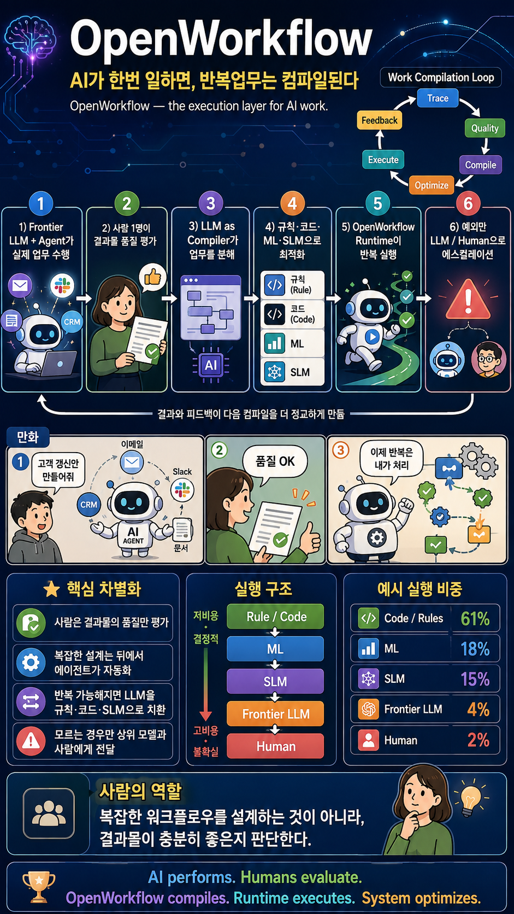

# 결정형 온톨로지와 LLM

> ChatGPT 공유 대화 아카이브
> - 원본: https://chatgpt.com/share/6a912271-750c-83e8-8eb8-7b287101e542
> - 아카이브일: 2026-08-28
> - 제목: 결정형 온톨로지와 LLM

---

## User

llm + agent로 한번 업무를 수행하고 품질까지 검토된 업무를 오픈워크플로우에 넘기면 llm as 컴파일러를 통해서 slm이 필요하면 만들고 적용하는 과정까지 백엔드에서 진행하고 업무를 정의하고 관리하는(적정숫자를 유지 하려고 하는) 형태로하여 1사람이 결과물의 품질을 평가 가능하도록 함이 중요하고 이 루프를 눈에만 보이고 뒤에서 에이전트가 자동화 함이 차별화 되는것으로

## Assistant

맞습니다. 이 방향이면 OpenWorkflow의 차별점이 훨씬 선명해집니다.

핵심은 "사람이 워크플로우를 직접 설계하는 도구"가 아니라, 검증된 업무 수행 사례를 보고 에이전트가 뒤에서 반복 가능한 실행 구조로 컴파일·최적화해주는 시스템이라는 점입니다.

즉 제품의 중심 루프는 이렇게 잡을 수 있습니다.

1. Frontier LLM + Agent가 실제 업무 수행
        ↓
2. 사람이 결과 품질 평가
        ↓
3. 품질 통과한 수행 사례를 OpenWorkflow에 전달
        ↓
4. LLM-as-Compiler가 업무를 분해
        ↓
5. 반복 가능한 부분을 결정형 workflow로 변환
        ↓
6. 필요한 경우 ML / SLM / Rule / Code 생성 또는 선택
        ↓
7. 실제 업무에 적용
        ↓
8. 결과 품질 지속 측정
        ↓
9. 품질 저하 / 예외만 Frontier LLM·Human으로 escalation
        ↓
10. 다시 학습/컴파일

이게 사실상 업무 자동화의 컴파일 루프입니다.

### 여기서 가장 중요한 제품 철학

사용자는 이런 걸 직접 설계하지 않아야 합니다.

- FSM
- rule
- threshold
- model router
- SLM
- fallback
- retry
- confidence policy
- ontology
- event mapping

이런 건 백엔드의 compiler agent가 관리합니다.

사람이 봐야 하는 것은 훨씬 단순해야 합니다.

```
업무: 계약 갱신 제안서 작성

최근 100건
────────────────
자동 처리      91
LLM escalation  7
Human review     2

품질            96.8%
평균 비용       $0.08
평균 시간       43초

[품질 좋음]
[수정 필요]
```

즉 사람이 하는 핵심 역할은:

**결과가 충분히 좋은지 판단하는 것** 입니다.

이게 굉장히 중요합니다.

### "한 사람이 품질을 평가 가능"해야 한다는 점

이걸 제품 요구사항으로 아주 강하게 넣는 게 좋습니다.

OpenWorkflow가 내부적으로 아무리 복잡해져도 최종적으로 사람이 평가하는 단위는:

```
Input
→ Output
→ Expected quality
```

여야 합니다.

예:

```
고객 요청:
"올해 사용량 기준으로 갱신안 만들어줘"

결과:
renewal_proposal.pdf

품질 평가:
✓ 사실관계 정확
✓ 가격 계산 정확
✓ 회사 정책 준수
✓ 문체 적절
✓ 발송 가능
```

사람은 workflow graph를 검사하지 않습니다. **결과물만 평가합니다.** 그리고 그 평가가 backend 최적화의 feedback signal이 됩니다.

### 그래서 OpenWorkflow는 2개의 루프를 가져야 합니다

```
Execution Loop
Event
↓
Workflow
↓
Action
↓
Result
↓
Validation
↓
Output
```

```
Optimization Loop
Output
↓
Quality Evaluation
↓
Trace Analysis
↓
Compiler Agent
↓
Workflow Revision
↓
Model / Rule / SLM Revision
↓
Canary
↓
Production
```

이 두 개가 분리돼야 합니다.

### LLM-as-Compiler 역할

여기서 LLM은 단순 agent가 아닙니다. **workflow compiler**입니다.

검증된 agent trace가 있다고 합시다.

1. Gmail에서 고객 메일 읽음
2. CRM 조회
3. 지난 계약 확인
4. 사용량 계산
5. 가격표 조회
6. 갱신 조건 계산
7. 제안서 작성
8. 담당자 승인
9. 이메일 발송

Compiler가 이걸 분석합니다.

- Step 1 → deterministic connector
- Step 2 → API
- Step 3 → database query
- Step 4 → code
- Step 5 → API
- Step 6 → rule engine
- Step 7 → SLM
- Step 8 → human
- Step 9 → email action

그 결과:

```
Agentic execution
      ↓ compile
Deterministic workflow
```

이 되는 겁니다.

### SLM을 "필요하면 만든다"는 것도 핵심 차별화 가능

이 부분이 상당히 강합니다.

현재 대부분 플랫폼은: **어떤 모델을 사용할지 사람이 선택** 합니다.

OpenWorkflow는 반대로:

- 이 업무에 frontier LLM이 과한가?
- 작은 모델로 동일 품질을 낼 수 있는가?

를 시스템이 스스로 평가합니다.

예:

```
현재:  GPT-class model   accuracy = 98.2%   cost = 1.0
후보:  SLM fine-tuned    accuracy = 98.0%   cost = 0.05

정책:
  quality_delta <= 0.5%
  AND latency improves
  AND cost improves > 50%
  → SLM promotion
```

그러면 backend가 자동으로:

```
trace 수집
↓
training dataset 생성
↓
SLM fine-tune/distill
↓
evaluation
↓
shadow traffic
↓
canary
↓
production
```

까지 진행합니다.

### 모델 개수도 자동으로 관리

말씀하신 "적정 숫자를 유지"도 굉장히 중요합니다. 그렇지 않으면 업무마다 SLM이 하나씩 생겨서 `300 workflows → 280 SLMs` 같은 운영 지옥이 됩니다.

그래서 **Model Consolidation Agent**가 필요합니다.

```
Task A ─┐
Task B ─┼→ SLM-1
Task C ─┘

Task D ─┐
Task E ─┼→ SLM-2
Task F ─┘
```

backend가 다음을 계속 평가합니다.

- task similarity
- training distribution
- quality
- latency
- cost
- GPU memory
- usage frequency
- model drift

그리고 merge / split / retire / promote / rollback 을 결정합니다.

즉 **Model Lifecycle Management 자체가 workflow compiler의 일부**입니다.

### 전체 백엔드는 이렇게 재정의할 수 있습니다

```
                       FRONTIER AGENT
                            │
                     performs new work
                            │
                            ▼
                    Execution Trace
                            │
                            ▼
                    Human Quality Gate
                            │
                     approved example
                            │
                            ▼
┌──────────────────────────────────────────────┐
│              WORK COMPILER                  │
│                                             │
│ trace decomposition                         │
│ state discovery                             │
│ action discovery                            │
│ deterministic extraction                    │
│ rule synthesis                              │
│ workflow synthesis                          │
│ schema generation                           │
└────────────────────┬─────────────────────────┘
                     │
                     ▼
┌──────────────────────────────────────────────┐
│            EXECUTOR OPTIMIZER                │
│                                             │
│ code vs rule vs ML                          │
│ SLM candidate                               │
│ frontier LLM fallback                       │
│ confidence thresholds                       │
│ cost / latency policy                       │
└────────────────────┬─────────────────────────┘
                     │
                     ▼
┌──────────────────────────────────────────────┐
│             MODEL FACTORY                   │
│                                             │
│ dataset generation                          │
│ distillation                                │
│ fine-tuning                                 │
│ evaluation                                  │
│ consolidation                               │
│ retirement                                  │
└────────────────────┬─────────────────────────┘
                     │
                     ▼
                OpenWorkflow
               Runtime / Policy
                     │
                     ▼
                 Production
                     │
                     ▼
                 Outputs
                     │
                     ▼
                Quality Eval
                     │
                     └──────── feedback
```

### 사용자에게는 이 복잡성이 거의 안 보여야 함

이게 제품적으로 제일 중요합니다.

사용자가 보는 화면은:

```
Customer Renewal Workflow

Automation level       94%
Quality                97.1%
Cost reduction         82%
Human intervention     3.2%

Current execution mix
──────────────────────
Code / Rules           61%
ML                     18%
SLM                    15%
Frontier LLM            4%
Human                    2%

[Review samples]
```

그리고 필요하면 아래를 펼칩니다.

```
Optimization activity

✓ Pricing calculation moved LLM → code
✓ Customer classification moved LLM → SLM
✓ SLM-14 merged into SLM-6
✓ Approval threshold adjusted
✓ Frontier fallback reduced 8.1% → 4.2%
```

즉: **루프는 보이되, 사람이 루프를 운영하지 않는다.** 이 문장이 핵심입니다.

### 이게 기존 workflow 제품과 가장 큰 차이

기존:

- 사람이 workflow를 만든다
- 사람이 rule을 작성한다
- 사람이 model을 선택한다
- 사람이 threshold를 조정한다
- 사람이 유지보수한다

OpenWorkflow:

- Agent가 업무를 먼저 수행한다
- 사람이 결과만 평가한다
- OpenWorkflow가 업무 구조를 학습한다
- compiler가 workflow를 만든다
- optimizer가 executor를 바꾼다
- system이 지속적으로 유지한다

이 차이는 큽니다.

### 그러면 제품의 핵심 문장도 조금 바꾸는 게 좋습니다

현재: `OpenWorkflow — the execution layer for AI work.` 이건 그대로 좋습니다.

그리고 부제나 설명을 추가하면:

- `Turn proven AI work into reliable, optimized workflows.`
- `Let AI do the work once. OpenWorkflow learns how to run it reliably thereafter.` — 이 문장이 매우 잘 맞습니다.
- `From agent execution to compiled automation.` — 기술적 포지셔닝으로 아주 좋습니다.

제가 보기엔 핵심 용어도 만들어야 합니다. 이 과정 자체를 **Work Compilation** 이라고 부르는 게 좋습니다.

```
Agent Trace
      ↓
Work Compilation
      ↓
Optimized Workflow
```

그리고 결과물을 **Compiled Workflow** 라고 부릅니다.

그러면 OpenWorkflow의 개념이 굉장히 명확해집니다.

```
AI performs.
Humans evaluate.
OpenWorkflow compiles.
Runtime executes.
System optimizes.
```

이 다섯 줄이면 거의 제품 철학 전체가 설명됩니다.

이 방향이면 다음 README 개정에서 **Work Compilation**, **Autonomous Optimization**, **Human Quality Loop**, **SLM Factory** 네 섹션을 전면에 넣는 게 좋습니다. 현재 README보다 훨씬 차별화된 프로젝트가 됩니다.

---

## User

위의 개념을 1장의 세로 모바일뷰 강의슬라이드 일러스트 강하게 전반적으로 1개의 이미지로 연결되도록 하면서도 설명을 중요한건하고, 만화 1개, 도식 중에 적절한걸 1개 넣어서 표현해줘서 이미지 만들어

## Assistant

(이미지 생성 — 1m 23s 소요)



---

*원본 대화 내용 전체를 마크다운으로 아카이브했습니다.*