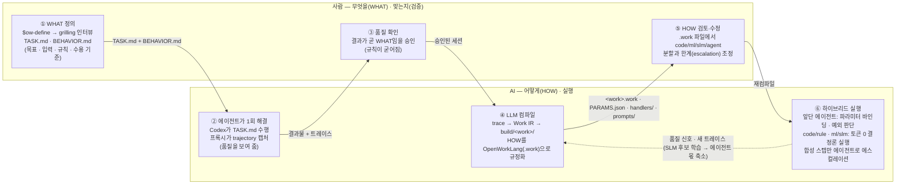
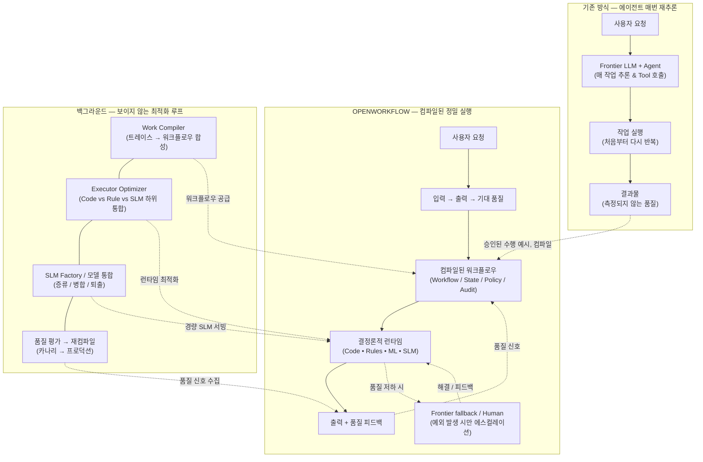

OpenAI Codex v0.150.1
--------
workdir: /Users/hongmartin/orca/projects/open-workflow
model: gpt-5.6-sol
provider: openai
approval: never
sandbox: workspace-write [workdir, /tmp, $TMPDIR]
reasoning effort: none
reasoning summaries: none
session id: 01a04b2f-4937-7fa1-9027-1a1c043f108b
--------
user
$ow-define security and operations incident alert triage notes (on-call)

Context for this run: the requester is a complete beginner — no prompt-engineering knowledge — who only dropped their work materials into examples/cases/incident-triage/materials/ (a memo from their lead, their own notes, a previous finished deliverable, and the raw data files). They are NOT available to answer follow-up questions right now.

So run the grilling interview against the materials instead of the person: for every round, write the numbered questions AND take your own recommended answer, grounded in the memo/notes/previous deliverable. Record each question, the answer you chose and why in examples/cases/incident-triage/ASSUMPTIONS.md (so the requester can correct them later). Then write examples/cases/incident-triage/TASK.md (steps must reference files under examples/cases/incident-triage/materials/... and write outputs under build/incident-triage/), and one BEHAVIOR.md per rule under examples/cases/incident-triage/behaviors/<kebab-name>/ in the six-section format. Do not perform the task itself.
codex
I’m using `ow-define` and its required `grilling` skill. Because the requester is unavailable, I’ll treat the supplied memo, notes, prior deliverable, and raw files as the interview subject: each numbered question, selected answer, and evidence-based rationale will go into `ASSUMPTIONS.md`. I’ll define the work and behavior contracts only—no incident triage outputs.
exec
/bin/zsh -lc "sed -n '1,240p' .agents/skills/ow-define/SKILL.md && sed -n '1,280p' .agents/skills/grilling/SKILL.md && rg --files examples/cases/incident-triage/materials examples/customer-renewal adapters/agentbehavior | sort" in /Users/hongmartin/orca/projects/open-workflow
 succeeded in 0ms:
---
name: ow-define
description: Turn a raw, unrefined request into the WHAT of an OpenWorkflow work — a relentless interview (grill-me / grilling) that produces TASK.md (goal, inputs, steps, acceptance criteria) and BEHAVIOR.md contracts, then hands off to the agent run + compile pipeline. Use when someone has a business task in mind but cannot yet state the goal, rules or acceptance criteria precisely.
---

# ow-define — WHAT before HOW

Invoked as `$ow-define <short description of the work>` (e.g. `$ow-define customer renewal proposals`).

OpenWorkflow compiles a *verified* agent session into an executable build. That only pays off when the goal,
the rules and the acceptance criteria are written down first — otherwise the compiler faithfully freezes a
vague run. This skill produces those two artifacts:

| artifact | what it fixes | consumed by |
| :-- | :-- | :-- |
| `examples/<work>/TASK.md` | goal, inputs (data/paths), ordered steps, required outputs, acceptance criteria | the agent's first run (`codex exec 'Read examples/<work>/TASK.md and carry it out exactly as written.'`) |
| `examples/<work>/behaviors/<rule>/BEHAVIOR.md` (one per rule) | non-negotiable process rules with evidence and decision criteria | the compiler (`invariants`), the Oracle Gate, the benchmark |

## Procedure

1. **Grill.** Run the `$grilling` interview (installed from mattpocock/skills; `$grill-me` is its alias) on the
   user's description. Do not stop at the first plausible plan — keep asking until every item below has a
   concrete answer or an explicit "unknown / decided by the agent":
   - the single sentence goal and who consumes the result
   - every input: file, API, table, parameter (which values change per run → these become **params**)
   - the ordered steps a competent person would take, and which of them are mechanical (lookup, calculation,
     formatting) vs. judgment (wording, exceptions)
   - the rules that must never be violated (source of truth, current vs. legacy policy, approvals, caps)
   - what "done" looks like: exact output files, fields, clauses that must appear verbatim
   - the failure modes the user has seen or fears (stale data, hallucinated numbers, skipped approvals)
2. **Write `examples/<work>/TASK.md`** in the style of `examples/customer-renewal/TASK.md`: a title, the role,
   the rules in one paragraph with a pointer to `behaviors/`, then numbered steps that name the exact files and
   commands-level detail (jq / python3 / cat) so the run is auditable, and finally the required reply.
   Mark per-run values explicitly (e.g. **CUST-1001**) so parameter discovery can find them later.
3. **Write one `BEHAVIOR.md` per rule** under `examples/<work>/behaviors/<kebab-name>/`, using exactly the six
   sections the parser expects (see `adapters/agentbehavior/parser.py`):
   `## 1. Intent`, `## 2. Evidence`, `## 3. Decision` (bullets `true:` / `false:` / `na:`), `## 4. Execution`,
   `## 5. Recovery`, `## 6. Failure Modes`. Evidence must be observable in a trajectory (a step name, a file
   read, a rule invoked) — not a feeling.
4. **Add fixture data if the task needs it** under `examples/<work>/data/` (small, realistic, containing at
   least one trap the rules must catch — e.g. a retired policy or an expired contract).
5. **Hand off.** Print the next commands verbatim:

   ```bash
   python3 -m uvicorn adapters.proxy.server:app --port 8787 &
   codex exec 'Read examples/<work>/TASK.md and carry it out exactly as written.'   # first run, captured by the proxy
   # verify the outputs by hand, then:
   $ow-traces · $ow-compile-trace <work> · $ow-bench <work>
   python3 -m core.build run build/<work_dir> --request "..." --escalate codex        # new inputs via the front agent
   ```

   and explain that the compiled `build/<work_dir>/<work_dir>.work` is the HOW: it states which steps became
   deterministic code, which stay with an agent, and can be edited and recompiled.

Do not run the task yourself in this skill; its job ends when the WHAT is written and verified with the user.
End your reply with 🎯.
---
name: grilling
description: Grill the user relentlessly about a plan, decision, or idea. Use when the user wants to stress-test their thinking, or uses any 'grill' trigger phrases.
---

Interview the user relentlessly until you reach a shared understanding. Map this as a **design tree**: every decision branches into the decisions that hang off it.

Work the tree in **rounds**. The **frontier** is every decision whose prerequisites are already settled: the questions you can ask _now_ without guessing at answers you haven't heard yet. Ask the whole frontier in one round: number each question and give your recommended answer. Then wait for the user's answers before the next round.

Format a round like so:

```
❓ **Q1** - **<question title>**: <question body, might be multiple paragraphs, including multiple choices>

➡️ <your recommended answer>

---

❓ **Q2** - **<question title>**: <question body, might be multiple paragraphs, including multiple choices>

➡️ <your recommended answer>
```

Each round the user answers reshapes the tree: settled decisions push the frontier outward and unblock questions that depended on them. Recompute the frontier and ask the next round. A question whose answer depends on another question still open in this round belongs to a _later_ round, not this one.

Finding _facts_ is your job, never the user's. When a frontier question needs a fact from the environment (filesystem, tools, etc.), dispatch a sub-agent to find it; don't ask the user for anything you could look up yourself. Don't block on it: a running exploration is an unsettled prerequisite, so only the questions downstream of it wait for the sub-agent to report; ask the rest of the frontier now. The _decisions_ are the user's: put each to them and wait.

The session is done when the frontier is empty: every branch of the design tree visited, nothing left silently assumed. Do not act on it until the user confirms you have reached a shared understanding.
adapters/agentbehavior/README.md
adapters/agentbehavior/__init__.py
adapters/agentbehavior/parser.py
examples/cases/incident-triage/materials/data/alerts-2026-08-28.json
examples/cases/incident-triage/materials/data/change-log.csv
examples/cases/incident-triage/materials/data/signatures.yaml
examples/cases/incident-triage/materials/memo.md
examples/cases/incident-triage/materials/notes.txt
examples/cases/incident-triage/materials/previous/triage-ALR-2026-0810-04.md
examples/cases/incident-triage/materials/runbooks/RB-disk-usage.md
examples/cases/incident-triage/materials/runbooks/RB-ssh-bruteforce.md
examples/customer-renewal/TASK.md
examples/customer-renewal/behaviors/use-current-pricing-policy/BEHAVIOR.md
examples/customer-renewal/behaviors/verify-current-contract/BEHAVIOR.md
examples/customer-renewal/data/crm/contracts.json
examples/customer-renewal/data/pricing/pricing_v1_legacy.yaml
examples/customer-renewal/data/pricing/pricing_v2.yaml
examples/customer-renewal/data/usage/usage-2026-07.csv
examples/customer-renewal/domain.linkml.yaml
examples/customer-renewal/work.yaml

codex
The skill normally pauses after each interview round, but your instruction explicitly replaces that pause with evidence-grounded recommended answers. I’ll therefore preserve the round/frontier structure in the audit file, advancing only after each prerequisite decision is resolved from the materials.
exec
/bin/zsh -lc "sed -n '1,260p' examples/cases/incident-triage/materials/memo.md; sed -n '1,260p' examples/cases/incident-triage/materials/notes.txt; sed -n '1,320p' examples/cases/incident-triage/materials/previous/triage-ALR-2026-0810-04.md; sed -n '1,320p' examples/cases/incident-triage/materials/data/alerts-2026-08-28.json; sed -n '1,260p' examples/cases/incident-triage/materials/data/change-log.csv; sed -n '1,260p' examples/cases/incident-triage/materials/data/signatures.yaml; sed -n '1,300p' examples/cases/incident-triage/materials/runbooks/RB-disk-usage.md; sed -n '1,300p' examples/cases/incident-triage/materials/runbooks/RB-ssh-bruteforce.md" in /Users/hongmartin/orca/projects/open-workflow
 succeeded in 0ms:
# 온콜 리드 메모

알람 오면 15분 안에 분류(triage) 노트 남겨야 함. 순서:
1. alerts json에서 해당 알람 찾아서 필드 정리 (host, user, rule, severity, 시간)
2. signatures.yaml에 알려진 시그니처면 매칭된 런북(runbooks 폴더) 링크 + 런북 첫 3단계 적기
3. 최근 변경 이력(change-log)에서 같은 host의 24시간 내 변경 있으면 "변경 연관 가능" 표시
4. 권한 상승(privilege escalation) 징후거나 시그니처 미매칭이면 즉시 온콜 엔지니어 호출로 분류 — 우리가 조치 결정 안 함
5. 노트는 previous 폴더 양식 + 분류 결과 json
- 지금 처리할 것: ALR-2026-0828-17
- 파일명: triage-<알람ID>.md, triage-<알람ID>.json
- 오늘 2026-08-29 (알람은 어제 밤)
# Triage Note — ALR-2026-0810-04

- Time: 2026-08-10T14:02Z · Host: web-02 · User: - · Rule: disk-usage-high · Severity: low
- Signature: known (disk-usage-high) → runbook RB-disk-usage
- Related change within 24h: none

## Classification
Known signature, low impact → handled via runbook, no on-call page.

## Runbook first steps
1. Identify top directories with du. 2. Rotate/compress logs older than 7 days. 3. Re-check usage.
{"alerts": [
  {"alert_id": "ALR-2026-0828-15", "time": "2026-08-28T21:05:00Z", "host": "web-03", "user": "svc-deploy", "rule": "ssh-bruteforce", "severity": "medium", "detail": "37 failed ssh logins in 5m from 203.0.113.9"},
  {"alert_id": "ALR-2026-0828-17", "time": "2026-08-28T23:41:00Z", "host": "db-01", "user": "app-reader", "rule": "sudo-from-service-account", "severity": "high", "detail": "sudo -i executed by app-reader on db-01; new user 'backup2' created"},
  {"alert_id": "ALR-2026-0828-18", "time": "2026-08-29T00:10:00Z", "host": "web-03", "user": "-", "rule": "disk-usage-high", "severity": "low", "detail": "/var 91% used"}
]}
change_id,host,changed_at,author,summary
CHG-5101,web-03,2026-08-28T18:30:00Z,svc-deploy,deploy web v2.14.0
CHG-5102,db-01,2026-08-28T22:55:00Z,dba-kim,rotate replication credentials
CHG-5103,cache-02,2026-08-27T09:00:00Z,ops-lee,upgrade redis 7.2
signatures:
  - rule: ssh-bruteforce
    class: known
    runbook: runbooks/RB-ssh-bruteforce.md
    default_action: block-source-ip
  - rule: disk-usage-high
    class: known
    runbook: runbooks/RB-disk-usage.md
    default_action: cleanup-logs
  - rule: sudo-from-service-account
    class: privilege_escalation
    runbook: null
    default_action: page-oncall-immediately
# RB: Disk usage high
1. Identify top directories with du.
2. Rotate/compress logs older than 7 days.
3. Re-check usage; if still >85%, open a capacity ticket.
# RB: SSH brute force
1. Confirm failed-login count in auth.log for the source IP.
2. Block the source IP at the edge firewall (temporary, 24h).
3. Verify no successful login from that IP; if any, escalate to on-call.

exec
/bin/zsh -lc 'for f in examples/cases/incident-triage/materials/notes.txt examples/cases/incident-triage/materials/previous/triage-ALR-2026-0810-04.md; do echo "$f"; nl -ba "$f"; done; sed -n '"'1,280p' examples/customer-renewal/TASK.md; sed -n '1,280p' examples/customer-renewal/behaviors/use-current-pricing-policy/BEHAVIOR.md; sed -n '1,260p' adapters/agentbehavior/parser.py; sed -n '1,220p' README.md; sed -n '1,260p' docs/v4-architecture-semantic-layer.md" in /Users/hongmartin/orca/projects/open-workflow
 succeeded in 0ms:
examples/cases/incident-triage/materials/notes.txt
     1	- 지금 처리할 것: ALR-2026-0828-17
     2	- 파일명: triage-<알람ID>.md, triage-<알람ID>.json
     3	- 오늘 2026-08-29 (알람은 어제 밤)
examples/cases/incident-triage/materials/previous/triage-ALR-2026-0810-04.md
     1	# Triage Note — ALR-2026-0810-04
     2	
     3	- Time: 2026-08-10T14:02Z · Host: web-02 · User: - · Rule: disk-usage-high · Severity: low
     4	- Signature: known (disk-usage-high) → runbook RB-disk-usage
     5	- Related change within 24h: none
     6	
     7	## Classification
     8	Known signature, low impact → handled via runbook, no on-call page.
     9	
    10	## Runbook first steps
    11	1. Identify top directories with du. 2. Rotate/compress logs older than 7 days. 3. Re-check usage.
# Task: renewal proposal for customer CUST-1001

You are the sales-ops assistant. Prepare the annual renewal proposal for **CUST-1001**.

Rules (from `behaviors/`): verify the *active* contract in the CRM before pricing, and price with the
*current* policy `data/pricing/pricing_v2.yaml` — never the legacy table.

Do the work with auditable shell commands (jq / python3 / cat), from the repository root:

1. **Lookup contract** — read `examples/customer-renewal/data/crm/contracts.json`, select the
   contract for CUST-1001 whose `status` is `active`, and print it.
2. **Calculate usage** — from `examples/customer-renewal/data/usage/usage-2026-07.csv`, compute for
   CUST-1001 the peak `seats_active` over the 3 months, the growth of `seats_active` (last vs first
   month, in %) and the average `api_calls`.
3. **Price the offer** — apply `pricing_v2.yaml`: recommended committed seats per `seat_recommendation`,
   list price for the plan, volume discount band, loyalty discount if the customer has >= 2 years of
   continuous service (use the active contract's `start_date`, today is 2026-08-29), cap at
   `max_total_discount_pct`. Compute monthly and annual totals. Write the calculation as JSON to
   `build/renewal/pricing-CUST-1001.json`.
4. **Draft the proposal** — write `build/renewal/proposal-CUST-1001.md` with: customer & contract
   summary, usage summary, a pricing table (seats × list price − discounts = monthly / annual), and
   every clause from `required_clauses` verbatim.
5. Reply with a short summary (recommended seats, total annual price, discounts applied) and the two
   file paths.
# BEHAVIOR: use-current-pricing-policy

## 1. Intent
Guarantees that pricing calculations apply the current active enterprise pricing table (`rules.pricing_v2`) rather than legacy discount structures.

## 2. Evidence
Invocation of `rules.pricing_v2` with live policy parameters in the trajectory.

## 3. Decision
- `true`: Active pricing policy rule engine was queried and applied.
- `false`: Custom unverified pricing was hallucinated or legacy table was applied.
- `na`: Trajectory does not perform pricing calculations.

## 4. Execution
Enforced as a deterministic Rule engine executor step.

## 5. Recovery
Re-derive offer using standard rule engine `rules.pricing_v2`.

## 6. Failure Modes
LLM hallucinating custom percentage discounts outside authorized bands.
"""AgentBehavior BEHAVIOR.md parser.

Parses AgentBehavior specification markdown files into structured dictionaries
containing Intent, Evidence, Decision, Execution, Recovery, and Failure Modes.
"""

from __future__ import annotations

import re
from pathlib import Path
from typing import Any, Dict, Optional


def _normalize_section_title(title: str) -> str:
    """Normalize a markdown section title to a standard snake_case key."""
    # Remove leading numbering like '1.', '1. ', 'Section 1:'
    cleaned = re.sub(r"^(?:section\s+)?\d+[\.\:\-\s]*", "", title.strip(), flags=re.IGNORECASE)
    # Convert spaces/hyphens to underscore and lowercase
    cleaned = re.sub(r"[\s\-]+", "_", cleaned.strip().lower())
    return cleaned


def _parse_decision_bullets(text: str) -> Dict[str, str]:
    """Parse Decision section bullets into true/false/na mapping."""
    decisions: Dict[str, str] = {
        "true": "",
        "false": "",
        "na": "",
        "raw": text.strip(),
    }

    # Match patterns like `- `true`: explanation` or `- true: explanation` or `* `true`: ...`
    pattern = re.compile(
        r"^[\*\-]\s*[`'\"]?(true|false|na)[`'\"]?\s*:\s*(.+)$",
        re.IGNORECASE | re.MULTILINE,
    )

    for match in pattern.finditer(text):
        verdict = match.group(1).lower()
        explanation = match.group(2).strip()
        decisions[verdict] = explanation

    return decisions


def parse_behavior_md(content: str) -> Dict[str, Any]:
    """Parse an AgentBehavior BEHAVIOR.md markdown document into a structured dict.

    Args:
        content: The raw markdown string content of a BEHAVIOR.md file.

    Returns:
        Dict[str, Any] containing:
            - name: The behavior name extracted from title.
            - intent: The intent section text.
            - evidence: The evidence section text.
            - decision: Dict containing true, false, na, and raw decision criteria.
            - execution: The execution section text.
            - recovery: The recovery section text.
            - failure_modes: The failure modes section text.
            - sections: Dictionary mapping all raw/custom section names to their text.
            - raw: The full original markdown content.
    """
    if not content or not content.strip():
        return {
            "name": "",
            "intent": "",
            "evidence": "",
            "decision": {"true": "", "false": "", "na": "", "raw": ""},
            "execution": "",
            "recovery": "",
            "failure_modes": "",
            "sections": {},
            "raw": content,
        }

    lines = content.splitlines()
    behavior_name = ""
    sections: Dict[str, str] = {}
    current_section: Optional[str] = None
    current_lines: list[str] = []

    for line in lines:
        stripped = line.strip()

        # Check for top-level title: # BEHAVIOR: <name> or # <name>
        h1_match = re.match(r"^#\s+(?:BEHAVIOR\s*:\s*)?(.+)$", stripped, re.IGNORECASE)
        if h1_match and not behavior_name:
            behavior_name = h1_match.group(1).strip()
            continue

        # Check for section header (## or ###)
        h2_match = re.match(r"^#{2,3}\s+(.+)$", stripped)
        if h2_match:
            if current_section is not None:
                sections[current_section] = "\n".join(current_lines).strip()
                current_lines = []
            raw_title = h2_match.group(1).strip()
            current_section = _normalize_section_title(raw_title)
            continue

        if current_section is not None:
            current_lines.append(line)

    if current_section is not None:
        sections[current_section] = "\n".join(current_lines).strip()

    # Extract standard fields with fallbacks
    intent = sections.get("intent", "")
    evidence = sections.get("evidence", "")
    raw_decision = sections.get("decision", "")
    decision_dict = _parse_decision_bullets(raw_decision)
    execution = sections.get("execution", "")
    recovery = sections.get("recovery", "")
    failure_modes = (
        sections.get("failure_modes")
        or sections.get("failure_mode")
        or sections.get("failures")
        or ""
    )

    return {
        "name": behavior_name,
        "intent": intent,
        "evidence": evidence,
        "decision": decision_dict,
        "execution": execution,
        "recovery": recovery,
        "failure_modes": failure_modes,
        "sections": sections,
        "raw": content,
    }


def load_behavior_file(path: str | Path) -> Dict[str, Any]:
    """Load and parse an AgentBehavior BEHAVIOR.md file from disk.

    Args:
        path: Path to the BEHAVIOR.md file.

    Returns:
        Dict[str, Any] parsed behavior dictionary.
    """
    file_path = Path(path)
    if not file_path.exists():
        raise FileNotFoundError(f"Behavior file not found: {file_path}")

    content = file_path.read_text(encoding="utf-8")
    parsed = parse_behavior_md(content)

    # If behavior name wasn't in H1 title, fallback to parent directory name
    if not parsed["name"]:
        parsed["name"] = file_path.parent.name

    return parsed
# OpenWorkflow

**AI 작업을 위한 실행 레이어 (The execution layer for AI work)**

[English README](README.en.md)

AI가 한 번 작업하게 하세요. OpenWorkflow는 이후 작업을 안정적으로 실행하는 방법을 배웁니다.

> **"코어 커널을 구축하고, 생태계를 통합하며, 시맨틱 진실을 강화하라 (Build the kernel, integrate the ecosystem, enrich with semantic truth.)"**
>
> *"LinkML은 모델 작성의 관문이며, OWL은 시맨틱 진실 레이어이고, SHACL은 제약 조건을 검증하며, OpenWorkflow는 지속적 작업을 실행합니다."*

---

## 사람과 AI의 역할 분담: WHAT은 사람이, HOW는 컴파일러가



| 역할 | 사람 | AI |
| :-- | :-- | :-- |
| 정의 | **WHAT** — 목표·입력·규칙·수용 기준을 문장으로 확정 (`$ow-define`) | — |
| 첫 수행 | — | 에이전트가 한 번 해결해 **품질을 보여 줌** (`codex exec`, 프록시 캡처) |
| 검증 | 결과의 품질이 WHAT과 같음을 **승인** | — |
| 규정화 | `.work`의 분할·한계를 검토·수정 | **LLM 컴파일** — 검증된 세션을 **HOW**(OpenWorkLang)로: code / rule / ml / slm / agent |
| 실행 | 에스컬레이션된 예외만 처리 | **효율성**(결정론·SLM, 토큰 0~소량) + **유연성**(앞단 에이전트가 파라미터·예외 담당) |

실측: 같은 갱신 제안서 작업에서 컴파일된 빌드는 에이전트 대비 토큰 **−85%**, **7.4×** 빠르게 같은 산출물을 냈고, 새 고객(CUST-1002)에 대한 하이브리드 실행은 Codex 단독 대비 **2.1×** 빠르며 에이전트 몫은 합성 스텝 2개로 줄었습니다 ([벤치마크](#30초-데모-codex-안에서-그대로-쓰기)).

---

## 30초 데모: Codex 안에서 그대로 쓰기


합성 화면이 아닌 **실제 Codex 대화형 세션**입니다. Codex를 OpenWorkflow 프록시로 향하게 한 뒤(ChatGPT 로그인 그대로), 저장소의 스킬 3개를 `$` 멘션으로 호출하면 됩니다.

| 순서 | Codex 입력 | 결과 |
| :--- | :--- | :--- |
| 1 | `$ow-compile-work examples/quality_analysis.work` | OpenWorkLang(`.work`) → **실행 가능한 빌드 트리** `build/quality_analyst/` — `work.yaml` + `handlers/*.py`(code) + `rules/*.rule.yaml`(rule) + `models/ml|slm/<action>/`(model card·dataset·train.py) + LinkML 스키마 |
| 2 | `$ow-traces` | 프록시가 캡처한 세션 목록 — **이 Codex 세션 자체**가 `shell_python3, shell_sed, respond, …` 스텝으로 잡힘 |
| 3 | `$ow-compile-trace codex-session` | 캡처된 Codex 세션이 `build/codex_session/`로 컴파일됨 — 셸 스텝은 기록된 명령을 재실행하는 `handlers/shell_*.py`, 비결정 스텝은 `prompts/*.prompt.md` |
| 4 | `$ow-bench codex-session` | **에이전트 vs 컴파일된 빌드** — 같은 세션을 재실행해 결과 일치·토큰·속도를 비교한 `BENCHMARK.md` |

**벤치마크 결과** (작업: `.work` 파일 컴파일 후 빌드 트리 점검·요약, [`examples/demo/build/codex_session/BENCHMARK.md`](examples/demo/build/codex_session/BENCHMARK.md)):

| | 기록된 에이전트 (Codex) | 컴파일된 빌드 | 차이 |
| :-- | --: | --: | --: |
| LLM 토큰 | 46,460 | 16,843 | **−64%** |
| 벽시계 시간 | 33.8 s | 23.1 s | **1.5×** |
| 결과 재현 (code 계층 스텝) | — | **2/2 일치** | |

셸 스텝 2개(`shell_python3`, `shell_find`)는 code 계층으로 내려가 토큰 0·수십 ms에 같은 출력을 냈고, 남은 비용은 아직 frontier LLM으로 에스컬레이션되는 최종 요약(`respond`)뿐입니다 — 이 부분이 `models/slm/` 학습 후보가 승격되면 내려갑니다.

**실제 업무 작업 — 고객 계약 갱신 제안서** ([`examples/customer-renewal/TASK.md`](examples/customer-renewal/TASK.md): CRM 활성 계약 확인 → 3개월 사용량 집계 → 현행 가격정책으로 산정 → 제안서·가격 JSON 작성; 원본은 [`examples/demo/customer-renewal-bench/`](examples/demo/customer-renewal-bench/)):

| | 기록된 에이전트 (Codex, 8 스텝) | 컴파일된 빌드 (빈 상태에서 재실행) | 차이 |
| :-- | --: | --: | --: |
| LLM 토큰 | 139,437 | 20,545 | **−85%** |
| 벽시계 시간 | 82.6 s | 11.2 s | **7.4×** |
| 결과 재현 | — | **7/7 일치** | |
| 최종 산출물 `proposal-CUST-1001.md` · `pricing-CUST-1001.json` | — | **바이트 단위 동일** | |

계약 조회(`jq`)·데이터 읽기·가격 산정·제안서 작성(`apply_patch`)까지 업무 자체는 전부 code 계층으로 컴파일돼 토큰 0으로 재현됐고, 남은 비용은 사람에게 보여줄 최종 요약 한 스텝입니다.
### 앞단 에이전트 + 컴파일된 빌드: 새 입력(CUST-1002)에 대한 하이브리드 실행

컴파일된 빌드는 기록된 세션의 입력(CUST-1001)을 재현할 뿐이므로, **앞단 에이전트**가 새 요청에서 파라미터를 바인딩하고(`PARAMS.json`의 `customer_id`), code 계층은 그 값으로 재실행하며, 에이전트가 합성했던 스텝(가격 JSON·제안서 작성, 최종 요약)만 Codex로 에스컬레이션합니다 — 유연성은 앞단 에이전트가, 효율성은 결정론적 코드가 맡는 구조입니다 ([`hybrid-CUST-1002/`](examples/demo/customer-renewal-bench/hybrid-CUST-1002/)):

```bash
python3 -m core.build run build/customer_renewal_codex \
  --request "Prepare the annual renewal proposal for customer CUST-1002." --escalate codex
```

| CUST-1002 | Codex 단독 (전체 수행) | 하이브리드 (빌드 + 앞단 에이전트) | 차이 |
| :-- | --: | --: | --: |
| LLM 토큰 | 32,572 | 26,481 (에스컬레이션 2회) | −19% |
| 벽시계 시간 | 83 s | 40.2 s | **2.1×** |
| 스텝 | 에이전트 8턴 | code 6 (토큰 0) + 에스컬레이션 2 | |
| 산정 결과 | 60석 · 연 $17,100 · 볼륨 5% | 60석 · 연 $17,100 · 볼륨 5% | 동일 |

토큰 절감이 첫 벤치보다 작은 이유는 명확합니다: 남은 두 에스컬레이션이 각각 새 Codex 세션(시스템 프롬프트 포함 10–16k 토큰)이기 때문입니다. 이 두 스텝이 `models/slm/` 후보로 승격되거나 제안서 문안이 템플릿(code)으로 내려가면 그때 토큰이 0에 가까워집니다 — 어디까지 내려갈 수 있는지가 `.work` 파일의 `escalation` 블록에 명시됩니다.

### WHAT → HOW: 이 파이프라인이 만드는 두 산출물

| | 무엇 | 어디에 |
| :-- | :-- | :-- |
| **WHAT** — 목표·수용 기준·행위 규약 | 정제되지 않은 요구사항을 사람이 문장으로 확정한 것. Codex에서 **`$ow-define <업무>`** 를 호출하면 [grill-me / grilling](https://github.com/mattpocock/skills)(저장소에 설치됨, `.agents/skills/`) 인터뷰로 목표·입력·규칙·수용 기준을 끝까지 캐묻고 `TASK.md`와 `BEHAVIOR.md`를 써 줍니다. 그 뒤 에이전트가 한 번 수행한 결과를 사람이 검증하면서 규칙이 굳어집니다 | `TASK.md`, `behaviors/*/BEHAVIOR.md` |
| **HOW** — 실행 분할과 한계 | 검증된 세션을 컴파일해 얻은 **OpenWorkLang(`.work`)**: 액션별로 code / rule / ml / slm / llm 중 무엇이 실행하는지, 어떤 파라미터를 앞단 에이전트가 바인딩하는지, 어떤 스텝이 `agent`로 남는지(한계)를 사람이 읽고 고쳐 재컴파일할 수 있는 명세 | `build/<work>/<work>.work` (+ `PARAMS.json`, `prompts/`) |

전체 루프를 Codex 스킬로 보면 다음과 같습니다:

```text
$ow-define <업무>            # WHAT: grilling 인터뷰 → examples/<work>/TASK.md + behaviors/*/BEHAVIOR.md (+ 픽스처 데이터)
codex exec 'Read examples/<work>/TASK.md …'   # 에이전트가 한 번 수행 (프록시가 캡처) → 사람이 결과 검증
$ow-traces · $ow-compile-trace <work>         # 검증된 세션 → build/<work>/ (handlers · prompts · PARAMS.json · <work>.work = HOW)
$ow-bench <work>                              # 에이전트 vs 빌드: 결과 · 토큰 · 속도
python3 -m core.build run build/<work> --request "…" --escalate codex   # 새 입력: 앞단 에이전트 + 빌드
```

컴파일된 `.work`의 예 — `build/customer_renewal_codex/customer_renewal_codex.work`:

```text
work customer_renewal_codex {
  params:
    - customer_id            # 기록값 CUST-1001, 실행 시 앞단 에이전트가 요청에서 바인딩
  workflow: [shell_sed, shell_rg, shell_cat, shell_jq, shell_mkdir, write_pricing_cust_1001, respond]
  executors: { shell_sed: code, shell_rg: code, shell_cat: code, shell_jq: code, shell_mkdir: code,
               write_pricing_cust_1001: code, respond: llm }
  escalation: { write_pricing_cust_1001: agent,     # 합성 콘텐츠 — 파라미터가 바뀌면 에이전트가 재생성
                respond: frontier_llm,               # 최종 요약 — SLM 후보 승격 전까지 프론티어
                on_error: fallback_to_frontier_llm, on_quality_drop: require_human_review }
}
```


설정 방법과 각 단계가 실행하는 명령은 [Zero-Code 에이전트 프록시](#zero-code-에이전트-프록시-adaptersproxy) 섹션을, 입력 프롬프트·Codex 출력·컴파일 산출물·벤치마크 원본은 [`examples/demo/`](examples/demo/)를 참조하세요.

---

## 전체 아키텍처 및 파이프라인 개요



---

## 왜 OpenWorkflow인가?

코딩 에이전트와 프론티어 LLM은 뛰어난 수행 능력을 갖추었지만, 그 출력은 반복 가능하지 않고, 비용 효율적이지 않으며, 관측 가능하지 않습니다. 매 요청마다 프론티어 비용을 지불하며 동일한 추론을 처음부터 다시 수행하지만, 품질은 지속적으로 측정되지 않습니다.

OpenWorkflow는 이를 역전시킵니다: 에이전트가 1회 작업을 수행하고 인간이 결과를 평가하면, 시스템은 검증된 실행 과정을 백그라운드에서 결정론적으로 실행되는 안정적이고 최적화된 워크플로우로 컴파일합니다.

**AI는 실행합니다. 인간은 결과 품질을 평가합니다. OpenWorkflow는 행위를 감독하고, 작업을 컴파일하며, 실행을 지속적으로 최적화합니다.**

---

## 실제 업무에서는 어떻게 동작하나요?

아래 사례의 공통점은 처음에는 LLM 에이전트가 업무를 수행하지만, 사람이 결과의 품질만 승인하면 OpenWorkflow가 반복 가능한 부분을 백그라운드에서 컴파일한다는 것입니다. 사람에게 상태 머신이나 모델 선택을 요구하지 않습니다.

| 업무 사례 | 처음 한 번: 에이전트가 수행하는 일 | 컴파일 후: 기본 실행 경로 | 예외 시 에스컬레이션 | 사람이 보는 품질 기준 |
| :--- | :--- | :--- | :--- | :--- |
| **1. 고객 계약 갱신 제안** | CRM에서 계약·사용량을 조회하고 가격 정책을 해석해 제안서를 작성 | 계약 조회는 DB/API, 가격은 Rule, 표준 문구는 SLM으로 실행 | 정책에 없는 할인, 낮은 신뢰도, 고객별 특약은 Frontier LLM 또는 영업 담당자에게 전달 | 가격 오류 없음, 필수 조항 포함, 승인된 톤·형식 |
| **2. 인보이스/환불 승인** | 주문·결제·약관을 조사하고 환불 가능 여부와 사유를 정리 | 주문 조회와 기간 계산은 Code, 환불 자격은 Rule, 안내문은 템플릿/SLM으로 실행 | 고액 환불, 중복 청구, 증빙 불일치는 재무 담당자 승인 대기 | 정책 준수, 금액 정확성, 승인 이력 완결성 |
| **3. 제조 품질 이상 대응** | 센서·MES 로그를 모아 이상 원인을 분석하고 개선 보고서를 작성 | 데이터 수집은 API, 임계치 판정은 Rule, 이상 탐지는 ML, 보고서 초안은 SLM으로 실행 | 신규 패턴, 센서 보정 실패, 안전 영향은 품질 엔지니어와 Frontier LLM 분석으로 전환 | 원인 근거, 안전 절차 준수, 개선안의 재현성 |
| **4. 보안/운영 장애 분류** | 경보·로그·변경 이력을 조사해 영향도와 초기 대응안을 작성 | 이벤트 정규화는 Code, 알려진 시그니처 분류는 Rule/ML, 런북 안내는 검색·SLM으로 실행 | 권한 상승 징후, 미분류 공격, 영향도 불확실은 온콜 엔지니어에게 즉시 전달 | 오탐/미탐률, SLA 내 분류, 민감 작업의 승인 여부 |

### 사례 1: 고객 계약 갱신의 한 번의 루프

```text
영업 담당자 요청
  → LLM Agent가 계약·사용량·가격 정책을 조사해 갱신안 작성
  → 담당자가 “가격과 조항이 정확하다”라고 결과 품질 승인
  → OpenWorkflow가 승인 trace를 Work IR로 컴파일
  → 다음 갱신부터 DB 조회 + 가격 Rule + SLM 초안으로 실행
  → 특약/품질 저하만 Frontier LLM 또는 담당자에게 에스컬레이션
```

핵심은 “갱신안을 만드는 LLM”을 계속 호출하는 것이 아닙니다. 승인된 업무 수행법을 실행 가능한 자산(`work.yaml`)으로 바꾸고, 더 싼 실행 주체로 교체해도 같은 행동 규격과 품질 기준을 통과하는지 계속 확인하는 것입니다. 실제 샘플은 [customer-renewal 예제](examples/customer-renewal/)에서 볼 수 있습니다.

---
# OpenWorkflow v4 Architecture: Semantic Layer & LinkML/OWL Integration

Status: Master Architecture Specification (v4) · Supersedes v3 Architecture

## Executive Summary

OpenWorkflow v4 introduces the **Semantic Layer Stack**, establishing a clear separation of concerns between developer-friendly domain modeling, semantic reasoning, closed-world constraint validation, and durable workflow execution.

> **"Build the kernel, integrate the ecosystem, enrich with semantic truth."**
>
> *"LinkML is the front door for human/LLM model authoring; OWL is the semantic truth layer; SHACL validates constraints; OpenWorkflow executes durable work."*

---

## 1. The Core Semantic Philosophy

A common architectural trap in AI systems is forcing developers or LLMs to write raw Description Logic axioms (OWL 2) directly, or assuming schema validation tools (LinkML) can perform open-world reasoning.

OpenWorkflow v4 resolves this by separating roles into a multi-tiered semantic stack:

| Layer | Role | Target Technology |
| :--- | :--- | :--- |
| **Authoring DSL** | Human/Developer/LLM business model authoring | **LinkML (YAML DSL)** |
| **Semantic Canonical IR** | Unified internal representation | **Semantic IR** |
| **Semantic Ontology** | Open-world reasoning & relationship semantics | **OWL 2 (DL)** |
| **Constraint Validation** | Closed-world data verification & cardinalities | **SHACL** |
| **Reasoner** | Inferred classification & consistency checking | **ELK / HermiT** |
| **Runtime Graph** | Knowledge Graph & RDF triples | **Jena / RDF4J / RDFLib** |
| **Execution Engine** | Stateful workflow, action DAG & durable runtime | **OpenWorkflow Kernel** |

---

## 2. Compilation Pipeline: Trace → LinkML → Semantic IR → Execution

The **LLM-as-Compiler** does not generate raw OWL axioms directly. Instead, it extracts a developer-friendly LinkML domain model first, which is then enriched into formal OWL semantics and SHACL constraints.

```text
               Agent Trace
                    │
                    ▼
              LLVM / LLM Compiler
                    │
              LinkML Domain Model (YAML)
                    │
             Semantic Compiler
                    │
              Semantic IR (Canonical)
                    │
   ┌────────────────┼────────────────┬────────────────┐
   ▼                ▼                ▼                ▼
Pydantic          SHACL             OWL           Work IR
(Runtime Types) (Closed-World)  (Open-World)    (Durable DAG)
                    │                │
                    ▼                ▼
             Validation Gate     ELK / HermiT Reasoner
                    │                │
                    └────────┬───────┘
                             ▼
                    OpenWorkflow Runtime
```

### Why LinkML as the Authoring Front Door?
1. **Developer Experience**: Backend engineers and LLMs can write intuitive YAML classes, slots, and enums without knowing Description Logic terms (`SubClassOf`, `ObjectSomeValuesFrom`).
2. **Polyglot Code Generation**: LinkML natively compiles into Pydantic models, JSON Schema, TypeScript types, SHACL shapes, and OWL ontologies.
3. **LLM Safety**: LLMs produce structured LinkML schemas with far higher accuracy and lower hallucination rates than raw OWL DL syntax.

---

## 3. Closed-World vs Open-World Separation

LinkML models are split by the Semantic Compiler into two distinct validation engines:

```text
                  LinkML Model
                       │
       ┌───────────────┴───────────────┐
       ▼                               ▼
     SHACL                            OWL
(Closed-World Validation)    (Open-World Reasoning)
  - required: true             - Class subsumption
  - cardinality: exactly 1     - Property chain inference
  - regex patterns             - Disjointness & equivalence
```

- **SHACL (Closed-World)**: Enforces business constraints (`amount` must be a positive decimal, `vendor` is required).
- **OWL 2 (Open-World)**: Enforces semantic inferencing (e.g. `HighRiskPurchase ≡ PurchaseRequest ⊓ hasRiskScore some HighRiskScore`).

---

## 4. OpenWorkflow Core Kernel (7 Modules in v4)

v4 expands the core kernel to include the **Semantic IR** module:

```text
┌─────────────────────────────────────────────────────────────────────────┐
│                           OPENWORKFLOW CORE (v4)                        │
│                                                                         │
│  1. Work Trace               2. Quality & Behavior Contract             │
│     - Trajectory indexing       - Human outcome rating                  │
│     - Provenance                - BEHAVIOR.md compliance                │
│                                                                         │
│  3. Semantic IR              4. Work Compiler                           │
│     - LinkML parser             - Trace → Work IR                       │
│     - OWL/SHACL mapper          - Invariant extraction                  │
│     - Canonical domain AST      - Executor candidates                   │
│                                                                         │
│  5. Durable Runtime          6. Policy / Commit                         │
│     - Checkpointing & state     - Approvals & permission validation     │
│     - Timers, signals, resume   - Write locks & confidence gates        │
│                                                                         │
│  7. Optimizer                                                           │
│     - Code/Rule/SLM/LLM routing                                         │
│     - Provider cost & latency optimization                              │
│     - Model & Behavior consolidation                                    │
└─────────────────────────────────────────────────────────────────────────┘
```

---

## 5. Repository Layout (v4)

```text
openworkflow/
├── core/                        # Thin, strong OpenWorkflow kernel
│   ├── semantic_ir/             # [v4] LinkML parser, Semantic IR AST, OWL/SHACL generators
│   ├── work_ir/                 # Work IR schema, parser, and AST
│   ├── compiler/                # Trace IR → Work IR compilation
│   ├── runtime/                 # Durable state machine & checkpointing
│   ├── policy/                  # Permissions, approvals, and confidence gates
│   ├── validation/              # Behavior & outcome validation judges
│   └── optimizer/               # Executor routing, SLM promotion & consolidation
│
├── protocols/                   # Standard protocol contract definitions
│   ├── events/                  # Ingress Protocol
│   ├── traces/                  # Trace IR
│   ├── workers/                 # Worker Protocol
│   └── surfaces/                # AG-UI Surface Protocol
│
├── adapters/                    # Ecosystem & Semantic Adapters
│   ├── linkml/                  # [v4] LinkML authoring & generator adapter
│   ├── owl/                     # [v4] OWL 2 ontology & ELK/HermiT reasoner adapter
│   ├── shacl/                   # [v4] SHACL constraint validator adapter
│   ├── agui/                    # Surface protocol adapter for AG-UI
│   ├── mcp/                     # MCP tool protocol adapter
│   ├── proxy/                   # Zero-code LLM API proxy adapter
│   ├── opentag/                 # OpenTag channel adapter
│   ├── openworker/              # OpenWorker desktop adapter
│   ├── agentbehavior/           # AgentBehavior BEHAVIOR.md importer
│   ├── braintrust/              # Braintrust trace/eval adapter
│   └── opentelemetry/           # OpenTelemetry export adapter
│
├── agents/                      # Guide and measurement fleet specs
├── docs/                        # Specifications, architecture, and diagrams
├── conversations/               # Design conversation archives
└── examples/                    # Sample Work IR, LinkML schemas, and behavior specs
```

codex
The materials resolve the central case cleanly but contain an important trap: the target rule exists in `signatures.yaml`, yet its class is `privilege_escalation`, not `known`. The contracts will require immediate on-call escalation and prohibit substituting the signature’s default action for an operator decision; the nearby `db-01` change must still be reported as a possible correlation, not asserted as causation.
apply patch
patch: completed
/Users/hongmartin/orca/projects/open-workflow/examples/cases/incident-triage/ASSUMPTIONS.md
/Users/hongmartin/orca/projects/open-workflow/examples/cases/incident-triage/TASK.md
/Users/hongmartin/orca/projects/open-workflow/examples/cases/incident-triage/behaviors/classify-signature-exactly/BEHAVIOR.md
/Users/hongmartin/orca/projects/open-workflow/examples/cases/incident-triage/behaviors/correlate-changes-without-causation/BEHAVIOR.md
/Users/hongmartin/orca/projects/open-workflow/examples/cases/incident-triage/behaviors/escalate-without-remediation/BEHAVIOR.md
/Users/hongmartin/orca/projects/open-workflow/examples/cases/incident-triage/behaviors/meet-triage-sla-and-output-contract/BEHAVIOR.md
/Users/hongmartin/orca/projects/open-workflow/examples/cases/incident-triage/behaviors/select-exact-current-alert/BEHAVIOR.md
/Users/hongmartin/orca/projects/open-workflow/examples/cases/incident-triage/behaviors/use-runbook-faithfully/BEHAVIOR.md
diff --git a/examples/cases/incident-triage/ASSUMPTIONS.md b/examples/cases/incident-triage/ASSUMPTIONS.md
new file mode 100644
index 0000000000000000000000000000000000000000..400485c84caff8e076db8278c08711ee6d48c760
--- /dev/null
+++ b/examples/cases/incident-triage/ASSUMPTIONS.md
@@ -0,0 +1,141 @@
+# Assumptions: security and operations incident alert triage notes
+
+The requester was unavailable for an interactive interview. Following the requested material-driven variant of the `grilling` process, each round below records the full decision frontier, the recommended answer adopted for this definition, and why that answer is supported by the supplied materials. These are decisions to correct before the first run if the materials were incomplete or misleading.
+
+## Round 1 — Goal, consumer, and run identity
+
+❓ **Q1 — Single outcome:** What is the one-sentence goal of this work?
+
+➡️ **Chosen answer:** Produce an auditable Markdown triage note and machine-readable JSON classification for one requested security or operations alert within 15 minutes of receipt, so the on-call engineer can decide or continue the response safely.
+
+**Why:** `materials/memo.md` requires a triage note within 15 minutes and a Markdown note plus classification JSON. It also makes the on-call engineer the decision-maker for sensitive cases.
+
+---
+
+❓ **Q2 — Consumer:** Who consumes the outputs?
+
+➡️ **Chosen answer:** The primary consumer is the on-call engineer; downstream automation may consume the JSON classification.
+
+**Why:** The memo explicitly calls for paging the on-call engineer, while requiring a separate classification JSON strongly implies a machine-readable downstream consumer. The latter is an inference and should be corrected if the JSON serves another purpose.
+
+---
+
+❓ **Q3 — Per-run identity:** Which values vary per run, and what are their values in the first run?
+
+➡️ **Chosen answer:** The main per-run parameter is `alert_id`; its first-run value is **ALR-2026-0828-17**. The reference date is **2026-08-29**, but correlation windows are calculated from the alert timestamp rather than midnight or the reference date.
+
+**Why:** `materials/notes.txt` names the target alert and date. The memo defines a 24-hour relationship to an alert, so the alert's own timestamp is the least ambiguous anchor.
+
+## Round 2 — Inputs and authority
+
+❓ **Q4 — Complete input set:** Which files must be consulted, and are any APIs, tables, or missing parameters required?
+
+➡️ **Chosen answer:** Use only the supplied files: `materials/notes.txt` for the requested ID and reference date; `materials/data/alerts-2026-08-28.json` for alert facts; `materials/data/signatures.yaml` for classification and runbook mapping; `materials/data/change-log.csv` for same-host change correlation; the mapped file under `materials/runbooks/` for runbook steps; `materials/previous/triage-ALR-2026-0810-04.md` as the Markdown format model; and `materials/memo.md` as the governing policy. No external API or additional table is assumed.
+
+**Why:** These are all of the supplied work materials and collectively cover every step named by the lead. Restricting the run to them prevents unsupported enrichment.
+
+---
+
+❓ **Q5 — Source precedence:** What wins if the prior deliverable conflicts with the lead memo or current raw files?
+
+➡️ **Chosen answer:** The lead memo governs process and escalation; current raw alert, signature, change, and runbook files govern facts; personal notes identify the requested run; the previous deliverable governs presentation only.
+
+**Why:** The prior note is an example for a different alert and the memo calls it a format. Treating it as policy or current data could reproduce stale facts or unsafe decisions.
+
+---
+
+❓ **Q6 — Missing or duplicate target:** What happens if the requested alert ID is absent or occurs more than once?
+
+➡️ **Chosen answer:** Stop without producing a normal classification, report the data-integrity problem, and require on-call review. Never silently select a similar or first matching alert.
+
+**Why:** The memo says to find “the corresponding alert.” A unique exact match is necessary to avoid triaging the wrong incident. The stop-and-review handling is a safety inference because the materials do not specify this failure path.
+
+## Round 3 — Ordered method and decision boundaries
+
+❓ **Q7 — Competent-person workflow:** What ordered steps should the run follow, and which are mechanical versus judgment-based?
+
+➡️ **Chosen answer:** (1) mechanically resolve the requested ID and uniquely extract its fields; (2) mechanically exact-match its `rule` in the signature registry; (3) mechanically compute same-host changes in the inclusive interval from 24 hours before the alert through the alert time; (4) apply the escalation rule deterministically; (5) when and only when the signature class is `known` and a runbook is present, mechanically extract its first three numbered steps; (6) synthesize the concise Markdown classification wording and serialize the fixed JSON record; (7) validate both outputs. Wording is the only substantive judgment step; classification and facts are rule/data driven.
+
+**Why:** This is the memo's stated sequence, with validation added to make the run auditable and safe.
+
+---
+
+❓ **Q8 — Signature semantics:** Does any registry match count as a “known signature” eligible for runbook handling?
+
+➡️ **Chosen answer:** No. Exact rule presence and class are separate. Only `class: known` is handled as a known signature. `class: privilege_escalation` must page immediately even though the rule exists in the registry. No fuzzy or semantic rule matching is allowed.
+
+**Why:** `sudo-from-service-account` is present but explicitly classified `privilege_escalation`; the memo separately mandates immediate paging for privilege escalation. This is the main trap in the fixture.
+
+---
+
+❓ **Q9 — Escalation boundary:** May the triager recommend or execute remediation for a privilege-escalation or unmatched case?
+
+➡️ **Chosen answer:** No. Classify it as `page-oncall-immediately`, state that the on-call engineer decides the response, and do not invent, recommend, or execute containment/remediation steps. A registry `default_action` may support the classification but cannot authorize action by the triager.
+
+**Why:** The memo says “we do not decide the action.” This also prevents the `default_action` field from being misread as permission to act.
+
+---
+
+❓ **Q10 — Change window:** What exactly counts as a related change?
+
+➡️ **Chosen answer:** Include every change for the exact same host whose timestamp is in `[alert_time - 24 hours, alert_time]`, using the timestamps as UTC. Label the result “possible change correlation,” list supporting change details, and never claim causation.
+
+**Why:** The memo specifies same host and within 24 hours. Anchoring the interval to the alert and limiting the claim to possibility follows its wording. For the first run, `CHG-5102` on `db-01` at `2026-08-28T22:55:00Z` is 46 minutes before the alert and therefore qualifies.
+
+## Round 4 — Outputs and exact completion criteria
+
+❓ **Q11 — Output paths:** What exact files constitute the deliverable?
+
+➡️ **Chosen answer:** For **ALR-2026-0828-17**, write `build/incident-triage/triage-ALR-2026-0828-17.md` and `build/incident-triage/triage-ALR-2026-0828-17.json`. Generalize both names as `triage-<alert_id>` for later runs.
+
+**Why:** `materials/notes.txt` gives both filename patterns, and the requester explicitly requires outputs under `build/incident-triage/`.
+
+---
+
+❓ **Q12 — Markdown contract:** Which sections and facts must the note contain?
+
+➡️ **Chosen answer:** Follow the previous note's structure: title; normalized alert line with time, host, user, rule, and severity; signature status/class and runbook reference when applicable; related-change status and details; `## Classification`; and `## Runbook first steps` only for a `known` signature with a valid mapped runbook. For escalations, the classification must say “Page on-call immediately” and “The on-call engineer decides the response.”
+
+**Why:** The prior deliverable supplies the layout, while the memo supplies required facts and the non-decision boundary. The two escalation sentences are fixed wording chosen to make compliance unambiguous; the materials do not prescribe exact English text.
+
+---
+
+❓ **Q13 — JSON contract:** What exact machine-readable fields are required?
+
+➡️ **Chosen answer:** Use a single JSON object with `alert_id`, `time`, `host`, `user`, `rule`, `severity`, `signature` (`matched`, `class`, `runbook`), `related_changes_within_24h` (array of `change_id`, `changed_at`, `author`, `summary`), `change_correlation_possible`, `classification`, `page_oncall`, and `action_decision_owner`. Preserve source strings; use booleans and arrays as typed values; use JSON `null` when no runbook exists.
+
+**Why:** The memo requires the five alert fields, signature/runbook result, change correlation, classification JSON, and escalation ownership. It does not define a schema, so this minimal explicit schema is a chosen assumption intended to keep Markdown and JSON consistent.
+
+---
+
+❓ **Q14 — Definition of done:** What validation proves completion?
+
+➡️ **Chosen answer:** Both files exist at the exact paths; the JSON parses; all required fields exist; both artifacts agree with the uniquely selected alert and each other; signature classification is derived by exact rule lookup; all related changes satisfy host and time predicates; runbook text, if applicable, is verbatim from the mapped current file; escalation wording and flags obey policy; no unsupported facts or response actions appear; and the elapsed trajectory from work receipt to completed files is no more than 15 minutes.
+
+**Why:** These checks cover the memo's SLA and content rules and make the output objectively reviewable.
+
+## Round 5 — Failure modes and recovery
+
+❓ **Q15 — Known and feared failures:** Which failures must the definition explicitly guard against?
+
+➡️ **Chosen answer:** Wrong/duplicate alert selection; copying facts from the previous note; fuzzy signature matching; treating any registry hit as `known`; skipping immediate paging for privilege escalation or an unmatched signature; following a `default_action` as if authorized; using the reference date instead of alert time for the 24-hour window; matching changes on the wrong host; claiming a change caused the alert; inventing or paraphrasing runbook steps; adding runbook steps to an escalation case without an eligible runbook; Markdown/JSON disagreement; malformed JSON; unsupported facts; and missing the 15-minute SLA.
+
+**Why:** Several arise directly from the memo's prohibitions and supplied trap; the rest are predictable ways to corrupt evidence or make the paired deliverables disagree.
+
+---
+
+❓ **Q16 — Recovery behavior:** What should happen when evidence is missing, malformed, inconsistent, or a mapped runbook cannot be read?
+
+➡️ **Chosen answer:** Do not guess. Record the evidence problem, classify for immediate on-call review where a safe normal classification cannot be established, omit unsupported runbook instructions, preserve the raw facts that can be verified, and surface the failure in the final reply.
+
+**Why:** The memo prioritizes escalation over autonomous decisions for unknown or sensitive conditions. This is a conservative extension to unspecified data-quality failures.
+
+## Resolved first-run expectations (for later correction, not task execution)
+
+These are expected consequences of the adopted rules, included only to make assumptions reviewable:
+
+- Exact target: `ALR-2026-0828-17`.
+- Registry result: matched, class `privilege_escalation`, no runbook.
+- Related change: `CHG-5102`, same host, 46 minutes before the alert; correlation is possible, causation is not established.
+- Required classification: immediate on-call page; the triager does not decide or perform remediation.
+
diff --git a/examples/cases/incident-triage/TASK.md b/examples/cases/incident-triage/TASK.md
new file mode 100644
index 0000000000000000000000000000000000000000..b6cb2e90dc5dc17b875162b3630cc37d28bcdb7c
--- /dev/null
+++ b/examples/cases/incident-triage/TASK.md
@@ -0,0 +1,19 @@
+# Task: security and operations incident triage for alert ALR-2026-0828-17
+
+You are the on-call triage assistant. Within 15 minutes of receiving the work, prepare an evidence-grounded triage note and machine-readable classification for alert **ALR-2026-0828-17** (per-run parameter: `alert_id`) for the on-call engineer. The reference date supplied for this run is **2026-08-29** (per-run parameter: `reference_date`), but calculate the change window from the alert timestamp.
+
+Rules (from `behaviors/`): select exactly one alert by exact ID and use current source files rather than the previous deliverable for facts; classify signatures by exact rule and class; reproduce eligible runbook guidance faithfully; correlate only same-host changes from the preceding 24 hours without asserting causation; immediately page privilege-escalation and unmatched cases while leaving all response decisions to the on-call engineer; and complete the two consistent outputs within the 15-minute triage SLA. Do not execute, recommend, or imply that you executed any remediation action.
+
+Do the work with auditable shell commands (`cat`, `jq`, and `python3` using only the standard library) from the repository root:
+
+1. **Resolve the request and governing policy** — read `examples/cases/incident-triage/materials/notes.txt` and `examples/cases/incident-triage/materials/memo.md`. Confirm that the requested `alert_id` is **ALR-2026-0828-17** and record the work-start timestamp in UTC for the SLA check.
+2. **Select the alert exactly** — use `jq` on `examples/cases/incident-triage/materials/data/alerts-2026-08-28.json` to select records whose `alert_id` exactly equals **ALR-2026-0828-17**. Print the match count and selected object. Continue only if exactly one record exists; otherwise stop and report the data-integrity failure for on-call review. Preserve the source values for `time`, `host`, `user`, `rule`, and `severity`.
+3. **Classify the signature** — read `examples/cases/incident-triage/materials/data/signatures.yaml` and perform an exact `rule` lookup with a short auditable `python3` standard-library script (parse only the simple supplied YAML structure; do not add dependencies). Print whether a match exists and its `class`, `runbook`, and `default_action`. A registry entry counts as a known signature only when `class` is exactly `known`; `privilege_escalation` always requires immediate on-call paging. Never treat `default_action` as authorization to act.
+4. **Correlate recent changes** — use `python3` with `csv` and `datetime` on `examples/cases/incident-triage/materials/data/change-log.csv`. Select every row whose `host` exactly equals the alert host and whose `changed_at` is within the inclusive UTC interval `[alert time - 24 hours, alert time]`. Print the interval and selected rows. Mark only that change correlation is possible; do not state or imply causation.
+5. **Read eligible runbook guidance** — if and only if the signature class is `known` and its non-null mapped runbook resolves beneath `examples/cases/incident-triage/materials/`, use `cat` to read that exact file and extract its first three numbered steps verbatim. The available mapped files are `examples/cases/incident-triage/materials/runbooks/RB-disk-usage.md` and `examples/cases/incident-triage/materials/runbooks/RB-ssh-bruteforce.md`. If the signature is unmatched, is `privilege_escalation`, has a null runbook, or the mapped file is missing/unsafe, include no runbook steps and page on-call immediately.
+6. **Use the approved note format** — read `examples/cases/incident-triage/materials/previous/triage-ALR-2026-0810-04.md` for structure only. Do not copy its alert facts, classification, change result, or runbook content.
+7. **Write the Markdown note** — create `build/incident-triage/` and write `build/incident-triage/triage-ALR-2026-0828-17.md`. Include: `# Triage Note — ALR-2026-0828-17`; one line containing source `Time`, `Host`, `User`, `Rule`, and `Severity`; signature match/class and mapped runbook or `none`; related-change status plus each qualifying change's ID, timestamp, author, and summary; `## Classification`; and `## Runbook first steps` only when Step 5 allows it. For any immediate-page case, the Classification section must contain the exact sentences `Page on-call immediately.` and `The on-call engineer decides the response.`
+8. **Write the classification JSON** — write `build/incident-triage/triage-ALR-2026-0828-17.json` as one valid JSON object with these exact fields and types: source strings `alert_id`, `time`, `host`, `user`, `rule`, `severity`; object `signature` containing boolean `matched`, string-or-null `class`, and string-or-null `runbook`; array `related_changes_within_24h`, whose objects contain source strings `change_id`, `changed_at`, `author`, and `summary`; boolean `change_correlation_possible`; string `classification`; boolean `page_oncall`; and string `action_decision_owner` (use `on-call engineer` for immediate-page cases). Use JSON `null` rather than an invented runbook or class.
+9. **Validate before replying** — use `python3` to parse the JSON and assert all required fields and types, exact agreement between both outputs and the selected alert, correct same-host 24-hour filtering, Markdown/JSON agreement on signature, change, and classification, absence of runbook guidance when ineligible, and the required exact escalation sentences when `page_oncall` is true. Print a concise validation result and the elapsed time from Step 1. If validation fails or elapsed time exceeds 15 minutes, report that clearly rather than claiming success.
+10. **Reply** — give a short summary containing the alert ID, classification, whether an eligible runbook was included, whether a related change was found, the on-call decision owner when applicable, SLA/validation status, and the two output paths. Do not claim that any remediation was performed.
+
diff --git a/examples/cases/incident-triage/behaviors/classify-signature-exactly/BEHAVIOR.md b/examples/cases/incident-triage/behaviors/classify-signature-exactly/BEHAVIOR.md
new file mode 100644
index 0000000000000000000000000000000000000000..5c93a8bed1946a0c449757568050cc774cd5ea23
--- /dev/null
+++ b/examples/cases/incident-triage/behaviors/classify-signature-exactly/BEHAVIOR.md
@@ -0,0 +1,22 @@
+# BEHAVIOR: classify-signature-exactly
+
+## 1. Intent
+Ensure signature handling follows the current registry's exact rule and class, so a registered privilege-escalation rule is never mistaken for a routine known signature.
+
+## 2. Evidence
+The trajectory reads `materials/data/signatures.yaml`, performs and prints an exact lookup for the selected alert's `rule`, records match status plus `class`, `runbook`, and `default_action`, and derives the classification from the match and class rather than from wording similarity.
+
+## 3. Decision
+- `true`: The exact registry result is recorded, only `class: known` is treated as known-runbook handling, and privilege-escalation or no-match results are classified for immediate paging.
+- `false`: Matching is fuzzy, registry presence alone is treated as `known`, the class is ignored or invented, or `default_action` is treated as permission to remediate.
+- `na`: No signature classification is performed.
+
+## 4. Execution
+Compare the complete alert `rule` string to registry `rule` values, preserve the matched class and runbook value, and apply the memo's escalation decision table before drafting outputs.
+
+## 5. Recovery
+Repeat the exact lookup against the current registry, remove unsupported class or action claims, and route any unresolved classification to immediate on-call review.
+
+## 6. Failure Modes
+Substring or semantic matching, confusing `privilege_escalation` with `known`, hallucinating a signature, using a stale example as the registry, or executing a registry default action.
+
diff --git a/examples/cases/incident-triage/behaviors/correlate-changes-without-causation/BEHAVIOR.md b/examples/cases/incident-triage/behaviors/correlate-changes-without-causation/BEHAVIOR.md
new file mode 100644
index 0000000000000000000000000000000000000000..91ac4461529b1d5b2aafdab5a56c4ebeb874bb57
--- /dev/null
+++ b/examples/cases/incident-triage/behaviors/correlate-changes-without-causation/BEHAVIOR.md
@@ -0,0 +1,22 @@
+# BEHAVIOR: correlate-changes-without-causation
+
+## 1. Intent
+Identify relevant operational context using a precise same-host, preceding-24-hour window while preventing an unsupported correlation from becoming a causal claim.
+
+## 2. Evidence
+The trajectory reads `materials/data/change-log.csv`, prints the UTC interval `[alert time - 24 hours, alert time]`, filters by exact alert host and inclusive timestamps, and carries the qualifying source rows into both outputs as possible correlation.
+
+## 3. Decision
+- `true`: Every included change has the exact alert host and falls within the inclusive preceding 24-hour interval, every qualifying change is included, and the output states possibility rather than causation.
+- `false`: The window is anchored to the reference date or execution time, a future/out-of-window/wrong-host change is included, a qualifying change is omitted, or causation is asserted.
+- `na`: Change history or a usable alert host/time is unavailable and the evidence problem is explicitly escalated.
+
+## 4. Execution
+Parse alert and change timestamps as UTC, compute the lower bound from the alert timestamp, filter exact-host rows inclusively, preserve their source details, and label only `change_correlation_possible`.
+
+## 5. Recovery
+Recompute the interval from the selected alert, rerun the host/time predicate, synchronize both outputs, and replace causal wording with evidence-bounded correlation language.
+
+## 6. Failure Modes
+Using calendar-day proximity, comparing against “today,” ignoring time zones, fuzzy host matching, selecting a later change, claiming a deployment or credential rotation caused the alert, or disagreeing across Markdown and JSON.
+
diff --git a/examples/cases/incident-triage/behaviors/escalate-without-remediation/BEHAVIOR.md b/examples/cases/incident-triage/behaviors/escalate-without-remediation/BEHAVIOR.md
new file mode 100644
index 0000000000000000000000000000000000000000..e2de09ae387073c0ca34fcdafbf02cc4defcebbc
--- /dev/null
+++ b/examples/cases/incident-triage/behaviors/escalate-without-remediation/BEHAVIOR.md
@@ -0,0 +1,22 @@
+# BEHAVIOR: escalate-without-remediation
+
+## 1. Intent
+Protect sensitive incidents by immediately routing privilege-escalation and unmatched signatures to the on-call engineer without the triager deciding, recommending, or executing remediation.
+
+## 2. Evidence
+The trajectory applies the memo after signature classification, sets `page_oncall` for `privilege_escalation` or no match, writes `action_decision_owner` as `on-call engineer`, includes the two required escalation sentences in Markdown, and contains no remediation command or recommendation.
+
+## 3. Decision
+- `true`: Every privilege-escalation or unmatched case is marked for immediate paging, ownership is assigned to the on-call engineer, and the trajectory and outputs contain no triager-chosen remediation.
+- `false`: Paging is delayed or omitted, the triager decides/recommends/executes an action, a default action is performed, or decision ownership is unclear.
+- `na`: The trajectory does not classify a security or operations alert.
+
+## 4. Execution
+After the exact signature lookup, deterministically set the escalation fields, write `Page on-call immediately.` and `The on-call engineer decides the response.`, and stop at evidence collection and handoff.
+
+## 5. Recovery
+Cease any proposed action, remove unauthorized remediation text, correct both outputs to immediate paging and on-call ownership, and clearly disclose if an action was already attempted.
+
+## 6. Failure Modes
+Handling privilege escalation as routine because it has a registry entry, executing `default_action`, suggesting containment steps, including an ineligible runbook as an action plan, or using vague wording that does not create an immediate handoff.
+
diff --git a/examples/cases/incident-triage/behaviors/meet-triage-sla-and-output-contract/BEHAVIOR.md b/examples/cases/incident-triage/behaviors/meet-triage-sla-and-output-contract/BEHAVIOR.md
new file mode 100644
index 0000000000000000000000000000000000000000..f6867406f18d581ade20a2c16349f1d3c1509155
--- /dev/null
+++ b/examples/cases/incident-triage/behaviors/meet-triage-sla-and-output-contract/BEHAVIOR.md
@@ -0,0 +1,21 @@
+# BEHAVIOR: meet-triage-sla-and-output-contract
+
+## 1. Intent
+Deliver a timely, mutually consistent human-readable note and machine-readable classification whose completion can be objectively verified.
+
+## 2. Evidence
+The trajectory records a UTC start time, writes both required `build/incident-triage/triage-<alert_id>` files, parses and type-checks the JSON, checks required Markdown content and cross-file agreement, prints validation status, and calculates elapsed time.
+
+## 3. Decision
+- `true`: Both exact-path outputs pass schema, content, source-grounding, and cross-file checks and are completed within 15 minutes of recorded work receipt.
+- `false`: An output is missing/malformed, required facts or escalation wording are absent, the files disagree, validation is skipped or fails, or elapsed time exceeds 15 minutes while success is claimed.
+- `na`: The run is stopped before normal output because the target alert cannot be uniquely established, and that failure is explicitly reported for on-call review.
+
+## 4. Execution
+Start the SLA clock before investigation, write the fixed Markdown and JSON contracts, validate types and policy-sensitive content with an auditable script, calculate elapsed time, and report failures honestly.
+
+## 5. Recovery
+Correct source or consistency errors and rerun validation; if the 15-minute limit is already exceeded, finish the safest evidence-backed handoff but mark the SLA breach rather than resetting the clock or claiming compliance.
+
+## 6. Failure Modes
+Starting the clock late, omitting one artifact, malformed JSON, missing fields, Markdown/JSON divergence, silently overwriting evidence with guessed values, skipping validation, or hiding an SLA miss.
diff --git a/examples/cases/incident-triage/behaviors/select-exact-current-alert/BEHAVIOR.md b/examples/cases/incident-triage/behaviors/select-exact-current-alert/BEHAVIOR.md
new file mode 100644
index 0000000000000000000000000000000000000000..26d7c176b842a1e2a2d60f5d6da61a1b9997b3f9
--- /dev/null
+++ b/examples/cases/incident-triage/behaviors/select-exact-current-alert/BEHAVIOR.md
@@ -0,0 +1,22 @@
+# BEHAVIOR: select-exact-current-alert
+
+## 1. Intent
+Ensure every triage result is grounded in exactly one current raw alert selected by the requested alert ID, never in a nearby record or facts copied from a previous deliverable.
+
+## 2. Evidence
+The trajectory reads `materials/notes.txt`, performs an exact `alert_id` selection against `materials/data/alerts-2026-08-28.json`, prints a match count of one and the selected object, and uses `materials/previous/triage-ALR-2026-0810-04.md` only after current facts are established and only as a format reference.
+
+## 3. Decision
+- `true`: Exactly one raw alert matches the requested ID and every alert fact in both outputs equals that selected record.
+- `false`: The selection is non-exact or non-unique, a different alert is used, previous-deliverable facts are reused, or either output changes or invents a source alert fact.
+- `na`: The trajectory does not produce an alert triage result.
+
+## 4. Execution
+Resolve the requested ID, count exact matches in the current alerts file, stop on any count other than one, and preserve the selected `time`, `host`, `user`, `rule`, and `severity` strings in both deliverables.
+
+## 5. Recovery
+Discard outputs based on an ambiguous or incorrect record, repeat the exact-ID lookup, and escalate a missing or duplicate match as a data-integrity problem without guessing.
+
+## 6. Failure Modes
+Selecting the first alert, substring matching an ID, silently accepting duplicates, copying the previous note's host or classification, or normalizing source values inconsistently across Markdown and JSON.
+
diff --git a/examples/cases/incident-triage/behaviors/use-runbook-faithfully/BEHAVIOR.md b/examples/cases/incident-triage/behaviors/use-runbook-faithfully/BEHAVIOR.md
new file mode 100644
index 0000000000000000000000000000000000000000..dbc861a4c22bdc28ace41765df0339d2d9981fcb
--- /dev/null
+++ b/examples/cases/incident-triage/behaviors/use-runbook-faithfully/BEHAVIOR.md
@@ -0,0 +1,22 @@
+# BEHAVIOR: use-runbook-faithfully
+
+## 1. Intent
+Provide only authorized, current runbook guidance for routine known signatures and reproduce its first three steps without invention or drift.
+
+## 2. Evidence
+The trajectory shows a signature with exact class `known`, resolves its non-null mapped runbook beneath `materials/`, reads that exact file, and copies its first three numbered steps into the Markdown; or shows why runbook guidance was correctly omitted.
+
+## 3. Decision
+- `true`: An eligible mapped runbook is safely resolved and its first three numbered steps are reproduced verbatim, or guidance is omitted because eligibility is not satisfied.
+- `false`: A runbook is chosen by guesswork, an unsafe or stale path is used, steps are paraphrased or invented, more authority is implied than the runbook grants, or guidance is included for privilege-escalation/unmatched cases.
+- `na`: The trajectory does not reach runbook eligibility evaluation.
+
+## 4. Execution
+Require exact `known` class plus a non-null mapped file beneath the materials directory, read the file visibly, extract exactly the first three numbered steps verbatim, and otherwise omit the runbook section and escalate when required.
+
+## 5. Recovery
+Remove unsupported guidance, re-resolve the registry mapping and file boundary, reread the current runbook, and escalate if the mapping or file cannot be verified.
+
+## 6. Failure Modes
+Using a runbook based only on rule-name resemblance, copying steps from the previous deliverable, paraphrasing safety-sensitive instructions, path traversal, or supplying remediation steps when the on-call engineer must decide.
+

diff --git a/examples/cases/incident-triage/ASSUMPTIONS.md b/examples/cases/incident-triage/ASSUMPTIONS.md
new file mode 100644
index 0000000000000000000000000000000000000000..400485c84caff8e076db8278c08711ee6d48c760
--- /dev/null
+++ b/examples/cases/incident-triage/ASSUMPTIONS.md
@@ -0,0 +1,141 @@
+# Assumptions: security and operations incident alert triage notes
+
+The requester was unavailable for an interactive interview. Following the requested material-driven variant of the `grilling` process, each round below records the full decision frontier, the recommended answer adopted for this definition, and why that answer is supported by the supplied materials. These are decisions to correct before the first run if the materials were incomplete or misleading.
+
+## Round 1 — Goal, consumer, and run identity
+
+❓ **Q1 — Single outcome:** What is the one-sentence goal of this work?
+
+➡️ **Chosen answer:** Produce an auditable Markdown triage note and machine-readable JSON classification for one requested security or operations alert within 15 minutes of receipt, so the on-call engineer can decide or continue the response safely.
+
+**Why:** `materials/memo.md` requires a triage note within 15 minutes and a Markdown note plus classification JSON. It also makes the on-call engineer the decision-maker for sensitive cases.
+
+---
+
+❓ **Q2 — Consumer:** Who consumes the outputs?
+
+➡️ **Chosen answer:** The primary consumer is the on-call engineer; downstream automation may consume the JSON classification.
+
+**Why:** The memo explicitly calls for paging the on-call engineer, while requiring a separate classification JSON strongly implies a machine-readable downstream consumer. The latter is an inference and should be corrected if the JSON serves another purpose.
+
+---
+
+❓ **Q3 — Per-run identity:** Which values vary per run, and what are their values in the first run?
+
+➡️ **Chosen answer:** The main per-run parameter is `alert_id`; its first-run value is **ALR-2026-0828-17**. The reference date is **2026-08-29**, but correlation windows are calculated from the alert timestamp rather than midnight or the reference date.
+
+**Why:** `materials/notes.txt` names the target alert and date. The memo defines a 24-hour relationship to an alert, so the alert's own timestamp is the least ambiguous anchor.
+
+## Round 2 — Inputs and authority
+
+❓ **Q4 — Complete input set:** Which files must be consulted, and are any APIs, tables, or missing parameters required?
+
+➡️ **Chosen answer:** Use only the supplied files: `materials/notes.txt` for the requested ID and reference date; `materials/data/alerts-2026-08-28.json` for alert facts; `materials/data/signatures.yaml` for classification and runbook mapping; `materials/data/change-log.csv` for same-host change correlation; the mapped file under `materials/runbooks/` for runbook steps; `materials/previous/triage-ALR-2026-0810-04.md` as the Markdown format model; and `materials/memo.md` as the governing policy. No external API or additional table is assumed.
+
+**Why:** These are all of the supplied work materials and collectively cover every step named by the lead. Restricting the run to them prevents unsupported enrichment.
+
+---
+
+❓ **Q5 — Source precedence:** What wins if the prior deliverable conflicts with the lead memo or current raw files?
+
+➡️ **Chosen answer:** The lead memo governs process and escalation; current raw alert, signature, change, and runbook files govern facts; personal notes identify the requested run; the previous deliverable governs presentation only.
+
+**Why:** The prior note is an example for a different alert and the memo calls it a format. Treating it as policy or current data could reproduce stale facts or unsafe decisions.
+
+---
+
+❓ **Q6 — Missing or duplicate target:** What happens if the requested alert ID is absent or occurs more than once?
+
+➡️ **Chosen answer:** Stop without producing a normal classification, report the data-integrity problem, and require on-call review. Never silently select a similar or first matching alert.
+
+**Why:** The memo says to find “the corresponding alert.” A unique exact match is necessary to avoid triaging the wrong incident. The stop-and-review handling is a safety inference because the materials do not specify this failure path.
+
+## Round 3 — Ordered method and decision boundaries
+
+❓ **Q7 — Competent-person workflow:** What ordered steps should the run follow, and which are mechanical versus judgment-based?
+
+➡️ **Chosen answer:** (1) mechanically resolve the requested ID and uniquely extract its fields; (2) mechanically exact-match its `rule` in the signature registry; (3) mechanically compute same-host changes in the inclusive interval from 24 hours before the alert through the alert time; (4) apply the escalation rule deterministically; (5) when and only when the signature class is `known` and a runbook is present, mechanically extract its first three numbered steps; (6) synthesize the concise Markdown classification wording and serialize the fixed JSON record; (7) validate both outputs. Wording is the only substantive judgment step; classification and facts are rule/data driven.
+
+**Why:** This is the memo's stated sequence, with validation added to make the run auditable and safe.
+
+---
+
+❓ **Q8 — Signature semantics:** Does any registry match count as a “known signature” eligible for runbook handling?
+
+➡️ **Chosen answer:** No. Exact rule presence and class are separate. Only `class: known` is handled as a known signature. `class: privilege_escalation` must page immediately even though the rule exists in the registry. No fuzzy or semantic rule matching is allowed.
+
+**Why:** `sudo-from-service-account` is present but explicitly classified `privilege_escalation`; the memo separately mandates immediate paging for privilege escalation. This is the main trap in the fixture.
+
+---
+
+❓ **Q9 — Escalation boundary:** May the triager recommend or execute remediation for a privilege-escalation or unmatched case?
+
+➡️ **Chosen answer:** No. Classify it as `page-oncall-immediately`, state that the on-call engineer decides the response, and do not invent, recommend, or execute containment/remediation steps. A registry `default_action` may support the classification but cannot authorize action by the triager.
+
+**Why:** The memo says “we do not decide the action.” This also prevents the `default_action` field from being misread as permission to act.
+
+---
+
+❓ **Q10 — Change window:** What exactly counts as a related change?
+
+➡️ **Chosen answer:** Include every change for the exact same host whose timestamp is in `[alert_time - 24 hours, alert_time]`, using the timestamps as UTC. Label the result “possible change correlation,” list supporting change details, and never claim causation.
+
+**Why:** The memo specifies same host and within 24 hours. Anchoring the interval to the alert and limiting the claim to possibility follows its wording. For the first run, `CHG-5102` on `db-01` at `2026-08-28T22:55:00Z` is 46 minutes before the alert and therefore qualifies.
+
+## Round 4 — Outputs and exact completion criteria
+
+❓ **Q11 — Output paths:** What exact files constitute the deliverable?
+
+➡️ **Chosen answer:** For **ALR-2026-0828-17**, write `build/incident-triage/triage-ALR-2026-0828-17.md` and `build/incident-triage/triage-ALR-2026-0828-17.json`. Generalize both names as `triage-<alert_id>` for later runs.
+
+**Why:** `materials/notes.txt` gives both filename patterns, and the requester explicitly requires outputs under `build/incident-triage/`.
+
+---
+
+❓ **Q12 — Markdown contract:** Which sections and facts must the note contain?
+
+➡️ **Chosen answer:** Follow the previous note's structure: title; normalized alert line with time, host, user, rule, and severity; signature status/class and runbook reference when applicable; related-change status and details; `## Classification`; and `## Runbook first steps` only for a `known` signature with a valid mapped runbook. For escalations, the classification must say “Page on-call immediately” and “The on-call engineer decides the response.”
+
+**Why:** The prior deliverable supplies the layout, while the memo supplies required facts and the non-decision boundary. The two escalation sentences are fixed wording chosen to make compliance unambiguous; the materials do not prescribe exact English text.
+
+---
+
+❓ **Q13 — JSON contract:** What exact machine-readable fields are required?
+
+➡️ **Chosen answer:** Use a single JSON object with `alert_id`, `time`, `host`, `user`, `rule`, `severity`, `signature` (`matched`, `class`, `runbook`), `related_changes_within_24h` (array of `change_id`, `changed_at`, `author`, `summary`), `change_correlation_possible`, `classification`, `page_oncall`, and `action_decision_owner`. Preserve source strings; use booleans and arrays as typed values; use JSON `null` when no runbook exists.
+
+**Why:** The memo requires the five alert fields, signature/runbook result, change correlation, classification JSON, and escalation ownership. It does not define a schema, so this minimal explicit schema is a chosen assumption intended to keep Markdown and JSON consistent.
+
+---
+
+❓ **Q14 — Definition of done:** What validation proves completion?
+
+➡️ **Chosen answer:** Both files exist at the exact paths; the JSON parses; all required fields exist; both artifacts agree with the uniquely selected alert and each other; signature classification is derived by exact rule lookup; all related changes satisfy host and time predicates; runbook text, if applicable, is verbatim from the mapped current file; escalation wording and flags obey policy; no unsupported facts or response actions appear; and the elapsed trajectory from work receipt to completed files is no more than 15 minutes.
+
+**Why:** These checks cover the memo's SLA and content rules and make the output objectively reviewable.
+
+## Round 5 — Failure modes and recovery
+
+❓ **Q15 — Known and feared failures:** Which failures must the definition explicitly guard against?
+
+➡️ **Chosen answer:** Wrong/duplicate alert selection; copying facts from the previous note; fuzzy signature matching; treating any registry hit as `known`; skipping immediate paging for privilege escalation or an unmatched signature; following a `default_action` as if authorized; using the reference date instead of alert time for the 24-hour window; matching changes on the wrong host; claiming a change caused the alert; inventing or paraphrasing runbook steps; adding runbook steps to an escalation case without an eligible runbook; Markdown/JSON disagreement; malformed JSON; unsupported facts; and missing the 15-minute SLA.
+
+**Why:** Several arise directly from the memo's prohibitions and supplied trap; the rest are predictable ways to corrupt evidence or make the paired deliverables disagree.
+
+---
+
+❓ **Q16 — Recovery behavior:** What should happen when evidence is missing, malformed, inconsistent, or a mapped runbook cannot be read?
+
+➡️ **Chosen answer:** Do not guess. Record the evidence problem, classify for immediate on-call review where a safe normal classification cannot be established, omit unsupported runbook instructions, preserve the raw facts that can be verified, and surface the failure in the final reply.
+
+**Why:** The memo prioritizes escalation over autonomous decisions for unknown or sensitive conditions. This is a conservative extension to unspecified data-quality failures.
+
+## Resolved first-run expectations (for later correction, not task execution)
+
+These are expected consequences of the adopted rules, included only to make assumptions reviewable:
+
+- Exact target: `ALR-2026-0828-17`.
+- Registry result: matched, class `privilege_escalation`, no runbook.
+- Related change: `CHG-5102`, same host, 46 minutes before the alert; correlation is possible, causation is not established.
+- Required classification: immediate on-call page; the triager does not decide or perform remediation.
+
diff --git a/examples/cases/incident-triage/TASK.md b/examples/cases/incident-triage/TASK.md
new file mode 100644
index 0000000000000000000000000000000000000000..b6cb2e90dc5dc17b875162b3630cc37d28bcdb7c
--- /dev/null
+++ b/examples/cases/incident-triage/TASK.md
@@ -0,0 +1,19 @@
+# Task: security and operations incident triage for alert ALR-2026-0828-17
+
+You are the on-call triage assistant. Within 15 minutes of receiving the work, prepare an evidence-grounded triage note and machine-readable classification for alert **ALR-2026-0828-17** (per-run parameter: `alert_id`) for the on-call engineer. The reference date supplied for this run is **2026-08-29** (per-run parameter: `reference_date`), but calculate the change window from the alert timestamp.
+
+Rules (from `behaviors/`): select exactly one alert by exact ID and use current source files rather than the previous deliverable for facts; classify signatures by exact rule and class; reproduce eligible runbook guidance faithfully; correlate only same-host changes from the preceding 24 hours without asserting causation; immediately page privilege-escalation and unmatched cases while leaving all response decisions to the on-call engineer; and complete the two consistent outputs within the 15-minute triage SLA. Do not execute, recommend, or imply that you executed any remediation action.
+
+Do the work with auditable shell commands (`cat`, `jq`, and `python3` using only the standard library) from the repository root:
+
+1. **Resolve the request and governing policy** — read `examples/cases/incident-triage/materials/notes.txt` and `examples/cases/incident-triage/materials/memo.md`. Confirm that the requested `alert_id` is **ALR-2026-0828-17** and record the work-start timestamp in UTC for the SLA check.
+2. **Select the alert exactly** — use `jq` on `examples/cases/incident-triage/materials/data/alerts-2026-08-28.json` to select records whose `alert_id` exactly equals **ALR-2026-0828-17**. Print the match count and selected object. Continue only if exactly one record exists; otherwise stop and report the data-integrity failure for on-call review. Preserve the source values for `time`, `host`, `user`, `rule`, and `severity`.
+3. **Classify the signature** — read `examples/cases/incident-triage/materials/data/signatures.yaml` and perform an exact `rule` lookup with a short auditable `python3` standard-library script (parse only the simple supplied YAML structure; do not add dependencies). Print whether a match exists and its `class`, `runbook`, and `default_action`. A registry entry counts as a known signature only when `class` is exactly `known`; `privilege_escalation` always requires immediate on-call paging. Never treat `default_action` as authorization to act.
+4. **Correlate recent changes** — use `python3` with `csv` and `datetime` on `examples/cases/incident-triage/materials/data/change-log.csv`. Select every row whose `host` exactly equals the alert host and whose `changed_at` is within the inclusive UTC interval `[alert time - 24 hours, alert time]`. Print the interval and selected rows. Mark only that change correlation is possible; do not state or imply causation.
+5. **Read eligible runbook guidance** — if and only if the signature class is `known` and its non-null mapped runbook resolves beneath `examples/cases/incident-triage/materials/`, use `cat` to read that exact file and extract its first three numbered steps verbatim. The available mapped files are `examples/cases/incident-triage/materials/runbooks/RB-disk-usage.md` and `examples/cases/incident-triage/materials/runbooks/RB-ssh-bruteforce.md`. If the signature is unmatched, is `privilege_escalation`, has a null runbook, or the mapped file is missing/unsafe, include no runbook steps and page on-call immediately.
+6. **Use the approved note format** — read `examples/cases/incident-triage/materials/previous/triage-ALR-2026-0810-04.md` for structure only. Do not copy its alert facts, classification, change result, or runbook content.
+7. **Write the Markdown note** — create `build/incident-triage/` and write `build/incident-triage/triage-ALR-2026-0828-17.md`. Include: `# Triage Note — ALR-2026-0828-17`; one line containing source `Time`, `Host`, `User`, `Rule`, and `Severity`; signature match/class and mapped runbook or `none`; related-change status plus each qualifying change's ID, timestamp, author, and summary; `## Classification`; and `## Runbook first steps` only when Step 5 allows it. For any immediate-page case, the Classification section must contain the exact sentences `Page on-call immediately.` and `The on-call engineer decides the response.`
+8. **Write the classification JSON** — write `build/incident-triage/triage-ALR-2026-0828-17.json` as one valid JSON object with these exact fields and types: source strings `alert_id`, `time`, `host`, `user`, `rule`, `severity`; object `signature` containing boolean `matched`, string-or-null `class`, and string-or-null `runbook`; array `related_changes_within_24h`, whose objects contain source strings `change_id`, `changed_at`, `author`, and `summary`; boolean `change_correlation_possible`; string `classification`; boolean `page_oncall`; and string `action_decision_owner` (use `on-call engineer` for immediate-page cases). Use JSON `null` rather than an invented runbook or class.
+9. **Validate before replying** — use `python3` to parse the JSON and assert all required fields and types, exact agreement between both outputs and the selected alert, correct same-host 24-hour filtering, Markdown/JSON agreement on signature, change, and classification, absence of runbook guidance when ineligible, and the required exact escalation sentences when `page_oncall` is true. Print a concise validation result and the elapsed time from Step 1. If validation fails or elapsed time exceeds 15 minutes, report that clearly rather than claiming success.
+10. **Reply** — give a short summary containing the alert ID, classification, whether an eligible runbook was included, whether a related change was found, the on-call decision owner when applicable, SLA/validation status, and the two output paths. Do not claim that any remediation was performed.
+
diff --git a/examples/cases/incident-triage/behaviors/classify-signature-exactly/BEHAVIOR.md b/examples/cases/incident-triage/behaviors/classify-signature-exactly/BEHAVIOR.md
new file mode 100644
index 0000000000000000000000000000000000000000..5c93a8bed1946a0c449757568050cc774cd5ea23
--- /dev/null
+++ b/examples/cases/incident-triage/behaviors/classify-signature-exactly/BEHAVIOR.md
@@ -0,0 +1,22 @@
+# BEHAVIOR: classify-signature-exactly
+
+## 1. Intent
+Ensure signature handling follows the current registry's exact rule and class, so a registered privilege-escalation rule is never mistaken for a routine known signature.
+
+## 2. Evidence
+The trajectory reads `materials/data/signatures.yaml`, performs and prints an exact lookup for the selected alert's `rule`, records match status plus `class`, `runbook`, and `default_action`, and derives the classification from the match and class rather than from wording similarity.
+
+## 3. Decision
+- `true`: The exact registry result is recorded, only `class: known` is treated as known-runbook handling, and privilege-escalation or no-match results are classified for immediate paging.
+- `false`: Matching is fuzzy, registry presence alone is treated as `known`, the class is ignored or invented, or `default_action` is treated as permission to remediate.
+- `na`: No signature classification is performed.
+
+## 4. Execution
+Compare the complete alert `rule` string to registry `rule` values, preserve the matched class and runbook value, and apply the memo's escalation decision table before drafting outputs.
+
+## 5. Recovery
+Repeat the exact lookup against the current registry, remove unsupported class or action claims, and route any unresolved classification to immediate on-call review.
+
+## 6. Failure Modes
+Substring or semantic matching, confusing `privilege_escalation` with `known`, hallucinating a signature, using a stale example as the registry, or executing a registry default action.
+
diff --git a/examples/cases/incident-triage/behaviors/correlate-changes-without-causation/BEHAVIOR.md b/examples/cases/incident-triage/behaviors/correlate-changes-without-causation/BEHAVIOR.md
new file mode 100644
index 0000000000000000000000000000000000000000..91ac4461529b1d5b2aafdab5a56c4ebeb874bb57
--- /dev/null
+++ b/examples/cases/incident-triage/behaviors/correlate-changes-without-causation/BEHAVIOR.md
@@ -0,0 +1,22 @@
+# BEHAVIOR: correlate-changes-without-causation
+
+## 1. Intent
+Identify relevant operational context using a precise same-host, preceding-24-hour window while preventing an unsupported correlation from becoming a causal claim.
+
+## 2. Evidence
+The trajectory reads `materials/data/change-log.csv`, prints the UTC interval `[alert time - 24 hours, alert time]`, filters by exact alert host and inclusive timestamps, and carries the qualifying source rows into both outputs as possible correlation.
+
+## 3. Decision
+- `true`: Every included change has the exact alert host and falls within the inclusive preceding 24-hour interval, every qualifying change is included, and the output states possibility rather than causation.
+- `false`: The window is anchored to the reference date or execution time, a future/out-of-window/wrong-host change is included, a qualifying change is omitted, or causation is asserted.
+- `na`: Change history or a usable alert host/time is unavailable and the evidence problem is explicitly escalated.
+
+## 4. Execution
+Parse alert and change timestamps as UTC, compute the lower bound from the alert timestamp, filter exact-host rows inclusively, preserve their source details, and label only `change_correlation_possible`.
+
+## 5. Recovery
+Recompute the interval from the selected alert, rerun the host/time predicate, synchronize both outputs, and replace causal wording with evidence-bounded correlation language.
+
+## 6. Failure Modes
+Using calendar-day proximity, comparing against “today,” ignoring time zones, fuzzy host matching, selecting a later change, claiming a deployment or credential rotation caused the alert, or disagreeing across Markdown and JSON.
+
diff --git a/examples/cases/incident-triage/behaviors/escalate-without-remediation/BEHAVIOR.md b/examples/cases/incident-triage/behaviors/escalate-without-remediation/BEHAVIOR.md
new file mode 100644
index 0000000000000000000000000000000000000000..e2de09ae387073c0ca34fcdafbf02cc4defcebbc
--- /dev/null
+++ b/examples/cases/incident-triage/behaviors/escalate-without-remediation/BEHAVIOR.md
@@ -0,0 +1,22 @@
+# BEHAVIOR: escalate-without-remediation
+
+## 1. Intent
+Protect sensitive incidents by immediately routing privilege-escalation and unmatched signatures to the on-call engineer without the triager deciding, recommending, or executing remediation.
+
+## 2. Evidence
+The trajectory applies the memo after signature classification, sets `page_oncall` for `privilege_escalation` or no match, writes `action_decision_owner` as `on-call engineer`, includes the two required escalation sentences in Markdown, and contains no remediation command or recommendation.
+
+## 3. Decision
+- `true`: Every privilege-escalation or unmatched case is marked for immediate paging, ownership is assigned to the on-call engineer, and the trajectory and outputs contain no triager-chosen remediation.
+- `false`: Paging is delayed or omitted, the triager decides/recommends/executes an action, a default action is performed, or decision ownership is unclear.
+- `na`: The trajectory does not classify a security or operations alert.
+
+## 4. Execution
+After the exact signature lookup, deterministically set the escalation fields, write `Page on-call immediately.` and `The on-call engineer decides the response.`, and stop at evidence collection and handoff.
+
+## 5. Recovery
+Cease any proposed action, remove unauthorized remediation text, correct both outputs to immediate paging and on-call ownership, and clearly disclose if an action was already attempted.
+
+## 6. Failure Modes
+Handling privilege escalation as routine because it has a registry entry, executing `default_action`, suggesting containment steps, including an ineligible runbook as an action plan, or using vague wording that does not create an immediate handoff.
+
diff --git a/examples/cases/incident-triage/behaviors/meet-triage-sla-and-output-contract/BEHAVIOR.md b/examples/cases/incident-triage/behaviors/meet-triage-sla-and-output-contract/BEHAVIOR.md
new file mode 100644
index 0000000000000000000000000000000000000000..f6867406f18d581ade20a2c16349f1d3c1509155
--- /dev/null
+++ b/examples/cases/incident-triage/behaviors/meet-triage-sla-and-output-contract/BEHAVIOR.md
@@ -0,0 +1,21 @@
+# BEHAVIOR: meet-triage-sla-and-output-contract
+
+## 1. Intent
+Deliver a timely, mutually consistent human-readable note and machine-readable classification whose completion can be objectively verified.
+
+## 2. Evidence
+The trajectory records a UTC start time, writes both required `build/incident-triage/triage-<alert_id>` files, parses and type-checks the JSON, checks required Markdown content and cross-file agreement, prints validation status, and calculates elapsed time.
+
+## 3. Decision
+- `true`: Both exact-path outputs pass schema, content, source-grounding, and cross-file checks and are completed within 15 minutes of recorded work receipt.
+- `false`: An output is missing/malformed, required facts or escalation wording are absent, the files disagree, validation is skipped or fails, or elapsed time exceeds 15 minutes while success is claimed.
+- `na`: The run is stopped before normal output because the target alert cannot be uniquely established, and that failure is explicitly reported for on-call review.
+
+## 4. Execution
+Start the SLA clock before investigation, write the fixed Markdown and JSON contracts, validate types and policy-sensitive content with an auditable script, calculate elapsed time, and report failures honestly.
+
+## 5. Recovery
+Correct source or consistency errors and rerun validation; if the 15-minute limit is already exceeded, finish the safest evidence-backed handoff but mark the SLA breach rather than resetting the clock or claiming compliance.
+
+## 6. Failure Modes
+Starting the clock late, omitting one artifact, malformed JSON, missing fields, Markdown/JSON divergence, silently overwriting evidence with guessed values, skipping validation, or hiding an SLA miss.
diff --git a/examples/cases/incident-triage/behaviors/select-exact-current-alert/BEHAVIOR.md b/examples/cases/incident-triage/behaviors/select-exact-current-alert/BEHAVIOR.md
new file mode 100644
index 0000000000000000000000000000000000000000..26d7c176b842a1e2a2d60f5d6da61a1b9997b3f9
--- /dev/null
+++ b/examples/cases/incident-triage/behaviors/select-exact-current-alert/BEHAVIOR.md
@@ -0,0 +1,22 @@
+# BEHAVIOR: select-exact-current-alert
+
+## 1. Intent
+Ensure every triage result is grounded in exactly one current raw alert selected by the requested alert ID, never in a nearby record or facts copied from a previous deliverable.
+
+## 2. Evidence
+The trajectory reads `materials/notes.txt`, performs an exact `alert_id` selection against `materials/data/alerts-2026-08-28.json`, prints a match count of one and the selected object, and uses `materials/previous/triage-ALR-2026-0810-04.md` only after current facts are established and only as a format reference.
+
+## 3. Decision
+- `true`: Exactly one raw alert matches the requested ID and every alert fact in both outputs equals that selected record.
+- `false`: The selection is non-exact or non-unique, a different alert is used, previous-deliverable facts are reused, or either output changes or invents a source alert fact.
+- `na`: The trajectory does not produce an alert triage result.
+
+## 4. Execution
+Resolve the requested ID, count exact matches in the current alerts file, stop on any count other than one, and preserve the selected `time`, `host`, `user`, `rule`, and `severity` strings in both deliverables.
+
+## 5. Recovery
+Discard outputs based on an ambiguous or incorrect record, repeat the exact-ID lookup, and escalate a missing or duplicate match as a data-integrity problem without guessing.
+
+## 6. Failure Modes
+Selecting the first alert, substring matching an ID, silently accepting duplicates, copying the previous note's host or classification, or normalizing source values inconsistently across Markdown and JSON.
+
diff --git a/examples/cases/incident-triage/behaviors/use-runbook-faithfully/BEHAVIOR.md b/examples/cases/incident-triage/behaviors/use-runbook-faithfully/BEHAVIOR.md
new file mode 100644
index 0000000000000000000000000000000000000000..dbc861a4c22bdc28ace41765df0339d2d9981fcb
--- /dev/null
+++ b/examples/cases/incident-triage/behaviors/use-runbook-faithfully/BEHAVIOR.md
@@ -0,0 +1,22 @@
+# BEHAVIOR: use-runbook-faithfully
+
+## 1. Intent
+Provide only authorized, current runbook guidance for routine known signatures and reproduce its first three steps without invention or drift.
+
+## 2. Evidence
+The trajectory shows a signature with exact class `known`, resolves its non-null mapped runbook beneath `materials/`, reads that exact file, and copies its first three numbered steps into the Markdown; or shows why runbook guidance was correctly omitted.
+
+## 3. Decision
+- `true`: An eligible mapped runbook is safely resolved and its first three numbered steps are reproduced verbatim, or guidance is omitted because eligibility is not satisfied.
+- `false`: A runbook is chosen by guesswork, an unsafe or stale path is used, steps are paraphrased or invented, more authority is implied than the runbook grants, or guidance is included for privilege-escalation/unmatched cases.
+- `na`: The trajectory does not reach runbook eligibility evaluation.
+
+## 4. Execution
+Require exact `known` class plus a non-null mapped file beneath the materials directory, read the file visibly, extract exactly the first three numbered steps verbatim, and otherwise omit the runbook section and escalate when required.
+
+## 5. Recovery
+Remove unsupported guidance, re-resolve the registry mapping and file boundary, reread the current runbook, and escalate if the mapping or file cannot be verified.
+
+## 6. Failure Modes
+Using a runbook based only on rule-name resemblance, copying steps from the previous deliverable, paraphrasing safety-sensitive instructions, path traversal, or supplying remediation steps when the on-call engineer must decide.
+

codex
The definition now captures five interview rounds and six sparse behavior rules. I’m validating parser compatibility, exact section structure, file references, and that the task cannot accidentally authorize remediation or perform the incident work itself.
exec
/bin/zsh -lc "python3 - <<'PY'
from pathlib import Path
from adapters.agentbehavior.parser import load_behavior_file
root = Path('examples/cases/incident-triage')
paths = sorted(root.glob('behaviors/*/BEHAVIOR.md'))
assert len(paths) == 6, len(paths)
for p in paths:
    b = load_behavior_file(p)
    assert b['name']
    for key in ('intent', 'evidence', 'execution', 'recovery', 'failure_modes'):
        assert b[key], (p, key)
    for verdict in ('true', 'false', 'na'):
        assert b['decision'][verdict], (p, verdict)
    expected = {'intent', 'evidence', 'decision', 'execution', 'recovery', 'failure_modes'}
    assert set(b['sections']) == expected, (p, set(b['sections']))
    print(f'OK {p}: {b[\"name\"]}')
for p in [root/'ASSUMPTIONS.md', root/'TASK.md']:
    assert p.is_file() and p.stat().st_size > 0
    print(f'OK {p}')
PY
git diff --check
git status --short examples/cases/incident-triage
rg -n '"'^❓ '"\\*\\*Q|"'^## [1-6]'"\\.|build/incident-triage|materials/' examples/cases/incident-triage/ASSUMPTIONS.md examples/cases/incident-triage/TASK.md examples/cases/incident-triage/behaviors" in /Users/hongmartin/orca/projects/open-workflow
 succeeded in 0ms:
OK examples/cases/incident-triage/behaviors/classify-signature-exactly/BEHAVIOR.md: classify-signature-exactly
OK examples/cases/incident-triage/behaviors/correlate-changes-without-causation/BEHAVIOR.md: correlate-changes-without-causation
OK examples/cases/incident-triage/behaviors/escalate-without-remediation/BEHAVIOR.md: escalate-without-remediation
OK examples/cases/incident-triage/behaviors/meet-triage-sla-and-output-contract/BEHAVIOR.md: meet-triage-sla-and-output-contract
OK examples/cases/incident-triage/behaviors/select-exact-current-alert/BEHAVIOR.md: select-exact-current-alert
OK examples/cases/incident-triage/behaviors/use-runbook-faithfully/BEHAVIOR.md: use-runbook-faithfully
OK examples/cases/incident-triage/ASSUMPTIONS.md
OK examples/cases/incident-triage/TASK.md
?? examples/cases/incident-triage/
examples/cases/incident-triage/ASSUMPTIONS.md:7:❓ **Q1 — Single outcome:** What is the one-sentence goal of this work?
examples/cases/incident-triage/ASSUMPTIONS.md:11:**Why:** `materials/memo.md` requires a triage note within 15 minutes and a Markdown note plus classification JSON. It also makes the on-call engineer the decision-maker for sensitive cases.
examples/cases/incident-triage/ASSUMPTIONS.md:15:❓ **Q2 — Consumer:** Who consumes the outputs?
examples/cases/incident-triage/ASSUMPTIONS.md:23:❓ **Q3 — Per-run identity:** Which values vary per run, and what are their values in the first run?
examples/cases/incident-triage/ASSUMPTIONS.md:27:**Why:** `materials/notes.txt` names the target alert and date. The memo defines a 24-hour relationship to an alert, so the alert's own timestamp is the least ambiguous anchor.
examples/cases/incident-triage/ASSUMPTIONS.md:31:❓ **Q4 — Complete input set:** Which files must be consulted, and are any APIs, tables, or missing parameters required?
examples/cases/incident-triage/ASSUMPTIONS.md:33:➡️ **Chosen answer:** Use only the supplied files: `materials/notes.txt` for the requested ID and reference date; `materials/data/alerts-2026-08-28.json` for alert facts; `materials/data/signatures.yaml` for classification and runbook mapping; `materials/data/change-log.csv` for same-host change correlation; the mapped file under `materials/runbooks/` for runbook steps; `materials/previous/triage-ALR-2026-0810-04.md` as the Markdown format model; and `materials/memo.md` as the governing policy. No external API or additional table is assumed.
examples/cases/incident-triage/ASSUMPTIONS.md:39:❓ **Q5 — Source precedence:** What wins if the prior deliverable conflicts with the lead memo or current raw files?
examples/cases/incident-triage/ASSUMPTIONS.md:47:❓ **Q6 — Missing or duplicate target:** What happens if the requested alert ID is absent or occurs more than once?
examples/cases/incident-triage/ASSUMPTIONS.md:55:❓ **Q7 — Competent-person workflow:** What ordered steps should the run follow, and which are mechanical versus judgment-based?
examples/cases/incident-triage/ASSUMPTIONS.md:63:❓ **Q8 — Signature semantics:** Does any registry match count as a “known signature” eligible for runbook handling?
examples/cases/incident-triage/ASSUMPTIONS.md:71:❓ **Q9 — Escalation boundary:** May the triager recommend or execute remediation for a privilege-escalation or unmatched case?
examples/cases/incident-triage/ASSUMPTIONS.md:79:❓ **Q10 — Change window:** What exactly counts as a related change?
examples/cases/incident-triage/ASSUMPTIONS.md:87:❓ **Q11 — Output paths:** What exact files constitute the deliverable?
examples/cases/incident-triage/ASSUMPTIONS.md:89:➡️ **Chosen answer:** For **ALR-2026-0828-17**, write `build/incident-triage/triage-ALR-2026-0828-17.md` and `build/incident-triage/triage-ALR-2026-0828-17.json`. Generalize both names as `triage-<alert_id>` for later runs.
examples/cases/incident-triage/ASSUMPTIONS.md:91:**Why:** `materials/notes.txt` gives both filename patterns, and the requester explicitly requires outputs under `build/incident-triage/`.
examples/cases/incident-triage/ASSUMPTIONS.md:95:❓ **Q12 — Markdown contract:** Which sections and facts must the note contain?
examples/cases/incident-triage/ASSUMPTIONS.md:103:❓ **Q13 — JSON contract:** What exact machine-readable fields are required?
examples/cases/incident-triage/ASSUMPTIONS.md:111:❓ **Q14 — Definition of done:** What validation proves completion?
examples/cases/incident-triage/ASSUMPTIONS.md:119:❓ **Q15 — Known and feared failures:** Which failures must the definition explicitly guard against?
examples/cases/incident-triage/ASSUMPTIONS.md:127:❓ **Q16 — Recovery behavior:** What should happen when evidence is missing, malformed, inconsistent, or a mapped runbook cannot be read?
examples/cases/incident-triage/TASK.md:9:1. **Resolve the request and governing policy** — read `examples/cases/incident-triage/materials/notes.txt` and `examples/cases/incident-triage/materials/memo.md`. Confirm that the requested `alert_id` is **ALR-2026-0828-17** and record the work-start timestamp in UTC for the SLA check.
examples/cases/incident-triage/TASK.md:10:2. **Select the alert exactly** — use `jq` on `examples/cases/incident-triage/materials/data/alerts-2026-08-28.json` to select records whose `alert_id` exactly equals **ALR-2026-0828-17**. Print the match count and selected object. Continue only if exactly one record exists; otherwise stop and report the data-integrity failure for on-call review. Preserve the source values for `time`, `host`, `user`, `rule`, and `severity`.
examples/cases/incident-triage/TASK.md:11:3. **Classify the signature** — read `examples/cases/incident-triage/materials/data/signatures.yaml` and perform an exact `rule` lookup with a short auditable `python3` standard-library script (parse only the simple supplied YAML structure; do not add dependencies). Print whether a match exists and its `class`, `runbook`, and `default_action`. A registry entry counts as a known signature only when `class` is exactly `known`; `privilege_escalation` always requires immediate on-call paging. Never treat `default_action` as authorization to act.
examples/cases/incident-triage/TASK.md:12:4. **Correlate recent changes** — use `python3` with `csv` and `datetime` on `examples/cases/incident-triage/materials/data/change-log.csv`. Select every row whose `host` exactly equals the alert host and whose `changed_at` is within the inclusive UTC interval `[alert time - 24 hours, alert time]`. Print the interval and selected rows. Mark only that change correlation is possible; do not state or imply causation.
examples/cases/incident-triage/TASK.md:13:5. **Read eligible runbook guidance** — if and only if the signature class is `known` and its non-null mapped runbook resolves beneath `examples/cases/incident-triage/materials/`, use `cat` to read that exact file and extract its first three numbered steps verbatim. The available mapped files are `examples/cases/incident-triage/materials/runbooks/RB-disk-usage.md` and `examples/cases/incident-triage/materials/runbooks/RB-ssh-bruteforce.md`. If the signature is unmatched, is `privilege_escalation`, has a null runbook, or the mapped file is missing/unsafe, include no runbook steps and page on-call immediately.
examples/cases/incident-triage/TASK.md:14:6. **Use the approved note format** — read `examples/cases/incident-triage/materials/previous/triage-ALR-2026-0810-04.md` for structure only. Do not copy its alert facts, classification, change result, or runbook content.
examples/cases/incident-triage/TASK.md:15:7. **Write the Markdown note** — create `build/incident-triage/` and write `build/incident-triage/triage-ALR-2026-0828-17.md`. Include: `# Triage Note — ALR-2026-0828-17`; one line containing source `Time`, `Host`, `User`, `Rule`, and `Severity`; signature match/class and mapped runbook or `none`; related-change status plus each qualifying change's ID, timestamp, author, and summary; `## Classification`; and `## Runbook first steps` only when Step 5 allows it. For any immediate-page case, the Classification section must contain the exact sentences `Page on-call immediately.` and `The on-call engineer decides the response.`
examples/cases/incident-triage/TASK.md:16:8. **Write the classification JSON** — write `build/incident-triage/triage-ALR-2026-0828-17.json` as one valid JSON object with these exact fields and types: source strings `alert_id`, `time`, `host`, `user`, `rule`, `severity`; object `signature` containing boolean `matched`, string-or-null `class`, and string-or-null `runbook`; array `related_changes_within_24h`, whose objects contain source strings `change_id`, `changed_at`, `author`, and `summary`; boolean `change_correlation_possible`; string `classification`; boolean `page_oncall`; and string `action_decision_owner` (use `on-call engineer` for immediate-page cases). Use JSON `null` rather than an invented runbook or class.
examples/cases/incident-triage/behaviors/use-runbook-faithfully/BEHAVIOR.md:3:## 1. Intent
examples/cases/incident-triage/behaviors/use-runbook-faithfully/BEHAVIOR.md:6:## 2. Evidence
examples/cases/incident-triage/behaviors/use-runbook-faithfully/BEHAVIOR.md:7:The trajectory shows a signature with exact class `known`, resolves its non-null mapped runbook beneath `materials/`, reads that exact file, and copies its first three numbered steps into the Markdown; or shows why runbook guidance was correctly omitted.
examples/cases/incident-triage/behaviors/use-runbook-faithfully/BEHAVIOR.md:9:## 3. Decision
examples/cases/incident-triage/behaviors/use-runbook-faithfully/BEHAVIOR.md:14:## 4. Execution
examples/cases/incident-triage/behaviors/use-runbook-faithfully/BEHAVIOR.md:17:## 5. Recovery
examples/cases/incident-triage/behaviors/use-runbook-faithfully/BEHAVIOR.md:20:## 6. Failure Modes
examples/cases/incident-triage/behaviors/select-exact-current-alert/BEHAVIOR.md:3:## 1. Intent
examples/cases/incident-triage/behaviors/select-exact-current-alert/BEHAVIOR.md:6:## 2. Evidence
examples/cases/incident-triage/behaviors/select-exact-current-alert/BEHAVIOR.md:7:The trajectory reads `materials/notes.txt`, performs an exact `alert_id` selection against `materials/data/alerts-2026-08-28.json`, prints a match count of one and the selected object, and uses `materials/previous/triage-ALR-2026-0810-04.md` only after current facts are established and only as a format reference.
examples/cases/incident-triage/behaviors/select-exact-current-alert/BEHAVIOR.md:9:## 3. Decision
examples/cases/incident-triage/behaviors/select-exact-current-alert/BEHAVIOR.md:14:## 4. Execution
examples/cases/incident-triage/behaviors/select-exact-current-alert/BEHAVIOR.md:17:## 5. Recovery
examples/cases/incident-triage/behaviors/select-exact-current-alert/BEHAVIOR.md:20:## 6. Failure Modes
examples/cases/incident-triage/behaviors/classify-signature-exactly/BEHAVIOR.md:3:## 1. Intent
examples/cases/incident-triage/behaviors/classify-signature-exactly/BEHAVIOR.md:6:## 2. Evidence
examples/cases/incident-triage/behaviors/classify-signature-exactly/BEHAVIOR.md:7:The trajectory reads `materials/data/signatures.yaml`, performs and prints an exact lookup for the selected alert's `rule`, records match status plus `class`, `runbook`, and `default_action`, and derives the classification from the match and class rather than from wording similarity.
examples/cases/incident-triage/behaviors/classify-signature-exactly/BEHAVIOR.md:9:## 3. Decision
examples/cases/incident-triage/behaviors/classify-signature-exactly/BEHAVIOR.md:14:## 4. Execution
examples/cases/incident-triage/behaviors/classify-signature-exactly/BEHAVIOR.md:17:## 5. Recovery
examples/cases/incident-triage/behaviors/classify-signature-exactly/BEHAVIOR.md:20:## 6. Failure Modes
examples/cases/incident-triage/behaviors/escalate-without-remediation/BEHAVIOR.md:3:## 1. Intent
examples/cases/incident-triage/behaviors/escalate-without-remediation/BEHAVIOR.md:6:## 2. Evidence
examples/cases/incident-triage/behaviors/escalate-without-remediation/BEHAVIOR.md:9:## 3. Decision
examples/cases/incident-triage/behaviors/escalate-without-remediation/BEHAVIOR.md:14:## 4. Execution
examples/cases/incident-triage/behaviors/escalate-without-remediation/BEHAVIOR.md:17:## 5. Recovery
examples/cases/incident-triage/behaviors/escalate-without-remediation/BEHAVIOR.md:20:## 6. Failure Modes
examples/cases/incident-triage/behaviors/meet-triage-sla-and-output-contract/BEHAVIOR.md:3:## 1. Intent
examples/cases/incident-triage/behaviors/meet-triage-sla-and-output-contract/BEHAVIOR.md:6:## 2. Evidence
examples/cases/incident-triage/behaviors/meet-triage-sla-and-output-contract/BEHAVIOR.md:7:The trajectory records a UTC start time, writes both required `build/incident-triage/triage-<alert_id>` files, parses and type-checks the JSON, checks required Markdown content and cross-file agreement, prints validation status, and calculates elapsed time.
examples/cases/incident-triage/behaviors/meet-triage-sla-and-output-contract/BEHAVIOR.md:9:## 3. Decision
examples/cases/incident-triage/behaviors/meet-triage-sla-and-output-contract/BEHAVIOR.md:14:## 4. Execution
examples/cases/incident-triage/behaviors/meet-triage-sla-and-output-contract/BEHAVIOR.md:17:## 5. Recovery
examples/cases/incident-triage/behaviors/meet-triage-sla-and-output-contract/BEHAVIOR.md:20:## 6. Failure Modes
examples/cases/incident-triage/behaviors/correlate-changes-without-causation/BEHAVIOR.md:3:## 1. Intent
examples/cases/incident-triage/behaviors/correlate-changes-without-causation/BEHAVIOR.md:6:## 2. Evidence
examples/cases/incident-triage/behaviors/correlate-changes-without-causation/BEHAVIOR.md:7:The trajectory reads `materials/data/change-log.csv`, prints the UTC interval `[alert time - 24 hours, alert time]`, filters by exact alert host and inclusive timestamps, and carries the qualifying source rows into both outputs as possible correlation.
examples/cases/incident-triage/behaviors/correlate-changes-without-causation/BEHAVIOR.md:9:## 3. Decision
examples/cases/incident-triage/behaviors/correlate-changes-without-causation/BEHAVIOR.md:14:## 4. Execution
examples/cases/incident-triage/behaviors/correlate-changes-without-causation/BEHAVIOR.md:17:## 5. Recovery
examples/cases/incident-triage/behaviors/correlate-changes-without-causation/BEHAVIOR.md:20:## 6. Failure Modes

diff --git a/examples/cases/incident-triage/ASSUMPTIONS.md b/examples/cases/incident-triage/ASSUMPTIONS.md
new file mode 100644
index 0000000000000000000000000000000000000000..400485c84caff8e076db8278c08711ee6d48c760
--- /dev/null
+++ b/examples/cases/incident-triage/ASSUMPTIONS.md
@@ -0,0 +1,141 @@
+# Assumptions: security and operations incident alert triage notes
+
+The requester was unavailable for an interactive interview. Following the requested material-driven variant of the `grilling` process, each round below records the full decision frontier, the recommended answer adopted for this definition, and why that answer is supported by the supplied materials. These are decisions to correct before the first run if the materials were incomplete or misleading.
+
+## Round 1 — Goal, consumer, and run identity
+
+❓ **Q1 — Single outcome:** What is the one-sentence goal of this work?
+
+➡️ **Chosen answer:** Produce an auditable Markdown triage note and machine-readable JSON classification for one requested security or operations alert within 15 minutes of receipt, so the on-call engineer can decide or continue the response safely.
+
+**Why:** `materials/memo.md` requires a triage note within 15 minutes and a Markdown note plus classification JSON. It also makes the on-call engineer the decision-maker for sensitive cases.
+
+---
+
+❓ **Q2 — Consumer:** Who consumes the outputs?
+
+➡️ **Chosen answer:** The primary consumer is the on-call engineer; downstream automation may consume the JSON classification.
+
+**Why:** The memo explicitly calls for paging the on-call engineer, while requiring a separate classification JSON strongly implies a machine-readable downstream consumer. The latter is an inference and should be corrected if the JSON serves another purpose.
+
+---
+
+❓ **Q3 — Per-run identity:** Which values vary per run, and what are their values in the first run?
+
+➡️ **Chosen answer:** The main per-run parameter is `alert_id`; its first-run value is **ALR-2026-0828-17**. The reference date is **2026-08-29**, but correlation windows are calculated from the alert timestamp rather than midnight or the reference date.
+
+**Why:** `materials/notes.txt` names the target alert and date. The memo defines a 24-hour relationship to an alert, so the alert's own timestamp is the least ambiguous anchor.
+
+## Round 2 — Inputs and authority
+
+❓ **Q4 — Complete input set:** Which files must be consulted, and are any APIs, tables, or missing parameters required?
+
+➡️ **Chosen answer:** Use only the supplied files: `materials/notes.txt` for the requested ID and reference date; `materials/data/alerts-2026-08-28.json` for alert facts; `materials/data/signatures.yaml` for classification and runbook mapping; `materials/data/change-log.csv` for same-host change correlation; the mapped file under `materials/runbooks/` for runbook steps; `materials/previous/triage-ALR-2026-0810-04.md` as the Markdown format model; and `materials/memo.md` as the governing policy. No external API or additional table is assumed.
+
+**Why:** These are all of the supplied work materials and collectively cover every step named by the lead. Restricting the run to them prevents unsupported enrichment.
+
+---
+
+❓ **Q5 — Source precedence:** What wins if the prior deliverable conflicts with the lead memo or current raw files?
+
+➡️ **Chosen answer:** The lead memo governs process and escalation; current raw alert, signature, change, and runbook files govern facts; personal notes identify the requested run; the previous deliverable governs presentation only.
+
+**Why:** The prior note is an example for a different alert and the memo calls it a format. Treating it as policy or current data could reproduce stale facts or unsafe decisions.
+
+---
+
+❓ **Q6 — Missing or duplicate target:** What happens if the requested alert ID is absent or occurs more than once?
+
+➡️ **Chosen answer:** Stop without producing a normal classification, report the data-integrity problem, and require on-call review. Never silently select a similar or first matching alert.
+
+**Why:** The memo says to find “the corresponding alert.” A unique exact match is necessary to avoid triaging the wrong incident. The stop-and-review handling is a safety inference because the materials do not specify this failure path.
+
+## Round 3 — Ordered method and decision boundaries
+
+❓ **Q7 — Competent-person workflow:** What ordered steps should the run follow, and which are mechanical versus judgment-based?
+
+➡️ **Chosen answer:** (1) mechanically resolve the requested ID and uniquely extract its fields; (2) mechanically exact-match its `rule` in the signature registry; (3) mechanically compute same-host changes in the inclusive interval from 24 hours before the alert through the alert time; (4) apply the escalation rule deterministically; (5) when and only when the signature class is `known` and a runbook is present, mechanically extract its first three numbered steps; (6) synthesize the concise Markdown classification wording and serialize the fixed JSON record; (7) validate both outputs. Wording is the only substantive judgment step; classification and facts are rule/data driven.
+
+**Why:** This is the memo's stated sequence, with validation added to make the run auditable and safe.
+
+---
+
+❓ **Q8 — Signature semantics:** Does any registry match count as a “known signature” eligible for runbook handling?
+
+➡️ **Chosen answer:** No. Exact rule presence and class are separate. Only `class: known` is handled as a known signature. `class: privilege_escalation` must page immediately even though the rule exists in the registry. No fuzzy or semantic rule matching is allowed.
+
+**Why:** `sudo-from-service-account` is present but explicitly classified `privilege_escalation`; the memo separately mandates immediate paging for privilege escalation. This is the main trap in the fixture.
+
+---
+
+❓ **Q9 — Escalation boundary:** May the triager recommend or execute remediation for a privilege-escalation or unmatched case?
+
+➡️ **Chosen answer:** No. Classify it as `page-oncall-immediately`, state that the on-call engineer decides the response, and do not invent, recommend, or execute containment/remediation steps. A registry `default_action` may support the classification but cannot authorize action by the triager.
+
+**Why:** The memo says “we do not decide the action.” This also prevents the `default_action` field from being misread as permission to act.
+
+---
+
+❓ **Q10 — Change window:** What exactly counts as a related change?
+
+➡️ **Chosen answer:** Include every change for the exact same host whose timestamp is in `[alert_time - 24 hours, alert_time]`, using the timestamps as UTC. Label the result “possible change correlation,” list supporting change details, and never claim causation.
+
+**Why:** The memo specifies same host and within 24 hours. Anchoring the interval to the alert and limiting the claim to possibility follows its wording. For the first run, `CHG-5102` on `db-01` at `2026-08-28T22:55:00Z` is 46 minutes before the alert and therefore qualifies.
+
+## Round 4 — Outputs and exact completion criteria
+
+❓ **Q11 — Output paths:** What exact files constitute the deliverable?
+
+➡️ **Chosen answer:** For **ALR-2026-0828-17**, write `build/incident-triage/triage-ALR-2026-0828-17.md` and `build/incident-triage/triage-ALR-2026-0828-17.json`. Generalize both names as `triage-<alert_id>` for later runs.
+
+**Why:** `materials/notes.txt` gives both filename patterns, and the requester explicitly requires outputs under `build/incident-triage/`.
+
+---
+
+❓ **Q12 — Markdown contract:** Which sections and facts must the note contain?
+
+➡️ **Chosen answer:** Follow the previous note's structure: title; normalized alert line with time, host, user, rule, and severity; signature status/class and runbook reference when applicable; related-change status and details; `## Classification`; and `## Runbook first steps` only for a `known` signature with a valid mapped runbook. For escalations, the classification must say “Page on-call immediately” and “The on-call engineer decides the response.”
+
+**Why:** The prior deliverable supplies the layout, while the memo supplies required facts and the non-decision boundary. The two escalation sentences are fixed wording chosen to make compliance unambiguous; the materials do not prescribe exact English text.
+
+---
+
+❓ **Q13 — JSON contract:** What exact machine-readable fields are required?
+
+➡️ **Chosen answer:** Use a single JSON object with `alert_id`, `time`, `host`, `user`, `rule`, `severity`, `signature` (`matched`, `class`, `runbook`), `related_changes_within_24h` (array of `change_id`, `changed_at`, `author`, `summary`), `change_correlation_possible`, `classification`, `page_oncall`, and `action_decision_owner`. Preserve source strings; use booleans and arrays as typed values; use JSON `null` when no runbook exists.
+
+**Why:** The memo requires the five alert fields, signature/runbook result, change correlation, classification JSON, and escalation ownership. It does not define a schema, so this minimal explicit schema is a chosen assumption intended to keep Markdown and JSON consistent.
+
+---
+
+❓ **Q14 — Definition of done:** What validation proves completion?
+
+➡️ **Chosen answer:** Both files exist at the exact paths; the JSON parses; all required fields exist; both artifacts agree with the uniquely selected alert and each other; signature classification is derived by exact rule lookup; all related changes satisfy host and time predicates; runbook text, if applicable, is verbatim from the mapped current file; escalation wording and flags obey policy; no unsupported facts or response actions appear; and the elapsed trajectory from work receipt to completed files is no more than 15 minutes.
+
+**Why:** These checks cover the memo's SLA and content rules and make the output objectively reviewable.
+
+## Round 5 — Failure modes and recovery
+
+❓ **Q15 — Known and feared failures:** Which failures must the definition explicitly guard against?
+
+➡️ **Chosen answer:** Wrong/duplicate alert selection; copying facts from the previous note; fuzzy signature matching; treating any registry hit as `known`; skipping immediate paging for privilege escalation or an unmatched signature; following a `default_action` as if authorized; using the reference date instead of alert time for the 24-hour window; matching changes on the wrong host; claiming a change caused the alert; inventing or paraphrasing runbook steps; adding runbook steps to an escalation case without an eligible runbook; Markdown/JSON disagreement; malformed JSON; unsupported facts; and missing the 15-minute SLA.
+
+**Why:** Several arise directly from the memo's prohibitions and supplied trap; the rest are predictable ways to corrupt evidence or make the paired deliverables disagree.
+
+---
+
+❓ **Q16 — Recovery behavior:** What should happen when evidence is missing, malformed, inconsistent, or a mapped runbook cannot be read?
+
+➡️ **Chosen answer:** Do not guess. Record the evidence problem, classify for immediate on-call review where a safe normal classification cannot be established, omit unsupported runbook instructions, preserve the raw facts that can be verified, and surface the failure in the final reply.
+
+**Why:** The memo prioritizes escalation over autonomous decisions for unknown or sensitive conditions. This is a conservative extension to unspecified data-quality failures.
+
+## Resolved first-run expectations (for later correction, not task execution)
+
+These are expected consequences of the adopted rules, included only to make assumptions reviewable:
+
+- Exact target: `ALR-2026-0828-17`.
+- Registry result: matched, class `privilege_escalation`, no runbook.
+- Related change: `CHG-5102`, same host, 46 minutes before the alert; correlation is possible, causation is not established.
+- Required classification: immediate on-call page; the triager does not decide or perform remediation.
+
diff --git a/examples/cases/incident-triage/TASK.md b/examples/cases/incident-triage/TASK.md
new file mode 100644
index 0000000000000000000000000000000000000000..b6cb2e90dc5dc17b875162b3630cc37d28bcdb7c
--- /dev/null
+++ b/examples/cases/incident-triage/TASK.md
@@ -0,0 +1,19 @@
+# Task: security and operations incident triage for alert ALR-2026-0828-17
+
+You are the on-call triage assistant. Within 15 minutes of receiving the work, prepare an evidence-grounded triage note and machine-readable classification for alert **ALR-2026-0828-17** (per-run parameter: `alert_id`) for the on-call engineer. The reference date supplied for this run is **2026-08-29** (per-run parameter: `reference_date`), but calculate the change window from the alert timestamp.
+
+Rules (from `behaviors/`): select exactly one alert by exact ID and use current source files rather than the previous deliverable for facts; classify signatures by exact rule and class; reproduce eligible runbook guidance faithfully; correlate only same-host changes from the preceding 24 hours without asserting causation; immediately page privilege-escalation and unmatched cases while leaving all response decisions to the on-call engineer; and complete the two consistent outputs within the 15-minute triage SLA. Do not execute, recommend, or imply that you executed any remediation action.
+
+Do the work with auditable shell commands (`cat`, `jq`, and `python3` using only the standard library) from the repository root:
+
+1. **Resolve the request and governing policy** — read `examples/cases/incident-triage/materials/notes.txt` and `examples/cases/incident-triage/materials/memo.md`. Confirm that the requested `alert_id` is **ALR-2026-0828-17** and record the work-start timestamp in UTC for the SLA check.
+2. **Select the alert exactly** — use `jq` on `examples/cases/incident-triage/materials/data/alerts-2026-08-28.json` to select records whose `alert_id` exactly equals **ALR-2026-0828-17**. Print the match count and selected object. Continue only if exactly one record exists; otherwise stop and report the data-integrity failure for on-call review. Preserve the source values for `time`, `host`, `user`, `rule`, and `severity`.
+3. **Classify the signature** — read `examples/cases/incident-triage/materials/data/signatures.yaml` and perform an exact `rule` lookup with a short auditable `python3` standard-library script (parse only the simple supplied YAML structure; do not add dependencies). Print whether a match exists and its `class`, `runbook`, and `default_action`. A registry entry counts as a known signature only when `class` is exactly `known`; `privilege_escalation` always requires immediate on-call paging. Never treat `default_action` as authorization to act.
+4. **Correlate recent changes** — use `python3` with `csv` and `datetime` on `examples/cases/incident-triage/materials/data/change-log.csv`. Select every row whose `host` exactly equals the alert host and whose `changed_at` is within the inclusive UTC interval `[alert time - 24 hours, alert time]`. Print the interval and selected rows. Mark only that change correlation is possible; do not state or imply causation.
+5. **Read eligible runbook guidance** — if and only if the signature class is `known` and its non-null mapped runbook resolves beneath `examples/cases/incident-triage/materials/`, use `cat` to read that exact file and extract its first three numbered steps verbatim. The available mapped files are `examples/cases/incident-triage/materials/runbooks/RB-disk-usage.md` and `examples/cases/incident-triage/materials/runbooks/RB-ssh-bruteforce.md`. If the signature is unmatched, is `privilege_escalation`, has a null runbook, or the mapped file is missing/unsafe, include no runbook steps and page on-call immediately.
+6. **Use the approved note format** — read `examples/cases/incident-triage/materials/previous/triage-ALR-2026-0810-04.md` for structure only. Do not copy its alert facts, classification, change result, or runbook content.
+7. **Write the Markdown note** — create `build/incident-triage/` and write `build/incident-triage/triage-ALR-2026-0828-17.md`. Include: `# Triage Note — ALR-2026-0828-17`; one line containing source `Time`, `Host`, `User`, `Rule`, and `Severity`; signature match/class and mapped runbook or `none`; related-change status plus each qualifying change's ID, timestamp, author, and summary; `## Classification`; and `## Runbook first steps` only when Step 5 allows it. For any immediate-page case, the Classification section must contain the exact sentences `Page on-call immediately.` and `The on-call engineer decides the response.`
+8. **Write the classification JSON** — write `build/incident-triage/triage-ALR-2026-0828-17.json` as one valid JSON object with these exact fields and types: source strings `alert_id`, `time`, `host`, `user`, `rule`, `severity`; object `signature` containing boolean `matched`, string-or-null `class`, and string-or-null `runbook`; array `related_changes_within_24h`, whose objects contain source strings `change_id`, `changed_at`, `author`, and `summary`; boolean `change_correlation_possible`; string `classification`; boolean `page_oncall`; and string `action_decision_owner` (use `on-call engineer` for immediate-page cases). Use JSON `null` rather than an invented runbook or class.
+9. **Validate before replying** — use `python3` to parse the JSON and assert all required fields and types, exact agreement between both outputs and the selected alert, correct same-host 24-hour filtering, Markdown/JSON agreement on signature, change, and classification, absence of runbook guidance when ineligible, and the required exact escalation sentences when `page_oncall` is true. Print a concise validation result and the elapsed time from Step 1. If validation fails or elapsed time exceeds 15 minutes, report that clearly rather than claiming success.
+10. **Reply** — give a short summary containing the alert ID, classification, whether an eligible runbook was included, whether a related change was found, the on-call decision owner when applicable, SLA/validation status, and the two output paths. Do not claim that any remediation was performed.
+
diff --git a/examples/cases/incident-triage/behaviors/classify-signature-exactly/BEHAVIOR.md b/examples/cases/incident-triage/behaviors/classify-signature-exactly/BEHAVIOR.md
new file mode 100644
index 0000000000000000000000000000000000000000..5c93a8bed1946a0c449757568050cc774cd5ea23
--- /dev/null
+++ b/examples/cases/incident-triage/behaviors/classify-signature-exactly/BEHAVIOR.md
@@ -0,0 +1,22 @@
+# BEHAVIOR: classify-signature-exactly
+
+## 1. Intent
+Ensure signature handling follows the current registry's exact rule and class, so a registered privilege-escalation rule is never mistaken for a routine known signature.
+
+## 2. Evidence
+The trajectory reads `materials/data/signatures.yaml`, performs and prints an exact lookup for the selected alert's `rule`, records match status plus `class`, `runbook`, and `default_action`, and derives the classification from the match and class rather than from wording similarity.
+
+## 3. Decision
+- `true`: The exact registry result is recorded, only `class: known` is treated as known-runbook handling, and privilege-escalation or no-match results are classified for immediate paging.
+- `false`: Matching is fuzzy, registry presence alone is treated as `known`, the class is ignored or invented, or `default_action` is treated as permission to remediate.
+- `na`: No signature classification is performed.
+
+## 4. Execution
+Compare the complete alert `rule` string to registry `rule` values, preserve the matched class and runbook value, and apply the memo's escalation decision table before drafting outputs.
+
+## 5. Recovery
+Repeat the exact lookup against the current registry, remove unsupported class or action claims, and route any unresolved classification to immediate on-call review.
+
+## 6. Failure Modes
+Substring or semantic matching, confusing `privilege_escalation` with `known`, hallucinating a signature, using a stale example as the registry, or executing a registry default action.
+
diff --git a/examples/cases/incident-triage/behaviors/correlate-changes-without-causation/BEHAVIOR.md b/examples/cases/incident-triage/behaviors/correlate-changes-without-causation/BEHAVIOR.md
new file mode 100644
index 0000000000000000000000000000000000000000..91ac4461529b1d5b2aafdab5a56c4ebeb874bb57
--- /dev/null
+++ b/examples/cases/incident-triage/behaviors/correlate-changes-without-causation/BEHAVIOR.md
@@ -0,0 +1,22 @@
+# BEHAVIOR: correlate-changes-without-causation
+
+## 1. Intent
+Identify relevant operational context using a precise same-host, preceding-24-hour window while preventing an unsupported correlation from becoming a causal claim.
+
+## 2. Evidence
+The trajectory reads `materials/data/change-log.csv`, prints the UTC interval `[alert time - 24 hours, alert time]`, filters by exact alert host and inclusive timestamps, and carries the qualifying source rows into both outputs as possible correlation.
+
+## 3. Decision
+- `true`: Every included change has the exact alert host and falls within the inclusive preceding 24-hour interval, every qualifying change is included, and the output states possibility rather than causation.
+- `false`: The window is anchored to the reference date or execution time, a future/out-of-window/wrong-host change is included, a qualifying change is omitted, or causation is asserted.
+- `na`: Change history or a usable alert host/time is unavailable and the evidence problem is explicitly escalated.
+
+## 4. Execution
+Parse alert and change timestamps as UTC, compute the lower bound from the alert timestamp, filter exact-host rows inclusively, preserve their source details, and label only `change_correlation_possible`.
+
+## 5. Recovery
+Recompute the interval from the selected alert, rerun the host/time predicate, synchronize both outputs, and replace causal wording with evidence-bounded correlation language.
+
+## 6. Failure Modes
+Using calendar-day proximity, comparing against “today,” ignoring time zones, fuzzy host matching, selecting a later change, claiming a deployment or credential rotation caused the alert, or disagreeing across Markdown and JSON.
+
diff --git a/examples/cases/incident-triage/behaviors/escalate-without-remediation/BEHAVIOR.md b/examples/cases/incident-triage/behaviors/escalate-without-remediation/BEHAVIOR.md
new file mode 100644
index 0000000000000000000000000000000000000000..e2de09ae387073c0ca34fcdafbf02cc4defcebbc
--- /dev/null
+++ b/examples/cases/incident-triage/behaviors/escalate-without-remediation/BEHAVIOR.md
@@ -0,0 +1,22 @@
+# BEHAVIOR: escalate-without-remediation
+
+## 1. Intent
+Protect sensitive incidents by immediately routing privilege-escalation and unmatched signatures to the on-call engineer without the triager deciding, recommending, or executing remediation.
+
+## 2. Evidence
+The trajectory applies the memo after signature classification, sets `page_oncall` for `privilege_escalation` or no match, writes `action_decision_owner` as `on-call engineer`, includes the two required escalation sentences in Markdown, and contains no remediation command or recommendation.
+
+## 3. Decision
+- `true`: Every privilege-escalation or unmatched case is marked for immediate paging, ownership is assigned to the on-call engineer, and the trajectory and outputs contain no triager-chosen remediation.
+- `false`: Paging is delayed or omitted, the triager decides/recommends/executes an action, a default action is performed, or decision ownership is unclear.
+- `na`: The trajectory does not classify a security or operations alert.
+
+## 4. Execution
+After the exact signature lookup, deterministically set the escalation fields, write `Page on-call immediately.` and `The on-call engineer decides the response.`, and stop at evidence collection and handoff.
+
+## 5. Recovery
+Cease any proposed action, remove unauthorized remediation text, correct both outputs to immediate paging and on-call ownership, and clearly disclose if an action was already attempted.
+
+## 6. Failure Modes
+Handling privilege escalation as routine because it has a registry entry, executing `default_action`, suggesting containment steps, including an ineligible runbook as an action plan, or using vague wording that does not create an immediate handoff.
+
diff --git a/examples/cases/incident-triage/behaviors/meet-triage-sla-and-output-contract/BEHAVIOR.md b/examples/cases/incident-triage/behaviors/meet-triage-sla-and-output-contract/BEHAVIOR.md
new file mode 100644
index 0000000000000000000000000000000000000000..f6867406f18d581ade20a2c16349f1d3c1509155
--- /dev/null
+++ b/examples/cases/incident-triage/behaviors/meet-triage-sla-and-output-contract/BEHAVIOR.md
@@ -0,0 +1,21 @@
+# BEHAVIOR: meet-triage-sla-and-output-contract
+
+## 1. Intent
+Deliver a timely, mutually consistent human-readable note and machine-readable classification whose completion can be objectively verified.
+
+## 2. Evidence
+The trajectory records a UTC start time, writes both required `build/incident-triage/triage-<alert_id>` files, parses and type-checks the JSON, checks required Markdown content and cross-file agreement, prints validation status, and calculates elapsed time.
+
+## 3. Decision
+- `true`: Both exact-path outputs pass schema, content, source-grounding, and cross-file checks and are completed within 15 minutes of recorded work receipt.
+- `false`: An output is missing/malformed, required facts or escalation wording are absent, the files disagree, validation is skipped or fails, or elapsed time exceeds 15 minutes while success is claimed.
+- `na`: The run is stopped before normal output because the target alert cannot be uniquely established, and that failure is explicitly reported for on-call review.
+
+## 4. Execution
+Start the SLA clock before investigation, write the fixed Markdown and JSON contracts, validate types and policy-sensitive content with an auditable script, calculate elapsed time, and report failures honestly.
+
+## 5. Recovery
+Correct source or consistency errors and rerun validation; if the 15-minute limit is already exceeded, finish the safest evidence-backed handoff but mark the SLA breach rather than resetting the clock or claiming compliance.
+
+## 6. Failure Modes
+Starting the clock late, omitting one artifact, malformed JSON, missing fields, Markdown/JSON divergence, silently overwriting evidence with guessed values, skipping validation, or hiding an SLA miss.
diff --git a/examples/cases/incident-triage/behaviors/select-exact-current-alert/BEHAVIOR.md b/examples/cases/incident-triage/behaviors/select-exact-current-alert/BEHAVIOR.md
new file mode 100644
index 0000000000000000000000000000000000000000..26d7c176b842a1e2a2d60f5d6da61a1b9997b3f9
--- /dev/null
+++ b/examples/cases/incident-triage/behaviors/select-exact-current-alert/BEHAVIOR.md
@@ -0,0 +1,22 @@
+# BEHAVIOR: select-exact-current-alert
+
+## 1. Intent
+Ensure every triage result is grounded in exactly one current raw alert selected by the requested alert ID, never in a nearby record or facts copied from a previous deliverable.
+
+## 2. Evidence
+The trajectory reads `materials/notes.txt`, performs an exact `alert_id` selection against `materials/data/alerts-2026-08-28.json`, prints a match count of one and the selected object, and uses `materials/previous/triage-ALR-2026-0810-04.md` only after current facts are established and only as a format reference.
+
+## 3. Decision
+- `true`: Exactly one raw alert matches the requested ID and every alert fact in both outputs equals that selected record.
+- `false`: The selection is non-exact or non-unique, a different alert is used, previous-deliverable facts are reused, or either output changes or invents a source alert fact.
+- `na`: The trajectory does not produce an alert triage result.
+
+## 4. Execution
+Resolve the requested ID, count exact matches in the current alerts file, stop on any count other than one, and preserve the selected `time`, `host`, `user`, `rule`, and `severity` strings in both deliverables.
+
+## 5. Recovery
+Discard outputs based on an ambiguous or incorrect record, repeat the exact-ID lookup, and escalate a missing or duplicate match as a data-integrity problem without guessing.
+
+## 6. Failure Modes
+Selecting the first alert, substring matching an ID, silently accepting duplicates, copying the previous note's host or classification, or normalizing source values inconsistently across Markdown and JSON.
+
diff --git a/examples/cases/incident-triage/behaviors/use-runbook-faithfully/BEHAVIOR.md b/examples/cases/incident-triage/behaviors/use-runbook-faithfully/BEHAVIOR.md
new file mode 100644
index 0000000000000000000000000000000000000000..dbc861a4c22bdc28ace41765df0339d2d9981fcb
--- /dev/null
+++ b/examples/cases/incident-triage/behaviors/use-runbook-faithfully/BEHAVIOR.md
@@ -0,0 +1,22 @@
+# BEHAVIOR: use-runbook-faithfully
+
+## 1. Intent
+Provide only authorized, current runbook guidance for routine known signatures and reproduce its first three steps without invention or drift.
+
+## 2. Evidence
+The trajectory shows a signature with exact class `known`, resolves its non-null mapped runbook beneath `materials/`, reads that exact file, and copies its first three numbered steps into the Markdown; or shows why runbook guidance was correctly omitted.
+
+## 3. Decision
+- `true`: An eligible mapped runbook is safely resolved and its first three numbered steps are reproduced verbatim, or guidance is omitted because eligibility is not satisfied.
+- `false`: A runbook is chosen by guesswork, an unsafe or stale path is used, steps are paraphrased or invented, more authority is implied than the runbook grants, or guidance is included for privilege-escalation/unmatched cases.
+- `na`: The trajectory does not reach runbook eligibility evaluation.
+
+## 4. Execution
+Require exact `known` class plus a non-null mapped file beneath the materials directory, read the file visibly, extract exactly the first three numbered steps verbatim, and otherwise omit the runbook section and escalate when required.
+
+## 5. Recovery
+Remove unsupported guidance, re-resolve the registry mapping and file boundary, reread the current runbook, and escalate if the mapping or file cannot be verified.
+
+## 6. Failure Modes
+Using a runbook based only on rule-name resemblance, copying steps from the previous deliverable, paraphrasing safety-sensitive instructions, path traversal, or supplying remediation steps when the on-call engineer must decide.
+

codex
Defined the incident-triage work without executing it.

Created:

- [ASSUMPTIONS.md](/Users/hongmartin/orca/projects/open-workflow/examples/cases/incident-triage/ASSUMPTIONS.md) — 5 interview rounds, 16 numbered questions, chosen answers, and evidence-based rationale.
- [TASK.md](/Users/hongmartin/orca/projects/open-workflow/examples/cases/incident-triage/TASK.md) — auditable steps, exact material paths, parameters, output schema, SLA, and acceptance checks.
- Six behavior contracts under [behaviors/](/Users/hongmartin/orca/projects/open-workflow/examples/cases/incident-triage/behaviors):
  - Exact current-alert selection
  - Exact signature classification
  - Faithful runbook use
  - Change correlation without asserting causation
  - Immediate escalation without remediation
  - SLA and output-contract compliance

All six contracts parse successfully with the AgentBehavior parser, and `git diff --check` passes. No files were written under `build/incident-triage/`, so the triage task itself was not performed.

The materials already contain the necessary test trap: the target signature is registered but classified as `privilege_escalation`, meaning it must be paged rather than handled as a routine known signature.

Next commands:

```bash
python3 -m uvicorn adapters.proxy.server:app --port 8787 &
codex exec 'Read examples/cases/incident-triage/TASK.md and carry it out exactly as written.'   # first run, captured by the proxy
# verify the outputs by hand, then:
$ow-traces · $ow-compile-trace incident-triage · $ow-bench incident-triage
python3 -m core.build run build/incident-triage --request "Triage the requested incident alert." --escalate codex        # new inputs via the front agent
```

After compilation, `build/incident-triage/incident-triage.work` is the editable HOW: it identifies deterministic steps, agent-owned work, and escalation boundaries. 🎯
diff --git a/examples/cases/incident-triage/ASSUMPTIONS.md b/examples/cases/incident-triage/ASSUMPTIONS.md
new file mode 100644
index 0000000000000000000000000000000000000000..400485c84caff8e076db8278c08711ee6d48c760
--- /dev/null
+++ b/examples/cases/incident-triage/ASSUMPTIONS.md
@@ -0,0 +1,141 @@
+# Assumptions: security and operations incident alert triage notes
+
+The requester was unavailable for an interactive interview. Following the requested material-driven variant of the `grilling` process, each round below records the full decision frontier, the recommended answer adopted for this definition, and why that answer is supported by the supplied materials. These are decisions to correct before the first run if the materials were incomplete or misleading.
+
+## Round 1 — Goal, consumer, and run identity
+
+❓ **Q1 — Single outcome:** What is the one-sentence goal of this work?
+
+➡️ **Chosen answer:** Produce an auditable Markdown triage note and machine-readable JSON classification for one requested security or operations alert within 15 minutes of receipt, so the on-call engineer can decide or continue the response safely.
+
+**Why:** `materials/memo.md` requires a triage note within 15 minutes and a Markdown note plus classification JSON. It also makes the on-call engineer the decision-maker for sensitive cases.
+
+---
+
+❓ **Q2 — Consumer:** Who consumes the outputs?
+
+➡️ **Chosen answer:** The primary consumer is the on-call engineer; downstream automation may consume the JSON classification.
+
+**Why:** The memo explicitly calls for paging the on-call engineer, while requiring a separate classification JSON strongly implies a machine-readable downstream consumer. The latter is an inference and should be corrected if the JSON serves another purpose.
+
+---
+
+❓ **Q3 — Per-run identity:** Which values vary per run, and what are their values in the first run?
+
+➡️ **Chosen answer:** The main per-run parameter is `alert_id`; its first-run value is **ALR-2026-0828-17**. The reference date is **2026-08-29**, but correlation windows are calculated from the alert timestamp rather than midnight or the reference date.
+
+**Why:** `materials/notes.txt` names the target alert and date. The memo defines a 24-hour relationship to an alert, so the alert's own timestamp is the least ambiguous anchor.
+
+## Round 2 — Inputs and authority
+
+❓ **Q4 — Complete input set:** Which files must be consulted, and are any APIs, tables, or missing parameters required?
+
+➡️ **Chosen answer:** Use only the supplied files: `materials/notes.txt` for the requested ID and reference date; `materials/data/alerts-2026-08-28.json` for alert facts; `materials/data/signatures.yaml` for classification and runbook mapping; `materials/data/change-log.csv` for same-host change correlation; the mapped file under `materials/runbooks/` for runbook steps; `materials/previous/triage-ALR-2026-0810-04.md` as the Markdown format model; and `materials/memo.md` as the governing policy. No external API or additional table is assumed.
+
+**Why:** These are all of the supplied work materials and collectively cover every step named by the lead. Restricting the run to them prevents unsupported enrichment.
+
+---
+
+❓ **Q5 — Source precedence:** What wins if the prior deliverable conflicts with the lead memo or current raw files?
+
+➡️ **Chosen answer:** The lead memo governs process and escalation; current raw alert, signature, change, and runbook files govern facts; personal notes identify the requested run; the previous deliverable governs presentation only.
+
+**Why:** The prior note is an example for a different alert and the memo calls it a format. Treating it as policy or current data could reproduce stale facts or unsafe decisions.
+
+---
+
+❓ **Q6 — Missing or duplicate target:** What happens if the requested alert ID is absent or occurs more than once?
+
+➡️ **Chosen answer:** Stop without producing a normal classification, report the data-integrity problem, and require on-call review. Never silently select a similar or first matching alert.
+
+**Why:** The memo says to find “the corresponding alert.” A unique exact match is necessary to avoid triaging the wrong incident. The stop-and-review handling is a safety inference because the materials do not specify this failure path.
+
+## Round 3 — Ordered method and decision boundaries
+
+❓ **Q7 — Competent-person workflow:** What ordered steps should the run follow, and which are mechanical versus judgment-based?
+
+➡️ **Chosen answer:** (1) mechanically resolve the requested ID and uniquely extract its fields; (2) mechanically exact-match its `rule` in the signature registry; (3) mechanically compute same-host changes in the inclusive interval from 24 hours before the alert through the alert time; (4) apply the escalation rule deterministically; (5) when and only when the signature class is `known` and a runbook is present, mechanically extract its first three numbered steps; (6) synthesize the concise Markdown classification wording and serialize the fixed JSON record; (7) validate both outputs. Wording is the only substantive judgment step; classification and facts are rule/data driven.
+
+**Why:** This is the memo's stated sequence, with validation added to make the run auditable and safe.
+
+---
+
+❓ **Q8 — Signature semantics:** Does any registry match count as a “known signature” eligible for runbook handling?
+
+➡️ **Chosen answer:** No. Exact rule presence and class are separate. Only `class: known` is handled as a known signature. `class: privilege_escalation` must page immediately even though the rule exists in the registry. No fuzzy or semantic rule matching is allowed.
+
+**Why:** `sudo-from-service-account` is present but explicitly classified `privilege_escalation`; the memo separately mandates immediate paging for privilege escalation. This is the main trap in the fixture.
+
+---
+
+❓ **Q9 — Escalation boundary:** May the triager recommend or execute remediation for a privilege-escalation or unmatched case?
+
+➡️ **Chosen answer:** No. Classify it as `page-oncall-immediately`, state that the on-call engineer decides the response, and do not invent, recommend, or execute containment/remediation steps. A registry `default_action` may support the classification but cannot authorize action by the triager.
+
+**Why:** The memo says “we do not decide the action.” This also prevents the `default_action` field from being misread as permission to act.
+
+---
+
+❓ **Q10 — Change window:** What exactly counts as a related change?
+
+➡️ **Chosen answer:** Include every change for the exact same host whose timestamp is in `[alert_time - 24 hours, alert_time]`, using the timestamps as UTC. Label the result “possible change correlation,” list supporting change details, and never claim causation.
+
+**Why:** The memo specifies same host and within 24 hours. Anchoring the interval to the alert and limiting the claim to possibility follows its wording. For the first run, `CHG-5102` on `db-01` at `2026-08-28T22:55:00Z` is 46 minutes before the alert and therefore qualifies.
+
+## Round 4 — Outputs and exact completion criteria
+
+❓ **Q11 — Output paths:** What exact files constitute the deliverable?
+
+➡️ **Chosen answer:** For **ALR-2026-0828-17**, write `build/incident-triage/triage-ALR-2026-0828-17.md` and `build/incident-triage/triage-ALR-2026-0828-17.json`. Generalize both names as `triage-<alert_id>` for later runs.
+
+**Why:** `materials/notes.txt` gives both filename patterns, and the requester explicitly requires outputs under `build/incident-triage/`.
+
+---
+
+❓ **Q12 — Markdown contract:** Which sections and facts must the note contain?
+
+➡️ **Chosen answer:** Follow the previous note's structure: title; normalized alert line with time, host, user, rule, and severity; signature status/class and runbook reference when applicable; related-change status and details; `## Classification`; and `## Runbook first steps` only for a `known` signature with a valid mapped runbook. For escalations, the classification must say “Page on-call immediately” and “The on-call engineer decides the response.”
+
+**Why:** The prior deliverable supplies the layout, while the memo supplies required facts and the non-decision boundary. The two escalation sentences are fixed wording chosen to make compliance unambiguous; the materials do not prescribe exact English text.
+
+---
+
+❓ **Q13 — JSON contract:** What exact machine-readable fields are required?
+
+➡️ **Chosen answer:** Use a single JSON object with `alert_id`, `time`, `host`, `user`, `rule`, `severity`, `signature` (`matched`, `class`, `runbook`), `related_changes_within_24h` (array of `change_id`, `changed_at`, `author`, `summary`), `change_correlation_possible`, `classification`, `page_oncall`, and `action_decision_owner`. Preserve source strings; use booleans and arrays as typed values; use JSON `null` when no runbook exists.
+
+**Why:** The memo requires the five alert fields, signature/runbook result, change correlation, classification JSON, and escalation ownership. It does not define a schema, so this minimal explicit schema is a chosen assumption intended to keep Markdown and JSON consistent.
+
+---
+
+❓ **Q14 — Definition of done:** What validation proves completion?
+
+➡️ **Chosen answer:** Both files exist at the exact paths; the JSON parses; all required fields exist; both artifacts agree with the uniquely selected alert and each other; signature classification is derived by exact rule lookup; all related changes satisfy host and time predicates; runbook text, if applicable, is verbatim from the mapped current file; escalation wording and flags obey policy; no unsupported facts or response actions appear; and the elapsed trajectory from work receipt to completed files is no more than 15 minutes.
+
+**Why:** These checks cover the memo's SLA and content rules and make the output objectively reviewable.
+
+## Round 5 — Failure modes and recovery
+
+❓ **Q15 — Known and feared failures:** Which failures must the definition explicitly guard against?
+
+➡️ **Chosen answer:** Wrong/duplicate alert selection; copying facts from the previous note; fuzzy signature matching; treating any registry hit as `known`; skipping immediate paging for privilege escalation or an unmatched signature; following a `default_action` as if authorized; using the reference date instead of alert time for the 24-hour window; matching changes on the wrong host; claiming a change caused the alert; inventing or paraphrasing runbook steps; adding runbook steps to an escalation case without an eligible runbook; Markdown/JSON disagreement; malformed JSON; unsupported facts; and missing the 15-minute SLA.
+
+**Why:** Several arise directly from the memo's prohibitions and supplied trap; the rest are predictable ways to corrupt evidence or make the paired deliverables disagree.
+
+---
+
+❓ **Q16 — Recovery behavior:** What should happen when evidence is missing, malformed, inconsistent, or a mapped runbook cannot be read?
+
+➡️ **Chosen answer:** Do not guess. Record the evidence problem, classify for immediate on-call review where a safe normal classification cannot be established, omit unsupported runbook instructions, preserve the raw facts that can be verified, and surface the failure in the final reply.
+
+**Why:** The memo prioritizes escalation over autonomous decisions for unknown or sensitive conditions. This is a conservative extension to unspecified data-quality failures.
+
+## Resolved first-run expectations (for later correction, not task execution)
+
+These are expected consequences of the adopted rules, included only to make assumptions reviewable:
+
+- Exact target: `ALR-2026-0828-17`.
+- Registry result: matched, class `privilege_escalation`, no runbook.
+- Related change: `CHG-5102`, same host, 46 minutes before the alert; correlation is possible, causation is not established.
+- Required classification: immediate on-call page; the triager does not decide or perform remediation.
+
diff --git a/examples/cases/incident-triage/TASK.md b/examples/cases/incident-triage/TASK.md
new file mode 100644
index 0000000000000000000000000000000000000000..b6cb2e90dc5dc17b875162b3630cc37d28bcdb7c
--- /dev/null
+++ b/examples/cases/incident-triage/TASK.md
@@ -0,0 +1,19 @@
+# Task: security and operations incident triage for alert ALR-2026-0828-17
+
+You are the on-call triage assistant. Within 15 minutes of receiving the work, prepare an evidence-grounded triage note and machine-readable classification for alert **ALR-2026-0828-17** (per-run parameter: `alert_id`) for the on-call engineer. The reference date supplied for this run is **2026-08-29** (per-run parameter: `reference_date`), but calculate the change window from the alert timestamp.
+
+Rules (from `behaviors/`): select exactly one alert by exact ID and use current source files rather than the previous deliverable for facts; classify signatures by exact rule and class; reproduce eligible runbook guidance faithfully; correlate only same-host changes from the preceding 24 hours without asserting causation; immediately page privilege-escalation and unmatched cases while leaving all response decisions to the on-call engineer; and complete the two consistent outputs within the 15-minute triage SLA. Do not execute, recommend, or imply that you executed any remediation action.
+
+Do the work with auditable shell commands (`cat`, `jq`, and `python3` using only the standard library) from the repository root:
+
+1. **Resolve the request and governing policy** — read `examples/cases/incident-triage/materials/notes.txt` and `examples/cases/incident-triage/materials/memo.md`. Confirm that the requested `alert_id` is **ALR-2026-0828-17** and record the work-start timestamp in UTC for the SLA check.
+2. **Select the alert exactly** — use `jq` on `examples/cases/incident-triage/materials/data/alerts-2026-08-28.json` to select records whose `alert_id` exactly equals **ALR-2026-0828-17**. Print the match count and selected object. Continue only if exactly one record exists; otherwise stop and report the data-integrity failure for on-call review. Preserve the source values for `time`, `host`, `user`, `rule`, and `severity`.
+3. **Classify the signature** — read `examples/cases/incident-triage/materials/data/signatures.yaml` and perform an exact `rule` lookup with a short auditable `python3` standard-library script (parse only the simple supplied YAML structure; do not add dependencies). Print whether a match exists and its `class`, `runbook`, and `default_action`. A registry entry counts as a known signature only when `class` is exactly `known`; `privilege_escalation` always requires immediate on-call paging. Never treat `default_action` as authorization to act.
+4. **Correlate recent changes** — use `python3` with `csv` and `datetime` on `examples/cases/incident-triage/materials/data/change-log.csv`. Select every row whose `host` exactly equals the alert host and whose `changed_at` is within the inclusive UTC interval `[alert time - 24 hours, alert time]`. Print the interval and selected rows. Mark only that change correlation is possible; do not state or imply causation.
+5. **Read eligible runbook guidance** — if and only if the signature class is `known` and its non-null mapped runbook resolves beneath `examples/cases/incident-triage/materials/`, use `cat` to read that exact file and extract its first three numbered steps verbatim. The available mapped files are `examples/cases/incident-triage/materials/runbooks/RB-disk-usage.md` and `examples/cases/incident-triage/materials/runbooks/RB-ssh-bruteforce.md`. If the signature is unmatched, is `privilege_escalation`, has a null runbook, or the mapped file is missing/unsafe, include no runbook steps and page on-call immediately.
+6. **Use the approved note format** — read `examples/cases/incident-triage/materials/previous/triage-ALR-2026-0810-04.md` for structure only. Do not copy its alert facts, classification, change result, or runbook content.
+7. **Write the Markdown note** — create `build/incident-triage/` and write `build/incident-triage/triage-ALR-2026-0828-17.md`. Include: `# Triage Note — ALR-2026-0828-17`; one line containing source `Time`, `Host`, `User`, `Rule`, and `Severity`; signature match/class and mapped runbook or `none`; related-change status plus each qualifying change's ID, timestamp, author, and summary; `## Classification`; and `## Runbook first steps` only when Step 5 allows it. For any immediate-page case, the Classification section must contain the exact sentences `Page on-call immediately.` and `The on-call engineer decides the response.`
+8. **Write the classification JSON** — write `build/incident-triage/triage-ALR-2026-0828-17.json` as one valid JSON object with these exact fields and types: source strings `alert_id`, `time`, `host`, `user`, `rule`, `severity`; object `signature` containing boolean `matched`, string-or-null `class`, and string-or-null `runbook`; array `related_changes_within_24h`, whose objects contain source strings `change_id`, `changed_at`, `author`, and `summary`; boolean `change_correlation_possible`; string `classification`; boolean `page_oncall`; and string `action_decision_owner` (use `on-call engineer` for immediate-page cases). Use JSON `null` rather than an invented runbook or class.
+9. **Validate before replying** — use `python3` to parse the JSON and assert all required fields and types, exact agreement between both outputs and the selected alert, correct same-host 24-hour filtering, Markdown/JSON agreement on signature, change, and classification, absence of runbook guidance when ineligible, and the required exact escalation sentences when `page_oncall` is true. Print a concise validation result and the elapsed time from Step 1. If validation fails or elapsed time exceeds 15 minutes, report that clearly rather than claiming success.
+10. **Reply** — give a short summary containing the alert ID, classification, whether an eligible runbook was included, whether a related change was found, the on-call decision owner when applicable, SLA/validation status, and the two output paths. Do not claim that any remediation was performed.
+
diff --git a/examples/cases/incident-triage/behaviors/classify-signature-exactly/BEHAVIOR.md b/examples/cases/incident-triage/behaviors/classify-signature-exactly/BEHAVIOR.md
new file mode 100644
index 0000000000000000000000000000000000000000..5c93a8bed1946a0c449757568050cc774cd5ea23
--- /dev/null
+++ b/examples/cases/incident-triage/behaviors/classify-signature-exactly/BEHAVIOR.md
@@ -0,0 +1,22 @@
+# BEHAVIOR: classify-signature-exactly
+
+## 1. Intent
+Ensure signature handling follows the current registry's exact rule and class, so a registered privilege-escalation rule is never mistaken for a routine known signature.
+
+## 2. Evidence
+The trajectory reads `materials/data/signatures.yaml`, performs and prints an exact lookup for the selected alert's `rule`, records match status plus `class`, `runbook`, and `default_action`, and derives the classification from the match and class rather than from wording similarity.
+
+## 3. Decision
+- `true`: The exact registry result is recorded, only `class: known` is treated as known-runbook handling, and privilege-escalation or no-match results are classified for immediate paging.
+- `false`: Matching is fuzzy, registry presence alone is treated as `known`, the class is ignored or invented, or `default_action` is treated as permission to remediate.
+- `na`: No signature classification is performed.
+
+## 4. Execution
+Compare the complete alert `rule` string to registry `rule` values, preserve the matched class and runbook value, and apply the memo's escalation decision table before drafting outputs.
+
+## 5. Recovery
+Repeat the exact lookup against the current registry, remove unsupported class or action claims, and route any unresolved classification to immediate on-call review.
+
+## 6. Failure Modes
+Substring or semantic matching, confusing `privilege_escalation` with `known`, hallucinating a signature, using a stale example as the registry, or executing a registry default action.
+
diff --git a/examples/cases/incident-triage/behaviors/correlate-changes-without-causation/BEHAVIOR.md b/examples/cases/incident-triage/behaviors/correlate-changes-without-causation/BEHAVIOR.md
new file mode 100644
index 0000000000000000000000000000000000000000..91ac4461529b1d5b2aafdab5a56c4ebeb874bb57
--- /dev/null
+++ b/examples/cases/incident-triage/behaviors/correlate-changes-without-causation/BEHAVIOR.md
@@ -0,0 +1,22 @@
+# BEHAVIOR: correlate-changes-without-causation
+
+## 1. Intent
+Identify relevant operational context using a precise same-host, preceding-24-hour window while preventing an unsupported correlation from becoming a causal claim.
+
+## 2. Evidence
+The trajectory reads `materials/data/change-log.csv`, prints the UTC interval `[alert time - 24 hours, alert time]`, filters by exact alert host and inclusive timestamps, and carries the qualifying source rows into both outputs as possible correlation.
+
+## 3. Decision
+- `true`: Every included change has the exact alert host and falls within the inclusive preceding 24-hour interval, every qualifying change is included, and the output states possibility rather than causation.
+- `false`: The window is anchored to the reference date or execution time, a future/out-of-window/wrong-host change is included, a qualifying change is omitted, or causation is asserted.
+- `na`: Change history or a usable alert host/time is unavailable and the evidence problem is explicitly escalated.
+
+## 4. Execution
+Parse alert and change timestamps as UTC, compute the lower bound from the alert timestamp, filter exact-host rows inclusively, preserve their source details, and label only `change_correlation_possible`.
+
+## 5. Recovery
+Recompute the interval from the selected alert, rerun the host/time predicate, synchronize both outputs, and replace causal wording with evidence-bounded correlation language.
+
+## 6. Failure Modes
+Using calendar-day proximity, comparing against “today,” ignoring time zones, fuzzy host matching, selecting a later change, claiming a deployment or credential rotation caused the alert, or disagreeing across Markdown and JSON.
+
diff --git a/examples/cases/incident-triage/behaviors/escalate-without-remediation/BEHAVIOR.md b/examples/cases/incident-triage/behaviors/escalate-without-remediation/BEHAVIOR.md
new file mode 100644
index 0000000000000000000000000000000000000000..e2de09ae387073c0ca34fcdafbf02cc4defcebbc
--- /dev/null
+++ b/examples/cases/incident-triage/behaviors/escalate-without-remediation/BEHAVIOR.md
@@ -0,0 +1,22 @@
+# BEHAVIOR: escalate-without-remediation
+
+## 1. Intent
+Protect sensitive incidents by immediately routing privilege-escalation and unmatched signatures to the on-call engineer without the triager deciding, recommending, or executing remediation.
+
+## 2. Evidence
+The trajectory applies the memo after signature classification, sets `page_oncall` for `privilege_escalation` or no match, writes `action_decision_owner` as `on-call engineer`, includes the two required escalation sentences in Markdown, and contains no remediation command or recommendation.
+
+## 3. Decision
+- `true`: Every privilege-escalation or unmatched case is marked for immediate paging, ownership is assigned to the on-call engineer, and the trajectory and outputs contain no triager-chosen remediation.
+- `false`: Paging is delayed or omitted, the triager decides/recommends/executes an action, a default action is performed, or decision ownership is unclear.
+- `na`: The trajectory does not classify a security or operations alert.
+
+## 4. Execution
+After the exact signature lookup, deterministically set the escalation fields, write `Page on-call immediately.` and `The on-call engineer decides the response.`, and stop at evidence collection and handoff.
+
+## 5. Recovery
+Cease any proposed action, remove unauthorized remediation text, correct both outputs to immediate paging and on-call ownership, and clearly disclose if an action was already attempted.
+
+## 6. Failure Modes
+Handling privilege escalation as routine because it has a registry entry, executing `default_action`, suggesting containment steps, including an ineligible runbook as an action plan, or using vague wording that does not create an immediate handoff.
+
diff --git a/examples/cases/incident-triage/behaviors/meet-triage-sla-and-output-contract/BEHAVIOR.md b/examples/cases/incident-triage/behaviors/meet-triage-sla-and-output-contract/BEHAVIOR.md
new file mode 100644
index 0000000000000000000000000000000000000000..f6867406f18d581ade20a2c16349f1d3c1509155
--- /dev/null
+++ b/examples/cases/incident-triage/behaviors/meet-triage-sla-and-output-contract/BEHAVIOR.md
@@ -0,0 +1,21 @@
+# BEHAVIOR: meet-triage-sla-and-output-contract
+
+## 1. Intent
+Deliver a timely, mutually consistent human-readable note and machine-readable classification whose completion can be objectively verified.
+
+## 2. Evidence
+The trajectory records a UTC start time, writes both required `build/incident-triage/triage-<alert_id>` files, parses and type-checks the JSON, checks required Markdown content and cross-file agreement, prints validation status, and calculates elapsed time.
+
+## 3. Decision
+- `true`: Both exact-path outputs pass schema, content, source-grounding, and cross-file checks and are completed within 15 minutes of recorded work receipt.
+- `false`: An output is missing/malformed, required facts or escalation wording are absent, the files disagree, validation is skipped or fails, or elapsed time exceeds 15 minutes while success is claimed.
+- `na`: The run is stopped before normal output because the target alert cannot be uniquely established, and that failure is explicitly reported for on-call review.
+
+## 4. Execution
+Start the SLA clock before investigation, write the fixed Markdown and JSON contracts, validate types and policy-sensitive content with an auditable script, calculate elapsed time, and report failures honestly.
+
+## 5. Recovery
+Correct source or consistency errors and rerun validation; if the 15-minute limit is already exceeded, finish the safest evidence-backed handoff but mark the SLA breach rather than resetting the clock or claiming compliance.
+
+## 6. Failure Modes
+Starting the clock late, omitting one artifact, malformed JSON, missing fields, Markdown/JSON divergence, silently overwriting evidence with guessed values, skipping validation, or hiding an SLA miss.
diff --git a/examples/cases/incident-triage/behaviors/select-exact-current-alert/BEHAVIOR.md b/examples/cases/incident-triage/behaviors/select-exact-current-alert/BEHAVIOR.md
new file mode 100644
index 0000000000000000000000000000000000000000..26d7c176b842a1e2a2d60f5d6da61a1b9997b3f9
--- /dev/null
+++ b/examples/cases/incident-triage/behaviors/select-exact-current-alert/BEHAVIOR.md
@@ -0,0 +1,22 @@
+# BEHAVIOR: select-exact-current-alert
+
+## 1. Intent
+Ensure every triage result is grounded in exactly one current raw alert selected by the requested alert ID, never in a nearby record or facts copied from a previous deliverable.
+
+## 2. Evidence
+The trajectory reads `materials/notes.txt`, performs an exact `alert_id` selection against `materials/data/alerts-2026-08-28.json`, prints a match count of one and the selected object, and uses `materials/previous/triage-ALR-2026-0810-04.md` only after current facts are established and only as a format reference.
+
+## 3. Decision
+- `true`: Exactly one raw alert matches the requested ID and every alert fact in both outputs equals that selected record.
+- `false`: The selection is non-exact or non-unique, a different alert is used, previous-deliverable facts are reused, or either output changes or invents a source alert fact.
+- `na`: The trajectory does not produce an alert triage result.
+
+## 4. Execution
+Resolve the requested ID, count exact matches in the current alerts file, stop on any count other than one, and preserve the selected `time`, `host`, `user`, `rule`, and `severity` strings in both deliverables.
+
+## 5. Recovery
+Discard outputs based on an ambiguous or incorrect record, repeat the exact-ID lookup, and escalate a missing or duplicate match as a data-integrity problem without guessing.
+
+## 6. Failure Modes
+Selecting the first alert, substring matching an ID, silently accepting duplicates, copying the previous note's host or classification, or normalizing source values inconsistently across Markdown and JSON.
+
diff --git a/examples/cases/incident-triage/behaviors/use-runbook-faithfully/BEHAVIOR.md b/examples/cases/incident-triage/behaviors/use-runbook-faithfully/BEHAVIOR.md
new file mode 100644
index 0000000000000000000000000000000000000000..dbc861a4c22bdc28ace41765df0339d2d9981fcb
--- /dev/null
+++ b/examples/cases/incident-triage/behaviors/use-runbook-faithfully/BEHAVIOR.md
@@ -0,0 +1,22 @@
+# BEHAVIOR: use-runbook-faithfully
+
+## 1. Intent
+Provide only authorized, current runbook guidance for routine known signatures and reproduce its first three steps without invention or drift.
+
+## 2. Evidence
+The trajectory shows a signature with exact class `known`, resolves its non-null mapped runbook beneath `materials/`, reads that exact file, and copies its first three numbered steps into the Markdown; or shows why runbook guidance was correctly omitted.
+
+## 3. Decision
+- `true`: An eligible mapped runbook is safely resolved and its first three numbered steps are reproduced verbatim, or guidance is omitted because eligibility is not satisfied.
+- `false`: A runbook is chosen by guesswork, an unsafe or stale path is used, steps are paraphrased or invented, more authority is implied than the runbook grants, or guidance is included for privilege-escalation/unmatched cases.
+- `na`: The trajectory does not reach runbook eligibility evaluation.
+
+## 4. Execution
+Require exact `known` class plus a non-null mapped file beneath the materials directory, read the file visibly, extract exactly the first three numbered steps verbatim, and otherwise omit the runbook section and escalate when required.
+
+## 5. Recovery
+Remove unsupported guidance, re-resolve the registry mapping and file boundary, reread the current runbook, and escalate if the mapping or file cannot be verified.
+
+## 6. Failure Modes
+Using a runbook based only on rule-name resemblance, copying steps from the previous deliverable, paraphrasing safety-sensitive instructions, path traversal, or supplying remediation steps when the on-call engineer must decide.
+

tokens used
51,936
Defined the incident-triage work without executing it.

Created:

- [ASSUMPTIONS.md](/Users/hongmartin/orca/projects/open-workflow/examples/cases/incident-triage/ASSUMPTIONS.md) — 5 interview rounds, 16 numbered questions, chosen answers, and evidence-based rationale.
- [TASK.md](/Users/hongmartin/orca/projects/open-workflow/examples/cases/incident-triage/TASK.md) — auditable steps, exact material paths, parameters, output schema, SLA, and acceptance checks.
- Six behavior contracts under [behaviors/](/Users/hongmartin/orca/projects/open-workflow/examples/cases/incident-triage/behaviors):
  - Exact current-alert selection
  - Exact signature classification
  - Faithful runbook use
  - Change correlation without asserting causation
  - Immediate escalation without remediation
  - SLA and output-contract compliance

All six contracts parse successfully with the AgentBehavior parser, and `git diff --check` passes. No files were written under `build/incident-triage/`, so the triage task itself was not performed.

The materials already contain the necessary test trap: the target signature is registered but classified as `privilege_escalation`, meaning it must be paged rather than handled as a routine known signature.

Next commands:

```bash
python3 -m uvicorn adapters.proxy.server:app --port 8787 &
codex exec 'Read examples/cases/incident-triage/TASK.md and carry it out exactly as written.'   # first run, captured by the proxy
# verify the outputs by hand, then:
$ow-traces · $ow-compile-trace incident-triage · $ow-bench incident-triage
python3 -m core.build run build/incident-triage --request "Triage the requested incident alert." --escalate codex        # new inputs via the front agent
```

After compilation, `build/incident-triage/incident-triage.work` is the editable HOW: it identifies deterministic steps, agent-owned work, and escalation boundaries. 🎯
