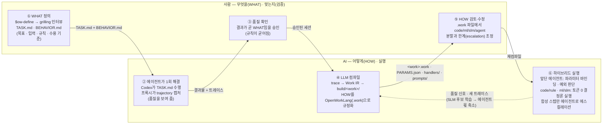
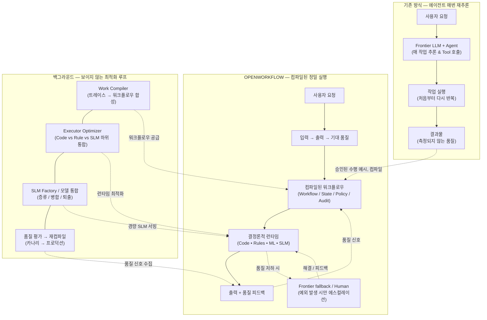

OpenAI Codex v0.150.1
--------
workdir: /Users/hongmartin/orca/projects/open-workflow
model: gpt-5.6-sol
provider: openai
approval: never
sandbox: workspace-write [workdir, /tmp, $TMPDIR]
reasoning effort: none
reasoning summaries: none
session id: 01a04b27-97cd-7421-bcbe-bd750216a26c
--------
user
$ow-define customer contract renewal proposals (sales ops)

Context for this run: the requester is a complete beginner — no prompt-engineering knowledge — who only dropped their work materials into examples/cases/renewal-proposal/materials/ (a memo from their lead, their own notes, a previous finished deliverable, and the raw data files). They are NOT available to answer follow-up questions right now.

So run the grilling interview against the materials instead of the person: for every round, write the numbered questions AND take your own recommended answer, grounded in the memo/notes/previous deliverable. Record each question, the answer you chose and why in examples/cases/renewal-proposal/ASSUMPTIONS.md (so the requester can correct them later). Then write examples/cases/renewal-proposal/TASK.md (steps must reference files under examples/cases/renewal-proposal/materials/... and write outputs under build/renewal-proposal/), and one BEHAVIOR.md per rule under examples/cases/renewal-proposal/behaviors/<kebab-name>/ in the six-section format. Do not perform the task itself.
codex
I’m using `ow-define` and its required `grilling` skill. Since the requester is unavailable, I’ll treat the memo, notes, prior deliverable, and raw files as the interviewee: each numbered question, chosen answer, and rationale will be preserved in `ASSUMPTIONS.md`. I’ll only define the work and behavior contracts—not generate renewal proposals.
exec
/bin/zsh -lc "sed -n '1,240p' .agents/skills/grilling/SKILL.md && printf '\\n--- OW DEFINE ---\\n' && sed -n '1,260p' .agents/skills/ow-define/SKILL.md && printf '\\n--- FILES ---\\n' && rg --files examples/cases/renewal-proposal examples/customer-renewal 2>/dev/null | sort && printf '\\n--- PARSER ---\\n' && sed -n '1,240p' adapters/agentbehavior/parser.py" in /Users/hongmartin/orca/projects/open-workflow
 succeeded in 0ms:
---
name: grilling
description: Grill the user relentlessly about a plan, decision, or idea. Use when the user wants to stress-test their thinking, or uses any 'grill' trigger phrases.
---

Interview the user relentlessly until you reach a shared understanding. Map this as a **design tree**: every decision branches into the decisions that hang off it.

Work the tree in **rounds**. The **frontier** is every decision whose prerequisites are already settled: the questions you can ask _now_ without guessing at answers you haven't heard yet. Ask the whole frontier in one round: number each question and give your recommended answer. Then wait for the user's answers before the next round.

Format a round like so:

```
❓ **Q1** - **<question title>**: <question body, might be multiple paragraphs, including multiple choices>

➡️ <your recommended answer>

---

❓ **Q2** - **<question title>**: <question body, might be multiple paragraphs, including multiple choices>

➡️ <your recommended answer>
```

Each round the user answers reshapes the tree: settled decisions push the frontier outward and unblock questions that depended on them. Recompute the frontier and ask the next round. A question whose answer depends on another question still open in this round belongs to a _later_ round, not this one.

Finding _facts_ is your job, never the user's. When a frontier question needs a fact from the environment (filesystem, tools, etc.), dispatch a sub-agent to find it; don't ask the user for anything you could look up yourself. Don't block on it: a running exploration is an unsettled prerequisite, so only the questions downstream of it wait for the sub-agent to report; ask the rest of the frontier now. The _decisions_ are the user's: put each to them and wait.

The session is done when the frontier is empty: every branch of the design tree visited, nothing left silently assumed. Do not act on it until the user confirms you have reached a shared understanding.

--- OW DEFINE ---
---
name: ow-define
description: Turn a raw, unrefined request into the WHAT of an OpenWorkflow work — a relentless interview (grill-me / grilling) that produces TASK.md (goal, inputs, steps, acceptance criteria) and BEHAVIOR.md contracts, then hands off to the agent run + compile pipeline. Use when someone has a business task in mind but cannot yet state the goal, rules or acceptance criteria precisely.
---

# ow-define — WHAT before HOW

Invoked as `$ow-define <short description of the work>` (e.g. `$ow-define customer renewal proposals`).

OpenWorkflow compiles a *verified* agent session into an executable build. That only pays off when the goal,
the rules and the acceptance criteria are written down first — otherwise the compiler faithfully freezes a
vague run. This skill produces those two artifacts:

| artifact | what it fixes | consumed by |
| :-- | :-- | :-- |
| `examples/<work>/TASK.md` | goal, inputs (data/paths), ordered steps, required outputs, acceptance criteria | the agent's first run (`codex exec 'Read examples/<work>/TASK.md and carry it out exactly as written.'`) |
| `examples/<work>/behaviors/<rule>/BEHAVIOR.md` (one per rule) | non-negotiable process rules with evidence and decision criteria | the compiler (`invariants`), the Oracle Gate, the benchmark |

## Procedure

1. **Grill.** Run the `$grilling` interview (installed from mattpocock/skills; `$grill-me` is its alias) on the
   user's description. Do not stop at the first plausible plan — keep asking until every item below has a
   concrete answer or an explicit "unknown / decided by the agent":
   - the single sentence goal and who consumes the result
   - every input: file, API, table, parameter (which values change per run → these become **params**)
   - the ordered steps a competent person would take, and which of them are mechanical (lookup, calculation,
     formatting) vs. judgment (wording, exceptions)
   - the rules that must never be violated (source of truth, current vs. legacy policy, approvals, caps)
   - what "done" looks like: exact output files, fields, clauses that must appear verbatim
   - the failure modes the user has seen or fears (stale data, hallucinated numbers, skipped approvals)
2. **Write `examples/<work>/TASK.md`** in the style of `examples/customer-renewal/TASK.md`: a title, the role,
   the rules in one paragraph with a pointer to `behaviors/`, then numbered steps that name the exact files and
   commands-level detail (jq / python3 / cat) so the run is auditable, and finally the required reply.
   Mark per-run values explicitly (e.g. **CUST-1001**) so parameter discovery can find them later.
3. **Write one `BEHAVIOR.md` per rule** under `examples/<work>/behaviors/<kebab-name>/`, using exactly the six
   sections the parser expects (see `adapters/agentbehavior/parser.py`):
   `## 1. Intent`, `## 2. Evidence`, `## 3. Decision` (bullets `true:` / `false:` / `na:`), `## 4. Execution`,
   `## 5. Recovery`, `## 6. Failure Modes`. Evidence must be observable in a trajectory (a step name, a file
   read, a rule invoked) — not a feeling.
4. **Add fixture data if the task needs it** under `examples/<work>/data/` (small, realistic, containing at
   least one trap the rules must catch — e.g. a retired policy or an expired contract).
5. **Hand off.** Print the next commands verbatim:

   ```bash
   python3 -m uvicorn adapters.proxy.server:app --port 8787 &
   codex exec 'Read examples/<work>/TASK.md and carry it out exactly as written.'   # first run, captured by the proxy
   # verify the outputs by hand, then:
   $ow-traces · $ow-compile-trace <work> · $ow-bench <work>
   python3 -m core.build run build/<work_dir> --request "..." --escalate codex        # new inputs via the front agent
   ```

   and explain that the compiled `build/<work_dir>/<work_dir>.work` is the HOW: it states which steps became
   deterministic code, which stay with an agent, and can be edited and recompiled.

Do not run the task yourself in this skill; its job ends when the WHAT is written and verified with the user.
End your reply with 🎯.

--- FILES ---
examples/cases/renewal-proposal/materials/data/contracts.json
examples/cases/renewal-proposal/materials/data/pricing_v1_legacy.yaml
examples/cases/renewal-proposal/materials/data/pricing_v2.yaml
examples/cases/renewal-proposal/materials/data/usage-2026-07.csv
examples/cases/renewal-proposal/materials/memo-from-sales-lead.md
examples/cases/renewal-proposal/materials/notes.txt
examples/cases/renewal-proposal/materials/previous/proposal-CUST-0993.md
examples/customer-renewal/TASK.md
examples/customer-renewal/behaviors/use-current-pricing-policy/BEHAVIOR.md
examples/customer-renewal/behaviors/verify-current-contract/BEHAVIOR.md
examples/customer-renewal/data/crm/contracts.json
examples/customer-renewal/data/pricing/pricing_v1_legacy.yaml
examples/customer-renewal/data/pricing/pricing_v2.yaml
examples/customer-renewal/data/usage/usage-2026-07.csv
examples/customer-renewal/domain.linkml.yaml
examples/customer-renewal/work.yaml

--- PARSER ---
"""AgentBehavior BEHAVIOR.md parser.

Parses AgentBehavior specification markdown files into structured dictionaries
containing Intent, Evidence, Decision, Execution, Recovery, and Failure Modes.
"""

from __future__ import annotations

import re
from pathlib import Path
from typing import Any, Dict, Optional


def _normalize_section_title(title: str) -> str:
    """Normalize a markdown section title to a standard snake_case key."""
    # Remove leading numbering like '1.', '1. ', 'Section 1:'
    cleaned = re.sub(r"^(?:section\s+)?\d+[\.\:\-\s]*", "", title.strip(), flags=re.IGNORECASE)
    # Convert spaces/hyphens to underscore and lowercase
    cleaned = re.sub(r"[\s\-]+", "_", cleaned.strip().lower())
    return cleaned


def _parse_decision_bullets(text: str) -> Dict[str, str]:
    """Parse Decision section bullets into true/false/na mapping."""
    decisions: Dict[str, str] = {
        "true": "",
        "false": "",
        "na": "",
        "raw": text.strip(),
    }

    # Match patterns like `- `true`: explanation` or `- true: explanation` or `* `true`: ...`
    pattern = re.compile(
        r"^[\*\-]\s*[`'\"]?(true|false|na)[`'\"]?\s*:\s*(.+)$",
        re.IGNORECASE | re.MULTILINE,
    )

    for match in pattern.finditer(text):
        verdict = match.group(1).lower()
        explanation = match.group(2).strip()
        decisions[verdict] = explanation

    return decisions


def parse_behavior_md(content: str) -> Dict[str, Any]:
    """Parse an AgentBehavior BEHAVIOR.md markdown document into a structured dict.

    Args:
        content: The raw markdown string content of a BEHAVIOR.md file.

    Returns:
        Dict[str, Any] containing:
            - name: The behavior name extracted from title.
            - intent: The intent section text.
            - evidence: The evidence section text.
            - decision: Dict containing true, false, na, and raw decision criteria.
            - execution: The execution section text.
            - recovery: The recovery section text.
            - failure_modes: The failure modes section text.
            - sections: Dictionary mapping all raw/custom section names to their text.
            - raw: The full original markdown content.
    """
    if not content or not content.strip():
        return {
            "name": "",
            "intent": "",
            "evidence": "",
            "decision": {"true": "", "false": "", "na": "", "raw": ""},
            "execution": "",
            "recovery": "",
            "failure_modes": "",
            "sections": {},
            "raw": content,
        }

    lines = content.splitlines()
    behavior_name = ""
    sections: Dict[str, str] = {}
    current_section: Optional[str] = None
    current_lines: list[str] = []

    for line in lines:
        stripped = line.strip()

        # Check for top-level title: # BEHAVIOR: <name> or # <name>
        h1_match = re.match(r"^#\s+(?:BEHAVIOR\s*:\s*)?(.+)$", stripped, re.IGNORECASE)
        if h1_match and not behavior_name:
            behavior_name = h1_match.group(1).strip()
            continue

        # Check for section header (## or ###)
        h2_match = re.match(r"^#{2,3}\s+(.+)$", stripped)
        if h2_match:
            if current_section is not None:
                sections[current_section] = "\n".join(current_lines).strip()
                current_lines = []
            raw_title = h2_match.group(1).strip()
            current_section = _normalize_section_title(raw_title)
            continue

        if current_section is not None:
            current_lines.append(line)

    if current_section is not None:
        sections[current_section] = "\n".join(current_lines).strip()

    # Extract standard fields with fallbacks
    intent = sections.get("intent", "")
    evidence = sections.get("evidence", "")
    raw_decision = sections.get("decision", "")
    decision_dict = _parse_decision_bullets(raw_decision)
    execution = sections.get("execution", "")
    recovery = sections.get("recovery", "")
    failure_modes = (
        sections.get("failure_modes")
        or sections.get("failure_mode")
        or sections.get("failures")
        or ""
    )

    return {
        "name": behavior_name,
        "intent": intent,
        "evidence": evidence,
        "decision": decision_dict,
        "execution": execution,
        "recovery": recovery,
        "failure_modes": failure_modes,
        "sections": sections,
        "raw": content,
    }


def load_behavior_file(path: str | Path) -> Dict[str, Any]:
    """Load and parse an AgentBehavior BEHAVIOR.md file from disk.

    Args:
        path: Path to the BEHAVIOR.md file.

    Returns:
        Dict[str, Any] parsed behavior dictionary.
    """
    file_path = Path(path)
    if not file_path.exists():
        raise FileNotFoundError(f"Behavior file not found: {file_path}")

    content = file_path.read_text(encoding="utf-8")
    parsed = parse_behavior_md(content)

    # If behavior name wasn't in H1 title, fallback to parent directory name
    if not parsed["name"]:
        parsed["name"] = file_path.parent.name

    return parsed

codex
The skill’s “wait for the user” rule is superseded here by your explicit instruction to self-answer from the materials. I’m now reading the complete evidence set and the repository’s reference example, then I’ll work through the decision tree in dependency-ordered rounds inside `ASSUMPTIONS.md`.
exec
/bin/zsh -lc "printf '%s\\n' '--- README ---' && sed -n '1,260p' README.md && printf '%s\\n' '--- ARCHITECTURE ---' && sed -n '1,300p' docs/v4-architecture-semantic-layer.md && printf '%s\\n' '--- BEHAVIOR DESIGN ---' && sed -n '1,300p' docs/behavior-contracts-v2.md && printf '%s\\n' '--- REFERENCE TASK ---' && sed -n '1,260p' examples/customer-renewal/TASK.md && printf '%s\\n' '--- REFERENCE BEHAVIORS ---' && for f in examples/customer-renewal/behaviors/*/BEHAVIOR.md; do echo \"FILE "'$f"; sed -n '"'1,240p' \""'$f"; done && printf '"'%s\\n' '--- CASE MATERIALS ---' && for f in examples/cases/renewal-proposal/materials/memo-from-sales-lead.md examples/cases/renewal-proposal/materials/notes.txt examples/cases/renewal-proposal/materials/previous/proposal-CUST-0993.md examples/cases/renewal-proposal/materials/data/contracts.json examples/cases/renewal-proposal/materials/data/pricing_v1_legacy.yaml examples/cases/renewal-proposal/materials/data/pricing_v2.yaml examples/cases/renewal-proposal/materials/data/usage-2026-07.csv; do echo \"FILE "'$f"; sed -n '"'1,300p' \""'$f"; done' in /Users/hongmartin/orca/projects/open-workflow
 succeeded in 0ms:
--- README ---
# OpenWorkflow

**AI 작업을 위한 실행 레이어 (The execution layer for AI work)**

[English README](README.en.md)

AI가 한 번 작업하게 하세요. OpenWorkflow는 이후 작업을 안정적으로 실행하는 방법을 배웁니다.

> **"코어 커널을 구축하고, 생태계를 통합하며, 시맨틱 진실을 강화하라 (Build the kernel, integrate the ecosystem, enrich with semantic truth.)"**
>
> *"LinkML은 모델 작성의 관문이며, OWL은 시맨틱 진실 레이어이고, SHACL은 제약 조건을 검증하며, OpenWorkflow는 지속적 작업을 실행합니다."*

---

## 사람과 AI의 역할 분담: WHAT은 사람이, HOW는 컴파일러가



| 역할 | 사람 | AI |
| :-- | :-- | :-- |
| 정의 | **WHAT** — 목표·입력·규칙·수용 기준을 문장으로 확정 (`$ow-define`) | — |
| 첫 수행 | — | 에이전트가 한 번 해결해 **품질을 보여 줌** (`codex exec`, 프록시 캡처) |
| 검증 | 결과의 품질이 WHAT과 같음을 **승인** | — |
| 규정화 | `.work`의 분할·한계를 검토·수정 | **LLM 컴파일** — 검증된 세션을 **HOW**(OpenWorkLang)로: code / rule / ml / slm / agent |
| 실행 | 에스컬레이션된 예외만 처리 | **효율성**(결정론·SLM, 토큰 0~소량) + **유연성**(앞단 에이전트가 파라미터·예외 담당) |

실측: 같은 갱신 제안서 작업에서 컴파일된 빌드는 에이전트 대비 토큰 **−85%**, **7.4×** 빠르게 같은 산출물을 냈고, 새 고객(CUST-1002)에 대한 하이브리드 실행은 Codex 단독 대비 **2.1×** 빠르며 에이전트 몫은 합성 스텝 2개로 줄었습니다 ([벤치마크](#30초-데모-codex-안에서-그대로-쓰기)).

---

## 30초 데모: Codex 안에서 그대로 쓰기


합성 화면이 아닌 **실제 Codex 대화형 세션**입니다. Codex를 OpenWorkflow 프록시로 향하게 한 뒤(ChatGPT 로그인 그대로), 저장소의 스킬 3개를 `$` 멘션으로 호출하면 됩니다.

| 순서 | Codex 입력 | 결과 |
| :--- | :--- | :--- |
| 1 | `$ow-compile-work examples/quality_analysis.work` | OpenWorkLang(`.work`) → **실행 가능한 빌드 트리** `build/quality_analyst/` — `work.yaml` + `handlers/*.py`(code) + `rules/*.rule.yaml`(rule) + `models/ml|slm/<action>/`(model card·dataset·train.py) + LinkML 스키마 |
| 2 | `$ow-traces` | 프록시가 캡처한 세션 목록 — **이 Codex 세션 자체**가 `shell_python3, shell_sed, respond, …` 스텝으로 잡힘 |
| 3 | `$ow-compile-trace codex-session` | 캡처된 Codex 세션이 `build/codex_session/`로 컴파일됨 — 셸 스텝은 기록된 명령을 재실행하는 `handlers/shell_*.py`, 비결정 스텝은 `prompts/*.prompt.md` |
| 4 | `$ow-bench codex-session` | **에이전트 vs 컴파일된 빌드** — 같은 세션을 재실행해 결과 일치·토큰·속도를 비교한 `BENCHMARK.md` |

**벤치마크 결과** (작업: `.work` 파일 컴파일 후 빌드 트리 점검·요약, [`examples/demo/build/codex_session/BENCHMARK.md`](examples/demo/build/codex_session/BENCHMARK.md)):

| | 기록된 에이전트 (Codex) | 컴파일된 빌드 | 차이 |
| :-- | --: | --: | --: |
| LLM 토큰 | 46,460 | 16,843 | **−64%** |
| 벽시계 시간 | 33.8 s | 23.1 s | **1.5×** |
| 결과 재현 (code 계층 스텝) | — | **2/2 일치** | |

셸 스텝 2개(`shell_python3`, `shell_find`)는 code 계층으로 내려가 토큰 0·수십 ms에 같은 출력을 냈고, 남은 비용은 아직 frontier LLM으로 에스컬레이션되는 최종 요약(`respond`)뿐입니다 — 이 부분이 `models/slm/` 학습 후보가 승격되면 내려갑니다.

**실제 업무 작업 — 고객 계약 갱신 제안서** ([`examples/customer-renewal/TASK.md`](examples/customer-renewal/TASK.md): CRM 활성 계약 확인 → 3개월 사용량 집계 → 현행 가격정책으로 산정 → 제안서·가격 JSON 작성; 원본은 [`examples/demo/customer-renewal-bench/`](examples/demo/customer-renewal-bench/)):

| | 기록된 에이전트 (Codex, 8 스텝) | 컴파일된 빌드 (빈 상태에서 재실행) | 차이 |
| :-- | --: | --: | --: |
| LLM 토큰 | 139,437 | 20,545 | **−85%** |
| 벽시계 시간 | 82.6 s | 11.2 s | **7.4×** |
| 결과 재현 | — | **7/7 일치** | |
| 최종 산출물 `proposal-CUST-1001.md` · `pricing-CUST-1001.json` | — | **바이트 단위 동일** | |

계약 조회(`jq`)·데이터 읽기·가격 산정·제안서 작성(`apply_patch`)까지 업무 자체는 전부 code 계층으로 컴파일돼 토큰 0으로 재현됐고, 남은 비용은 사람에게 보여줄 최종 요약 한 스텝입니다.
### 앞단 에이전트 + 컴파일된 빌드: 새 입력(CUST-1002)에 대한 하이브리드 실행

컴파일된 빌드는 기록된 세션의 입력(CUST-1001)을 재현할 뿐이므로, **앞단 에이전트**가 새 요청에서 파라미터를 바인딩하고(`PARAMS.json`의 `customer_id`), code 계층은 그 값으로 재실행하며, 에이전트가 합성했던 스텝(가격 JSON·제안서 작성, 최종 요약)만 Codex로 에스컬레이션합니다 — 유연성은 앞단 에이전트가, 효율성은 결정론적 코드가 맡는 구조입니다 ([`hybrid-CUST-1002/`](examples/demo/customer-renewal-bench/hybrid-CUST-1002/)):

```bash
python3 -m core.build run build/customer_renewal_codex \
  --request "Prepare the annual renewal proposal for customer CUST-1002." --escalate codex
```

| CUST-1002 | Codex 단독 (전체 수행) | 하이브리드 (빌드 + 앞단 에이전트) | 차이 |
| :-- | --: | --: | --: |
| LLM 토큰 | 32,572 | 26,481 (에스컬레이션 2회) | −19% |
| 벽시계 시간 | 83 s | 40.2 s | **2.1×** |
| 스텝 | 에이전트 8턴 | code 6 (토큰 0) + 에스컬레이션 2 | |
| 산정 결과 | 60석 · 연 $17,100 · 볼륨 5% | 60석 · 연 $17,100 · 볼륨 5% | 동일 |

토큰 절감이 첫 벤치보다 작은 이유는 명확합니다: 남은 두 에스컬레이션이 각각 새 Codex 세션(시스템 프롬프트 포함 10–16k 토큰)이기 때문입니다. 이 두 스텝이 `models/slm/` 후보로 승격되거나 제안서 문안이 템플릿(code)으로 내려가면 그때 토큰이 0에 가까워집니다 — 어디까지 내려갈 수 있는지가 `.work` 파일의 `escalation` 블록에 명시됩니다.

### WHAT → HOW: 이 파이프라인이 만드는 두 산출물

| | 무엇 | 어디에 |
| :-- | :-- | :-- |
| **WHAT** — 목표·수용 기준·행위 규약 | 정제되지 않은 요구사항을 사람이 문장으로 확정한 것. Codex에서 **`$ow-define <업무>`** 를 호출하면 [grill-me / grilling](https://github.com/mattpocock/skills)(저장소에 설치됨, `.agents/skills/`) 인터뷰로 목표·입력·규칙·수용 기준을 끝까지 캐묻고 `TASK.md`와 `BEHAVIOR.md`를 써 줍니다. 그 뒤 에이전트가 한 번 수행한 결과를 사람이 검증하면서 규칙이 굳어집니다 | `TASK.md`, `behaviors/*/BEHAVIOR.md` |
| **HOW** — 실행 분할과 한계 | 검증된 세션을 컴파일해 얻은 **OpenWorkLang(`.work`)**: 액션별로 code / rule / ml / slm / llm 중 무엇이 실행하는지, 어떤 파라미터를 앞단 에이전트가 바인딩하는지, 어떤 스텝이 `agent`로 남는지(한계)를 사람이 읽고 고쳐 재컴파일할 수 있는 명세 | `build/<work>/<work>.work` (+ `PARAMS.json`, `prompts/`) |

전체 루프를 Codex 스킬로 보면 다음과 같습니다:

```text
$ow-define <업무>            # WHAT: grilling 인터뷰 → examples/<work>/TASK.md + behaviors/*/BEHAVIOR.md (+ 픽스처 데이터)
codex exec 'Read examples/<work>/TASK.md …'   # 에이전트가 한 번 수행 (프록시가 캡처) → 사람이 결과 검증
$ow-traces · $ow-compile-trace <work>         # 검증된 세션 → build/<work>/ (handlers · prompts · PARAMS.json · <work>.work = HOW)
$ow-bench <work>                              # 에이전트 vs 빌드: 결과 · 토큰 · 속도
python3 -m core.build run build/<work> --request "…" --escalate codex   # 새 입력: 앞단 에이전트 + 빌드
```

컴파일된 `.work`의 예 — `build/customer_renewal_codex/customer_renewal_codex.work`:

```text
work customer_renewal_codex {
  params:
    - customer_id            # 기록값 CUST-1001, 실행 시 앞단 에이전트가 요청에서 바인딩
  workflow: [shell_sed, shell_rg, shell_cat, shell_jq, shell_mkdir, write_pricing_cust_1001, respond]
  executors: { shell_sed: code, shell_rg: code, shell_cat: code, shell_jq: code, shell_mkdir: code,
               write_pricing_cust_1001: code, respond: llm }
  escalation: { write_pricing_cust_1001: agent,     # 합성 콘텐츠 — 파라미터가 바뀌면 에이전트가 재생성
                respond: frontier_llm,               # 최종 요약 — SLM 후보 승격 전까지 프론티어
                on_error: fallback_to_frontier_llm, on_quality_drop: require_human_review }
}
```


설정 방법과 각 단계가 실행하는 명령은 [Zero-Code 에이전트 프록시](#zero-code-에이전트-프록시-adaptersproxy) 섹션을, 입력 프롬프트·Codex 출력·컴파일 산출물·벤치마크 원본은 [`examples/demo/`](examples/demo/)를 참조하세요.

---

## 전체 아키텍처 및 파이프라인 개요



---

## 왜 OpenWorkflow인가?

코딩 에이전트와 프론티어 LLM은 뛰어난 수행 능력을 갖추었지만, 그 출력은 반복 가능하지 않고, 비용 효율적이지 않으며, 관측 가능하지 않습니다. 매 요청마다 프론티어 비용을 지불하며 동일한 추론을 처음부터 다시 수행하지만, 품질은 지속적으로 측정되지 않습니다.

OpenWorkflow는 이를 역전시킵니다: 에이전트가 1회 작업을 수행하고 인간이 결과를 평가하면, 시스템은 검증된 실행 과정을 백그라운드에서 결정론적으로 실행되는 안정적이고 최적화된 워크플로우로 컴파일합니다.

**AI는 실행합니다. 인간은 결과 품질을 평가합니다. OpenWorkflow는 행위를 감독하고, 작업을 컴파일하며, 실행을 지속적으로 최적화합니다.**

---

## 실제 업무에서는 어떻게 동작하나요?

아래 사례의 공통점은 처음에는 LLM 에이전트가 업무를 수행하지만, 사람이 결과의 품질만 승인하면 OpenWorkflow가 반복 가능한 부분을 백그라운드에서 컴파일한다는 것입니다. 사람에게 상태 머신이나 모델 선택을 요구하지 않습니다.

| 업무 사례 | 처음 한 번: 에이전트가 수행하는 일 | 컴파일 후: 기본 실행 경로 | 예외 시 에스컬레이션 | 사람이 보는 품질 기준 |
| :--- | :--- | :--- | :--- | :--- |
| **1. 고객 계약 갱신 제안** | CRM에서 계약·사용량을 조회하고 가격 정책을 해석해 제안서를 작성 | 계약 조회는 DB/API, 가격은 Rule, 표준 문구는 SLM으로 실행 | 정책에 없는 할인, 낮은 신뢰도, 고객별 특약은 Frontier LLM 또는 영업 담당자에게 전달 | 가격 오류 없음, 필수 조항 포함, 승인된 톤·형식 |
| **2. 인보이스/환불 승인** | 주문·결제·약관을 조사하고 환불 가능 여부와 사유를 정리 | 주문 조회와 기간 계산은 Code, 환불 자격은 Rule, 안내문은 템플릿/SLM으로 실행 | 고액 환불, 중복 청구, 증빙 불일치는 재무 담당자 승인 대기 | 정책 준수, 금액 정확성, 승인 이력 완결성 |
| **3. 제조 품질 이상 대응** | 센서·MES 로그를 모아 이상 원인을 분석하고 개선 보고서를 작성 | 데이터 수집은 API, 임계치 판정은 Rule, 이상 탐지는 ML, 보고서 초안은 SLM으로 실행 | 신규 패턴, 센서 보정 실패, 안전 영향은 품질 엔지니어와 Frontier LLM 분석으로 전환 | 원인 근거, 안전 절차 준수, 개선안의 재현성 |
| **4. 보안/운영 장애 분류** | 경보·로그·변경 이력을 조사해 영향도와 초기 대응안을 작성 | 이벤트 정규화는 Code, 알려진 시그니처 분류는 Rule/ML, 런북 안내는 검색·SLM으로 실행 | 권한 상승 징후, 미분류 공격, 영향도 불확실은 온콜 엔지니어에게 즉시 전달 | 오탐/미탐률, SLA 내 분류, 민감 작업의 승인 여부 |

### 사례 1: 고객 계약 갱신의 한 번의 루프

```text
영업 담당자 요청
  → LLM Agent가 계약·사용량·가격 정책을 조사해 갱신안 작성
  → 담당자가 “가격과 조항이 정확하다”라고 결과 품질 승인
  → OpenWorkflow가 승인 trace를 Work IR로 컴파일
  → 다음 갱신부터 DB 조회 + 가격 Rule + SLM 초안으로 실행
  → 특약/품질 저하만 Frontier LLM 또는 담당자에게 에스컬레이션
```

핵심은 “갱신안을 만드는 LLM”을 계속 호출하는 것이 아닙니다. 승인된 업무 수행법을 실행 가능한 자산(`work.yaml`)으로 바꾸고, 더 싼 실행 주체로 교체해도 같은 행동 규격과 품질 기준을 통과하는지 계속 확인하는 것입니다. 실제 샘플은 [customer-renewal 예제](examples/customer-renewal/)에서 볼 수 있습니다.

---

## 엔드투엔드 작업 컴파일 파이프라인 (6단계)

```text
 ┌─────────────────────────────────────────────────────────────────────────────┐
 │                      6-STEP COMPILATION & EXECUTION PIPELINE               │
 ├─────────────────────────────────────────────────────────────────────────────┤
 │ 1단계: 트레이스 수집 ────────▶ 로컬/API 통신 로그를 TraceIR로 정규화       │
 │ 2단계: 행위 규격 파싱 ───────▶ BEHAVIOR.md 프로세스 불변식 구조화            │
 │ 3단계: Work IR 컴파일 ───────▶ 3대 분석기 기반 8단계 실행 계층 하위 통합     │
 │ 4단계: 지속성 런타임 ────────▶ 상태 머신 실행, 체크포인팅 및 대기 상태      │
 │ 5단계: Frugal 오라클 게이트 ──▶ JSON 스키마 & 행위 규격 객관적 에스컬레이션  │
 │ 6단계: 품질 축약 & 최적화 ───▶ Lucky-correct 차단 & SLM 학습 데이터 산출   │
 └─────────────────────────────────────────────────────────────────────────────┘
```

1. **1단계: 트레이스 수집 (`TraceIR`)**: OpenWorker, LangGraph, 커스텀 스크립트, 또는 OpenAI/Anthropic API 통신 로그를 표준 `TraceIR`로 정규화합니다.
2. **2단계: 행위 규격 파싱 (`BEHAVIOR.md`)**: 프로세스 평가 사양을 파싱하여 Rule/Policy, Workflow Transition Constraint, Runtime Judge로 분류합니다.
3. **3단계: Work IR 컴파일 (`WorkCompiler`)**: 3대 Middle-End 분석기(`DeterminismAnalyzer`, `PredictionAnalyzer`, `SLMAnalyzer`)가 액션 스텝을 8단계 최적 실행 주체로 하위 통합(Lowering)하여 `work.yaml`을 생성합니다.
4. **4단계: 지속성 상태 머신 실행 (`DurableRuntimeEngine`)**: 자동 상태 체크포인팅 및 `WAITING_EVENT`, `WAITING_HUMAN`, `WAITING_TIMER` 대기 상태를 지원하는 런타임 상태 머신 실행.
5. **5단계: Frugal 객관적 오라클 에스컬레이션 (`ObjectiveOracleGate`)**: 폐쇄 세계 스키마 검증 및 행위 불변식을 직접 검증하며, **검증 실패 시에만** Frontier LLM이나 인간으로 에스컬레이션합니다.
6. **6단계: 품질 축약 평가 & 모델 승격 (`QualityRecord` & `ExecutorOptimizer`)**: `evaluate_quality_fold()`를 통해 행위 불변식을 위반한 행운의 성공(Lucky-Correct)을 거부하고, 모델 승격을 평가하며, HuggingFace SFT `TrainingCandidate` 데이터 세트를 산출합니다.

---

## Zero-Code 에이전트 프록시 (`adapters/proxy/`)

OpenWorkflow는 표준 LLM API 요청을 TraceIR 입력으로 수집합니다. `adapters/proxy/server.py`는 두 가지 모드를 제공합니다.

| 엔드포인트 | 모드 | 설명 |
| :--- | :--- | :--- |
| `POST /v1/responses`, `POST /backend-api/codex/responses` | **passthrough** (`X-OpenWorkflow-Response-Mode: passthrough`) | 요청을 실제 upstream(OpenAI Responses API 또는 ChatGPT Codex 백엔드)으로 그대로 전달하고 SSE 스트림을 바이트 단위로 중계하면서, 완료된 턴을 백그라운드에서 TraceIR로 캡처합니다. **Codex CLI가 수정 없이 그대로 동작합니다.** |
| `POST /v1/chat/completions`, `POST /v1/messages` | **synthetic** (`X-OpenWorkflow-Response-Mode: synthetic`) | 개발·데모용 합성 응답. 운영 트래픽을 전달하면 안 됩니다. |

### 실제 사용 화면: Codex TUI 안에서 전부 실행

README 상단의 [30초 데모](#30초-데모-codex-안에서-그대로-쓰기) 녹화는 합성 데이터가 아니라 **실제 Codex 대화형 TUI 세션**이며, 프록시 기동 한 줄을 제외한 모든 실행이 Codex 안에서 이뤄집니다. 저장소의 `.agents/skills/`에 든 스킬 3개가 Codex에 자동 탐지되어 `$` 멘션으로 명시 호출됩니다(Codex 문서상 `/prompts:` 커스텀 프롬프트는 폐기되어 최신 버전에서 인식되지 않으므로, 명시적 명령은 스킬 멘션이 표준입니다).

| 순서 | Codex 입력 | Codex가 실행하는 것 | 결과 |
| :--- | :--- | :--- | :--- |
--- ARCHITECTURE ---
# OpenWorkflow v4 Architecture: Semantic Layer & LinkML/OWL Integration

Status: Master Architecture Specification (v4) · Supersedes v3 Architecture

## Executive Summary

OpenWorkflow v4 introduces the **Semantic Layer Stack**, establishing a clear separation of concerns between developer-friendly domain modeling, semantic reasoning, closed-world constraint validation, and durable workflow execution.

> **"Build the kernel, integrate the ecosystem, enrich with semantic truth."**
>
> *"LinkML is the front door for human/LLM model authoring; OWL is the semantic truth layer; SHACL validates constraints; OpenWorkflow executes durable work."*

---

## 1. The Core Semantic Philosophy

A common architectural trap in AI systems is forcing developers or LLMs to write raw Description Logic axioms (OWL 2) directly, or assuming schema validation tools (LinkML) can perform open-world reasoning.

OpenWorkflow v4 resolves this by separating roles into a multi-tiered semantic stack:

| Layer | Role | Target Technology |
| :--- | :--- | :--- |
| **Authoring DSL** | Human/Developer/LLM business model authoring | **LinkML (YAML DSL)** |
| **Semantic Canonical IR** | Unified internal representation | **Semantic IR** |
| **Semantic Ontology** | Open-world reasoning & relationship semantics | **OWL 2 (DL)** |
| **Constraint Validation** | Closed-world data verification & cardinalities | **SHACL** |
| **Reasoner** | Inferred classification & consistency checking | **ELK / HermiT** |
| **Runtime Graph** | Knowledge Graph & RDF triples | **Jena / RDF4J / RDFLib** |
| **Execution Engine** | Stateful workflow, action DAG & durable runtime | **OpenWorkflow Kernel** |

---

## 2. Compilation Pipeline: Trace → LinkML → Semantic IR → Execution

The **LLM-as-Compiler** does not generate raw OWL axioms directly. Instead, it extracts a developer-friendly LinkML domain model first, which is then enriched into formal OWL semantics and SHACL constraints.

```text
               Agent Trace
                    │
                    ▼
              LLVM / LLM Compiler
                    │
              LinkML Domain Model (YAML)
                    │
             Semantic Compiler
                    │
              Semantic IR (Canonical)
                    │
   ┌────────────────┼────────────────┬────────────────┐
   ▼                ▼                ▼                ▼
Pydantic          SHACL             OWL           Work IR
(Runtime Types) (Closed-World)  (Open-World)    (Durable DAG)
                    │                │
                    ▼                ▼
             Validation Gate     ELK / HermiT Reasoner
                    │                │
                    └────────┬───────┘
                             ▼
                    OpenWorkflow Runtime
```

### Why LinkML as the Authoring Front Door?
1. **Developer Experience**: Backend engineers and LLMs can write intuitive YAML classes, slots, and enums without knowing Description Logic terms (`SubClassOf`, `ObjectSomeValuesFrom`).
2. **Polyglot Code Generation**: LinkML natively compiles into Pydantic models, JSON Schema, TypeScript types, SHACL shapes, and OWL ontologies.
3. **LLM Safety**: LLMs produce structured LinkML schemas with far higher accuracy and lower hallucination rates than raw OWL DL syntax.

---

## 3. Closed-World vs Open-World Separation

LinkML models are split by the Semantic Compiler into two distinct validation engines:

```text
                  LinkML Model
                       │
       ┌───────────────┴───────────────┐
       ▼                               ▼
     SHACL                            OWL
(Closed-World Validation)    (Open-World Reasoning)
  - required: true             - Class subsumption
  - cardinality: exactly 1     - Property chain inference
  - regex patterns             - Disjointness & equivalence
```

- **SHACL (Closed-World)**: Enforces business constraints (`amount` must be a positive decimal, `vendor` is required).
- **OWL 2 (Open-World)**: Enforces semantic inferencing (e.g. `HighRiskPurchase ≡ PurchaseRequest ⊓ hasRiskScore some HighRiskScore`).

---

## 4. OpenWorkflow Core Kernel (7 Modules in v4)

v4 expands the core kernel to include the **Semantic IR** module:

```text
┌─────────────────────────────────────────────────────────────────────────┐
│                           OPENWORKFLOW CORE (v4)                        │
│                                                                         │
│  1. Work Trace               2. Quality & Behavior Contract             │
│     - Trajectory indexing       - Human outcome rating                  │
│     - Provenance                - BEHAVIOR.md compliance                │
│                                                                         │
│  3. Semantic IR              4. Work Compiler                           │
│     - LinkML parser             - Trace → Work IR                       │
│     - OWL/SHACL mapper          - Invariant extraction                  │
│     - Canonical domain AST      - Executor candidates                   │
│                                                                         │
│  5. Durable Runtime          6. Policy / Commit                         │
│     - Checkpointing & state     - Approvals & permission validation     │
│     - Timers, signals, resume   - Write locks & confidence gates        │
│                                                                         │
│  7. Optimizer                                                           │
│     - Code/Rule/SLM/LLM routing                                         │
│     - Provider cost & latency optimization                              │
│     - Model & Behavior consolidation                                    │
└─────────────────────────────────────────────────────────────────────────┘
```

---

## 5. Repository Layout (v4)

```text
openworkflow/
├── core/                        # Thin, strong OpenWorkflow kernel
│   ├── semantic_ir/             # [v4] LinkML parser, Semantic IR AST, OWL/SHACL generators
│   ├── work_ir/                 # Work IR schema, parser, and AST
│   ├── compiler/                # Trace IR → Work IR compilation
│   ├── runtime/                 # Durable state machine & checkpointing
│   ├── policy/                  # Permissions, approvals, and confidence gates
│   ├── validation/              # Behavior & outcome validation judges
│   └── optimizer/               # Executor routing, SLM promotion & consolidation
│
├── protocols/                   # Standard protocol contract definitions
│   ├── events/                  # Ingress Protocol
│   ├── traces/                  # Trace IR
│   ├── workers/                 # Worker Protocol
│   └── surfaces/                # AG-UI Surface Protocol
│
├── adapters/                    # Ecosystem & Semantic Adapters
│   ├── linkml/                  # [v4] LinkML authoring & generator adapter
│   ├── owl/                     # [v4] OWL 2 ontology & ELK/HermiT reasoner adapter
│   ├── shacl/                   # [v4] SHACL constraint validator adapter
│   ├── agui/                    # Surface protocol adapter for AG-UI
│   ├── mcp/                     # MCP tool protocol adapter
│   ├── proxy/                   # Zero-code LLM API proxy adapter
│   ├── opentag/                 # OpenTag channel adapter
│   ├── openworker/              # OpenWorker desktop adapter
│   ├── agentbehavior/           # AgentBehavior BEHAVIOR.md importer
│   ├── braintrust/              # Braintrust trace/eval adapter
│   └── opentelemetry/           # OpenTelemetry export adapter
│
├── agents/                      # Guide and measurement fleet specs
├── docs/                        # Specifications, architecture, and diagrams
├── conversations/               # Design conversation archives
└── examples/                    # Sample Work IR, LinkML schemas, and behavior specs
```
--- BEHAVIOR DESIGN ---
# OpenWorkflow Behavior Contract Layer (v2)

Status: design (v2/v3) · Integrated into v3 Architecture via `adapters/agentbehavior/` and `core/validation/` (see `docs/v3-architecture-kernel-ecosystem.md`)

AgentBehavior is **not** a competing execution layer. It is a standard layer that sits in front of OpenWorkflow's Work Compilation: it defines and validates what a *good execution* is, before compilation. This document improves the v1 analysis into a concrete, buildable design and lands the decisions.

## 1. The gap v1 left open

The loop we had:

```text
Frontier Agent performs work
        ↓
Human evaluates result quality
        ↓
Approved Trace
        ↓
LLM-as-Compiler → Rule/Code/ML/SLM workflow
        ↓
Production → quality eval → recompile
```

had exactly one blank: **"the result was good" and "the way it was done was good" are not the same.**

A frontier agent can land a correct contract analysis while skipping the primary-source check, querying data without permission checks, or using a cached price table instead of the live one. v1 named this problem correctly ("lucky-correct negative") but did not decide how OpenWorkflow opens, owns, and operates a behavior layer. v2 decides that.

## 2. The one-sentence correction

> **Humans evaluate outcome quality. The system evaluates behavior and outcome quality together.**

This replaces the old phrasing "humans only evaluate outputs" as the system philosophy. The product UX principle stays intact — humans still *see* a single output card — but the system no longer trusts a correct-looking output without a behavior check.

## 3. Core separation

Three things must never be merged.

```text
Behavior   = what it means for the work to be done well (implementation-independent)
Workflow   = how the work is executed (steps, transitions)
Executor   = who/what actually runs each step (code • rule • ML • SLM • LLM)
```

- Behavior survives any executor swap: SLM, LLM, or code must satisfy the same behavior.
- Workflow can be recompiled; Behavior is the invariant set it must never violate.

## 4. Behavior Contract — native format

OpenWorkflow supports AgentBehavior's `BEHAVIOR.md` format natively and stores it under a work definition. Full compat with AgentBehavior spec + Apache-2.0 borrow is intentional, but the registry and lifecycle are OpenWorkflow-owned.

```text
work: renewal-proposal

quality:
  - factual_accuracy >= 0.99
  - reviewer_acceptance >= 0.95

behaviors:
  - verify-current-contract
  - use-current-pricing-policy
  - cite-financial-source
  - require-approval-before-send
```

Each behavior is a `BEHAVIOR.md` file (AgentBehavior format), authored with the recommended six sections: `Intent / Evidence / Decision / Execution / Recovery / Failure modes`.

### Discovery rule

Behavior specs live where the work is compiled, alongside the workflow definition, so the compiler, the runtime judges, and the human review surface all read the same source of truth:

```text
workflows/renewal-proposal/
├── work.yaml                 # work definition (schema → behaviors → quality → executors)
├── workflow.yaml             # compiled workflow graph
├── behaviors/
│   ├── verify-current-contract/BEHAVIOR.md
│   ├── use-current-pricing-policy/BEHAVIOR.md
│   └── require-approval-before-send/BEHAVIOR.md
└── executors/
    └── model-registry.yaml
```

## 5. Compilation: how the compiler decides the behavior's target

Not every behavior compiles to the same thing. The LLM-as-Compiler classifies each behavior with an explicit decision procedure:

```text
1. Is the trigger observable in the trace?            → no  → preserve as evaluator-only spec
2. Can the conduct be expressed as a deterministic rule?  → yes → Rule / Policy
3. Does the conduct impose an ordering/dependency between steps? → yes → Workflow transition constraint
4. Otherwise (semantic/qualitative conduct)           → SLM/LLM judge at runtime
```

| Behavior type                            | Compiles to              | Enforced by                |
| ---------------------------------------- | ------------------------ | -------------------------- |
| Deterministic invariant (approval-before-send) | Rule / Policy            | Runtime policy engine      |
| Structural procedure (CRM-lookup → price calc)  | Workflow transition      | Workflow graph dependency  |
| Semantic / qualitative (don't over-infer)        | Runtime judge            | SLM/LLM behavior judge     |

The compiler must **not** treat an AgentBehavior text as a *hint* that trace statistics happened to show. A behavior declared in the contract is a **non-removable invariant** during workflow synthesis.

## 6. Compiler invariants

```text
Agent Trace
   ├── Output Quality
   └── Behavior Compliance
            ↓
     Accepted Trace Set
            ↓
       Work Compiler
            ├── Workflow synthesis
            └── Invariants (locked behaviors)
            └── Executor candidates (code / ML / SLM)
```

Compiled output is therefore `workflow + invariants + executor model`, not workflow alone.

## 7. Behavior evaluation model (judges)

Per-behavior verdicts over a trajectory, using the `true / false / na` convention:

- `true`  — trigger fired and required conduct observed
- `false` — trigger fired, conduct missing/failed
- `na`    — no trigger in this trajectory, or unjudgeable

Judge each behavior independently, and **fold** into a per-workflow result with a deterministic rule (adopt the calibrated convention from AgentBehavior rather than inventing a score):

```text
any behavior false  → FAIL (regardless of outcome or others)
else any true       → PASS with evidence
else                → na
```

This keeps debugging at the granularity of `verify-contract: true / approval-before-send: false` instead of a single opaque `98%`, and prevents a lucky-correct outcome from passing a behavior it did not perform.

### Calibration discipline (adopted from AgentBehavior)

Before a behavior ships, it must pass a fixture matrix:

```text
Positive            trigger fires, conduct present → judge true
Negative            trigger fires, conduct absent  → judge false
Lucky-correct       outcome correct, process wrong → judge false (MUST stay false)
Outside scope       no trigger                     → na
Allowed boundary    permitted alternative path     → PASS (not penalized)
```

Disagreement diagnosis happens at the owning layer (wording / fixture / judge / telemetry / policy), never by contorting the behavior text to satisfy a broken judge.

### Separation of evaluated agent and judge

The evaluated agent does **not** receive the behavior spec merely because it is being evaluated — otherwise the eval measures promptability, not conduct. (Behaviors are injected as runtime instruction only when that is the deliberate, documented experiment.)

## 8. Where behavior evaluation runs

Behaviors split into three enforcement layers:

```text
Compile-time    rule/policy expressions
Runtime         dedicated approval gates, workflow dependencies
Post-hoc        behavior judges over recorded trajectories
```

Post-hoc judges run on both:

- **Discovery traces** — before compilation (result quality + behavior compliance → accepted trace set)
- **Production traces** — after deployment (drift / regression detection → recompile trigger)

## 9. Behavior Registry (sparse + lifecycle)

Adopt AgentBehavior's sparse principle: a behavior belongs only if it is recurring, consequential, a real choice, observable, durable, and debuggable. 1 workflow → 214 behaviors → 72 rules → 28 evaluators is the failure mode.

Registry lifecycle, run by the compiler continuously:

```text
add → deduplicate → merge → generalize → retire
```

Cross-workflow consolidation is first-class, mirroring Model Consolidation:

```text
Behavior A: check customer identity
Behavior B: verify customer's CRM record
Behavior C: confirm customer before contract query
        →  merge →  verify-customer-identity
```

Three consolidation loops run in parallel in the backend: **Workflow Consolidation · Model Consolidation · Behavior Consolidation**.

## 10. Executor Optimizer gate (SLM/LLM/code swap)

v1 said "just slot behavior checks into the optimizer." v2 specifies the promotion gate:

```text
output_quality >= threshold                (result)
AND behavior_compliance >= threshold       (process — new, mandatory)
AND cost_improves
AND latency_acceptable
```

Behavior compliance is measured on **held-out production-ish traces**, not the training set, using the fold rule above. A frontier→SLM swap that keeps 98% output accuracy while dropping the "use-current-pricing-policy" check 40% of the time is rejected.

```text
behavior: always-check-current-pricing-policy
   Frontier Agent Trace   PASS
   SLM Trace              FAIL   ← swap blocked
```

## 11. Dependency posture

- **Format**: support AgentBehavior `BEHAVIOR.md` natively + provide an importer/exporter so specs are portable.
- **Execution**: OpenWorkflow owns the registry, runtime policy, and judges. AgentBehavior provides the standard, not the engine.
- **License**: Apache-2.0 — borrow with attribution, no structural risk.

## 12. Human review surface (unchanged UX, richer backend)

People still review one output card; the behavior layer stays behind it.

```text
                  Production Trace
                         │
              ┌──────────┴──────────┐
              ▼                     ▼
       Automated Behavior      Output Quality
            Judges
              │                     │
              │                     ▼
              │              Human Reviewer
              │                     │
              └─────────┬───────────┘
                        ▼
                   Quality Record
```

Human card:

```text
계약 갱신안 #182

결과 품질
★★★★★
[승인]

자동 검증
✓ 최신 계약 확인
✓ 최신 가격 정책 사용
✓ 가격 계산 검증
✓ 외부 발송 전 승인
```

Behavior verdicts surface as **explainable checkmarks**; the full per-behavior `true/false/na` record is available on drill-down for review, not as a required reading surface.

## 13. Updated loop (v2)

```text
              Frontier Agent
                    │
                    ▼
             Raw Work Trace
                    │
          ┌─────────┴─────────┐
          ▼                   ▼
    Result Quality       Behavior Eval
       Human             Automated
          │                   │
          └────────┬──────────┘
                   ▼
            Approved Traces
                   │
                   ▼
           LLM-as-Compiler
                   │
       ┌───────────┼────────────┐
       ▼           ▼            ▼
   Behavior      Workflow     Executor
  Invariants    Graph        Candidates
       │           │            │
       │           │      Code / ML / SLM
       └───────────┼────────────┘
                   ▼
             OpenWorkflow
                 Runtime
                   │
                   ▼
               Production
                   │
          ┌────────┴────────┐
          ▼                 ▼
    Behavior Judge      Human Sample
          │             Quality Review
          └────────┬────────┘
                   ▼
               Feedback
                   │
                   ▼
          Recompile / Optimize
```

## 14. Owner agents in this repo

--- REFERENCE TASK ---
# Task: renewal proposal for customer CUST-1001

You are the sales-ops assistant. Prepare the annual renewal proposal for **CUST-1001**.

Rules (from `behaviors/`): verify the *active* contract in the CRM before pricing, and price with the
*current* policy `data/pricing/pricing_v2.yaml` — never the legacy table.

Do the work with auditable shell commands (jq / python3 / cat), from the repository root:

1. **Lookup contract** — read `examples/customer-renewal/data/crm/contracts.json`, select the
   contract for CUST-1001 whose `status` is `active`, and print it.
2. **Calculate usage** — from `examples/customer-renewal/data/usage/usage-2026-07.csv`, compute for
   CUST-1001 the peak `seats_active` over the 3 months, the growth of `seats_active` (last vs first
   month, in %) and the average `api_calls`.
3. **Price the offer** — apply `pricing_v2.yaml`: recommended committed seats per `seat_recommendation`,
   list price for the plan, volume discount band, loyalty discount if the customer has >= 2 years of
   continuous service (use the active contract's `start_date`, today is 2026-08-29), cap at
   `max_total_discount_pct`. Compute monthly and annual totals. Write the calculation as JSON to
   `build/renewal/pricing-CUST-1001.json`.
4. **Draft the proposal** — write `build/renewal/proposal-CUST-1001.md` with: customer & contract
   summary, usage summary, a pricing table (seats × list price − discounts = monthly / annual), and
   every clause from `required_clauses` verbatim.
5. Reply with a short summary (recommended seats, total annual price, discounts applied) and the two
   file paths.
--- REFERENCE BEHAVIORS ---
FILE examples/customer-renewal/behaviors/use-current-pricing-policy/BEHAVIOR.md
# BEHAVIOR: use-current-pricing-policy

## 1. Intent
Guarantees that pricing calculations apply the current active enterprise pricing table (`rules.pricing_v2`) rather than legacy discount structures.

## 2. Evidence
Invocation of `rules.pricing_v2` with live policy parameters in the trajectory.

## 3. Decision
- `true`: Active pricing policy rule engine was queried and applied.
- `false`: Custom unverified pricing was hallucinated or legacy table was applied.
- `na`: Trajectory does not perform pricing calculations.

## 4. Execution
Enforced as a deterministic Rule engine executor step.

## 5. Recovery
Re-derive offer using standard rule engine `rules.pricing_v2`.

## 6. Failure Modes
LLM hallucinating custom percentage discounts outside authorized bands.
FILE examples/customer-renewal/behaviors/verify-current-contract/BEHAVIOR.md
# BEHAVIOR: verify-current-contract

## 1. Intent
Ensure that any renewal offer or contract analysis looks up the active, current customer contract from the CRM before computing renewal terms.

## 2. Evidence
Evidence consists of a `crm.lookup_contract` step occurring before `services.usage.calculate` or `rules.pricing_v2` steps in the execution trajectory.

## 3. Decision
- `true`: `crm.lookup_contract` executed successfully and returned active contract data prior to pricing logic.
- `false`: Pricing or drafting occurred without querying the active contract, or queried a cached/stale record.
- `na`: Trajectory does not involve contract renewals.

## 4. Execution
Enforced at compile-time as a non-removable workflow transition dependency and verified by post-hoc trajectory judges.

## 5. Recovery
If missing, halt execution and escalate to CRM lookup connector or prompt reviewer.

## 6. Failure Modes
Using hardcoded contract terms or relying on LLM memory from previous turns.
--- CASE MATERIALS ---
FILE examples/cases/renewal-proposal/materials/memo-from-sales-lead.md
# 영업팀장 메모 (슬랙에서 복사)

갱신 제안서 이제 네가 맡아줘. 대충 이렇게 해왔음:
- CRM 파일(contracts.json)에서 그 고객 "현재 살아있는" 계약 찾기. 옛날 만료된 거 보고 견적 낸 사고 한 번 있었음. 꼭 status 확인.
- 최근 3개월 사용량(usage csv) 보고 좌석 늘었으면 늘어난 만큼 잡아서 제안. 10석 단위로 올림.
- 가격은 무조건 pricing_v2. v1_legacy는 작년에 폐기됐는데 아직 파일이 남아있음. 헷갈리지 말 것.
- 50석 이상 5%, 200석 이상 10%, 500석 이상 15%. 2년 이상 고객은 3% 더. 합쳐서 20% 넘으면 안 됨(넘으면 이사 승인).
- 제안서 끝에 표준 조항 3개 꼭 넣기 (자동갱신 통지 60일, DPA v3, 30일 유효).
- 결과물은 md 파일 하나 + 계산 근거 json 하나. 예전 거 previous 폴더에 있음.
FILE examples/cases/renewal-proposal/materials/notes.txt
내 메모
- 오늘 날짜 기준으로 2년 계산 (계약 start_date부터)
- ACME(CUST-1001)가 9월 말 만료라 이번 주에 보내야 함
- 파일 이름: proposal-<고객ID>.md, pricing-<고객ID>.json 로 통일
FILE examples/cases/renewal-proposal/materials/previous/proposal-CUST-0993.md
# Annual Renewal Proposal — Northwind Traders (CUST-0993)

Proposal date: 2026-03-02

## Customer and contract summary
- Active contract: CTR-2025-0011, Professional, 80 seats, 2025-03-15 → 2026-03-14

## Usage summary
Peak active seats 84 over the last 3 months → recommended commitment 90 seats.

## Pricing (pricing_v2)
| Calculation | Monthly (USD) | Annual (USD) |
|---|---:|---:|
| 90 seats × $25.00 | $2,250.00 | $27,000.00 |
| Less 5% volume discount | −$112.50 | −$1,350.00 |
| Total | $2,137.50 | $25,650.00 |

## Required clauses
12-month term with 60-day auto-renewal notice
Data Processing Addendum v3 attached
Price valid for 30 days from proposal date
FILE examples/cases/renewal-proposal/materials/data/contracts.json
{
  "generated_at": "2026-08-01",
  "contracts": [
    {
      "customer_id": "CUST-1001",
      "customer_name": "ACME Manufacturing Co.",
      "contract_id": "CTR-2024-0917",
      "status": "active",
      "plan": "enterprise",
      "seats": 240,
      "price_per_seat_month_usd": 38.0,
      "pricing_policy": "pricing_v1_legacy",
      "start_date": "2024-09-01",
      "end_date": "2026-09-30",
      "billing": "annual",
      "account_owner": "j.park@example.com",
      "special_terms": []
    },
    {
      "customer_id": "CUST-1002",
      "customer_name": "Bluebird Logistics",
      "contract_id": "CTR-2025-0142",
      "status": "active",
      "plan": "professional",
      "seats": 60,
      "price_per_seat_month_usd": 25.0,
      "pricing_policy": "pricing_v2",
      "start_date": "2025-11-15",
      "end_date": "2026-11-14",
      "billing": "annual",
      "account_owner": "m.lee@example.com",
      "special_terms": ["custom SLA 99.95%"]
    },
    {
      "customer_id": "CUST-1001",
      "customer_name": "ACME Manufacturing Co.",
      "contract_id": "CTR-2022-0311",
      "status": "expired",
      "plan": "professional",
      "seats": 120,
      "price_per_seat_month_usd": 22.0,
      "pricing_policy": "pricing_v1_legacy",
      "start_date": "2022-09-01",
      "end_date": "2024-08-31",
      "billing": "annual",
      "account_owner": "j.park@example.com",
      "special_terms": []
    }
  ]
}
FILE examples/cases/renewal-proposal/materials/data/pricing_v1_legacy.yaml
# LEGACY pricing (retired 2025-12-31). Kept for historical invoices only — do NOT use for new offers.
policy: pricing_v1_legacy
retired_on: "2025-12-31"
list_price_per_seat_month:
  professional: 22.0
  enterprise: 38.0
flat_renewal_discount_pct: 8
FILE examples/cases/renewal-proposal/materials/data/pricing_v2.yaml
# Current enterprise pricing policy (rules.pricing_v2). Effective 2026-01-01.
# The renewal offer MUST be computed from this table (see behaviors/use-current-pricing-policy).
policy: pricing_v2
effective_from: "2026-01-01"
currency: USD
renewal_term_months: 12
list_price_per_seat_month:
  starter: 12.0
  professional: 25.0
  enterprise: 40.0
volume_discount_bands:            # applied on list price, by committed seats
  - min_seats: 50
    pct: 5
  - min_seats: 200
    pct: 10
  - min_seats: 500
    pct: 15
loyalty_discount:                 # customers with >= min_years continuous service
  min_years: 2
  pct: 3
max_total_discount_pct: 20        # hard cap; anything beyond needs sales-director approval
seat_recommendation:
  rule: "commit seats = max(current contract seats, peak seats_active of last 3 months) rounded up to next 10"
required_clauses:
  - "12-month term with 60-day auto-renewal notice"
  - "Data Processing Addendum v3 attached"
  - "Price valid for 30 days from proposal date"
FILE examples/cases/renewal-proposal/materials/data/usage-2026-07.csv
customer_id,month,seats_active,api_calls,storage_gb,support_tickets
CUST-1001,2026-05,238,1840000,910,4
CUST-1001,2026-06,247,2010000,955,3
CUST-1001,2026-07,262,2265000,1010,5
CUST-1002,2026-05,54,310000,120,1
CUST-1002,2026-06,57,325000,128,2
CUST-1002,2026-07,58,331000,131,1

codex
The evidence settles the core case: **CUST-1001**, proposal date **2026-08-29**, active contract only, a **270-seat** recommendation from a 262-seat peak, and `pricing_v2` as the sole pricing authority. I’m treating the old proposal as a format precedent—not a source for customer facts—and keeping the behavior registry sparse around four consequential rules: active-contract verification, current-policy pricing, discount-cap approval, and verbatim required clauses.
apply patch
patch: completed
/Users/hongmartin/orca/projects/open-workflow/examples/cases/renewal-proposal/ASSUMPTIONS.md
/Users/hongmartin/orca/projects/open-workflow/examples/cases/renewal-proposal/TASK.md
/Users/hongmartin/orca/projects/open-workflow/examples/cases/renewal-proposal/behaviors/enforce-discount-approval-cap/BEHAVIOR.md
/Users/hongmartin/orca/projects/open-workflow/examples/cases/renewal-proposal/behaviors/include-required-clauses-verbatim/BEHAVIOR.md
/Users/hongmartin/orca/projects/open-workflow/examples/cases/renewal-proposal/behaviors/use-current-pricing-policy/BEHAVIOR.md
/Users/hongmartin/orca/projects/open-workflow/examples/cases/renewal-proposal/behaviors/verify-active-contract/BEHAVIOR.md
diff --git a/examples/cases/renewal-proposal/ASSUMPTIONS.md b/examples/cases/renewal-proposal/ASSUMPTIONS.md
new file mode 100644
index 0000000000000000000000000000000000000000..912e53375e5f8f4eb9cc4b03053c8e8ecf414f87
--- /dev/null
+++ b/examples/cases/renewal-proposal/ASSUMPTIONS.md
@@ -0,0 +1,126 @@
+# Assumptions: customer contract renewal proposals
+
+The requester was unavailable for follow-up questions. The interview below was therefore answered from the supplied memo, personal notes, previous deliverable, and raw data. Each answer is provisional and should be corrected before the first run if it does not match sales-operations policy.
+
+## Round 1 — Outcome and scope
+
+❓ **Q1 — What is the single-sentence goal, and who consumes the result?** Prepare an auditable annual renewal proposal and its pricing calculation for the customer due for renewal, for review and sending by sales operations/account ownership.
+
+➡️ **Chosen answer:** Prepare the annual renewal proposal and pricing evidence for **CUST-1001 (ACME Manufacturing Co.)**, for the sales-ops requester and account owner to review before customer delivery.
+
+**Why:** `materials/notes.txt` identifies ACME/CUST-1001 as expiring at the end of September and needing action this week. The memo assigns the work to sales ops, while the active contract identifies `j.park@example.com` as account owner. The materials do not authorize sending anything externally.
+
+---
+
+❓ **Q2 — Which values vary per run?** Is this a one-off ACME task, or a reusable customer-renewal task with bound parameters?
+
+➡️ **Chosen answer:** Define a reusable renewal task whose per-run parameters are **customer_id = CUST-1001** and **proposal_date = 2026-08-29** for this first run. The input file paths are fixed for this case definition.
+
+**Why:** The requested work is plural/generic, but the notes identify the immediate customer. Explicit values make the first trace reproducible and allow later compilation to discover parameters.
+
+---
+
+❓ **Q3 — What exactly must the run produce?**
+
+➡️ **Chosen answer:** Produce exactly two artifacts: `build/renewal-proposal/proposal-CUST-1001.md` and `build/renewal-proposal/pricing-CUST-1001.json`; then reply with a short summary and both paths. Do not send the proposal.
+
+**Why:** The memo requires one Markdown proposal and one JSON calculation, and `materials/notes.txt` fixes their naming convention. The user explicitly requested all outputs under `build/renewal-proposal/`.
+
+## Round 2 — Inputs, authority, and calculations
+
+❓ **Q4 — Which inputs are authoritative, and how should conflicts be resolved?**
+
+➡️ **Chosen answer:** Use `materials/data/contracts.json` for contract identity/status/term, `materials/data/usage-2026-07.csv` for recent usage, and `materials/data/pricing_v2.yaml` for every new-offer price, discount, term, seat, and clause rule. Use the memo and notes as task instructions. Use `materials/previous/proposal-CUST-0993.md` only as a formatting precedent. Never use `pricing_v1_legacy.yaml` or the active contract's legacy `pricing_policy`/stored seat price to price the offer.
+
+**Why:** The memo explicitly says v1 was retired and v2 is mandatory. The v1 file marks itself retired. The ACME contract still references v1, creating the exact stale-policy trap the process must catch.
+
+---
+
+❓ **Q5 — How is the current contract selected?**
+
+➡️ **Chosen answer:** Select the record matching **CUST-1001** whose `status` is exactly `active`; require exactly one match. Stop without drafting if none or more than one exists.
+
+**Why:** The lead cites a prior incident caused by using an expired contract. The file contains both active and expired ACME contracts, so customer ID alone is unsafe. Uniqueness is not stated explicitly, but it is the safest deterministic interpretation of “current live contract.”
+
+---
+
+❓ **Q6 — What does “recent three months” mean and which usage metrics belong in the output?**
+
+➡️ **Chosen answer:** Filter the supplied usage CSV to **CUST-1001**, require exactly the three rows `2026-05`, `2026-06`, and `2026-07`, then calculate peak active seats, first-to-last active-seat growth percentage, and average API calls. Include all three in the proposal usage summary.
+
+**Why:** Those are the only three ACME months in the dated July snapshot. The reference task calculates these three metrics; peak seats directly drives the seat recommendation. Requiring three rows avoids silently presenting an incomplete window.
+
+---
+
+❓ **Q7 — How are committed seats calculated, especially when usage falls?**
+
+➡️ **Chosen answer:** Compute `max(active contract seats, three-month peak seats_active)`, then round upward to a multiple of 10. For ACME this is `max(240, 262) = 262`, rounded to **270 seats**.
+
+**Why:** This is stated verbatim in `pricing_v2.yaml`; the memo’s shorthand (“if seats increased, capture the increase”) is consistent with it. The current contract creates a floor, so the proposal does not automatically contract seat count.
+
+---
+
+❓ **Q8 — How are price and discounts calculated?**
+
+➡️ **Chosen answer:** Use the v2 enterprise list price of **$40 per seat per month**. Apply the single highest qualifying volume band, plus the 3% loyalty discount when service from the active contract `start_date` to proposal date reaches two years. Add applicable percentages, enforce the 20% cap, and calculate monthly and 12-month annual totals from list price less the combined discount. Round currency to two decimals.
+
+**Why:** The v2 policy describes volume bands by committed seats, a loyalty add-on, a total cap, and a 12-month term. Selecting the highest band avoids incorrectly stacking 5% and 10%. ACME qualifies for 10% volume and, on 2026-08-29, does **not yet** reach two full years from 2024-09-01, so the expected combined discount is **10%**, monthly total **$9,720.00**, and annual total **$116,640.00**.
+
+## Round 3 — Judgment, exceptions, and acceptance
+
+❓ **Q9 — What happens when proposed discounts exceed the policy cap?**
+
+➡️ **Chosen answer:** Never silently apply more than 20%. If any policy/custom combination requests more than 20%, stop proposal finalization and report that sales-director approval is required; record the requested discount and approval-required status in pricing JSON. Do not invent or assume approval.
+
+**Why:** Both the memo and v2 policy establish a hard cap and director approval above it. No approval artifact or approval source is present in the materials.
+
+---
+
+❓ **Q10 — What content and tone should the proposal use?**
+
+➡️ **Chosen answer:** Follow the prior proposal’s concise structure: title/date, customer and active-contract summary, usage summary with recommended seats, pricing table, and required clauses. Use professional, factual sales-ops language and do not introduce unsupported claims, concessions, or terms.
+
+**Why:** The previous finished deliverable is the only supplied presentation precedent. Its facts belong to another customer, so only its structure and tone are reusable.
+
+---
+
+❓ **Q11 — Which text must appear verbatim?**
+
+➡️ **Chosen answer:** Include each string in `pricing_v2.yaml.required_clauses` exactly once and unchanged under `## Required clauses`:
+
+- `12-month term with 60-day auto-renewal notice`
+- `Data Processing Addendum v3 attached`
+- `Price valid for 30 days from proposal date`
+
+**Why:** The memo requires all three standard clauses, the policy provides their authoritative English wording, and the reference deliverable reproduces them verbatim.
+
+---
+
+❓ **Q12 — What must pricing JSON contain to be auditable?**
+
+➡️ **Chosen answer:** Record customer/proposal identifiers; source paths and policy/version; active-contract identifiers and dates; usage window and calculated metrics; seat-recommendation inputs/result; list price; each discount and reason; combined/capped discount; monthly and annual list/subtotal/final totals; currency and term; and approval status.
+
+**Why:** The memo calls the JSON the calculation basis. These fields allow a reviewer to recompute every decision without relying on narrative prose.
+
+---
+
+❓ **Q13 — What are the principal failure modes and stop conditions?**
+
+➡️ **Chosen answer:** Stop without producing a final proposal when the active contract is absent/ambiguous, the three-month usage window is incomplete, the current policy cannot be read or is not `pricing_v2`, a plan lacks a v2 list price, calculations cannot be reconciled, or an above-cap discount lacks director approval. Explicitly guard against stale/expired contracts, legacy pricing, stacked volume bands, premature loyalty eligibility, invented data/discounts, altered/missing clauses, and accidental external sending.
+
+**Why:** These cover the incident named by the lead, the deliberate traps in the files, and the main ways a plausible-looking proposal could be lucky-correct or commercially unauthorized.
+
+---
+
+❓ **Q14 — What is the exact definition of done?**
+
+➡️ **Chosen answer:** Done means both named files exist under `build/renewal-proposal/`; all values trace to the supplied inputs; JSON arithmetic recomputes exactly; proposal values agree with JSON; the active contract and v2 policy were read before calculation; every required clause appears verbatim; no approval-required exception remains unresolved; and the final reply names recommended seats, annual price, discounts, and both output paths.
+
+**Why:** This combines the requested outputs with observable behavior and cross-file consistency, preventing a polished but unauditable result from passing.
+
+## Explicit unknowns left for later correction
+
+- Whether sales-director approval has a specific file/API source and whether an approved exception may exceed 20% rather than merely requiring escalation.
+- Whether “recent three months” should eventually be derived dynamically from proposal date instead of using the supplied dated snapshot.
+- Whether growth percentage should be rounded to a prescribed precision; this definition uses two decimal places.
+- Whether the proposal requires a named recipient, branding, signature block, or an approval workflow before external delivery.
diff --git a/examples/cases/renewal-proposal/TASK.md b/examples/cases/renewal-proposal/TASK.md
new file mode 100644
index 0000000000000000000000000000000000000000..f55a79bf1f746637774e36a5889e20e953e04188
--- /dev/null
+++ b/examples/cases/renewal-proposal/TASK.md
@@ -0,0 +1,19 @@
+# Task: renewal proposal for customer CUST-1001
+
+You are the sales-operations assistant. Prepare an auditable annual renewal proposal for **CUST-1001** as of **2026-08-29**, for internal review by sales operations and the account owner. Do not send it externally.
+
+Rules (from `examples/cases/renewal-proposal/behaviors/`): verify exactly one active contract before any usage-based recommendation or pricing; use only the current `pricing_v2` policy; never finalize a discount above the policy cap without recorded sales-director approval; and reproduce all current-policy required clauses verbatim. Treat `examples/cases/renewal-proposal/materials/previous/proposal-CUST-0993.md` only as a structure/tone precedent, never as a factual source. Do not use `pricing_v1_legacy.yaml` for any new-offer calculation.
+
+Do the work with auditable shell commands (`jq`, `python3`, `sed`, `cat`) from the repository root:
+
+1. **Inspect the instructions and precedent** — read `examples/cases/renewal-proposal/materials/memo-from-sales-lead.md`, `examples/cases/renewal-proposal/materials/notes.txt`, and `examples/cases/renewal-proposal/materials/previous/proposal-CUST-0993.md`. Use the prior proposal only to guide structure and professional tone.
+2. **Verify the current contract** — read `examples/cases/renewal-proposal/materials/data/contracts.json`; select records whose `customer_id` is **CUST-1001** and `status` is `active`; print the selected record and require exactly one match. Stop and report the ambiguity/missing contract without drafting if the match count is not one. Do not use the expired ACME record.
+3. **Calculate the three-month usage** — read `examples/cases/renewal-proposal/materials/data/usage-2026-07.csv`; filter to **CUST-1001** and require exactly the months `2026-05`, `2026-06`, and `2026-07`. Compute peak `seats_active`, active-seat growth from first to last month as a percentage rounded to two decimals, and average `api_calls` rounded to two decimals. Stop if the window is incomplete or duplicated.
+4. **Load and validate current pricing** — read `examples/cases/renewal-proposal/materials/data/pricing_v2.yaml` and verify `policy: pricing_v2` and that **2026-08-29** is on or after `effective_from`. Do not read pricing values from `examples/cases/renewal-proposal/materials/data/pricing_v1_legacy.yaml`, from the contract's `pricing_policy`, or from the prior proposal.
+5. **Calculate the offer** — apply `seat_recommendation`: take the greater of active-contract seats and the three-month peak, then round upward to the next multiple of 10 (an existing multiple remains unchanged). Use the v2 list price for the active contract plan. Apply only the highest qualifying volume discount band. Apply the loyalty discount only if the interval from the active contract `start_date` through **2026-08-29** is at least two full calendar years. Sum applicable discounts without exceeding `max_total_discount_pct`; if a requested discount would exceed the cap and no sales-director approval evidence exists, stop finalization and report approval required. Calculate monthly and 12-month annual list totals, discount amounts, and final totals in USD, rounded to two decimals.
+6. **Write auditable pricing evidence** — create `build/renewal-proposal/` and write `build/renewal-proposal/pricing-CUST-1001.json`. Include `customer_id`, `customer_name`, `proposal_date`, source file paths, policy/version and effective date, active-contract ID/status/plan/start/end/current seats, usage window and all calculated usage metrics, seat-recommendation inputs/result, currency and term, per-seat list price, monthly/annual list totals, each discount with its eligibility reason, combined discount before and after cap, monthly/annual discount amounts, monthly/annual final totals, and `approval_required`/`approval_status`. Use JSON numbers for numeric fields.
+7. **Draft the proposal** — write `build/renewal-proposal/proposal-CUST-1001.md` using only facts established above. Include the title and proposal date; customer and active-contract summary; usage summary (window, peak seats, growth, average API calls, and recommended commitment); a pricing table showing seats × v2 list price, each applied discount, and monthly/annual totals; and a `## Required clauses` section containing every string from `pricing_v2.yaml.required_clauses` exactly once and verbatim. Do not add unsupported customer claims, discounts, special terms, or approval claims.
+8. **Validate before completion** — use commands to parse the JSON; independently recompute its seat recommendation, discounts, and totals; verify the proposal's customer, contract, seats, discounts, and totals agree with the JSON; verify all required clauses match the v2 policy byte-for-byte; and verify neither output cites or applies `pricing_v1_legacy`. If any check fails, correct the output and rerun all validations.
+9. **Required reply** — reply with a short internal-review summary containing the recommended committed seats, final annual price, every applied discount, and these two paths: `build/renewal-proposal/proposal-CUST-1001.md` and `build/renewal-proposal/pricing-CUST-1001.json`. State clearly that the files were prepared but not sent.
+
+Acceptance requires both files at the exact paths, successful arithmetic and cross-file validation, observable compliance with all four behavior contracts, verbatim required clauses, and no unresolved approval requirement.
diff --git a/examples/cases/renewal-proposal/behaviors/enforce-discount-approval-cap/BEHAVIOR.md b/examples/cases/renewal-proposal/behaviors/enforce-discount-approval-cap/BEHAVIOR.md
new file mode 100644
index 0000000000000000000000000000000000000000..7a9b8cbb8d474bbc80469a96217329735c76abf4
--- /dev/null
+++ b/examples/cases/renewal-proposal/behaviors/enforce-discount-approval-cap/BEHAVIOR.md
@@ -0,0 +1,21 @@
+# BEHAVIOR: enforce-discount-approval-cap
+
+## 1. Intent
+Prevent an unauthorized renewal proposal from being finalized when requested combined discounts exceed the current policy's maximum total discount.
+
+## 2. Evidence
+The trajectory records each discount and eligibility reason, the pre-cap combined percentage, the policy cap from `pricing_v2.yaml`, and `approval_required`/`approval_status` before proposal finalization; any above-cap case includes observable sales-director approval evidence or stops without a final proposal.
+
+## 3. Decision
+- `true`: The combined discount is at or below the policy cap, or an above-cap proposal is finalized only with recorded sales-director approval evidence.
+- `false`: A proposal is finalized above the cap without approval, approval is invented or assumed, or discount components/cap comparison are absent.
+- `na`: No discount is calculated, or the trajectory stops before an offer is proposed for reasons unrelated to the discount cap.
+
+## 4. Execution
+Evaluate the deterministic cap after all eligible discounts are assembled and before writing the final proposal. Treat missing approval evidence as not approved and halt above-cap finalization.
+
+## 5. Recovery
+Stop proposal finalization and report the requested discount and required sales-director approval; resume only when verifiable approval evidence is available or the offer is revised within the cap.
+
+## 6. Failure Modes
+Silently clipping an intended exception without disclosure; exceeding 20% without approval; claiming verbal or implied approval not present in evidence; omitting a discount component to evade the cap check.
diff --git a/examples/cases/renewal-proposal/behaviors/include-required-clauses-verbatim/BEHAVIOR.md b/examples/cases/renewal-proposal/behaviors/include-required-clauses-verbatim/BEHAVIOR.md
new file mode 100644
index 0000000000000000000000000000000000000000..f2a2ab3d7d86e14a45a2d6caba7b7c362cab61f9
--- /dev/null
+++ b/examples/cases/renewal-proposal/behaviors/include-required-clauses-verbatim/BEHAVIOR.md
@@ -0,0 +1,21 @@
+# BEHAVIOR: include-required-clauses-verbatim
+
+## 1. Intent
+Ensure the renewal proposal contains every standard clause mandated by the current pricing policy, exactly and without semantic drift.
+
+## 2. Evidence
+The trajectory reads `required_clauses` from `examples/cases/renewal-proposal/materials/data/pricing_v2.yaml` and validates that each source string occurs exactly once, unchanged, in the proposal's `## Required clauses` section.
+
+## 3. Decision
+- `true`: Every current-policy required clause appears exactly once and verbatim in the designated proposal section.
+- `false`: Any clause is missing, duplicated, paraphrased, altered, sourced from legacy material, or placed only in pricing JSON rather than the proposal.
+- `na`: The trajectory does not draft a renewal proposal.
+
+## 4. Execution
+Copy the clause strings directly from the validated v2 policy during drafting, then perform an exact string and occurrence-count check before completion.
+
+## 5. Recovery
+Reload `required_clauses` from the current policy, replace the entire required-clauses section with the authoritative strings, and rerun exact-match validation.
+
+## 6. Failure Modes
+Paraphrasing legal text; omitting the 60-day notice, DPA v3, or 30-day validity clause; copying legacy wording; inserting a clause twice; claiming clause compliance without checking the written file.
diff --git a/examples/cases/renewal-proposal/behaviors/use-current-pricing-policy/BEHAVIOR.md b/examples/cases/renewal-proposal/behaviors/use-current-pricing-policy/BEHAVIOR.md
new file mode 100644
index 0000000000000000000000000000000000000000..ac97926e51433232010d725517fa0e6cead90c22
--- /dev/null
+++ b/examples/cases/renewal-proposal/behaviors/use-current-pricing-policy/BEHAVIOR.md
@@ -0,0 +1,21 @@
+# BEHAVIOR: use-current-pricing-policy
+
+## 1. Intent
+Guarantee that every new renewal offer uses the effective `pricing_v2` policy as the sole authority for list price, seat recommendation, discounts, term, cap, and required clauses.
+
+## 2. Evidence
+The trajectory shows `examples/cases/renewal-proposal/materials/data/pricing_v2.yaml` read and validated as `policy: pricing_v2` with an effective date no later than the proposal date before pricing; calculation fields in the JSON trace to its values and do not trace to the legacy file, stored contract price, or previous proposal.
+
+## 3. Decision
+- `true`: The effective v2 policy was validated and all offer calculations and required clauses were derived from it.
+- `false`: Legacy v1, the contract's historical price/policy, the previous proposal, invented terms, or an ineffective/unvalidated policy supplied any new-offer value.
+- `na`: The trajectory performs no renewal pricing or proposal drafting.
+
+## 4. Execution
+Enforce policy validation before price calculation and proposal drafting, with deterministic checks of the policy identifier, effective date, plan price, highest qualifying volume band, loyalty eligibility, term, and clause list.
+
+## 5. Recovery
+Discard affected calculations and prose, reload and validate `pricing_v2.yaml`, recompute the complete offer, and rerun arithmetic and clause validation.
+
+## 6. Failure Modes
+Using `pricing_v1_legacy.yaml`; retaining the active contract's $38 historical enterprise price instead of v2's current price; stacking volume bands; granting loyalty before two full years; copying another customer's price or clauses.
diff --git a/examples/cases/renewal-proposal/behaviors/verify-active-contract/BEHAVIOR.md b/examples/cases/renewal-proposal/behaviors/verify-active-contract/BEHAVIOR.md
new file mode 100644
index 0000000000000000000000000000000000000000..381f70ff53a6f0477fed5716beffbb89852c0808
--- /dev/null
+++ b/examples/cases/renewal-proposal/behaviors/verify-active-contract/BEHAVIOR.md
@@ -0,0 +1,21 @@
+# BEHAVIOR: verify-active-contract
+
+## 1. Intent
+Ensure every renewal proposal is based on exactly one current, active contract for the requested customer, never an expired or merely matching historical record.
+
+## 2. Evidence
+The trajectory shows `examples/cases/renewal-proposal/materials/data/contracts.json` being read and filtered by both the bound `customer_id` and `status == active`; it records a match count of one and the selected contract before usage calculation, pricing, or drafting.
+
+## 3. Decision
+- `true`: Exactly one active contract was selected from the contract source before recommendation, pricing, and drafting.
+- `false`: Pricing or drafting used an expired, hardcoded, cached, missing, or ambiguously selected contract, or occurred before the active-contract check.
+- `na`: The trajectory does not perform a customer contract renewal or contract-based pricing.
+
+## 4. Execution
+Enforce a non-removable dependency from active-contract lookup and uniqueness validation to usage recommendation, pricing, and proposal drafting.
+
+## 5. Recovery
+Stop downstream work, re-read the contract source, filter on customer and active status, and continue only after exactly one active record is established; otherwise report the missing or ambiguous contract for human resolution.
+
+## 6. Failure Modes
+Selecting the expired ACME record; matching customer ID without status; trusting the previous proposal; using contract details from memory; continuing when zero or multiple active records match.

diff --git a/examples/cases/renewal-proposal/ASSUMPTIONS.md b/examples/cases/renewal-proposal/ASSUMPTIONS.md
new file mode 100644
index 0000000000000000000000000000000000000000..912e53375e5f8f4eb9cc4b03053c8e8ecf414f87
--- /dev/null
+++ b/examples/cases/renewal-proposal/ASSUMPTIONS.md
@@ -0,0 +1,126 @@
+# Assumptions: customer contract renewal proposals
+
+The requester was unavailable for follow-up questions. The interview below was therefore answered from the supplied memo, personal notes, previous deliverable, and raw data. Each answer is provisional and should be corrected before the first run if it does not match sales-operations policy.
+
+## Round 1 — Outcome and scope
+
+❓ **Q1 — What is the single-sentence goal, and who consumes the result?** Prepare an auditable annual renewal proposal and its pricing calculation for the customer due for renewal, for review and sending by sales operations/account ownership.
+
+➡️ **Chosen answer:** Prepare the annual renewal proposal and pricing evidence for **CUST-1001 (ACME Manufacturing Co.)**, for the sales-ops requester and account owner to review before customer delivery.
+
+**Why:** `materials/notes.txt` identifies ACME/CUST-1001 as expiring at the end of September and needing action this week. The memo assigns the work to sales ops, while the active contract identifies `j.park@example.com` as account owner. The materials do not authorize sending anything externally.
+
+---
+
+❓ **Q2 — Which values vary per run?** Is this a one-off ACME task, or a reusable customer-renewal task with bound parameters?
+
+➡️ **Chosen answer:** Define a reusable renewal task whose per-run parameters are **customer_id = CUST-1001** and **proposal_date = 2026-08-29** for this first run. The input file paths are fixed for this case definition.
+
+**Why:** The requested work is plural/generic, but the notes identify the immediate customer. Explicit values make the first trace reproducible and allow later compilation to discover parameters.
+
+---
+
+❓ **Q3 — What exactly must the run produce?**
+
+➡️ **Chosen answer:** Produce exactly two artifacts: `build/renewal-proposal/proposal-CUST-1001.md` and `build/renewal-proposal/pricing-CUST-1001.json`; then reply with a short summary and both paths. Do not send the proposal.
+
+**Why:** The memo requires one Markdown proposal and one JSON calculation, and `materials/notes.txt` fixes their naming convention. The user explicitly requested all outputs under `build/renewal-proposal/`.
+
+## Round 2 — Inputs, authority, and calculations
+
+❓ **Q4 — Which inputs are authoritative, and how should conflicts be resolved?**
+
+➡️ **Chosen answer:** Use `materials/data/contracts.json` for contract identity/status/term, `materials/data/usage-2026-07.csv` for recent usage, and `materials/data/pricing_v2.yaml` for every new-offer price, discount, term, seat, and clause rule. Use the memo and notes as task instructions. Use `materials/previous/proposal-CUST-0993.md` only as a formatting precedent. Never use `pricing_v1_legacy.yaml` or the active contract's legacy `pricing_policy`/stored seat price to price the offer.
+
+**Why:** The memo explicitly says v1 was retired and v2 is mandatory. The v1 file marks itself retired. The ACME contract still references v1, creating the exact stale-policy trap the process must catch.
+
+---
+
+❓ **Q5 — How is the current contract selected?**
+
+➡️ **Chosen answer:** Select the record matching **CUST-1001** whose `status` is exactly `active`; require exactly one match. Stop without drafting if none or more than one exists.
+
+**Why:** The lead cites a prior incident caused by using an expired contract. The file contains both active and expired ACME contracts, so customer ID alone is unsafe. Uniqueness is not stated explicitly, but it is the safest deterministic interpretation of “current live contract.”
+
+---
+
+❓ **Q6 — What does “recent three months” mean and which usage metrics belong in the output?**
+
+➡️ **Chosen answer:** Filter the supplied usage CSV to **CUST-1001**, require exactly the three rows `2026-05`, `2026-06`, and `2026-07`, then calculate peak active seats, first-to-last active-seat growth percentage, and average API calls. Include all three in the proposal usage summary.
+
+**Why:** Those are the only three ACME months in the dated July snapshot. The reference task calculates these three metrics; peak seats directly drives the seat recommendation. Requiring three rows avoids silently presenting an incomplete window.
+
+---
+
+❓ **Q7 — How are committed seats calculated, especially when usage falls?**
+
+➡️ **Chosen answer:** Compute `max(active contract seats, three-month peak seats_active)`, then round upward to a multiple of 10. For ACME this is `max(240, 262) = 262`, rounded to **270 seats**.
+
+**Why:** This is stated verbatim in `pricing_v2.yaml`; the memo’s shorthand (“if seats increased, capture the increase”) is consistent with it. The current contract creates a floor, so the proposal does not automatically contract seat count.
+
+---
+
+❓ **Q8 — How are price and discounts calculated?**
+
+➡️ **Chosen answer:** Use the v2 enterprise list price of **$40 per seat per month**. Apply the single highest qualifying volume band, plus the 3% loyalty discount when service from the active contract `start_date` to proposal date reaches two years. Add applicable percentages, enforce the 20% cap, and calculate monthly and 12-month annual totals from list price less the combined discount. Round currency to two decimals.
+
+**Why:** The v2 policy describes volume bands by committed seats, a loyalty add-on, a total cap, and a 12-month term. Selecting the highest band avoids incorrectly stacking 5% and 10%. ACME qualifies for 10% volume and, on 2026-08-29, does **not yet** reach two full years from 2024-09-01, so the expected combined discount is **10%**, monthly total **$9,720.00**, and annual total **$116,640.00**.
+
+## Round 3 — Judgment, exceptions, and acceptance
+
+❓ **Q9 — What happens when proposed discounts exceed the policy cap?**
+
+➡️ **Chosen answer:** Never silently apply more than 20%. If any policy/custom combination requests more than 20%, stop proposal finalization and report that sales-director approval is required; record the requested discount and approval-required status in pricing JSON. Do not invent or assume approval.
+
+**Why:** Both the memo and v2 policy establish a hard cap and director approval above it. No approval artifact or approval source is present in the materials.
+
+---
+
+❓ **Q10 — What content and tone should the proposal use?**
+
+➡️ **Chosen answer:** Follow the prior proposal’s concise structure: title/date, customer and active-contract summary, usage summary with recommended seats, pricing table, and required clauses. Use professional, factual sales-ops language and do not introduce unsupported claims, concessions, or terms.
+
+**Why:** The previous finished deliverable is the only supplied presentation precedent. Its facts belong to another customer, so only its structure and tone are reusable.
+
+---
+
+❓ **Q11 — Which text must appear verbatim?**
+
+➡️ **Chosen answer:** Include each string in `pricing_v2.yaml.required_clauses` exactly once and unchanged under `## Required clauses`:
+
+- `12-month term with 60-day auto-renewal notice`
+- `Data Processing Addendum v3 attached`
+- `Price valid for 30 days from proposal date`
+
+**Why:** The memo requires all three standard clauses, the policy provides their authoritative English wording, and the reference deliverable reproduces them verbatim.
+
+---
+
+❓ **Q12 — What must pricing JSON contain to be auditable?**
+
+➡️ **Chosen answer:** Record customer/proposal identifiers; source paths and policy/version; active-contract identifiers and dates; usage window and calculated metrics; seat-recommendation inputs/result; list price; each discount and reason; combined/capped discount; monthly and annual list/subtotal/final totals; currency and term; and approval status.
+
+**Why:** The memo calls the JSON the calculation basis. These fields allow a reviewer to recompute every decision without relying on narrative prose.
+
+---
+
+❓ **Q13 — What are the principal failure modes and stop conditions?**
+
+➡️ **Chosen answer:** Stop without producing a final proposal when the active contract is absent/ambiguous, the three-month usage window is incomplete, the current policy cannot be read or is not `pricing_v2`, a plan lacks a v2 list price, calculations cannot be reconciled, or an above-cap discount lacks director approval. Explicitly guard against stale/expired contracts, legacy pricing, stacked volume bands, premature loyalty eligibility, invented data/discounts, altered/missing clauses, and accidental external sending.
+
+**Why:** These cover the incident named by the lead, the deliberate traps in the files, and the main ways a plausible-looking proposal could be lucky-correct or commercially unauthorized.
+
+---
+
+❓ **Q14 — What is the exact definition of done?**
+
+➡️ **Chosen answer:** Done means both named files exist under `build/renewal-proposal/`; all values trace to the supplied inputs; JSON arithmetic recomputes exactly; proposal values agree with JSON; the active contract and v2 policy were read before calculation; every required clause appears verbatim; no approval-required exception remains unresolved; and the final reply names recommended seats, annual price, discounts, and both output paths.
+
+**Why:** This combines the requested outputs with observable behavior and cross-file consistency, preventing a polished but unauditable result from passing.
+
+## Explicit unknowns left for later correction
+
+- Whether sales-director approval has a specific file/API source and whether an approved exception may exceed 20% rather than merely requiring escalation.
+- Whether “recent three months” should eventually be derived dynamically from proposal date instead of using the supplied dated snapshot.
+- Whether growth percentage should be rounded to a prescribed precision; this definition uses two decimal places.
+- Whether the proposal requires a named recipient, branding, signature block, or an approval workflow before external delivery.
diff --git a/examples/cases/renewal-proposal/TASK.md b/examples/cases/renewal-proposal/TASK.md
new file mode 100644
index 0000000000000000000000000000000000000000..f55a79bf1f746637774e36a5889e20e953e04188
--- /dev/null
+++ b/examples/cases/renewal-proposal/TASK.md
@@ -0,0 +1,19 @@
+# Task: renewal proposal for customer CUST-1001
+
+You are the sales-operations assistant. Prepare an auditable annual renewal proposal for **CUST-1001** as of **2026-08-29**, for internal review by sales operations and the account owner. Do not send it externally.
+
+Rules (from `examples/cases/renewal-proposal/behaviors/`): verify exactly one active contract before any usage-based recommendation or pricing; use only the current `pricing_v2` policy; never finalize a discount above the policy cap without recorded sales-director approval; and reproduce all current-policy required clauses verbatim. Treat `examples/cases/renewal-proposal/materials/previous/proposal-CUST-0993.md` only as a structure/tone precedent, never as a factual source. Do not use `pricing_v1_legacy.yaml` for any new-offer calculation.
+
+Do the work with auditable shell commands (`jq`, `python3`, `sed`, `cat`) from the repository root:
+
+1. **Inspect the instructions and precedent** — read `examples/cases/renewal-proposal/materials/memo-from-sales-lead.md`, `examples/cases/renewal-proposal/materials/notes.txt`, and `examples/cases/renewal-proposal/materials/previous/proposal-CUST-0993.md`. Use the prior proposal only to guide structure and professional tone.
+2. **Verify the current contract** — read `examples/cases/renewal-proposal/materials/data/contracts.json`; select records whose `customer_id` is **CUST-1001** and `status` is `active`; print the selected record and require exactly one match. Stop and report the ambiguity/missing contract without drafting if the match count is not one. Do not use the expired ACME record.
+3. **Calculate the three-month usage** — read `examples/cases/renewal-proposal/materials/data/usage-2026-07.csv`; filter to **CUST-1001** and require exactly the months `2026-05`, `2026-06`, and `2026-07`. Compute peak `seats_active`, active-seat growth from first to last month as a percentage rounded to two decimals, and average `api_calls` rounded to two decimals. Stop if the window is incomplete or duplicated.
+4. **Load and validate current pricing** — read `examples/cases/renewal-proposal/materials/data/pricing_v2.yaml` and verify `policy: pricing_v2` and that **2026-08-29** is on or after `effective_from`. Do not read pricing values from `examples/cases/renewal-proposal/materials/data/pricing_v1_legacy.yaml`, from the contract's `pricing_policy`, or from the prior proposal.
+5. **Calculate the offer** — apply `seat_recommendation`: take the greater of active-contract seats and the three-month peak, then round upward to the next multiple of 10 (an existing multiple remains unchanged). Use the v2 list price for the active contract plan. Apply only the highest qualifying volume discount band. Apply the loyalty discount only if the interval from the active contract `start_date` through **2026-08-29** is at least two full calendar years. Sum applicable discounts without exceeding `max_total_discount_pct`; if a requested discount would exceed the cap and no sales-director approval evidence exists, stop finalization and report approval required. Calculate monthly and 12-month annual list totals, discount amounts, and final totals in USD, rounded to two decimals.
+6. **Write auditable pricing evidence** — create `build/renewal-proposal/` and write `build/renewal-proposal/pricing-CUST-1001.json`. Include `customer_id`, `customer_name`, `proposal_date`, source file paths, policy/version and effective date, active-contract ID/status/plan/start/end/current seats, usage window and all calculated usage metrics, seat-recommendation inputs/result, currency and term, per-seat list price, monthly/annual list totals, each discount with its eligibility reason, combined discount before and after cap, monthly/annual discount amounts, monthly/annual final totals, and `approval_required`/`approval_status`. Use JSON numbers for numeric fields.
+7. **Draft the proposal** — write `build/renewal-proposal/proposal-CUST-1001.md` using only facts established above. Include the title and proposal date; customer and active-contract summary; usage summary (window, peak seats, growth, average API calls, and recommended commitment); a pricing table showing seats × v2 list price, each applied discount, and monthly/annual totals; and a `## Required clauses` section containing every string from `pricing_v2.yaml.required_clauses` exactly once and verbatim. Do not add unsupported customer claims, discounts, special terms, or approval claims.
+8. **Validate before completion** — use commands to parse the JSON; independently recompute its seat recommendation, discounts, and totals; verify the proposal's customer, contract, seats, discounts, and totals agree with the JSON; verify all required clauses match the v2 policy byte-for-byte; and verify neither output cites or applies `pricing_v1_legacy`. If any check fails, correct the output and rerun all validations.
+9. **Required reply** — reply with a short internal-review summary containing the recommended committed seats, final annual price, every applied discount, and these two paths: `build/renewal-proposal/proposal-CUST-1001.md` and `build/renewal-proposal/pricing-CUST-1001.json`. State clearly that the files were prepared but not sent.
+
+Acceptance requires both files at the exact paths, successful arithmetic and cross-file validation, observable compliance with all four behavior contracts, verbatim required clauses, and no unresolved approval requirement.
diff --git a/examples/cases/renewal-proposal/behaviors/enforce-discount-approval-cap/BEHAVIOR.md b/examples/cases/renewal-proposal/behaviors/enforce-discount-approval-cap/BEHAVIOR.md
new file mode 100644
index 0000000000000000000000000000000000000000..7a9b8cbb8d474bbc80469a96217329735c76abf4
--- /dev/null
+++ b/examples/cases/renewal-proposal/behaviors/enforce-discount-approval-cap/BEHAVIOR.md
@@ -0,0 +1,21 @@
+# BEHAVIOR: enforce-discount-approval-cap
+
+## 1. Intent
+Prevent an unauthorized renewal proposal from being finalized when requested combined discounts exceed the current policy's maximum total discount.
+
+## 2. Evidence
+The trajectory records each discount and eligibility reason, the pre-cap combined percentage, the policy cap from `pricing_v2.yaml`, and `approval_required`/`approval_status` before proposal finalization; any above-cap case includes observable sales-director approval evidence or stops without a final proposal.
+
+## 3. Decision
+- `true`: The combined discount is at or below the policy cap, or an above-cap proposal is finalized only with recorded sales-director approval evidence.
+- `false`: A proposal is finalized above the cap without approval, approval is invented or assumed, or discount components/cap comparison are absent.
+- `na`: No discount is calculated, or the trajectory stops before an offer is proposed for reasons unrelated to the discount cap.
+
+## 4. Execution
+Evaluate the deterministic cap after all eligible discounts are assembled and before writing the final proposal. Treat missing approval evidence as not approved and halt above-cap finalization.
+
+## 5. Recovery
+Stop proposal finalization and report the requested discount and required sales-director approval; resume only when verifiable approval evidence is available or the offer is revised within the cap.
+
+## 6. Failure Modes
+Silently clipping an intended exception without disclosure; exceeding 20% without approval; claiming verbal or implied approval not present in evidence; omitting a discount component to evade the cap check.
diff --git a/examples/cases/renewal-proposal/behaviors/include-required-clauses-verbatim/BEHAVIOR.md b/examples/cases/renewal-proposal/behaviors/include-required-clauses-verbatim/BEHAVIOR.md
new file mode 100644
index 0000000000000000000000000000000000000000..f2a2ab3d7d86e14a45a2d6caba7b7c362cab61f9
--- /dev/null
+++ b/examples/cases/renewal-proposal/behaviors/include-required-clauses-verbatim/BEHAVIOR.md
@@ -0,0 +1,21 @@
+# BEHAVIOR: include-required-clauses-verbatim
+
+## 1. Intent
+Ensure the renewal proposal contains every standard clause mandated by the current pricing policy, exactly and without semantic drift.
+
+## 2. Evidence
+The trajectory reads `required_clauses` from `examples/cases/renewal-proposal/materials/data/pricing_v2.yaml` and validates that each source string occurs exactly once, unchanged, in the proposal's `## Required clauses` section.
+
+## 3. Decision
+- `true`: Every current-policy required clause appears exactly once and verbatim in the designated proposal section.
+- `false`: Any clause is missing, duplicated, paraphrased, altered, sourced from legacy material, or placed only in pricing JSON rather than the proposal.
+- `na`: The trajectory does not draft a renewal proposal.
+
+## 4. Execution
+Copy the clause strings directly from the validated v2 policy during drafting, then perform an exact string and occurrence-count check before completion.
+
+## 5. Recovery
+Reload `required_clauses` from the current policy, replace the entire required-clauses section with the authoritative strings, and rerun exact-match validation.
+
+## 6. Failure Modes
+Paraphrasing legal text; omitting the 60-day notice, DPA v3, or 30-day validity clause; copying legacy wording; inserting a clause twice; claiming clause compliance without checking the written file.
diff --git a/examples/cases/renewal-proposal/behaviors/use-current-pricing-policy/BEHAVIOR.md b/examples/cases/renewal-proposal/behaviors/use-current-pricing-policy/BEHAVIOR.md
new file mode 100644
index 0000000000000000000000000000000000000000..ac97926e51433232010d725517fa0e6cead90c22
--- /dev/null
+++ b/examples/cases/renewal-proposal/behaviors/use-current-pricing-policy/BEHAVIOR.md
@@ -0,0 +1,21 @@
+# BEHAVIOR: use-current-pricing-policy
+
+## 1. Intent
+Guarantee that every new renewal offer uses the effective `pricing_v2` policy as the sole authority for list price, seat recommendation, discounts, term, cap, and required clauses.
+
+## 2. Evidence
+The trajectory shows `examples/cases/renewal-proposal/materials/data/pricing_v2.yaml` read and validated as `policy: pricing_v2` with an effective date no later than the proposal date before pricing; calculation fields in the JSON trace to its values and do not trace to the legacy file, stored contract price, or previous proposal.
+
+## 3. Decision
+- `true`: The effective v2 policy was validated and all offer calculations and required clauses were derived from it.
+- `false`: Legacy v1, the contract's historical price/policy, the previous proposal, invented terms, or an ineffective/unvalidated policy supplied any new-offer value.
+- `na`: The trajectory performs no renewal pricing or proposal drafting.
+
+## 4. Execution
+Enforce policy validation before price calculation and proposal drafting, with deterministic checks of the policy identifier, effective date, plan price, highest qualifying volume band, loyalty eligibility, term, and clause list.
+
+## 5. Recovery
+Discard affected calculations and prose, reload and validate `pricing_v2.yaml`, recompute the complete offer, and rerun arithmetic and clause validation.
+
+## 6. Failure Modes
+Using `pricing_v1_legacy.yaml`; retaining the active contract's $38 historical enterprise price instead of v2's current price; stacking volume bands; granting loyalty before two full years; copying another customer's price or clauses.
diff --git a/examples/cases/renewal-proposal/behaviors/verify-active-contract/BEHAVIOR.md b/examples/cases/renewal-proposal/behaviors/verify-active-contract/BEHAVIOR.md
new file mode 100644
index 0000000000000000000000000000000000000000..381f70ff53a6f0477fed5716beffbb89852c0808
--- /dev/null
+++ b/examples/cases/renewal-proposal/behaviors/verify-active-contract/BEHAVIOR.md
@@ -0,0 +1,21 @@
+# BEHAVIOR: verify-active-contract
+
+## 1. Intent
+Ensure every renewal proposal is based on exactly one current, active contract for the requested customer, never an expired or merely matching historical record.
+
+## 2. Evidence
+The trajectory shows `examples/cases/renewal-proposal/materials/data/contracts.json` being read and filtered by both the bound `customer_id` and `status == active`; it records a match count of one and the selected contract before usage calculation, pricing, or drafting.
+
+## 3. Decision
+- `true`: Exactly one active contract was selected from the contract source before recommendation, pricing, and drafting.
+- `false`: Pricing or drafting used an expired, hardcoded, cached, missing, or ambiguously selected contract, or occurred before the active-contract check.
+- `na`: The trajectory does not perform a customer contract renewal or contract-based pricing.
+
+## 4. Execution
+Enforce a non-removable dependency from active-contract lookup and uniqueness validation to usage recommendation, pricing, and proposal drafting.
+
+## 5. Recovery
+Stop downstream work, re-read the contract source, filter on customer and active status, and continue only after exactly one active record is established; otherwise report the missing or ambiguous contract for human resolution.
+
+## 6. Failure Modes
+Selecting the expired ACME record; matching customer ID without status; trusting the previous proposal; using contract details from memory; continuing when zero or multiple active records match.

codex
The full three-round interview is now recorded, including the unresolved policy questions a requester may later correct. The task and four contracts are drafted; I’m validating exact section parsing, file paths, decision bullets, and internal consistency without executing the renewal task.
exec
/bin/zsh -lc "python3 - <<'PY'
from pathlib import Path
from adapters.agentbehavior.parser import load_behavior_file
root = Path('examples/cases/renewal-proposal')
for p in sorted((root/'behaviors').glob('*/BEHAVIOR.md')):
    x = load_behavior_file(p)
    missing = [k for k in ('intent','evidence','execution','recovery','failure_modes') if not x[k]]
    missing += [f'decision.{k}' for k in ('true','false','na') if not x['decision'][k]]
    print(p, 'OK' if not missing else f'MISSING {missing}')
for name in ('ASSUMPTIONS.md','TASK.md'):
    p=root/name
    print(p, p.stat().st_size, 'bytes')
PY

git diff --check -- examples/cases/renewal-proposal && git status --short -- examples/cases/renewal-proposal && find examples/cases/renewal-proposal -maxdepth 3 -type f | sort" in /Users/hongmartin/orca/projects/open-workflow
 succeeded in 0ms:
examples/cases/renewal-proposal/behaviors/enforce-discount-approval-cap/BEHAVIOR.md OK
examples/cases/renewal-proposal/behaviors/include-required-clauses-verbatim/BEHAVIOR.md OK
examples/cases/renewal-proposal/behaviors/use-current-pricing-policy/BEHAVIOR.md OK
examples/cases/renewal-proposal/behaviors/verify-active-contract/BEHAVIOR.md OK
examples/cases/renewal-proposal/ASSUMPTIONS.md 9939 bytes
examples/cases/renewal-proposal/TASK.md 5469 bytes
?? examples/cases/renewal-proposal/
examples/cases/renewal-proposal/ASSUMPTIONS.md
examples/cases/renewal-proposal/TASK.md
examples/cases/renewal-proposal/behaviors/enforce-discount-approval-cap/BEHAVIOR.md
examples/cases/renewal-proposal/behaviors/include-required-clauses-verbatim/BEHAVIOR.md
examples/cases/renewal-proposal/behaviors/use-current-pricing-policy/BEHAVIOR.md
examples/cases/renewal-proposal/behaviors/verify-active-contract/BEHAVIOR.md
examples/cases/renewal-proposal/materials/data/contracts.json
examples/cases/renewal-proposal/materials/data/pricing_v1_legacy.yaml
examples/cases/renewal-proposal/materials/data/pricing_v2.yaml
examples/cases/renewal-proposal/materials/data/usage-2026-07.csv
examples/cases/renewal-proposal/materials/memo-from-sales-lead.md
examples/cases/renewal-proposal/materials/notes.txt
examples/cases/renewal-proposal/materials/previous/proposal-CUST-0993.md

diff --git a/examples/cases/renewal-proposal/ASSUMPTIONS.md b/examples/cases/renewal-proposal/ASSUMPTIONS.md
new file mode 100644
index 0000000000000000000000000000000000000000..912e53375e5f8f4eb9cc4b03053c8e8ecf414f87
--- /dev/null
+++ b/examples/cases/renewal-proposal/ASSUMPTIONS.md
@@ -0,0 +1,126 @@
+# Assumptions: customer contract renewal proposals
+
+The requester was unavailable for follow-up questions. The interview below was therefore answered from the supplied memo, personal notes, previous deliverable, and raw data. Each answer is provisional and should be corrected before the first run if it does not match sales-operations policy.
+
+## Round 1 — Outcome and scope
+
+❓ **Q1 — What is the single-sentence goal, and who consumes the result?** Prepare an auditable annual renewal proposal and its pricing calculation for the customer due for renewal, for review and sending by sales operations/account ownership.
+
+➡️ **Chosen answer:** Prepare the annual renewal proposal and pricing evidence for **CUST-1001 (ACME Manufacturing Co.)**, for the sales-ops requester and account owner to review before customer delivery.
+
+**Why:** `materials/notes.txt` identifies ACME/CUST-1001 as expiring at the end of September and needing action this week. The memo assigns the work to sales ops, while the active contract identifies `j.park@example.com` as account owner. The materials do not authorize sending anything externally.
+
+---
+
+❓ **Q2 — Which values vary per run?** Is this a one-off ACME task, or a reusable customer-renewal task with bound parameters?
+
+➡️ **Chosen answer:** Define a reusable renewal task whose per-run parameters are **customer_id = CUST-1001** and **proposal_date = 2026-08-29** for this first run. The input file paths are fixed for this case definition.
+
+**Why:** The requested work is plural/generic, but the notes identify the immediate customer. Explicit values make the first trace reproducible and allow later compilation to discover parameters.
+
+---
+
+❓ **Q3 — What exactly must the run produce?**
+
+➡️ **Chosen answer:** Produce exactly two artifacts: `build/renewal-proposal/proposal-CUST-1001.md` and `build/renewal-proposal/pricing-CUST-1001.json`; then reply with a short summary and both paths. Do not send the proposal.
+
+**Why:** The memo requires one Markdown proposal and one JSON calculation, and `materials/notes.txt` fixes their naming convention. The user explicitly requested all outputs under `build/renewal-proposal/`.
+
+## Round 2 — Inputs, authority, and calculations
+
+❓ **Q4 — Which inputs are authoritative, and how should conflicts be resolved?**
+
+➡️ **Chosen answer:** Use `materials/data/contracts.json` for contract identity/status/term, `materials/data/usage-2026-07.csv` for recent usage, and `materials/data/pricing_v2.yaml` for every new-offer price, discount, term, seat, and clause rule. Use the memo and notes as task instructions. Use `materials/previous/proposal-CUST-0993.md` only as a formatting precedent. Never use `pricing_v1_legacy.yaml` or the active contract's legacy `pricing_policy`/stored seat price to price the offer.
+
+**Why:** The memo explicitly says v1 was retired and v2 is mandatory. The v1 file marks itself retired. The ACME contract still references v1, creating the exact stale-policy trap the process must catch.
+
+---
+
+❓ **Q5 — How is the current contract selected?**
+
+➡️ **Chosen answer:** Select the record matching **CUST-1001** whose `status` is exactly `active`; require exactly one match. Stop without drafting if none or more than one exists.
+
+**Why:** The lead cites a prior incident caused by using an expired contract. The file contains both active and expired ACME contracts, so customer ID alone is unsafe. Uniqueness is not stated explicitly, but it is the safest deterministic interpretation of “current live contract.”
+
+---
+
+❓ **Q6 — What does “recent three months” mean and which usage metrics belong in the output?**
+
+➡️ **Chosen answer:** Filter the supplied usage CSV to **CUST-1001**, require exactly the three rows `2026-05`, `2026-06`, and `2026-07`, then calculate peak active seats, first-to-last active-seat growth percentage, and average API calls. Include all three in the proposal usage summary.
+
+**Why:** Those are the only three ACME months in the dated July snapshot. The reference task calculates these three metrics; peak seats directly drives the seat recommendation. Requiring three rows avoids silently presenting an incomplete window.
+
+---
+
+❓ **Q7 — How are committed seats calculated, especially when usage falls?**
+
+➡️ **Chosen answer:** Compute `max(active contract seats, three-month peak seats_active)`, then round upward to a multiple of 10. For ACME this is `max(240, 262) = 262`, rounded to **270 seats**.
+
+**Why:** This is stated verbatim in `pricing_v2.yaml`; the memo’s shorthand (“if seats increased, capture the increase”) is consistent with it. The current contract creates a floor, so the proposal does not automatically contract seat count.
+
+---
+
+❓ **Q8 — How are price and discounts calculated?**
+
+➡️ **Chosen answer:** Use the v2 enterprise list price of **$40 per seat per month**. Apply the single highest qualifying volume band, plus the 3% loyalty discount when service from the active contract `start_date` to proposal date reaches two years. Add applicable percentages, enforce the 20% cap, and calculate monthly and 12-month annual totals from list price less the combined discount. Round currency to two decimals.
+
+**Why:** The v2 policy describes volume bands by committed seats, a loyalty add-on, a total cap, and a 12-month term. Selecting the highest band avoids incorrectly stacking 5% and 10%. ACME qualifies for 10% volume and, on 2026-08-29, does **not yet** reach two full years from 2024-09-01, so the expected combined discount is **10%**, monthly total **$9,720.00**, and annual total **$116,640.00**.
+
+## Round 3 — Judgment, exceptions, and acceptance
+
+❓ **Q9 — What happens when proposed discounts exceed the policy cap?**
+
+➡️ **Chosen answer:** Never silently apply more than 20%. If any policy/custom combination requests more than 20%, stop proposal finalization and report that sales-director approval is required; record the requested discount and approval-required status in pricing JSON. Do not invent or assume approval.
+
+**Why:** Both the memo and v2 policy establish a hard cap and director approval above it. No approval artifact or approval source is present in the materials.
+
+---
+
+❓ **Q10 — What content and tone should the proposal use?**
+
+➡️ **Chosen answer:** Follow the prior proposal’s concise structure: title/date, customer and active-contract summary, usage summary with recommended seats, pricing table, and required clauses. Use professional, factual sales-ops language and do not introduce unsupported claims, concessions, or terms.
+
+**Why:** The previous finished deliverable is the only supplied presentation precedent. Its facts belong to another customer, so only its structure and tone are reusable.
+
+---
+
+❓ **Q11 — Which text must appear verbatim?**
+
+➡️ **Chosen answer:** Include each string in `pricing_v2.yaml.required_clauses` exactly once and unchanged under `## Required clauses`:
+
+- `12-month term with 60-day auto-renewal notice`
+- `Data Processing Addendum v3 attached`
+- `Price valid for 30 days from proposal date`
+
+**Why:** The memo requires all three standard clauses, the policy provides their authoritative English wording, and the reference deliverable reproduces them verbatim.
+
+---
+
+❓ **Q12 — What must pricing JSON contain to be auditable?**
+
+➡️ **Chosen answer:** Record customer/proposal identifiers; source paths and policy/version; active-contract identifiers and dates; usage window and calculated metrics; seat-recommendation inputs/result; list price; each discount and reason; combined/capped discount; monthly and annual list/subtotal/final totals; currency and term; and approval status.
+
+**Why:** The memo calls the JSON the calculation basis. These fields allow a reviewer to recompute every decision without relying on narrative prose.
+
+---
+
+❓ **Q13 — What are the principal failure modes and stop conditions?**
+
+➡️ **Chosen answer:** Stop without producing a final proposal when the active contract is absent/ambiguous, the three-month usage window is incomplete, the current policy cannot be read or is not `pricing_v2`, a plan lacks a v2 list price, calculations cannot be reconciled, or an above-cap discount lacks director approval. Explicitly guard against stale/expired contracts, legacy pricing, stacked volume bands, premature loyalty eligibility, invented data/discounts, altered/missing clauses, and accidental external sending.
+
+**Why:** These cover the incident named by the lead, the deliberate traps in the files, and the main ways a plausible-looking proposal could be lucky-correct or commercially unauthorized.
+
+---
+
+❓ **Q14 — What is the exact definition of done?**
+
+➡️ **Chosen answer:** Done means both named files exist under `build/renewal-proposal/`; all values trace to the supplied inputs; JSON arithmetic recomputes exactly; proposal values agree with JSON; the active contract and v2 policy were read before calculation; every required clause appears verbatim; no approval-required exception remains unresolved; and the final reply names recommended seats, annual price, discounts, and both output paths.
+
+**Why:** This combines the requested outputs with observable behavior and cross-file consistency, preventing a polished but unauditable result from passing.
+
+## Explicit unknowns left for later correction
+
+- Whether sales-director approval has a specific file/API source and whether an approved exception may exceed 20% rather than merely requiring escalation.
+- Whether “recent three months” should eventually be derived dynamically from proposal date instead of using the supplied dated snapshot.
+- Whether growth percentage should be rounded to a prescribed precision; this definition uses two decimal places.
+- Whether the proposal requires a named recipient, branding, signature block, or an approval workflow before external delivery.
diff --git a/examples/cases/renewal-proposal/TASK.md b/examples/cases/renewal-proposal/TASK.md
new file mode 100644
index 0000000000000000000000000000000000000000..f55a79bf1f746637774e36a5889e20e953e04188
--- /dev/null
+++ b/examples/cases/renewal-proposal/TASK.md
@@ -0,0 +1,19 @@
+# Task: renewal proposal for customer CUST-1001
+
+You are the sales-operations assistant. Prepare an auditable annual renewal proposal for **CUST-1001** as of **2026-08-29**, for internal review by sales operations and the account owner. Do not send it externally.
+
+Rules (from `examples/cases/renewal-proposal/behaviors/`): verify exactly one active contract before any usage-based recommendation or pricing; use only the current `pricing_v2` policy; never finalize a discount above the policy cap without recorded sales-director approval; and reproduce all current-policy required clauses verbatim. Treat `examples/cases/renewal-proposal/materials/previous/proposal-CUST-0993.md` only as a structure/tone precedent, never as a factual source. Do not use `pricing_v1_legacy.yaml` for any new-offer calculation.
+
+Do the work with auditable shell commands (`jq`, `python3`, `sed`, `cat`) from the repository root:
+
+1. **Inspect the instructions and precedent** — read `examples/cases/renewal-proposal/materials/memo-from-sales-lead.md`, `examples/cases/renewal-proposal/materials/notes.txt`, and `examples/cases/renewal-proposal/materials/previous/proposal-CUST-0993.md`. Use the prior proposal only to guide structure and professional tone.
+2. **Verify the current contract** — read `examples/cases/renewal-proposal/materials/data/contracts.json`; select records whose `customer_id` is **CUST-1001** and `status` is `active`; print the selected record and require exactly one match. Stop and report the ambiguity/missing contract without drafting if the match count is not one. Do not use the expired ACME record.
+3. **Calculate the three-month usage** — read `examples/cases/renewal-proposal/materials/data/usage-2026-07.csv`; filter to **CUST-1001** and require exactly the months `2026-05`, `2026-06`, and `2026-07`. Compute peak `seats_active`, active-seat growth from first to last month as a percentage rounded to two decimals, and average `api_calls` rounded to two decimals. Stop if the window is incomplete or duplicated.
+4. **Load and validate current pricing** — read `examples/cases/renewal-proposal/materials/data/pricing_v2.yaml` and verify `policy: pricing_v2` and that **2026-08-29** is on or after `effective_from`. Do not read pricing values from `examples/cases/renewal-proposal/materials/data/pricing_v1_legacy.yaml`, from the contract's `pricing_policy`, or from the prior proposal.
+5. **Calculate the offer** — apply `seat_recommendation`: take the greater of active-contract seats and the three-month peak, then round upward to the next multiple of 10 (an existing multiple remains unchanged). Use the v2 list price for the active contract plan. Apply only the highest qualifying volume discount band. Apply the loyalty discount only if the interval from the active contract `start_date` through **2026-08-29** is at least two full calendar years. Sum applicable discounts without exceeding `max_total_discount_pct`; if a requested discount would exceed the cap and no sales-director approval evidence exists, stop finalization and report approval required. Calculate monthly and 12-month annual list totals, discount amounts, and final totals in USD, rounded to two decimals.
+6. **Write auditable pricing evidence** — create `build/renewal-proposal/` and write `build/renewal-proposal/pricing-CUST-1001.json`. Include `customer_id`, `customer_name`, `proposal_date`, source file paths, policy/version and effective date, active-contract ID/status/plan/start/end/current seats, usage window and all calculated usage metrics, seat-recommendation inputs/result, currency and term, per-seat list price, monthly/annual list totals, each discount with its eligibility reason, combined discount before and after cap, monthly/annual discount amounts, monthly/annual final totals, and `approval_required`/`approval_status`. Use JSON numbers for numeric fields.
+7. **Draft the proposal** — write `build/renewal-proposal/proposal-CUST-1001.md` using only facts established above. Include the title and proposal date; customer and active-contract summary; usage summary (window, peak seats, growth, average API calls, and recommended commitment); a pricing table showing seats × v2 list price, each applied discount, and monthly/annual totals; and a `## Required clauses` section containing every string from `pricing_v2.yaml.required_clauses` exactly once and verbatim. Do not add unsupported customer claims, discounts, special terms, or approval claims.
+8. **Validate before completion** — use commands to parse the JSON; independently recompute its seat recommendation, discounts, and totals; verify the proposal's customer, contract, seats, discounts, and totals agree with the JSON; verify all required clauses match the v2 policy byte-for-byte; and verify neither output cites or applies `pricing_v1_legacy`. If any check fails, correct the output and rerun all validations.
+9. **Required reply** — reply with a short internal-review summary containing the recommended committed seats, final annual price, every applied discount, and these two paths: `build/renewal-proposal/proposal-CUST-1001.md` and `build/renewal-proposal/pricing-CUST-1001.json`. State clearly that the files were prepared but not sent.
+
+Acceptance requires both files at the exact paths, successful arithmetic and cross-file validation, observable compliance with all four behavior contracts, verbatim required clauses, and no unresolved approval requirement.
diff --git a/examples/cases/renewal-proposal/behaviors/enforce-discount-approval-cap/BEHAVIOR.md b/examples/cases/renewal-proposal/behaviors/enforce-discount-approval-cap/BEHAVIOR.md
new file mode 100644
index 0000000000000000000000000000000000000000..7a9b8cbb8d474bbc80469a96217329735c76abf4
--- /dev/null
+++ b/examples/cases/renewal-proposal/behaviors/enforce-discount-approval-cap/BEHAVIOR.md
@@ -0,0 +1,21 @@
+# BEHAVIOR: enforce-discount-approval-cap
+
+## 1. Intent
+Prevent an unauthorized renewal proposal from being finalized when requested combined discounts exceed the current policy's maximum total discount.
+
+## 2. Evidence
+The trajectory records each discount and eligibility reason, the pre-cap combined percentage, the policy cap from `pricing_v2.yaml`, and `approval_required`/`approval_status` before proposal finalization; any above-cap case includes observable sales-director approval evidence or stops without a final proposal.
+
+## 3. Decision
+- `true`: The combined discount is at or below the policy cap, or an above-cap proposal is finalized only with recorded sales-director approval evidence.
+- `false`: A proposal is finalized above the cap without approval, approval is invented or assumed, or discount components/cap comparison are absent.
+- `na`: No discount is calculated, or the trajectory stops before an offer is proposed for reasons unrelated to the discount cap.
+
+## 4. Execution
+Evaluate the deterministic cap after all eligible discounts are assembled and before writing the final proposal. Treat missing approval evidence as not approved and halt above-cap finalization.
+
+## 5. Recovery
+Stop proposal finalization and report the requested discount and required sales-director approval; resume only when verifiable approval evidence is available or the offer is revised within the cap.
+
+## 6. Failure Modes
+Silently clipping an intended exception without disclosure; exceeding 20% without approval; claiming verbal or implied approval not present in evidence; omitting a discount component to evade the cap check.
diff --git a/examples/cases/renewal-proposal/behaviors/include-required-clauses-verbatim/BEHAVIOR.md b/examples/cases/renewal-proposal/behaviors/include-required-clauses-verbatim/BEHAVIOR.md
new file mode 100644
index 0000000000000000000000000000000000000000..f2a2ab3d7d86e14a45a2d6caba7b7c362cab61f9
--- /dev/null
+++ b/examples/cases/renewal-proposal/behaviors/include-required-clauses-verbatim/BEHAVIOR.md
@@ -0,0 +1,21 @@
+# BEHAVIOR: include-required-clauses-verbatim
+
+## 1. Intent
+Ensure the renewal proposal contains every standard clause mandated by the current pricing policy, exactly and without semantic drift.
+
+## 2. Evidence
+The trajectory reads `required_clauses` from `examples/cases/renewal-proposal/materials/data/pricing_v2.yaml` and validates that each source string occurs exactly once, unchanged, in the proposal's `## Required clauses` section.
+
+## 3. Decision
+- `true`: Every current-policy required clause appears exactly once and verbatim in the designated proposal section.
+- `false`: Any clause is missing, duplicated, paraphrased, altered, sourced from legacy material, or placed only in pricing JSON rather than the proposal.
+- `na`: The trajectory does not draft a renewal proposal.
+
+## 4. Execution
+Copy the clause strings directly from the validated v2 policy during drafting, then perform an exact string and occurrence-count check before completion.
+
+## 5. Recovery
+Reload `required_clauses` from the current policy, replace the entire required-clauses section with the authoritative strings, and rerun exact-match validation.
+
+## 6. Failure Modes
+Paraphrasing legal text; omitting the 60-day notice, DPA v3, or 30-day validity clause; copying legacy wording; inserting a clause twice; claiming clause compliance without checking the written file.
diff --git a/examples/cases/renewal-proposal/behaviors/use-current-pricing-policy/BEHAVIOR.md b/examples/cases/renewal-proposal/behaviors/use-current-pricing-policy/BEHAVIOR.md
new file mode 100644
index 0000000000000000000000000000000000000000..ac97926e51433232010d725517fa0e6cead90c22
--- /dev/null
+++ b/examples/cases/renewal-proposal/behaviors/use-current-pricing-policy/BEHAVIOR.md
@@ -0,0 +1,21 @@
+# BEHAVIOR: use-current-pricing-policy
+
+## 1. Intent
+Guarantee that every new renewal offer uses the effective `pricing_v2` policy as the sole authority for list price, seat recommendation, discounts, term, cap, and required clauses.
+
+## 2. Evidence
+The trajectory shows `examples/cases/renewal-proposal/materials/data/pricing_v2.yaml` read and validated as `policy: pricing_v2` with an effective date no later than the proposal date before pricing; calculation fields in the JSON trace to its values and do not trace to the legacy file, stored contract price, or previous proposal.
+
+## 3. Decision
+- `true`: The effective v2 policy was validated and all offer calculations and required clauses were derived from it.
+- `false`: Legacy v1, the contract's historical price/policy, the previous proposal, invented terms, or an ineffective/unvalidated policy supplied any new-offer value.
+- `na`: The trajectory performs no renewal pricing or proposal drafting.
+
+## 4. Execution
+Enforce policy validation before price calculation and proposal drafting, with deterministic checks of the policy identifier, effective date, plan price, highest qualifying volume band, loyalty eligibility, term, and clause list.
+
+## 5. Recovery
+Discard affected calculations and prose, reload and validate `pricing_v2.yaml`, recompute the complete offer, and rerun arithmetic and clause validation.
+
+## 6. Failure Modes
+Using `pricing_v1_legacy.yaml`; retaining the active contract's $38 historical enterprise price instead of v2's current price; stacking volume bands; granting loyalty before two full years; copying another customer's price or clauses.
diff --git a/examples/cases/renewal-proposal/behaviors/verify-active-contract/BEHAVIOR.md b/examples/cases/renewal-proposal/behaviors/verify-active-contract/BEHAVIOR.md
new file mode 100644
index 0000000000000000000000000000000000000000..381f70ff53a6f0477fed5716beffbb89852c0808
--- /dev/null
+++ b/examples/cases/renewal-proposal/behaviors/verify-active-contract/BEHAVIOR.md
@@ -0,0 +1,21 @@
+# BEHAVIOR: verify-active-contract
+
+## 1. Intent
+Ensure every renewal proposal is based on exactly one current, active contract for the requested customer, never an expired or merely matching historical record.
+
+## 2. Evidence
+The trajectory shows `examples/cases/renewal-proposal/materials/data/contracts.json` being read and filtered by both the bound `customer_id` and `status == active`; it records a match count of one and the selected contract before usage calculation, pricing, or drafting.
+
+## 3. Decision
+- `true`: Exactly one active contract was selected from the contract source before recommendation, pricing, and drafting.
+- `false`: Pricing or drafting used an expired, hardcoded, cached, missing, or ambiguously selected contract, or occurred before the active-contract check.
+- `na`: The trajectory does not perform a customer contract renewal or contract-based pricing.
+
+## 4. Execution
+Enforce a non-removable dependency from active-contract lookup and uniqueness validation to usage recommendation, pricing, and proposal drafting.
+
+## 5. Recovery
+Stop downstream work, re-read the contract source, filter on customer and active status, and continue only after exactly one active record is established; otherwise report the missing or ambiguous contract for human resolution.
+
+## 6. Failure Modes
+Selecting the expired ACME record; matching customer ID without status; trusting the previous proposal; using contract details from memory; continuing when zero or multiple active records match.

codex
Defined the renewal-proposal work without executing it.

Created:

- [ASSUMPTIONS.md](/Users/hongmartin/orca/projects/open-workflow/examples/cases/renewal-proposal/ASSUMPTIONS.md) — 14 self-answered grilling questions across three rounds, with evidence and unresolved assumptions.
- [TASK.md](/Users/hongmartin/orca/projects/open-workflow/examples/cases/renewal-proposal/TASK.md) — auditable CUST-1001 workflow writing only under `build/renewal-proposal/`.
- Four six-section behavior contracts:
  - `verify-active-contract`
  - `use-current-pricing-policy`
  - `enforce-discount-approval-cap`
  - `include-required-clauses-verbatim`

All behavior files parse successfully, and `git diff --check` passes. No extra fixture data was added because the supplied materials already contain realistic traps: an expired contract, a retired pricing policy, and a customer just short of loyalty eligibility.

Next commands:

```bash
python3 -m uvicorn adapters.proxy.server:app --port 8787 &
codex exec 'Read examples/cases/renewal-proposal/TASK.md and carry it out exactly as written.'   # first run, captured by the proxy
# verify the outputs by hand, then:
$ow-traces · $ow-compile-trace renewal-proposal · $ow-bench renewal-proposal
python3 -m core.build run build/renewal-proposal --request "Prepare the annual renewal proposal for customer CUST-1002." --escalate codex        # new inputs via the front agent
```

After compilation, `build/renewal-proposal/renewal-proposal.work` becomes the editable HOW: it identifies deterministic steps, agent-owned judgment, and escalation boundaries. 🎯
diff --git a/examples/cases/renewal-proposal/ASSUMPTIONS.md b/examples/cases/renewal-proposal/ASSUMPTIONS.md
new file mode 100644
index 0000000000000000000000000000000000000000..912e53375e5f8f4eb9cc4b03053c8e8ecf414f87
--- /dev/null
+++ b/examples/cases/renewal-proposal/ASSUMPTIONS.md
@@ -0,0 +1,126 @@
+# Assumptions: customer contract renewal proposals
+
+The requester was unavailable for follow-up questions. The interview below was therefore answered from the supplied memo, personal notes, previous deliverable, and raw data. Each answer is provisional and should be corrected before the first run if it does not match sales-operations policy.
+
+## Round 1 — Outcome and scope
+
+❓ **Q1 — What is the single-sentence goal, and who consumes the result?** Prepare an auditable annual renewal proposal and its pricing calculation for the customer due for renewal, for review and sending by sales operations/account ownership.
+
+➡️ **Chosen answer:** Prepare the annual renewal proposal and pricing evidence for **CUST-1001 (ACME Manufacturing Co.)**, for the sales-ops requester and account owner to review before customer delivery.
+
+**Why:** `materials/notes.txt` identifies ACME/CUST-1001 as expiring at the end of September and needing action this week. The memo assigns the work to sales ops, while the active contract identifies `j.park@example.com` as account owner. The materials do not authorize sending anything externally.
+
+---
+
+❓ **Q2 — Which values vary per run?** Is this a one-off ACME task, or a reusable customer-renewal task with bound parameters?
+
+➡️ **Chosen answer:** Define a reusable renewal task whose per-run parameters are **customer_id = CUST-1001** and **proposal_date = 2026-08-29** for this first run. The input file paths are fixed for this case definition.
+
+**Why:** The requested work is plural/generic, but the notes identify the immediate customer. Explicit values make the first trace reproducible and allow later compilation to discover parameters.
+
+---
+
+❓ **Q3 — What exactly must the run produce?**
+
+➡️ **Chosen answer:** Produce exactly two artifacts: `build/renewal-proposal/proposal-CUST-1001.md` and `build/renewal-proposal/pricing-CUST-1001.json`; then reply with a short summary and both paths. Do not send the proposal.
+
+**Why:** The memo requires one Markdown proposal and one JSON calculation, and `materials/notes.txt` fixes their naming convention. The user explicitly requested all outputs under `build/renewal-proposal/`.
+
+## Round 2 — Inputs, authority, and calculations
+
+❓ **Q4 — Which inputs are authoritative, and how should conflicts be resolved?**
+
+➡️ **Chosen answer:** Use `materials/data/contracts.json` for contract identity/status/term, `materials/data/usage-2026-07.csv` for recent usage, and `materials/data/pricing_v2.yaml` for every new-offer price, discount, term, seat, and clause rule. Use the memo and notes as task instructions. Use `materials/previous/proposal-CUST-0993.md` only as a formatting precedent. Never use `pricing_v1_legacy.yaml` or the active contract's legacy `pricing_policy`/stored seat price to price the offer.
+
+**Why:** The memo explicitly says v1 was retired and v2 is mandatory. The v1 file marks itself retired. The ACME contract still references v1, creating the exact stale-policy trap the process must catch.
+
+---
+
+❓ **Q5 — How is the current contract selected?**
+
+➡️ **Chosen answer:** Select the record matching **CUST-1001** whose `status` is exactly `active`; require exactly one match. Stop without drafting if none or more than one exists.
+
+**Why:** The lead cites a prior incident caused by using an expired contract. The file contains both active and expired ACME contracts, so customer ID alone is unsafe. Uniqueness is not stated explicitly, but it is the safest deterministic interpretation of “current live contract.”
+
+---
+
+❓ **Q6 — What does “recent three months” mean and which usage metrics belong in the output?**
+
+➡️ **Chosen answer:** Filter the supplied usage CSV to **CUST-1001**, require exactly the three rows `2026-05`, `2026-06`, and `2026-07`, then calculate peak active seats, first-to-last active-seat growth percentage, and average API calls. Include all three in the proposal usage summary.
+
+**Why:** Those are the only three ACME months in the dated July snapshot. The reference task calculates these three metrics; peak seats directly drives the seat recommendation. Requiring three rows avoids silently presenting an incomplete window.
+
+---
+
+❓ **Q7 — How are committed seats calculated, especially when usage falls?**
+
+➡️ **Chosen answer:** Compute `max(active contract seats, three-month peak seats_active)`, then round upward to a multiple of 10. For ACME this is `max(240, 262) = 262`, rounded to **270 seats**.
+
+**Why:** This is stated verbatim in `pricing_v2.yaml`; the memo’s shorthand (“if seats increased, capture the increase”) is consistent with it. The current contract creates a floor, so the proposal does not automatically contract seat count.
+
+---
+
+❓ **Q8 — How are price and discounts calculated?**
+
+➡️ **Chosen answer:** Use the v2 enterprise list price of **$40 per seat per month**. Apply the single highest qualifying volume band, plus the 3% loyalty discount when service from the active contract `start_date` to proposal date reaches two years. Add applicable percentages, enforce the 20% cap, and calculate monthly and 12-month annual totals from list price less the combined discount. Round currency to two decimals.
+
+**Why:** The v2 policy describes volume bands by committed seats, a loyalty add-on, a total cap, and a 12-month term. Selecting the highest band avoids incorrectly stacking 5% and 10%. ACME qualifies for 10% volume and, on 2026-08-29, does **not yet** reach two full years from 2024-09-01, so the expected combined discount is **10%**, monthly total **$9,720.00**, and annual total **$116,640.00**.
+
+## Round 3 — Judgment, exceptions, and acceptance
+
+❓ **Q9 — What happens when proposed discounts exceed the policy cap?**
+
+➡️ **Chosen answer:** Never silently apply more than 20%. If any policy/custom combination requests more than 20%, stop proposal finalization and report that sales-director approval is required; record the requested discount and approval-required status in pricing JSON. Do not invent or assume approval.
+
+**Why:** Both the memo and v2 policy establish a hard cap and director approval above it. No approval artifact or approval source is present in the materials.
+
+---
+
+❓ **Q10 — What content and tone should the proposal use?**
+
+➡️ **Chosen answer:** Follow the prior proposal’s concise structure: title/date, customer and active-contract summary, usage summary with recommended seats, pricing table, and required clauses. Use professional, factual sales-ops language and do not introduce unsupported claims, concessions, or terms.
+
+**Why:** The previous finished deliverable is the only supplied presentation precedent. Its facts belong to another customer, so only its structure and tone are reusable.
+
+---
+
+❓ **Q11 — Which text must appear verbatim?**
+
+➡️ **Chosen answer:** Include each string in `pricing_v2.yaml.required_clauses` exactly once and unchanged under `## Required clauses`:
+
+- `12-month term with 60-day auto-renewal notice`
+- `Data Processing Addendum v3 attached`
+- `Price valid for 30 days from proposal date`
+
+**Why:** The memo requires all three standard clauses, the policy provides their authoritative English wording, and the reference deliverable reproduces them verbatim.
+
+---
+
+❓ **Q12 — What must pricing JSON contain to be auditable?**
+
+➡️ **Chosen answer:** Record customer/proposal identifiers; source paths and policy/version; active-contract identifiers and dates; usage window and calculated metrics; seat-recommendation inputs/result; list price; each discount and reason; combined/capped discount; monthly and annual list/subtotal/final totals; currency and term; and approval status.
+
+**Why:** The memo calls the JSON the calculation basis. These fields allow a reviewer to recompute every decision without relying on narrative prose.
+
+---
+
+❓ **Q13 — What are the principal failure modes and stop conditions?**
+
+➡️ **Chosen answer:** Stop without producing a final proposal when the active contract is absent/ambiguous, the three-month usage window is incomplete, the current policy cannot be read or is not `pricing_v2`, a plan lacks a v2 list price, calculations cannot be reconciled, or an above-cap discount lacks director approval. Explicitly guard against stale/expired contracts, legacy pricing, stacked volume bands, premature loyalty eligibility, invented data/discounts, altered/missing clauses, and accidental external sending.
+
+**Why:** These cover the incident named by the lead, the deliberate traps in the files, and the main ways a plausible-looking proposal could be lucky-correct or commercially unauthorized.
+
+---
+
+❓ **Q14 — What is the exact definition of done?**
+
+➡️ **Chosen answer:** Done means both named files exist under `build/renewal-proposal/`; all values trace to the supplied inputs; JSON arithmetic recomputes exactly; proposal values agree with JSON; the active contract and v2 policy were read before calculation; every required clause appears verbatim; no approval-required exception remains unresolved; and the final reply names recommended seats, annual price, discounts, and both output paths.
+
+**Why:** This combines the requested outputs with observable behavior and cross-file consistency, preventing a polished but unauditable result from passing.
+
+## Explicit unknowns left for later correction
+
+- Whether sales-director approval has a specific file/API source and whether an approved exception may exceed 20% rather than merely requiring escalation.
+- Whether “recent three months” should eventually be derived dynamically from proposal date instead of using the supplied dated snapshot.
+- Whether growth percentage should be rounded to a prescribed precision; this definition uses two decimal places.
+- Whether the proposal requires a named recipient, branding, signature block, or an approval workflow before external delivery.
diff --git a/examples/cases/renewal-proposal/TASK.md b/examples/cases/renewal-proposal/TASK.md
new file mode 100644
index 0000000000000000000000000000000000000000..f55a79bf1f746637774e36a5889e20e953e04188
--- /dev/null
+++ b/examples/cases/renewal-proposal/TASK.md
@@ -0,0 +1,19 @@
+# Task: renewal proposal for customer CUST-1001
+
+You are the sales-operations assistant. Prepare an auditable annual renewal proposal for **CUST-1001** as of **2026-08-29**, for internal review by sales operations and the account owner. Do not send it externally.
+
+Rules (from `examples/cases/renewal-proposal/behaviors/`): verify exactly one active contract before any usage-based recommendation or pricing; use only the current `pricing_v2` policy; never finalize a discount above the policy cap without recorded sales-director approval; and reproduce all current-policy required clauses verbatim. Treat `examples/cases/renewal-proposal/materials/previous/proposal-CUST-0993.md` only as a structure/tone precedent, never as a factual source. Do not use `pricing_v1_legacy.yaml` for any new-offer calculation.
+
+Do the work with auditable shell commands (`jq`, `python3`, `sed`, `cat`) from the repository root:
+
+1. **Inspect the instructions and precedent** — read `examples/cases/renewal-proposal/materials/memo-from-sales-lead.md`, `examples/cases/renewal-proposal/materials/notes.txt`, and `examples/cases/renewal-proposal/materials/previous/proposal-CUST-0993.md`. Use the prior proposal only to guide structure and professional tone.
+2. **Verify the current contract** — read `examples/cases/renewal-proposal/materials/data/contracts.json`; select records whose `customer_id` is **CUST-1001** and `status` is `active`; print the selected record and require exactly one match. Stop and report the ambiguity/missing contract without drafting if the match count is not one. Do not use the expired ACME record.
+3. **Calculate the three-month usage** — read `examples/cases/renewal-proposal/materials/data/usage-2026-07.csv`; filter to **CUST-1001** and require exactly the months `2026-05`, `2026-06`, and `2026-07`. Compute peak `seats_active`, active-seat growth from first to last month as a percentage rounded to two decimals, and average `api_calls` rounded to two decimals. Stop if the window is incomplete or duplicated.
+4. **Load and validate current pricing** — read `examples/cases/renewal-proposal/materials/data/pricing_v2.yaml` and verify `policy: pricing_v2` and that **2026-08-29** is on or after `effective_from`. Do not read pricing values from `examples/cases/renewal-proposal/materials/data/pricing_v1_legacy.yaml`, from the contract's `pricing_policy`, or from the prior proposal.
+5. **Calculate the offer** — apply `seat_recommendation`: take the greater of active-contract seats and the three-month peak, then round upward to the next multiple of 10 (an existing multiple remains unchanged). Use the v2 list price for the active contract plan. Apply only the highest qualifying volume discount band. Apply the loyalty discount only if the interval from the active contract `start_date` through **2026-08-29** is at least two full calendar years. Sum applicable discounts without exceeding `max_total_discount_pct`; if a requested discount would exceed the cap and no sales-director approval evidence exists, stop finalization and report approval required. Calculate monthly and 12-month annual list totals, discount amounts, and final totals in USD, rounded to two decimals.
+6. **Write auditable pricing evidence** — create `build/renewal-proposal/` and write `build/renewal-proposal/pricing-CUST-1001.json`. Include `customer_id`, `customer_name`, `proposal_date`, source file paths, policy/version and effective date, active-contract ID/status/plan/start/end/current seats, usage window and all calculated usage metrics, seat-recommendation inputs/result, currency and term, per-seat list price, monthly/annual list totals, each discount with its eligibility reason, combined discount before and after cap, monthly/annual discount amounts, monthly/annual final totals, and `approval_required`/`approval_status`. Use JSON numbers for numeric fields.
+7. **Draft the proposal** — write `build/renewal-proposal/proposal-CUST-1001.md` using only facts established above. Include the title and proposal date; customer and active-contract summary; usage summary (window, peak seats, growth, average API calls, and recommended commitment); a pricing table showing seats × v2 list price, each applied discount, and monthly/annual totals; and a `## Required clauses` section containing every string from `pricing_v2.yaml.required_clauses` exactly once and verbatim. Do not add unsupported customer claims, discounts, special terms, or approval claims.
+8. **Validate before completion** — use commands to parse the JSON; independently recompute its seat recommendation, discounts, and totals; verify the proposal's customer, contract, seats, discounts, and totals agree with the JSON; verify all required clauses match the v2 policy byte-for-byte; and verify neither output cites or applies `pricing_v1_legacy`. If any check fails, correct the output and rerun all validations.
+9. **Required reply** — reply with a short internal-review summary containing the recommended committed seats, final annual price, every applied discount, and these two paths: `build/renewal-proposal/proposal-CUST-1001.md` and `build/renewal-proposal/pricing-CUST-1001.json`. State clearly that the files were prepared but not sent.
+
+Acceptance requires both files at the exact paths, successful arithmetic and cross-file validation, observable compliance with all four behavior contracts, verbatim required clauses, and no unresolved approval requirement.
diff --git a/examples/cases/renewal-proposal/behaviors/enforce-discount-approval-cap/BEHAVIOR.md b/examples/cases/renewal-proposal/behaviors/enforce-discount-approval-cap/BEHAVIOR.md
new file mode 100644
index 0000000000000000000000000000000000000000..7a9b8cbb8d474bbc80469a96217329735c76abf4
--- /dev/null
+++ b/examples/cases/renewal-proposal/behaviors/enforce-discount-approval-cap/BEHAVIOR.md
@@ -0,0 +1,21 @@
+# BEHAVIOR: enforce-discount-approval-cap
+
+## 1. Intent
+Prevent an unauthorized renewal proposal from being finalized when requested combined discounts exceed the current policy's maximum total discount.
+
+## 2. Evidence
+The trajectory records each discount and eligibility reason, the pre-cap combined percentage, the policy cap from `pricing_v2.yaml`, and `approval_required`/`approval_status` before proposal finalization; any above-cap case includes observable sales-director approval evidence or stops without a final proposal.
+
+## 3. Decision
+- `true`: The combined discount is at or below the policy cap, or an above-cap proposal is finalized only with recorded sales-director approval evidence.
+- `false`: A proposal is finalized above the cap without approval, approval is invented or assumed, or discount components/cap comparison are absent.
+- `na`: No discount is calculated, or the trajectory stops before an offer is proposed for reasons unrelated to the discount cap.
+
+## 4. Execution
+Evaluate the deterministic cap after all eligible discounts are assembled and before writing the final proposal. Treat missing approval evidence as not approved and halt above-cap finalization.
+
+## 5. Recovery
+Stop proposal finalization and report the requested discount and required sales-director approval; resume only when verifiable approval evidence is available or the offer is revised within the cap.
+
+## 6. Failure Modes
+Silently clipping an intended exception without disclosure; exceeding 20% without approval; claiming verbal or implied approval not present in evidence; omitting a discount component to evade the cap check.
diff --git a/examples/cases/renewal-proposal/behaviors/include-required-clauses-verbatim/BEHAVIOR.md b/examples/cases/renewal-proposal/behaviors/include-required-clauses-verbatim/BEHAVIOR.md
new file mode 100644
index 0000000000000000000000000000000000000000..f2a2ab3d7d86e14a45a2d6caba7b7c362cab61f9
--- /dev/null
+++ b/examples/cases/renewal-proposal/behaviors/include-required-clauses-verbatim/BEHAVIOR.md
@@ -0,0 +1,21 @@
+# BEHAVIOR: include-required-clauses-verbatim
+
+## 1. Intent
+Ensure the renewal proposal contains every standard clause mandated by the current pricing policy, exactly and without semantic drift.
+
+## 2. Evidence
+The trajectory reads `required_clauses` from `examples/cases/renewal-proposal/materials/data/pricing_v2.yaml` and validates that each source string occurs exactly once, unchanged, in the proposal's `## Required clauses` section.
+
+## 3. Decision
+- `true`: Every current-policy required clause appears exactly once and verbatim in the designated proposal section.
+- `false`: Any clause is missing, duplicated, paraphrased, altered, sourced from legacy material, or placed only in pricing JSON rather than the proposal.
+- `na`: The trajectory does not draft a renewal proposal.
+
+## 4. Execution
+Copy the clause strings directly from the validated v2 policy during drafting, then perform an exact string and occurrence-count check before completion.
+
+## 5. Recovery
+Reload `required_clauses` from the current policy, replace the entire required-clauses section with the authoritative strings, and rerun exact-match validation.
+
+## 6. Failure Modes
+Paraphrasing legal text; omitting the 60-day notice, DPA v3, or 30-day validity clause; copying legacy wording; inserting a clause twice; claiming clause compliance without checking the written file.
diff --git a/examples/cases/renewal-proposal/behaviors/use-current-pricing-policy/BEHAVIOR.md b/examples/cases/renewal-proposal/behaviors/use-current-pricing-policy/BEHAVIOR.md
new file mode 100644
index 0000000000000000000000000000000000000000..ac97926e51433232010d725517fa0e6cead90c22
--- /dev/null
+++ b/examples/cases/renewal-proposal/behaviors/use-current-pricing-policy/BEHAVIOR.md
@@ -0,0 +1,21 @@
+# BEHAVIOR: use-current-pricing-policy
+
+## 1. Intent
+Guarantee that every new renewal offer uses the effective `pricing_v2` policy as the sole authority for list price, seat recommendation, discounts, term, cap, and required clauses.
+
+## 2. Evidence
+The trajectory shows `examples/cases/renewal-proposal/materials/data/pricing_v2.yaml` read and validated as `policy: pricing_v2` with an effective date no later than the proposal date before pricing; calculation fields in the JSON trace to its values and do not trace to the legacy file, stored contract price, or previous proposal.
+
+## 3. Decision
+- `true`: The effective v2 policy was validated and all offer calculations and required clauses were derived from it.
+- `false`: Legacy v1, the contract's historical price/policy, the previous proposal, invented terms, or an ineffective/unvalidated policy supplied any new-offer value.
+- `na`: The trajectory performs no renewal pricing or proposal drafting.
+
+## 4. Execution
+Enforce policy validation before price calculation and proposal drafting, with deterministic checks of the policy identifier, effective date, plan price, highest qualifying volume band, loyalty eligibility, term, and clause list.
+
+## 5. Recovery
+Discard affected calculations and prose, reload and validate `pricing_v2.yaml`, recompute the complete offer, and rerun arithmetic and clause validation.
+
+## 6. Failure Modes
+Using `pricing_v1_legacy.yaml`; retaining the active contract's $38 historical enterprise price instead of v2's current price; stacking volume bands; granting loyalty before two full years; copying another customer's price or clauses.
diff --git a/examples/cases/renewal-proposal/behaviors/verify-active-contract/BEHAVIOR.md b/examples/cases/renewal-proposal/behaviors/verify-active-contract/BEHAVIOR.md
new file mode 100644
index 0000000000000000000000000000000000000000..381f70ff53a6f0477fed5716beffbb89852c0808
--- /dev/null
+++ b/examples/cases/renewal-proposal/behaviors/verify-active-contract/BEHAVIOR.md
@@ -0,0 +1,21 @@
+# BEHAVIOR: verify-active-contract
+
+## 1. Intent
+Ensure every renewal proposal is based on exactly one current, active contract for the requested customer, never an expired or merely matching historical record.
+
+## 2. Evidence
+The trajectory shows `examples/cases/renewal-proposal/materials/data/contracts.json` being read and filtered by both the bound `customer_id` and `status == active`; it records a match count of one and the selected contract before usage calculation, pricing, or drafting.
+
+## 3. Decision
+- `true`: Exactly one active contract was selected from the contract source before recommendation, pricing, and drafting.
+- `false`: Pricing or drafting used an expired, hardcoded, cached, missing, or ambiguously selected contract, or occurred before the active-contract check.
+- `na`: The trajectory does not perform a customer contract renewal or contract-based pricing.
+
+## 4. Execution
+Enforce a non-removable dependency from active-contract lookup and uniqueness validation to usage recommendation, pricing, and proposal drafting.
+
+## 5. Recovery
+Stop downstream work, re-read the contract source, filter on customer and active status, and continue only after exactly one active record is established; otherwise report the missing or ambiguous contract for human resolution.
+
+## 6. Failure Modes
+Selecting the expired ACME record; matching customer ID without status; trusting the previous proposal; using contract details from memory; continuing when zero or multiple active records match.

tokens used
38,184
Defined the renewal-proposal work without executing it.

Created:

- [ASSUMPTIONS.md](/Users/hongmartin/orca/projects/open-workflow/examples/cases/renewal-proposal/ASSUMPTIONS.md) — 14 self-answered grilling questions across three rounds, with evidence and unresolved assumptions.
- [TASK.md](/Users/hongmartin/orca/projects/open-workflow/examples/cases/renewal-proposal/TASK.md) — auditable CUST-1001 workflow writing only under `build/renewal-proposal/`.
- Four six-section behavior contracts:
  - `verify-active-contract`
  - `use-current-pricing-policy`
  - `enforce-discount-approval-cap`
  - `include-required-clauses-verbatim`

All behavior files parse successfully, and `git diff --check` passes. No extra fixture data was added because the supplied materials already contain realistic traps: an expired contract, a retired pricing policy, and a customer just short of loyalty eligibility.

Next commands:

```bash
python3 -m uvicorn adapters.proxy.server:app --port 8787 &
codex exec 'Read examples/cases/renewal-proposal/TASK.md and carry it out exactly as written.'   # first run, captured by the proxy
# verify the outputs by hand, then:
$ow-traces · $ow-compile-trace renewal-proposal · $ow-bench renewal-proposal
python3 -m core.build run build/renewal-proposal --request "Prepare the annual renewal proposal for customer CUST-1002." --escalate codex        # new inputs via the front agent
```

After compilation, `build/renewal-proposal/renewal-proposal.work` becomes the editable HOW: it identifies deterministic steps, agent-owned judgment, and escalation boundaries. 🎯
