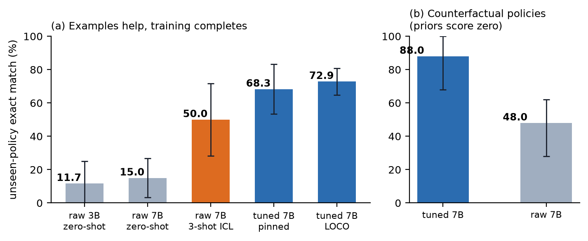
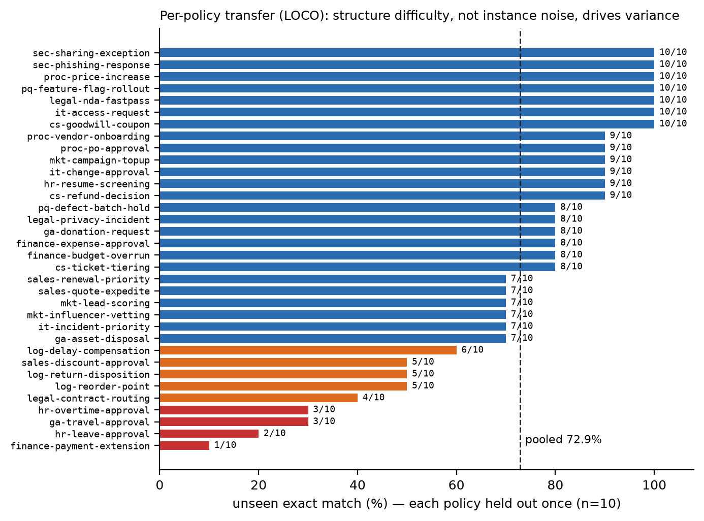

# 암기가 아니라 적용을 배운다: 정책-인-컨텍스트 파인튜닝은 처음 보는 조직 정책에 일반화된다

> **초고 v0.6 한국어판 (2026-09-01)** — 영어판 `DRAFT.md`와 병행 유지되는 번역본입니다(제출 정본은
> 영어판). 모든 수치는 이 저장소에서 실측·재현 가능합니다(§7). `⚠body` 표시는 원논문 본문 확인이
> 남은 주장이었으나, TriMPI·PRT 2건은 본문 확인까지 완료되었습니다.

## 초록

조직에서 올바른 행동은 조직의 일정으로 바뀌는 문서가 정의합니다; "조직의 방식대로" 결정하는 AI는
명문 정책을 따르고, 적용한 규칙을 인용하며, 정책이 재량을 열어둔 곳에서만 위임해야 합니다. 지배적인 파인튜닝 레시피는 특정 정책을 모델 가중치에
내재화하는데, 이는 정책이 바뀌는 순간 무너집니다. 우리는 반대 프레이밍을 연구합니다: 정책은 추론
시점에 **컨텍스트로** 공급하고, 소형 모델에는 **주어진 정책이 무엇이든 그것을 적용하는 기술**을
파인튜닝으로 가르치는 것입니다. 선언적 온톨로지 위의 결정론 규칙 엔진이 생성한 조직 결정 34개
사례(라벨된 판단 3,400건) 코퍼스에서, QLoRA로 튜닝한 7B 모델은 훈련에서 본 적 없는 정책에 대해
**정확 일치 72.9%**(판정·라우팅·파라미터·*올바른* 인용 규칙)를 달성합니다 — 모든 정책이 정확히 한
번씩 unseen이 되는 leave-case-out 평가 기준이며, 동일 서빙 조건의 미훈련 모델 15.0%와
대비됩니다(클러스터 부트스트랩 95% CI [64.7, 80.9] vs [3.3, 26.7]). 무엇을 배웠는지는 통제 3종이
확정합니다: approve/reject를 뒤집고 뒤집힘이 답을 바꾸는 레코드만 평가해 **사전지식이 구조적으로
0점**이 되는 **반사실 정책**에서 튜닝 모델은 **88.0%**(raw 48.0%)를 기록하고, 3-shot 인-컨텍스트 학습
베이스라인은 50.0%에 그치며, 훈련 시드 분산은 ±4.8pp입니다. 음성 통제가 레시피의 경계를 긋습니다:
*같은* 레시피를 바이트 정확 산술 파생 과제에 적용하면 0/6 — 계산 과정을 타깃에 넣어도, 심지어 도구
없는 프런티어 모델을 동일 프롬프트로 평가해도 0/6이며(둘 다 고정밀 나눗셈 필드에서만 실패), 이는
파생이 추론 밖에 속함을 확인합니다: 실행마다 도구를 호출하는 것이 아니라 코드로 컴파일해 반복
실행에서 LLM을 아예 제거하는 것입니다. 파이프라인이 조직이 이미 지불한 작업 세션으로부터
컴파일되므로, frontier 토큰 손익분기는 **두 번째 실행**입니다.

## 1. 서론

대부분의 조직에서 올바른 행동은 *문서*가 정의합니다 — 결정 정책, 지원 런북, 에스컬레이션
매트릭스, 채점 루브릭, 편집 스타일 가이드, 컴플라이언스 체크리스트 — 그리고 그 문서는 모델이 아닌
조직의 일정으로 바뀝니다. 그 위에 세워지는 AI 시스템에는 특정한 분해가 필요합니다: **내용**(문서가
오늘 말하는 것)은 바뀌는 날 갈아끼울 수 있도록 *컨텍스트에* 살아야 하고, **기술**(그런 문서를 읽고
사례에 충실히 적용하는 법)은 *가중치에* 살 수 있습니다. 이 논문은 그 기술이 실제로 소형 모델의
지도 파인튜닝으로 학습 가능한지 — 그리고 결정적으로, 모델이 본 적 없는 문서로 전이되는지 —
측정합니다.

우리는 결정론 채점기를 허용하는 이 클래스의 가장 깨끗한 사례, 조직 결정 정책을 연구합니다. 직원이
"이 고객에게 12% 할인을 줘도 되나요?"라고 물을 때, 조직이 원하는 것은 오라클의 의견이 아닙니다.
**조직 자신의 정책이 적용되는 것**입니다: 순서 있는 규칙을 위에서부터 검사하고, 첫 일치 규칙을
인용하고, 정책이 지정한 승인자에게 라우팅하고, 정책이 의도적으로 열어둔 밴드("5–10%: AI 추천 가능,
팀장 승인") — 오직 그 밴드만 — 를 추천으로 채우는 것. 여기서 ML 문제를 규정하는 세 성질이 따라
나오며, 각각이 위의 일반 분해를 구체화합니다:

1. **문서는 모델보다 빨리 바뀐다.** 정책 P를 암기한 모델은 P가 P′이 되는 날 틀린다. 내용은
   가중치 *바깥*에 살아야 한다.
2. **판단은 감사 가능해야 한다.** "승인"은 답이 아니다. "승인, 본부장 라우팅,
   `strategic_retention_band` 인용 — 그 조건이 이 레코드에 실제로 성립"이 답이다.
3. **재량은 선언되는 것이지 추론되는 것이 아니다.** 어디서 모델이 추천해도 되는지는 문서가
   말한다. 신뢰도 임계값이 아니라.

선행 연구는 정책을 가중치에 내재화하거나(Multimodal Policy Internalization / TriMPI,
arXiv:2510.09474), 도메인 정책 지침을 준 에이전트를 벤치마킹하거나(τ-bench, 2406.12045; RuleArena,
2412.08972), 규칙 개정에 대한 강건성을 측정합니다(GuideBench, 2505.11368). 빠져 있는 것은 배포가
실제로 요구하는 조합입니다: **로컬 서빙 가능한 소형 모델에 "임의의 컨텍스트 정책을 적용하는 전이
가능한 기술"을 파인튜닝으로 가르치고, 훈련에서 본 적 없는 정책으로의 전이를 측정하는 것.**

선언적 결정 정책은 기술(순서 평가·첫 일치·근거 있는 인용)을 비자명하게 유지하면서 정답을 바이트
단위로 채점 가능하게 합니다. 더 지저분한 문서 클래스 구성원(런북·루브릭)으로의 전이는 §6에서
로드맵과 함께 명시적으로 범위를 긋는 열린 질문입니다.

기여:

- **과제와 코퍼스** (§3): 10개 조직 기능에 걸친 결정 사례 34개 — 각각 온톨로지 + 명시적 재량
  밴드를 가진 순서 규칙으로 선언되고, 결정론 엔진이 인용 규칙·성립 조건이 달린 라벨된 판단
  3,400건으로 컴파일.
- **엄격한 결정론 채점기** (§3.3): 판정·라우팅·파라미터·인용 규칙의 정확 일치 + 인용 규칙의
  조건이 레코드에 실제로 성립하는지 검증(판정을 맞혀도 근거 날조는 실패).
- **전이 결과** (§5.1): 34개 정책 전부의 leave-case-out, 72.9% [64.7, 80.9] vs raw 15.0%
  (동일 bf16 greedy 서빙); ICL 사다리 15.0 → 50.0 → 72.9.
- **반사실 통제** (§5.2): 사전지식이 구조적으로 0점인 뒤집힌 정책에서 88.0% — 모델은 세상의
  기본값이 아니라 *정책을 읽는 법*을 배웠다.
- **음성 통제와 배치 경제학** (§5.3–5.4): 같은 레시피가 바이트 정확 산술 파생에서 실패(0/6),
  CoT 타깃 절제에도 0/6 유지, 도구 없는 *프런티어* 모델도 같은 나눗셈 필드에서 같은 게이트에
  실패. 이것은 발견이 아니라 통제 — 산술을 도구로 보내는 것은 상식 — 지만, 실행마다의 tool call을
  넘어 코드로 컴파일하는 한 걸음(반복 실행에서 LLM 완전 제거, 실측 2회차 손익분기)을 정당화한다.

## 2. 관련 연구

*확장 예정; 조사로 검증된 위치 설정:*

**정책 내재화 vs 정책-인-컨텍스트.** Multimodal Policy Internalization(TriMPI, 2510.09474)은
정책을 모델 파라미터 *안으로* 훈련해 추론 시 정책이 컨텍스트에 없어도 되게 합니다 — 우리와 정확히
반대의 유지보수 베팅입니다. 그쪽의 "Policy Override" 설정(그 논문 §5.2)은 갱신된 정책을 추론 시
컨텍스트로 주되 이를 내재화 모델의 *일반화 프로브*로 씁니다; 우리는 컨텍스트 적용 자체를 훈련
목표로 만듭니다. Policy Reasoning Traces(2509.23291)는 HIPAA·GDPR 등 특정 정책의 컴플라이언스
평가를 정책별 인스턴스 분할로 개선하며, 교차-정책 전이는 부수 분석(§4.2/App. G)으로만 등장합니다 —
우리의 홀드아웃-정책 프로토콜과 다릅니다. GuideBench(2505.11368)는 LLM 에이전트의 규칙 개정
강건성을 벤치마킹합니다.

**정책 준수 벤치마크.** τ-bench(2406.12045)는 도메인 정책 지침을 준 SOTA 에이전트를 평가하고,
RuleArena(2412.08972)의 발견은 규칙 식별 실패와 규칙이 요구하는 계산의 실패를 구분해 우리 §5.3의
경계를 직접 예고하며, CRMArena-Pro(2505.18878)는 기밀 인지 등 엔터프라이즈 시나리오에서 에이전트를
평가합니다. 동시대의 엔터프라이즈 벤치마크(2605.08761, *초록 검증됨*)는 규칙 엔진이 채점하는 결정
벤치마크를 독립적으로 구축했으나 평가 전용이고 재량 밴드가 없습니다. DMN(OMG 표준)은 FIRST-hit
의미론의 순서 결정 규칙을 10년째 표준화해 왔습니다 — 우리 DSL은 의도적으로 그 계열이며, ML 기여는
규칙 언어가 아니라 전이 측정입니다.

**SFT와 산술.** Faith and Fate(2305.18654)는 Transformer가 합성적 다단계 산술에 실패하고 추론을
선형화된 패턴 매칭으로 환원함을 보였고, "SFT Memorizes, RL Generalizes"(2501.17161)는 SFT가
암기하며 분포 밖에서 고전함을 보였으며, PAL(2211.10435)은 풀이 단계를 파이썬 인터프리터로
넘깁니다 — 계산을 코드로 라우팅하는 계열의 원조. 우리의 기여는 부정 결과 자체가 아니라 그
**짝지음**입니다: 산술에서 실패한 그 레시피·코퍼스 규모·게이트가 규칙 적용에서는 성공하고, 도구
없는 프런티어가 같은 산술 게이트에 실패해 "소형 모델은 계산을 못 한다"를 "추론은 계산을 못 한다"로
벼립니다.

**소형 모델 배포.** Belcak et al.의 SLM 포지션 페이퍼(2506.02153)는 소형 모델이 에이전틱 AI의
미래라 주장하고 LLM→SLM 전환 알고리즘을 제시합니다; 우리는 고가치 슬롯 하나(정책 적용)의 훈련된
기술 레시피와 전이 측정, 그리고 다른 슬롯(파생)에 대해 프런티어조차 실패하는 결정론 게이트를 제공해
선호가 아닌 **배치 규칙**을 내놓습니다.

## 3. 과제와 코퍼스

### 3.1 결정 사례

*사례*는 반복되는 조직 결정 하나를 선언합니다: 결정 역할, **온톨로지**(개체·속성·관계), 피처 공간,
**순서 규칙**(`when` 조건 → 판정·라우팅·파라미터·사유), 선택적 **재량 밴드**(`defer:
slm_recommend`, 밴드 한계는 파라미터로), 그리고 fallback. 예시(축약):

```yaml
id: sales-discount-approval          # org: 영업 · role: 영업대표
rules:
  - {name: min_margin_violation, when: margin_pct - requested_discount_pct < 10, verdict: reject}
  - {name: strategic_retention_band,
     when: segment == strategic and churn_risk == high and requested_discount_pct <= 12,
     verdict: approve, route: 본부장, set: {max_discount_pct: 12}}
  - {name: over_director_threshold, when: requested_discount_pct > 10, verdict: escalate, route: 본부장}
  - {name: standard_auto, when: requested_discount_pct <= 5, verdict: approve, route: auto}
  - {name: gray_band_recommend, when: requested_discount_pct <= 10,
     defer: slm_recommend, route: 팀장, set: {recommend_between: [5, 10]}}
fallback: {verdict: escalate, route: 본부장}
```

코퍼스는 **10개 기능(영업·재무·고객지원·인사·구매·법무·IT운영·마케팅·물류·보안)의 34개 사례**를
담습니다. 결정론 엔진이 각 사례의 피처 공간에서 레코드를 샘플링하고 첫 일치 의미론을 적용해
**사례당 라벨된 판단 100건**(총 3,400건)을 만들며, 각 판단에는 적용 규칙명·조건·사유가 붙습니다.
생성은 시드 고정·바이트 재현입니다.

### 3.2 정책-인-컨텍스트 형식

모델은 인스턴스마다 다음을 받습니다: 조직·역할·결정을 명명하는 시스템 턴; 사례의 온톨로지와 **전체
순서 규칙 목록**(YAML 원문); 그리고 레코드. 출력은 JSON 객체 하나 —
`{verdict, route, params, cited_rule, rationale}`. 특정 정책에 관한 그 무엇도 가중치에 없으므로,
규칙 수정은 재훈련 없이 행동을 바꿉니다.

### 3.3 채점

답이 **정확(exact)** 판정을 받으려면: 판정·라우팅·파라미터가 엔진의 결정과 같고, *그리고* 인용 규칙이 첫 일치
규칙이며, *그리고* 그 규칙의 조건이 레코드에 실제로 성립해야 합니다(마지막 검사는 판정을 찍어 맞혀도
근거 날조를 실패시킵니다). **완화(relaxed)** 지표는 첫 일치가 아니어도 조건이 진짜 성립하는 규칙
인용을, 나머지가 전부 정답일 때 인정합니다 — 첫 일치는 관례이지 의미론적 요구가 아니기 때문입니다.
판정-단독 정확도도 병기합니다. 홀드아웃 항목이 정책 단위로 군집하므로 모든 신뢰구간은 **사례-클러스터
부트스트랩**(사례 복원추출 10,000회)입니다.

### 3.4 정직한 범위

코퍼스는 합성이고 자기 채점입니다: 라벨을 만드는 엔진이 채점하는 엔진이고, 정책은 이미 기계가독이며,
규칙 조건의 필드명이 레코드 키와 일치합니다 — 산문 정책의 엔티티 정합 난이도, 결측·노이즈 필드,
주석자 불일치가 전부 부재합니다. 따라서 우리의 주장은 *선언적 정책 위에서의 정책 적용* 전이이며,
의도적으로 깨끗한 기판입니다; 산문 정책으로 가는 길은 §6에서 논의합니다. (이 한계들은 내부 적대
감사가 표면화한 것으로, 갈아 없애지 않고 논문에 남깁니다.)

## 4. 실험 설정

**모델·훈련.** Qwen2.5-7B-Instruct, QLoRA(r=16, α=32, dropout 0.05, 전체 선형 프로젝션),
completion-only 손실, 2 에폭, LR 1e-4 cosine, RTX 4090 1장에서 bf16 연산(런당 ≈12분). 훈련 데이터:
28사례 × 40인스턴스(1,120행); 6사례는 **통째로** 홀드아웃. 환경은 핀 고정(`requirements-train.txt`)
이고 모든 런이 매니페스트(시드·에폭·데이터/어댑터 SHA-256·패키지 버전)를 기록합니다.

**서빙·공정성.** 튜닝 모델과 raw 베이스라인 *모두* 같은 bf16 서버·greedy 디코딩으로 평가합니다.
(이전 프로토콜은 raw를 다른 스택의 4bit 양자화로 서빙했는데, 동일 조건 재평가에서 raw 7B가
16.7%→15.0%로 이동 — 양자화 교란은 격차를 설명하지 못합니다.)

**평가 분할.** (a) *고정 분할*: 홀드아웃 6사례 × 10인스턴스(60건) + seen-정책/unseen-인스턴스
56건. (b) *Leave-case-out(LOCO)*: 같은 레시피로 6-fold 재훈련해 **34개 정책 전부가 정확히 한 번씩
unseen**(340건, 클러스터 34개).

## 5. 결과

### 5.1 처음 보는 정책으로의 전이



| 모델 (동일 서빙) | unseen 정확 | 95% CI (클러스터) | verdict | 완화 |
| :-- | --: | :-- | --: | --: |
| raw 3B, 제로샷 | 11.7% | [0.0, 25.0] | 50.0% | 11.7% |
| raw 7B, 제로샷 | 15.0% | [3.3, 26.7] | 53.3% | 15.0% |
| raw 7B, 3-shot ICL (타 사례의 풀이 예시) | 50.0% | [28.3, 71.7] | 75.0% | 51.7% |
| tuned 7B (고정 분할) | 68.3% | [53.3, 83.3] | 86.7% | 71.7% |
| **tuned 7B (LOCO, 34개 정책 전부 unseen 1회)** | **72.9%** | **[64.7, 80.9]** | 87.4% | 73.8% |

LOCO fold 정확도는 65.0–80.0%로, 고정 분할 결과는 운 좋은 한 분할의 산물이 아닙니다. 훈련 시드
3개에 걸쳐 unseen 정확은 62.8% ± 4.8pp(60.0, 60.0, 68.3) — 실행 간 분산은 실재하고 보고되며, 어떤
시드도 raw 베이스라인 근처로 내려가지 않습니다. 인-컨텍스트 예시는 크게 돕지만(15→50%) 파인튜닝이
그 위에 ~20pp를 더하며 요청마다의 예시 토큰도 없앱니다. LOCO에서 정책별 성적은 1/10–10/10(그림 2);
분산을 끄는 것은 인스턴스 노이즈가 아니라 정책 구조 난이도입니다 — 조건에 날짜·한도 산술이 들어간
승인 정책(휴가·초과근무·지급기한 연장)이 최하위에 앉아 §5.3의 계산 경계를 예고합니다.



### 5.2 무엇을 배웠나: 반사실 통제

홀드아웃 사례의 모든 규칙(및 fallback)에서 approve↔reject를 뒤집고, **뒤집힌 정책이 원 정책과
다르게 결정하는 레코드만** 평가합니다 — 이 부분집합에서 사전지식이나 원 정책으로 답하면 구조적으로
0점입니다.

| 모델 | 반사실 정확 (n=50) |
| :-- | --: |
| tuned 7B | **88.0%** |
| raw 7B | 48.0% |

튜닝 모델은 뒤집힌 정책을 따라갑니다. §5.1과 결합하면, 파인튜닝이 가르친 것은 정책 내용도 세상의
사전지식도 아닌 **컨텍스트 정책의 적용**이라는 직접 증거입니다. (approve/reject 판정이 없는 1개
사례는 뒤집을 수 없어 제외; 88.0%가 통상 unseen 정확도보다 높은 이유는 판별 레코드들이 명시적 판정
규칙 — 가장 쉬운 인용 대상 — 을 지나가기 때문입니다.)

### 5.3 음성 통제: 같은 레시피는 계산을 못 배운다 — 프롬프팅도 마찬가지다

동일 레시피(같은 트레이너·게이트·코퍼스 규모 300예시)를 같은 제품군의 *파생* 과제에 적용했습니다:
고객의 갱신 가격 파일(22개 수치 필드: 좌석 올림, 성장률, 밴드 조회, 할인 상한, 월·연 총액)을
홀드아웃 고객에 대해 바이트 정확으로 재생성, 결정론 게이트가 채점.

| 팔 | 게이트 (exact) | 수치 필드 정확도 | 실패 지점 |
| :-- | --: | --: | :-- |
| SFT 7B (일반 타깃) | 0/6 | — | 계산 값 오답 |
| SFT 7B (CoT 타깃) | 0/6 | 86.4% (114/132) | 나눗셈 2필드; 1건은 밴드 연쇄 오류 |
| **프런티어, 같은 프롬프트, 도구 없음** | **0/6** | 93.6% (103/110) | 거의 오로지 나눗셈 2필드 |

이것은 **발견이 아니라 통제**임을 강조합니다: 산술을 도구로 보내는 것은 정착된 관행입니다. 역할은
세 가지입니다. (i) 우리 계층 지도에 대한 "더 훈련하면 된다" 반론을 닫습니다 — 0/6은 추론 없는
타깃의 산물도(CoT 절제), 모델 규모의 산물도 아닙니다(프런티어가 같은 두 나눗셈 필드에서 같은
게이트에 실패하면서 밴드·할인 규칙은 전부 정답; 원 기록 에이전트가 통과한 이유는 도구로 계산했기
때문). (ii) 필드 단위 점수는 exact 게이트가 숨기는 것을 보여줍니다 — 추론은 22개 중 20–21개 필드를
맞히며, 실패는 정확히 규칙-읽기가 아니라 계산이 필요한 곳에 몰립니다. (iii) 표준 처방보다 한 걸음 더
나아갈 동기를 줍니다. 실행마다의 **tool call은 매 실행 LLM을 루프 안에 남깁니다** — 어떤 도구를
부를지 다시 결정하고(토큰), 다르게 결정할 수 있고(비결정성), 순서를 매번 재조율합니다. **code
계층으로의 컴파일은 그 결정을 컴파일 타임에 한 번만** 내리며, 반복 실행에는 LLM이 없습니다. 결과인
배치 규칙: 파생 → code 계층; 정책 판단 → 결정론 게이트 뒤의 훈련된 SLM 계층; 선언된 재량 밴드 →
추천 + 사람 승인자.

### 5.4 배치 경제학: 손익분기는 두 번째 실행

LLM 단계를 루프 밖으로 내리는 것은 컴파일러 베팅 — 한 번 내고 실행마다 회수 — 이므로, 정직한 질문은
손익분기의 위치입니다. 갱신 파이프라인에서 유니크 토큰(에이전트가 턴마다 재전송하는 누적 컨텍스트를
중복 계상하지 않는 기준)으로 실측: 기록된 에이전트 세션은 실행당 **frontier 토큰 23,614개**;
컴파일과 SLM 승격 후 실행은 **frontier 토큰 0개**(로컬 모델에서 4,208 토큰, 한계비용 $0, 7.4× 빠름,
결정론 벤치마크로 출력 7/7 재현). 컴파일러의 입력이 조직이 어차피 한 번은 실행해야 했던 작업 세션
이고 컴파일 자체는 결정론 로컬 연산이므로, frontier 토큰 **손익분기는 두 번째 실행**입니다 —
컴파일러가 LLM 토큰으로 탐색하는 최적화 중심 컴파일의 ≈17-트랜잭션 손익분기(Compiled AI,
2604.05150 — "breaking even with runtime inference at approximately 17 transactions")와
대비됩니다. 진짜 새로운 파라미터 값의 에스컬레이션은 각 1회의 frontier 호출이 들고, 상류 출력
지문과 함께 캐시되어 반복에서 0으로 상각됩니다. 숨은 분모는 온톨로지·정책을 선언하는 사람의
비용입니다; 따라서 파이프라인은 결정의 반복 빈도에 비례해 성립하며 — 바로 조직이 가장 먼저 자동화
하는 영역 — record-first 설계(스펙을 백지에서 쓰는 게 아니라 지불된 세션에서 추출)가 그 분모를
작게 유지합니다.

## 6. 논의와 한계

**왜 내재화하지 않는가?** 가중치에 내재화된 정책은 빠르게 답하지만 즉시 낡고 규칙 수정을 설명하지
못합니다. 정책-인-컨텍스트는 유지보수 경제학을 뒤집습니다: 정책 파일이 배포 산물이고, 재훈련은
정책이 아니라 *기술*이 표류할 때만 필요합니다.

**정책 결정 너머.** 레시피의 무엇도 승인 워크플로 특화가 아닙니다: 훈련 행은 (문서, 레코드, 근거
있는 구조화 답변) 삼중항이고, 반사실 통제는 의미를 프로그램적으로 뒤집을 수 있는 모든 문서 클래스로
일반화됩니다. 런북(절차-인-컨텍스트, 실행 기술-인-가중치)과 루브릭(기준-인-컨텍스트, 채점 기술-인-
가중치)이 최근접 이웃이며, 각자 결정론 채점기가 필요합니다 — 그것이 주장을 넓히는 실제 병목입니다.
이 논문은 또한 더 큰 컴파일 파이프라인 시스템 — 기록된 에이전트 세션을 code/rule/cache 계층으로
내리고, 이 논문의 훈련된 SLM 계층이 승격 게이트 뒤의 판단 슬롯을 차지하는 — 의 한 계층이며, 그
종단 경제학(§5.4)은 전이 결과에 동기를 주지만 의존하지는 않습니다.

| 문서 클래스 | 필요한 결정론 채점기 | 현황 |
| :-- | :-- | :-- |
| 선언적 결정 정책 | 규칙 엔진 (존재) | **측정 완료 — 본 논문** |
| 에스컬레이션 매트릭스 | 표 조회 검사기 | 근접 — 카탈로그 일부 사례가 이 형태 |
| 컴플라이언스 체크리스트 | 항목별 규칙 검사기 | 미착수 |
| 채점 루브릭 | 정답지 채점기 | 미착수 |
| 지원 런북 | 상태머신 검사기 | 미착수 |

**산문 정책으로 가는 길.** 우리 기판은 엔티티 정합을 제거합니다(규칙 필드명 = 레코드 키). 자연스러운
다음 실험은 훈련된 applier를 고정한 채 앞에 정책 컴파일 단계(산문 → 선언 규칙)를 끼우고, 72.9% 중
얼마가 노이즈 있는 컴파일을 견디는지, 반사실 통제가 여전히 성립하는지를 측정하는 것입니다.

**순환성.** 라벨과 채점이 같은 엔진에서 나옵니다. 근거-성립 검사(인용 날조 실패), 완화 지표(첫 일치
관례와 의미론 분리), 반사실 통제(사전지식 0점화), 전체 핀 고정으로 완화했지만, 주석자 간 일치도가
있는 사람 라벨 판단은 향후 과제로 남습니다.

**규모.** 정책 34개, 베이스 모델 7B 하나, 언어쌍 하나(한국어 프롬프트, 혼합 언어 필드). 클러스터
CI가 이에 정직합니다 — 주장은 72.9%가 아니라 [64.7, 80.9]입니다.

## 7. 재현성

코퍼스 생성기, 트레이너(핀 고정·런별 매니페스트), 평가 코드, 모든 원자료와 이 초고가 한 저장소에
있습니다: `examples/org/`(카탈로그·엔진·코퍼스), `tools/remote-train/`(트레이너·LOCO·통제 러너),
`examples/org/decision-slm/`(RESULTS.md·eval_history.json·loco/results.json·c3c_controls.json),
`examples/demo/customer-renewal-bench/slm-training/`(산술 팔·controls.json). 이 논문의 모든 표는
시드 고정 생성기와 저장된 모델 출력에서 재생 가능합니다.

---

### 제출 전 TODO (영어판과 공유)
- [ ] §2 관련 연구 산문화.
- [ ] refs.bib 저자 완성(제목·ID는 초록 검증 완료).
- [ ] 한국어판은 영어판 개정 시 함께 갱신(정본은 영어판).
